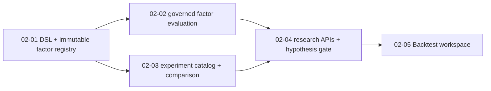

# Phase 2 Research: Factor And Strategy Research

**Researched:** 2026-07-11  
**Scope:** FACT-01, FACT-02, FACT-03 only

## Sources Examined

- `.planning/phases/02-factor-and-strategy-research/02-CONTEXT.md` locks the DSL, immutability, retention gate, data boundaries, and UI constraints.
- `.planning/phases/01-core-merger/01-VERIFICATION.md` certifies the governed Parquet/DuckDB/Polars and SQLite operational-state foundation at `1034413`.
- `backend/app/backtest/factor.py` already produces Polars-vectorized factor evidence but computes only one rank-based correlation series under the name `ic`.
- `backend/app/backtest/strategy.py`, `backend/app/api/backtest.py`, and `frontend/src/lib/backtestTask.ts` already define bounded, registered-strategy execution and task reconnection conventions.
- `backend/app/strategy/custom_signals.py` and `backend/app/api/signals.py` demonstrate the required allowlist → validation → compile-to-Polars pattern; their boolean JSON conditions are deliberately not reusable as the new factor DSL.
- `backend/app/operational/{migrations,repository}.py` owns versioned local SQLite migrations and parameterized transactional persistence.
- `frontend/src/pages/Backtest.tsx`, `frontend/src/pages/backtest/{FactorBacktest,StrategyBacktest}.tsx`, `frontend/src/lib/{api,queryKeys}.ts` provide the only permitted workspace, typed client, and TanStack Query extension seams.

## Existing Seams and Implications

| Seam | Observed behavior | Phase 2 use |
|---|---|---|
| `FactorBacktestService.run(FactorConfig)` | Loads governed panels through `BacktestEngine`, computes forward returns, rank correlation, grouped and long-short evidence, and serializes config. | Add a compiled-factor entry point and explicit Pearson IC plus Spearman RankIC outputs; do not bypass `BacktestEngine.load_panel`. |
| `StrategyBacktestService.run(StrategyBacktestConfig)` | Resolves only registered strategies and returns config, result, curves, trades, metrics, strategy metadata, and cancellation outcome. | Wrap completed registered-strategy runs in the experiment catalog; do not introduce strategy authoring, Python execution, or sandboxing. |
| `/api/backtest` | Validates Pydantic requests, applies server memory/range/symbol limits, keeps an SSE strategy job lifecycle. | Preserve limits and route conventions; research APIs should orchestrate validated domain services rather than duplicate execution. |
| `OperationalRepository` / migrations | Uses one SQLite `operational.db`, `PRAGMA user_version`, per-call parameterized connections, JSON snapshots, and immutable decision records. | Add Phase 2 tables in the existing migration sequence and a separate research-catalog repository over the same database path. |
| `DataStore` / `KlineRepository` | Parquet is the market-time-series system of record; DuckDB views and Polars provide governed reads. | Capture a stable governed-input manifest/reference, never copy raw market rows into SQLite or a second lake. |
| Existing AI provider gateway | The host has configured-provider state and a test fake gateway in `app.decision.ai_review`. | Define a narrow hypothesis-draft gateway with provider/model provenance and deterministic fake collaborator; the gateway returns text only and never persists or runs work itself. |

## Recommended Design

### Domain boundaries

Create a separable `app/research/` package:

- `factor_dsl.py`: tokenizer/parser, AST, canonical serializer, allowlists, structural signature, similarity explanation, and compile-to-Polars. It must never evaluate source text or inspect Python objects.
- `factor_registry.py`: immutable factor/revision operations and deterministic candidate ranking.
- `catalog.py`: retained immutable experiment records, artifact references, filtering, and side-by-side comparison.
- `hypotheses.py`: draft gateway and explicit review/backtest/retention state machine.

Keep `app/backtest/` responsible for loading governed panels and calculating factor/strategy evidence. The research services call those contracts; they do not become a second engine.

### Restricted DSL

Use one compact expression grammar with numeric literals, explicitly listed fields, parentheses, unary `-`, binary `+ - * /`, and a finite function allowlist. The initial function set should be documented in the options endpoint and be implemented by explicit AST-node dispatch only: `abs(x)`, `sign(x)`, `log1p(x)`, `clip(x, low, high)`, `rank(x)`, `zscore(x)`, and `rolling_mean(x, window)`. Validate arity, literal ranges, window bounds, dependency fields, and division shape before compiling. Reject every token/construct outside this grammar (including dots, brackets, strings, imports, identifiers not in the field allowlist, and unapproved function calls).

Canonical serialization must make whitespace and harmless parentheses irrelevant, record a fixed DSL version, and retain a stable AST-derived structural signature. Similarity is deterministic: exact structural-signature candidates first, then a documented weighted score from AST-shape equality, referenced-field Jaccard overlap, and operator/function overlap. Every candidate returns its score components and reason; similarity never writes, merges, rejects, or hides a valid revision.

### Metrics, artifacts, and provenance

A factor evaluation must calculate and retain both:

- **IC:** daily cross-sectional Pearson correlation between factor values and configured forward returns.
- **RankIC:** daily Spearman correlation (ranked factor and ranked forward returns).

Their time series, summaries, run configuration, and supporting group/long-short output are evidence. Existing `FactorResult.ic_*` cannot silently continue to mean RankIC; the returned contract must expose both metric families explicitly and UI labels must match.

Before any retained run, resolve and persist an explicit configuration: universe/symbol selection, asset type, start/end, forward-return horizon, rebalance cadence, missing-data treatment, warmup treatment, fees/slippage/grouping as applicable, factor revision or registered strategy identity/version, and run status. Build a governed-data manifest from stable input identity (asset type, resolved symbols or declared universe, parquet/view identity, observed min/max data date, row count/schema fingerprint or equivalent deterministic source reference) rather than copying data. Write prediction/signal and result artifacts under `data_dir/research_artifacts/<experiment_id>/`; persist only managed relative paths, checksums, content type, and size in SQLite.

Completed validated runs are immutable snapshots. Failed/cancelled/invalid/draft status and diagnostic detail may be retained, but comparisons query only completed validated rows. The comparison service must pair selected records without inventing a score and must emit a comparability warning whenever universe, time window, horizon, or data-manifest revision differs.

### Natural-language hypothesis gate

The gateway returns a non-persistent draft with explanation, raw/normalized expression, provider/model/version provenance, and parser diagnostics. An invalid/unsupported provider result returns actionable validation errors. A researcher explicitly reviews the valid draft, runs a backtest, and can retain it only when the linked run completed successfully and was validated. The API/service must reject a direct save of an unbacktested or failed natural-language draft. Provider code has no reference to registry or executor methods.

## Persistence Contract

Append versioned SQLite migration(s) to the existing operational migration tuple for factor definitions/revisions, experiment snapshots, input manifests, metric records, artifact metadata, model-version provenance, and draft/audit records as needed. Enforce immutable identity with insert-only revision/run rows and foreign keys. Use a dedicated research repository with the same connection rules and `operational.db` path; no MLflow service, external database, queue, or separate dataset storage.

## Implementation Dependency Graph

- Wave 1 establishes a safe factor-language and durable identities.
- Wave 2 may develop evaluation and catalog code in parallel because both consume Wave 1’s schema/registry contract and neither alters the other’s files.
- Wave 3 assembles API-level workflows only after both evidence production and retention/comparison contracts exist.
- Wave 4 consumes typed APIs in the existing Backtest workspace.

## Focused Verification Strategy

1. **DSL/registry tests:** reject Python-like or unknown tokens, unknown fields/functions, invalid arity/windows, and unsafe syntax; prove canonical equivalence; prove compiler produces only expected Polars expression; prove revisions are insert-only; prove deterministic similarity order and reasons.
2. **Evaluation tests:** use a small in-memory/stub governed panel to assert exact Pearson IC versus RankIC divergence, forward-horizon/warmup semantics, mandatory explicit config, governed manifest capture, artifact checksum/reference creation, and failure diagnostics.
3. **Catalog tests:** prove immutable completed snapshot persistence, failed/cancelled/draft exclusion, storage of factor and registered-strategy provenance, artifact integrity metadata, side-by-side field differences, and comparability warnings.
4. **API/hypothesis tests:** construct a minimal FastAPI app with research services and deterministic draft gateway to prove validation precedes execution/persistence, provider provenance is returned, unbacktested natural-language drafts cannot be retained, range limits remain enforced, and only completed validated experiments compare.
5. **Frontend check:** test or browser-exercise the existing `/backtest` workspace so factor-library/review/history/comparison controls use the unified `api.ts` client and query keys, show distinct IC/RankIC results, show provenance/artifact/model fields, and visibly warn for incomparable selections. Run the focused frontend typecheck/build only after the behavior checks pass.

## Pitfalls and Scope Fences

- The current factor service names a rank correlation `ic`; retaining that ambiguity would violate FACT-01/02. Rename/add fields rather than relabeling a value.
- Do not build the DSL atop `custom_signals` JSON condition format or call `eval`, `pl.sql_expr`, dynamic attribute lookup, or arbitrary Polars-expression construction.
- Do not allow a model response to reach the registry, artifact writer, executor, or comparison set without parser validation, explicit human review, and completed backtest status.
- Do not create a second FastAPI application, router hierarchy, datastore, external DB/queue, MLflow server, or raw-data copy.
- Do not accept custom strategy code, AST/import/resource sandboxing, strategy mutation, promotion, autonomous agents, broker execution, AI-analysis reports, or Phase 3/4 capabilities.
