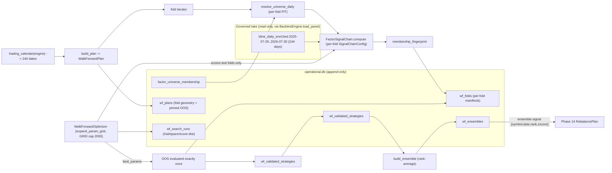

# Phase 13: Walk-Forward Validation & Parameter Search - Research

**Researched:** 2026-08-02
**Domain:** Walk-forward validation (rolling folds + reserved OOS), OOS-scored parameter search, rank-average strategy ensembling
**Confidence:** HIGH (measured history + verified code seams); fold-geometry sizing is a calibrated recommendation, not a locked value

## Summary

Phase 13 is the validation layer of the v1.2 pipeline. It consumes the Phase 10 shared signal chain (`research/signal_chain.py`), the Phase 10 PIT universe contract (`research/universe.py` `resolve_universe_daily`), and the Phase 11 optimizer pattern (`backtest/optimizer.py`), and produces **validated strategies** that feed Phase 14's RebalancePlan. The entire phase is grounded in one measured fact: **the enriched A-share lake holds 244 trading days (2025-07-29 → 2026-07-30), 1,305,493 rows, 5,535 symbols** (verified 2026-08-02 via DuckDB over `data/kline_daily_enriched/**/part.parquet`). That is the calibration constraint for every design decision in this document.

**Primary recommendation** (fold geometry, WFWD-01): with H=244 trading days, reserve the **final 40 trading days (2026-06-04 → 2026-07-30) as the once-evaluated OOS**, and build **3 rolling folds** on the 204-day selection region: **train=120, gap=20 (WF_GAP), test=20** trading days, step=20 (test segments tile contiguously, disjoint by construction). Concrete fold dates are in the calibration section. The 20-day gap is the locked AlphaMaster starting point `WF_GAP=20` [CITED: `.planning/research/SUMMARY.md` Phase 13 flag / `.planning/ROADMAP.md` Phase 13 note]. The label horizon (`forward_return_horizon`) reduces effective scorable days — the per-fold chain compute window must extend `test_end + horizon` so labels are finite through the whole test segment.

**Key findings:**
- **OOS reservation is structural, not advisory.** The OOS segment is part of the `WalkForwardPlan` dataclass, persisted to an append-only `wf_plans` row **before** any parameter search; the search folds subset excludes `plan.oos_fold`; the OOS fold record has a `UNIQUE(plan_id, strategy_id, params_sha256)` constraint so it can be evaluated at most once; append-only triggers make it immutable.
- **Parameter search is extended, not rewritten.** Reuse `expand_param_grid`/`count_combinations`/`GRID_MAX_COMBINATIONS=2000` (`optimizer.py:15,78-103`) and the per-combo error-isolation pattern (`optimizer.py:189-213`). Each trial scores on the **test segments of the walk-forward folds only** (never the reserved OOS, never in-sample train). WFWD-02 bookkeeping = `n_trials`, `search_space`, `score_distribution` JSON on a new `wf_search_runs` table.
- **Ensembling is a Polars rank-mean.** Each strategy's chain frame already carries per-date cross-sectional `_rank` (`signal_chain.py:139-146`); rank-average = mean of per-strategy `_rank` per `(symbol, date)`, re-ranked/z-scored into the ensemble signal. Only strategies with a `wf_validated_strategies` row (`passed_gate=1`) enter; output persisted as an immutable artifact for Phase 14.
- **Trading calendar must come from the governed panel.** A-share holidays (Feb 2026 has only 14 trading days — CNY) make `timedelta`-based fold arithmetic wrong; fold boundaries snap to the measured distinct dates from `BacktestEngine.load_panel`.

## User Constraints (from CONTEXT.md)

<user_constraints>
### Locked Decisions

#### Fold Geometry (WFWD-01)
- **Rolling (non-expanding)** windows — a fold is a `(train_start, train_end, test_start, test_end)` rectangle with an explicit gap between train and test.
- **Explicit gap** — starting point `WF_GAP = 20` trading days (AlphaMaster documented baseline), calibrated to available A-share history during planning.
- **Disjoint recorded folds** — each test segment is recorded; folds do not overlap.
- **Reserved final OOS segment** — evaluated exactly once, never touched by selection or parameter search. Its reservation is pinned BEFORE any parameter-search reuse.

#### PIT Universe per Fold (WFWD-01 + Phase 10 contract)
- Every fold resolves its universe via `resolve_universe_daily` (Phase 10 PIT contract — per-date membership, no survivorship bias).
- Fold manifests record `membership_fingerprint`.
- Each fold's signal chain uses a per-fold `SignalChainConfig` (same shared chain — anti train/serve skew).

#### Parameter Optimization (WFWD-02, P2)
- Scored on **walk-forward OOS folds** (never in-sample).
- Records **trial count, search space, score distribution** — the multiple-comparison-bias guard.
- Reuses `backtest/optimizer.py` grid-search pattern (`GRID_MAX_COMBINATIONS` cap) with OOS reservation.

#### Strategy Ensembling (WFWD-03, P2)
- **Rank-average** of validated strategy signals (only strategies that passed walk-forward validation).
- Output is research-use (candidate input for Phase 14 RebalancePlan).
- Consumed via the shared signal chain.

### Claude's Discretion
- Exact fold train/test sizes + gap value (WF_GAP starting 20, calibrated to A-share history length), fold count.
- Parameter search space definition + trial cap, score metric (e.g. OOS Sharpe/IC).
- Ensemble weighting details within rank-average.
- New append-only table schema for fold/search/ensemble records (following existing conventions).

### Deferred Ideas (OUT OF SCOPE)
- RebalancePlan + paper rebalance (Phase 14).
- Frontend panels (Phase 15).
- Black-Litterman, ML expected returns (v2).
</user_constraints>

## Phase Requirements

| ID | Description | Research Support |
|----|-------------|------------------|
| WFWD-01 | Rolling (non-expanding) walk-forward with explicit gap, disjoint recorded folds, reserved final OOS evaluated exactly once, never touched by selection/search | `## Fold Geometry Calibration` + `## Walk-Forward Runner` + `## OOS Reservation` — measured 244-day calendar, `WalkForwardPlan` dataclass, per-fold `SignalChainConfig` + `resolve_universe_daily` + `membership_fingerprint`, `wf_plans`/`wf_folds` schema with UNIQUE exactly-once OOS |
| WFWD-02 | Parameter optimization scored on walk-forward OOS folds (not in-sample), trial count/search space/score distribution recorded | `## OOS-Scored Parameter Search` — `WalkForwardOptimizer` over `expand_param_grid` (GRID cap `optimizer.py:15`), OOS fold excluded structurally, `wf_search_runs` bookkeeping |
| WFWD-03 | Ensemble validated strategies via rank-average of their signals | `## Rank-Average Ensembling` — mean of per-strategy `_rank` (`signal_chain.py:139-146`), validated-only gate, `wf_ensembles` + artifact |

## Architectural Responsibility Map

| Capability | Primary Tier | Secondary Tier | Rationale |
|------------|-------------|----------------|-----------|
| Fold geometry / walk-forward orchestration | API/Backend | — | `backtest/walkforward.py` — pure-Polars geometry over the measured calendar; no client involvement (research-only) |
| Per-fold PIT universe resolution | API/Backend | Database/Storage | `research/universe.py:67` `resolve_universe_daily` reads append-only `factor_universe_membership`; the chain's `_resolve_membership` (`signal_chain.py:228-251`) applies the per-date join after the single governed read |
| Per-fold signal computation | API/Backend | — | One shared `FactorSignalChain.compute` with a per-fold `SignalChainConfig` (anti train/serve skew, FACT-06) |
| OOS-scored parameter search | API/Backend | Database/Storage | `backtest/optimizer.py` extension; trial/search-space/score-distribution recorded on `wf_search_runs` |
| OOS reservation + exactly-once | Database/Storage | API/Backend | Pinned in `wf_plans` before search; UNIQUE constraint + append-only triggers enforce immutability and single evaluation |
| Rank-average ensembling | API/Backend | Database/Storage | `backtest/ensemble.py` rank-mean; validated-only gate; `wf_ensembles` + checksum-verified artifact |

## Fold Geometry Calibration (PRIMARY)

### Measured history (the calibration input)

Verified 2026-08-02 via DuckDB over `data/kline_daily_enriched/**/part.parquet` (Hive partition by date):

| Fact | Value | Source |
|------|-------|--------|
| Enriched window | `2025-07-29` → `2026-07-30` | [VERIFIED: DuckDB measure] |
| Trading days (distinct dates) | **244** | [VERIFIED: DuckDB measure] |
| Rows / symbols | 1,305,493 / 5,535 | [VERIFIED: DuckDB measure] |
| Per-day symbol count | min 5,284 / median 5,349 / max 5,528 | [VERIFIED: DuckDB measure] |
| Monthly trading days | 2025-07:3, 08:21, 09:22, 10:17, 11:20, 12:23; 2026-01:20, 02:**14** (CNY), 03:22, 04:21, 05:18, 06:21, 07:22 | [VERIFIED: DuckDB measure] |

The 2026-02 hole (14 days) and 2026-05 (18) are why fold boundaries MUST be snapped to the measured calendar, never `timedelta` arithmetic.

### Recommended geometry (default)

| Parameter | Value | Rationale |
|-----------|-------|-----------|
| `H` total trading days | 244 | measured |
| `OOS` reserved final segment | **40** days (≈2 months) → `2026-06-04` → `2026-07-30` | ~16% of history held out, evaluated exactly once |
| Selection region | 204 days → `2025-07-29` → `2026-06-03` | `H - OOS` |
| `Tr` train length | **120** days (≈6 months) | enough for ICIR/mean-IC stability (Phase 10 gate `MIN_TRAIN_OBSERVATIONS=40`, `10-RESEARCH.md`); mirrors admission train scale |
| `G` gap | **20** days (WF_GAP, locked) | AlphaMaster documented baseline [CITED: SUMMARY.md/ROADMAP.md] |
| `Te` test length | **20** days (≈1 month) | with `G=20`, next train window ends before prior test starts → strict train/test isolation |
| Step | `Te` = 20 | test segments tile contiguously → disjoint by construction |
| Fold count `k` | **3** | derived from span math below |

**Arithmetic** (day-index 0 = 2025-07-29, indices into the 244 measured trading dates):

```
Fold i: train  [20i, 20i + 119]
        gap    [20i + 120, 20i + 139]        (20 days, unused)
        test   [20i + 140, 20i + 159]        (20 days, recorded)
Step 20 ⇒ tests tile: fold1 [140,159], fold2 [160,179], fold3 [180,199].
Fold-3 test end = index 199 < selection end 203 < OOS start 204.  ✓ no fold touches OOS.
```

**Concrete dates** (measured trading calendar):

| Fold | Train | Gap | Test |
|------|-------|-----|------|
| 1 | 2025-07-29 → 2026-01-22 | 2026-01-23 → 2026-02-27 | **2026-03-02 → 2026-03-27** |
| 2 | 2025-08-26 → 2026-02-27 | 2026-03-02 → 2026-03-27 | **2026-03-30 → 2026-04-27** |
| 3 | 2025-09-23 → 2026-03-27 | 2026-03-30 → 2026-04-27 | **2026-04-28 → 2026-05-28** |
| **OOS** | — | — | **2026-06-04 → 2026-07-30 (reserved, evaluated exactly once)** |

Test segments are pairwise disjoint and contiguous; the OOS sits after fold 3's test with a 5-day buffer (2026-05-29 → 2026-06-03) that is neither train nor test.

### Label-horizon effect (must be handled)

The signal chain drops the last `horizon` days of any compute window — `_forward_return = close.shift(-horizon)` is null beyond the panel end and the windowed frame filters them out (`signal_chain.py:104-120`). Consequences:

- A `Te=20` test segment scored with `horizon=5` yields only **15 scorable days** unless the per-fold compute window extends past the test end.
- The OOS's last `horizon` days are **structurally unscorable** (2026-07-30 is the lake end — no future data exists). `OOS=40` with `horizon=5` ⇒ **effective OOS = 35 days**.

**Required handling:** per-fold `SignalChainConfig.end = fold.test_end + horizon` (calendar-day buffer) so labels are finite through the whole test segment; scoring restricted to `[test_start, test_end]`. Same for the OOS fold. Record `effective_days` in the fold manifest.

### Sensitivity note

| Variant | Tr | Te | k | Validated test days | Effective test days (h=5) | When to use |
|---------|----|----|---|--------------------|---------------------------|-------------|
| **Default** | 120 | 20 | 3 | 60 | 45 | baseline; max train stability |
| More folds | 100 | 20 | 4 | 80 | 60 | prefer more selection evidence over train length |
| Even more folds | 80 | 20 | 5 | 100 | 75 | only if factor warmup permits (risk: unstable trains) |
| Longer tests (standard refit) | 80 | 40 | 2 | 80 | 60 | ⚠️ fold-2 train **overlaps** fold-1 test — violates the strict-isolation reading of "disjoint folds" |

- **Fold-count ceiling:** `(k-1)·Te + (Tr+G+Te) - 1 ≤ 203`. With `Tr=120,G=20,Te=20`: `k≤3`. Every 20 days of extra history adds one fold; every 20 days of OOS adds one fold.
- **OOS size:** 40 days keeps selection evidence dominant; 20-day OOS (10%) buys one extra fold but weakens the once-evaluated estimate. Below `OOS≈30` the final estimate is noise-dominated — do not go lower without a documented rationale.
- **History ceiling:** at `H≈180` (≈7.5 months) only 2 folds fit; below that, walk-forward degenerates — fail-closed with a clear error rather than producing a 1-fold "validation".
- **Future enrichment:** each subsequent month of enriched data adds ~20 trading days ⇒ the same recipe yields +1 fold and can roll the OOS forward. This is why the plan geometry must be *derived* from the measured calendar, not hard-coded dates.

## Walk-Forward Runner

New module `backend/app/backtest/walkforward.py`. Pure-Polars + stdlib; no new dependencies.

### Surface

```python
@dataclass(frozen=True, slots=True)
class WalkForwardFold:
    fold_index: int
    is_oos: bool                      # True only for the reserved final segment
    train_start: date
    train_end: date
    gap_start: date
    gap_end: date
    test_start: date
    test_end: date
    membership_fingerprint: str       # per-fold, from chain.resolved_universe
    chain_config: SignalChainConfig   # per-fold config (same shared chain)

@dataclass(frozen=True, slots=True)
class WalkForwardPlan:
    plan_id: str
    universe: str
    asset_type: str
    start: date
    end: date
    train_size: int                   # trading days
    gap_size: int                     # WF_GAP
    test_size: int
    oos_size: int
    horizon: int                      # forward_return_horizon (label lookahead)
    folds: tuple[WalkForwardFold, ...]        # search/selection folds only
    oos_fold: WalkForwardFold                 # reserved final segment
    trading_dates: tuple[date, ...]           # measured calendar
    created_at: str
```

Key functions:

1. **`trading_calendar(engine, symbols, start, end) -> list[date]`** — distinct dates from the governed seam `BacktestEngine.load_panel` (`engine.py:191-200`). A tiny date-only probe (`columns=["date"]`) reuses `PanelCache` (`engine.py:141-176`) — one governed read, no new data path. Never synthesize a weekday calendar (Feb 2026 hole).

2. **`build_plan(...) -> WalkForwardPlan`** — pure geometry over `trading_dates`:
   - splits `[start,end]` into selection region + reserved OOS;
   - computes fold rectangles with the arithmetic above;
   - **asserts** (fail-closed, not best-effort): test segments pairwise disjoint; `test_end_{i+1} = test_start_i + Te`; `fold_N.test_end < oos_start`; `len(oos_segment) == oos_size`; `train_end + gap < test_start`.

3. **`run_walk_forward(plan, strategy_id, params, service, chain, resolver, repo) -> WalkForwardResult`** — per fold:
   - resolve membership via `resolve_universe_daily(repo, universe_name, start=train_start-warmup, end=test_end+horizon)` (`universe.py:67-122`) — per-date PIT, no survivorship bias;
   - build the per-fold `SignalChainConfig` (below) and compute through `FactorSignalChain.compute` (`signal_chain.py:78-158`) — this is the anti train/serve-skew path (FACT-06);
   - record `membership_fingerprint` from `frame.resolved_universe["membership_fingerprint"]` (`signal_chain.py:302-328`);
   - run train-window and test-window strategy backtests through `StrategyBacktestService.run` (`strategy.py:147-360`) with `StrategyBacktestConfig(start=train_start, end=train_end)` / `(start=test_start, end=test_end)`;
   - append one `wf_folds` row (append-only, `INSERT` only).

### Per-fold SignalChainConfig

```python
SignalChainConfig(
    universe=plan.universe,
    symbols=(),                       # union derived from membership (chain._union_symbols, signal_chain.py:253-257)
    asset_type=plan.asset_type,
    start=fold.train_start,           # factors computed over the whole fold span
    end=fold.test_end + timedelta(days=plan.horizon),  # label buffer → finite forward returns through test_end
    warmup_days=120,                  # calendar-day warmup, matches strategy._panel_window (strategy.py:123-124)
    forward_return_horizon=plan.horizon,
    rebalance="daily",
)
```

The chain's `_resolve_membership` (`signal_chain.py:228-251`) resolves over `[start - warmup, end]`, unions the symbols, loads one governed panel, and inner-joins per-date membership after the seam — the fold rectangle is honored exactly. This is the Phase 10 PIT forward-compat note (`10-RESEARCH.md` §6) realized.

### Why the runner is strategy-agnostic

"Strategy" here = a `strategy_id` bound to research assets (`research_strategy_asset_bindings`, `migrations.py:727-736`; `repository.resolve_bound_strategy`) run through `StrategyBacktestService`. The same fold loop also hosts the Phase 11 per-fold covariance/optimization candidates (CONTEXT code_context) — a fold may re-estimate covariance on train and apply weights on test. Keep `run_walk_forward` parametrized by a `fold_scorer` callable so the portfolio-optimizer variant plugs in without forking the geometry.

## OOS Reservation

The reserved final OOS segment is the single most important integrity boundary in the phase. Design:

1. **Pinned before any search reuse.** `build_plan` computes the OOS rectangle from the measured calendar and the `WalkForwardPlan` is **INSERTed into `wf_plans` before any parameter search starts** (`oos_pinned_at` timestamp recorded). The search never re-derives the OOS — it consumes `plan.oos_fold`.

2. **Structurally excluded from search.** Search folds = `[f for f in plan.folds if not f.is_oos]` (`plan.folds` never contains the OOS by construction). The `wf_search_runs` row carries `oos_excluded INTEGER NOT NULL CHECK (oos_excluded IN (0,1))` set to `1`; the insert fails closed if `0`.

3. **Exactly-once evaluation.** The OOS fold row in `wf_folds` has `UNIQUE (plan_id, fold_index, is_oos, strategy_id, params_sha256)` and `is_oos=1`. A second evaluation of the same `(plan, strategy, params)` on the OOS raises `sqlite3.IntegrityError`, mapped to `ValueError("OOS segment already evaluated")` — mirroring `create_experiment`'s `originating_run_id` uniqueness (`repository.py:240-248`).

4. **Immutable.** `wf_plans`/`wf_folds`/`wf_search_runs`/`wf_validated_strategies`/`wf_ensembles` all get `_no_update`/`_no_delete` triggers (`RAISE(ABORT, '... append-only')`), following `migrations.py:1526-1548,1614-1617`.

5. **Validation gate ties OOS to the verdict.** `wf_validated_strategies.oos_evidence_fold_id TEXT NOT NULL UNIQUE REFERENCES wf_folds(id)` — a strategy is only "validated" once its OOS evidence exists; the UNIQUE enforces one OOS evaluation per strategy/params.

**Idempotency/immutability contract:** re-running the same walk-forward/optimization is append-only-safe — it either returns the already-recorded rows (query path) or fails on the UNIQUE constraint (write path). No UPDATE/DELETE anywhere. This matches the established append-only + O_EXCL + fsync + sha256 artifact discipline (`models.py:189-207`, `artifacts.py`).

## OOS-Scored Parameter Search

Extension of `backtest/optimizer.py` — do NOT fork the grid machinery. Add a `WalkForwardOptimizer` (same file or a thin subclass) that:

```python
class WalkForwardOptimizer:
    def __init__(self, service, strategy_engine): ...   # same DI as StrategyOptimizer (optimizer.py:150-152)

    def optimize(self, *, plan: WalkForwardPlan, strategy_id: str,
                 param_grid: dict, objective: str = "sharpe",
                 max_workers: int = 4, progress_cb=None, cancel_event=None) -> dict:
        search_folds = [f for f in plan.folds if not f.is_oos]   # OOS structurally excluded
        params_meta = self.strategy_engine.get(strategy_id).meta.get("params", [])
        combos = expand_param_grid(params_meta, param_grid)       # GRID_MAX_COMBINATIONS=2000 cap (optimizer.py:15,87-103)
        # per combo: for each search_fold run the test-window backtest (error-isolated,
        #   mirroring optimizer.py:189-213 _run_one); pooled_score = mean(fold objective values)
        # per combo records: per-fold scores + pooled score
        return {
            "objective": objective, "direction": direction,
            "n_trials": len(combos), "n_completed": n_ok,
            "search_space": {"param_grid": param_grid, "params_meta": params_meta},
            "score_distribution": {"per_trial": [...], "per_fold": {...}, "min": ..., "median": ...,
                                   "max": ..., "mean": ..., "std": ...},
            "best_params": ..., "best_score": ...,
            "results": ranked,
        }
```

Design points:

- **Never in-sample:** each trial scores the **test segments of walk-forward folds only**. Train windows are used for parameter behavior confirmation (and, for portfolio strategies, per-fold covariance estimation), never for the score.
- **GRID cap respected:** `expand_param_grid` already rejects `total > GRID_MAX_COMBINATIONS` (`optimizer.py:94-103`) — the walk-forward path inherits it unchanged.
- **Score metric (discretion):** default **mean OOS Sharpe across folds** (`"sharpe"` is in `VALID_OBJECTIVES`, `optimizer.py:26-34`); OOS RankIC (mean per-fold test IC) is the alternative for factor-level search. Per-fold scores are always recorded so the distribution, not just the mean, is inspectable.
- **Multiple-comparison guard (WFWD-02):** `n_trials`, `search_space`, and `score_distribution` are recorded on `wf_search_runs`. Best-of-N selection inflates the expected score (e.g. for N iid standard-normal trials, `E[max] ≈ √(2·ln N)`); recording the distribution makes the bias visible, and the **final OOS run of `best_params` is the unbiased estimate**. Never report the search-best score as the expected forward performance.
- **Error isolation:** reuse the `_run_one` try/except pattern (`optimizer.py:189-213`) so one failing combo doesn't kill the batch; failures sink to the bottom (`_sort=-inf`).
- **Progress/cancel:** reuse the `progress_cb` shape (`optimizer.py:229-237`) with `done/total/best_score`.

**Reuse, don't duplicate:** `count_combinations`, `expand_param_grid`, `objective_value`, `default_direction`, `_validate_backtest_kwargs` all stay as-is. The only new logic is the fold loop + distribution bookkeeping.

## Rank-Average Ensembling

New module `backend/app/backtest/ensemble.py`.

```python
@dataclass(frozen=True, slots=True)
class EnsembleConfig:
    strategy_ids: tuple[str, ...]          # sorted → determinism
    weights: Mapping[str, float]           # default equal 1/n (discretion)
    validation_record_ids: tuple[str, ...] # wf_validated_strategies rows, passed_gate=1

def build_ensemble(*, config, signals: Mapping[str, pl.DataFrame], universe, start, end, horizon) -> pl.DataFrame:
    # gate: every strategy_id has a wf_validated_strategies row with passed_gate=1, else fail closed
    # rank-average per (symbol, date):
    #   mean_rank = mean over strategies of strategy_frame._rank (cross-sectional per date)
    #   ensemble_rank  = mean_rank.rank(method="average").over("date")
    #   ensemble_zscore = (mean_rank - mean(mean_rank).over(date)) / std(mean_rank).over(date)
    # return [symbol, date, ensemble_rank, ensemble_zscore]
```

- **Input:** each validated strategy's chain frame already has `_rank` = per-date cross-sectional average rank (`signal_chain.py:139-146`). Rank-average is a Polars mean over strategies per `(symbol, date)` — no scipy, no new machinery.
- **Validated-only:** the constructor takes `validation_record_ids`; every id must resolve to a `wf_validated_strategies` row with `passed_gate=1`. A non-validated strategy fails closed.
- **Weighting (discretion):** default equal weights within the rank-average; optional OOS-Sharpe-weighted ranks (weights proportional to the recorded validation score). Weight vector is frozen into the input snapshot.
- **Output shape for Phase 14:** `[symbol, date, ensemble_rank, ensemble_zscore]`, persisted as an immutable artifact via `EvaluationArtifactService.write_bundle` (`models.py:189-207` pattern) with `input_snapshot_sha256` binding `(strategy_ids, weights, validation_record_ids, membership_fingerprint)`; one append-only `wf_ensembles` row (`output_sha256` + relative path). Phase 14 consumes it as a signal source through the shared chain.

## Schema/Migration Sketch

Append one script to the `MIGRATIONS` tuple in `backend/app/operational/migrations.py` (convention: `migrations.py:9` tuple; append-only tables + `_no_update`/`_no_delete` triggers). All rows INSERT-only; idempotency via UNIQUE.

```sql
-- Phase 13: walk-forward validation, OOS-scored parameter search, ensembling (WFWD-01/02/03).
CREATE TABLE wf_plans (
    id TEXT PRIMARY KEY,
    universe TEXT NOT NULL,
    asset_type TEXT NOT NULL CHECK (asset_type IN ('stock','etf')),
    start TEXT NOT NULL,
    end TEXT NOT NULL,
    train_size INTEGER NOT NULL CHECK (train_size > 0),
    gap_size INTEGER NOT NULL CHECK (gap_size >= 0),      -- WF_GAP
    test_size INTEGER NOT NULL CHECK (test_size > 0),
    oos_size INTEGER NOT NULL CHECK (oos_size > 0),
    horizon INTEGER NOT NULL CHECK (horizon > 0),
    trading_dates_json TEXT NOT NULL,                     -- measured calendar (fold snapping)
    fold_geometry_json TEXT NOT NULL,                     -- fold rectangles + OOS dates
    oos_pinned_at TEXT NOT NULL,                          -- reservation BEFORE any search reuse
    created_at TEXT NOT NULL
);

CREATE TABLE wf_folds (
    id TEXT PRIMARY KEY,
    plan_id TEXT NOT NULL REFERENCES wf_plans(id) ON DELETE RESTRICT,
    fold_index INTEGER NOT NULL CHECK (fold_index >= 0),
    is_oos INTEGER NOT NULL CHECK (is_oos IN (0,1)),
    strategy_id TEXT NOT NULL,
    params_sha256 TEXT NOT NULL CHECK (length(params_sha256) = 64),
    train_start TEXT NOT NULL, train_end TEXT NOT NULL,
    test_start TEXT NOT NULL, test_end TEXT NOT NULL,
    membership_fingerprint TEXT NOT NULL CHECK (length(membership_fingerprint) = 64),
    chain_config_json TEXT NOT NULL,                      -- per-fold SignalChainConfig
    stats_json TEXT NOT NULL,                             -- test-window stats (+ effective_days)
    created_at TEXT NOT NULL,
    UNIQUE (plan_id, fold_index, is_oos, strategy_id, params_sha256)  -- exactly-once incl. OOS
);

CREATE TABLE wf_search_runs (
    id TEXT PRIMARY KEY,
    plan_id TEXT NOT NULL REFERENCES wf_plans(id) ON DELETE RESTRICT,
    strategy_id TEXT NOT NULL,
    objective TEXT NOT NULL,
    direction TEXT NOT NULL,
    search_space_json TEXT NOT NULL,                      -- param_grid + params_meta
    n_trials INTEGER NOT NULL,
    n_completed INTEGER NOT NULL,
    score_distribution_json TEXT NOT NULL,                -- per-trial + per-fold scores; min/median/max/mean/std
    best_params_json TEXT NOT NULL,
    best_score REAL,
    oos_excluded INTEGER NOT NULL CHECK (oos_excluded IN (0,1)),  -- search never touched OOS
    created_at TEXT NOT NULL
);

CREATE TABLE wf_validated_strategies (
    id TEXT PRIMARY KEY,
    strategy_id TEXT NOT NULL,
    plan_id TEXT NOT NULL REFERENCES wf_plans(id) ON DELETE RESTRICT,
    search_run_id TEXT REFERENCES wf_search_runs(id) ON DELETE RESTRICT,
    params_sha256 TEXT NOT NULL CHECK (length(params_sha256) = 64),
    oos_evidence_fold_id TEXT NOT NULL UNIQUE REFERENCES wf_folds(id) ON DELETE RESTRICT, -- exactly-once OOS
    validation_score REAL NOT NULL,
    fold_evidence_json TEXT NOT NULL,
    passed_gate INTEGER NOT NULL CHECK (passed_gate IN (0,1)),
    created_at TEXT NOT NULL,
    UNIQUE (strategy_id, params_sha256, plan_id)
);

CREATE TABLE wf_ensembles (
    id TEXT PRIMARY KEY,
    name TEXT NOT NULL,
    strategy_ids_json TEXT NOT NULL,
    weights_json TEXT NOT NULL,
    validation_record_ids_json TEXT NOT NULL,
    input_snapshot_sha256 TEXT NOT NULL CHECK (length(input_snapshot_sha256) = 64),
    output_sha256 TEXT NOT NULL CHECK (length(output_sha256) = 64),
    artifact_relative_path TEXT NOT NULL,
    created_at TEXT NOT NULL
);

-- _no_update / _no_delete triggers on all five tables
-- (RAISE(ABORT, '<table> facts are append-only'), mirroring migrations.py:1526-1548)
-- indexes: idx_wf_folds_plan(plan_id, fold_index),
--          idx_wf_validated_strategies(strategy_id),
--          idx_wf_ensembles_created(created_at)
```

**Repository methods** (on `ResearchRepository`, following `repository.py` conventions: canonical `_json`, transactional, `IntegrityError → ValueError`):
`create_wf_plan`, `record_wf_fold`, `record_wf_search`, `record_validated_strategy`, `record_wf_ensemble` + read paths (`get_wf_plan`, `list_wf_folds`, `list_validated_strategies`).

## Verification Plan

New test files (patterns modeled on `tests/backtest/test_optimizer_grid.py`, `tests/backtest/test_optimizer_run.py`, `tests/research/test_signal_chain.py`, `tests/research/test_universe_resolution.py` — fake-service injection + real resolver fixtures):

| File | Covers | Key assertions |
|------|--------|----------------|
| `tests/backtest/test_walkforward.py` | WFWD-01 | test segments disjoint + contiguous; OOS reserved & pinned before search; fold boundaries snap to measured calendar (Feb 2026 14-day month); per-fold `SignalChainConfig`; `membership_fingerprint` recorded per fold and changes when membership changes; geometry fail-closed on overlap/OOS-collision; label-buffer extends compute window |
| `tests/backtest/test_walkforward_optimizer.py` | WFWD-02 | search folds exclude `plan.oos_fold` (fail-closed if referenced); `expand_param_grid` GRID cap respected; `n_trials`/`search_space`/`score_distribution` recorded; per-combo error isolation; OOS evaluated exactly once (UNIQUE violation on re-run); never-in-sample score |
| `tests/backtest/test_ensemble.py` | WFWD-03 | only `passed_gate=1` strategies enter (else fail closed); rank-average = mean of per-strategy `_rank` per (symbol,date); output `[symbol,date,ensemble_rank,ensemble_zscore]`; input-snapshot binding |
| `tests/operational/test_migrations_phase13.py` (or extend `test_operational_migrations.py`) | schema | append-only triggers abort UPDATE/DELETE; UNIQUE idempotency; FK integrity |

**Requirement → test map (Nyquist):**

| Req | Behavior | Test type | Command |
|-----|----------|-----------|---------|
| WFWD-01 | rolling folds, gap, disjoint tests, reserved once-evaluated OOS | unit + integration | `pytest tests/backtest/test_walkforward.py -x` |
| WFWD-02 | OOS-scored search + bookkeeping | unit | `pytest tests/backtest/test_walkforward_optimizer.py -x` |
| WFWD-03 | rank-average of validated signals | unit | `pytest tests/backtest/test_ensemble.py -x` |
| all | append-only schema | unit | `pytest tests/operational/test_operational_migrations.py -x` |

**Sampling rate:** per task commit → the affected test file(s) with `-x`; per wave merge → full `tests/backtest` + `tests/research` + `tests/operational`; phase gate → full suite green before `/gsd-verify-work`.

**Wave 0 gaps:** the three new test files above, a `tests/backtest/conftest.py` fixture for a measured-calendar fold plan (or reuse the existing research fixtures), and the Phase 13 migration test.

## Standard Stack

No new external dependencies for Phase 13. The phase reuses the locked v1.2 stack:

### Core
| Library | Version | Purpose | Why Standard |
|---------|---------|---------|--------------|
| Polars | 1.40.1 (locked, verified in `.venv`) | fold geometry, rank-average, per-date cross-sections | existing project standard; `signal_chain.py`/`engine.py` are Polars-native |
| SQLite (stdlib) | — | append-only fold/search/ensemble records | existing append-only convention (`repository.py`, `migrations.py`) |
| numpy | 2.4.6 (locked) | score distribution stats (mean/std/quantiles) | existing |

### Supporting
| Library | Version | Purpose | When to Use |
|---------|---------|---------|-------------|
| cvxpy / scipy (Phases 11-12) | 1.9.2 / 1.17.1 | per-fold covariance + min-vol weights for portfolio strategies | only if a fold re-optimizes a portfolio |
| pytest | — | unit/integration tests | verification |

### Alternatives Considered
| Instead of | Could Use | Tradeoff |
|------------|-----------|----------|
| measured-calendar fold snapping | `timedelta`/weekday calendar | A-share holidays (Feb 2026: 14 days) make weekday calendars wrong — reject |
| Polars rank-mean ensemble | scipy/numpy manual rank loop | chain already emits `_rank`; Polars keeps one code path |
| SQLite append-only records | MLflow / external tracker | anti-feature per SUMMARY (`Out of Scope`); existing convention suffices |
| rolling (non-expanding) | expanding window | expanding re-leaks early validation data (SUMMARY Pitfall 8) — locked to rolling |

**Installation:** none. **Version verification:** Polars 1.40.1 / duckdb 1.5.3 confirmed importable in `backend/.venv` on 2026-08-02.

## Package Legitimacy Audit

> No new packages are installed by Phase 13. The phase reuses locked dependencies (polars, numpy, sqlite3/stdlib) and Phase 11-12 additions (cvxpy 1.9.2, scipy 1.17.1) that already passed the Phase 10/11 legitimacy gates.

| Package | Registry | Verdict | Disposition |
|---------|----------|---------|-------------|
| (none added) | — | — | — |

**Packages removed due to [SLOP] verdict:** none. **Packages flagged suspicious [SUS]:** none.

## Architecture Patterns

### System Architecture Diagram



Flow: measured calendar → fold plan (OOS pinned) → per-fold PIT universe → per-fold chain compute → fold manifests → OOS-scored search → once-evaluated OOS → validated strategies → rank-average ensemble → Phase 14.

### Recommended Project Structure

```
backend/app/backtest/
├── walkforward.py      # NEW — WalkForwardPlan/Fold, trading_calendar, build_plan, run_walk_forward
├── optimizer.py        # MODIFY — add WalkForwardOptimizer (OOS-scored, distribution bookkeeping)
├── ensemble.py         # NEW — EnsembleConfig, build_ensemble (rank-average, validated-only)
├── engine.py           # unchanged — load_panel is the sole governed seam (engine.py:191-200)
└── strategy.py         # unchanged — StrategyBacktestService.run per fold window

backend/app/research/
├── signal_chain.py     # unchanged — per-fold SignalChainConfig + membership_fingerprint
├── universe.py         # unchanged — resolve_universe_daily (universe.py:67-122)
├── repository.py       # MODIFY — wf_* repository methods (append-only)
└── models.py           # unchanged — composite/artifact patterns to mirror

backend/app/operational/migrations.py   # MODIFY — append Phase 13 script

backend/tests/backtest/
├── test_walkforward.py           # NEW
├── test_walkforward_optimizer.py # NEW
└── test_ensemble.py              # NEW
```

### Pattern 1: Fold-plan builder (pure geometry, fail-closed)
**What:** derive fold rectangles from the measured calendar; raise on any overlap/OOS violation.
**When to use:** always — the plan is the single source of truth for fold boundaries.
```python
# backend/app/backtest/walkforward.py (new)
def build_plan(*, dates, train_size, gap_size, test_size, oos_size, horizon) -> WalkForwardPlan:
    assert len(dates) == train_size + gap_size + test_size + oos_size + slack  # geometry identity
    oos = dates[-oos_size:]
    sel = dates[: len(dates) - oos_size]
    folds = []
    i = 0
    while i + train_size + gap_size + test_size <= len(sel):
        t = sel[i + train_size + gap_size : i + train_size + gap_size + test_size]
        folds.append(WalkForwardFold(train=sel[i:i+train_size], test=t, ...))
        i += test_size                     # step = test_size ⇒ tests tile, disjoint
    assert all(not set(f.test) & set(g.test) for f, g in itertools.combinations(folds, 2))
    assert folds[-1].test[-1] < oos[0]     # OOS never touched
    return WalkForwardPlan(folds=folds, oos_fold=WalkForwardFold(is_oos=True, test=oos, ...))
```
*(Geometry contract only — concrete implementation is the planner's.)*

### Anti-Patterns to Avoid
- **`timedelta` fold arithmetic** — holidays make calendar-day offsets wrong; always snap to measured trading dates.
- **Silently shrinking test evidence** — scoring a `Te=20` test with `horizon=5` without a label buffer yields only 15 scorable days; extend the compute window, record `effective_days`.
- **Best-of-N reported as expected performance** — record `n_trials` + `score_distribution`; only the once-evaluated OOS is the unbiased estimate.
- **Two signal implementations** — walk-forward MUST use `FactorSignalChain` per fold; a parallel compute path is a train/serve-skew bug (FACT-06).
- **OOS in the search fold set** — structural exclusion + `oos_excluded=1` + UNIQUE exactly-once.

## Don't Hand-Roll

| Problem | Don't Build | Use Instead | Why |
|---------|-------------|-------------|-----|
| Trading calendar | synthetic weekday/`bdate_range` calendar | distinct dates from `BacktestEngine.load_panel` (`engine.py:191-200`) | A-share holidays (Feb 2026: 14 days) — the governed panel IS the calendar |
| Parameter grid expansion | custom cartesian product | `expand_param_grid` (`optimizer.py:87-103`) | validation, dedup, type coercion, GRID cap already handled |
| Per-date cross-sectional rank | manual sort+rank loop | chain `_rank` / Polars `.rank(method="average").over("date")` (`signal_chain.py:139-146`) | one code path, reproducible |
| Run provenance / search bookkeeping | MLflow / experiment DB | append-only SQLite JSON columns (`wf_search_runs`) | existing convention; no new infra (SUMMARY Out of Scope) |
| Immutable artifacts | ad-hoc file writes | `EvaluationArtifactService.write_bundle` (O_EXCL + fsync + sha256, `models.py:189-207`) | existing checksum discipline |

**Key insight:** the phase adds orchestration, not new algorithms. Every computational primitive (grid expansion, rank, covariance, backtest) already exists and is governed; Phase 13 wires them into a leakage-safe sequence and records everything append-only.

## Common Pitfalls

### Pitfall 1: Calendar misalignment
**What goes wrong:** fold boundaries computed with `timedelta` drift across holidays; the Feb 2026 hole (14 trading days) silently shortens a "20-day" gap or test.
**Why:** no market-calendar utility; naive weekday math ignores CNY/suspension.
**How to avoid:** `trading_calendar()` from the governed panel; `build_plan` snaps to measured indices and asserts `len(test)==test_size`.
**Warning signs:** fold manifests whose test windows contain 16-18 distinct dates instead of 20.

### Pitfall 2: Label lookahead silently truncating evidence
**What goes wrong:** the last `horizon` days of each test segment (and of the OOS) drop out because `_forward_return` is null beyond the window (`signal_chain.py:104-120`); reported "60 validated days" is actually 45.
**Why:** the chain drops non-finite labels; the fold window ends at `test_end`.
**How to avoid:** per-fold `config.end = test_end + horizon`; record `effective_days` in the manifest; assert `effective_days >= 10` per fold.
**Warning signs:** OOS effective length `OOS - horizon` not documented; fold coverage < `Te - horizon`.

### Pitfall 3: OOS reuse in selection
**What goes wrong:** a search run scores the final OOS segment as one of its folds, inflating the "best" parameters and corrupting the once-evaluated estimate.
**Why:** the OOS is just "the last dates" unless structurally reserved.
**How to avoid:** `plan.folds` excludes `plan.oos_fold`; `wf_search_runs.oos_excluded=1` enforced at insert; OOS row UNIQUE exactly-once.
**Warning signs:** search run records overlap OOS dates; `oos_excluded=0` (should never be insertable).

### Pitfall 4: Multiple-comparison bias hidden
**What goes wrong:** best-of-N grid results reported as forward-looking performance without acknowledging selection inflation.
**Why:** N trials ⇒ expected max rises (≈ `√(2 ln N)` for iid scores).
**How to avoid:** record `n_trials` + `search_space` + `score_distribution` (WFWD-02); the OOS run of `best_params` is the only unbiased estimate.
**Warning signs:** `wf_search_runs` missing distribution fields; OOS never run for the selected params.

### Pitfall 5: Per-fold membership drift / stale fingerprints
**What goes wrong:** one fingerprint reused across folds, or membership resolved over a different window than the fold, breaks reproducibility and PIT guarantees.
**Why:** membership is window-dependent; a cached fingerprint from another fold is subtly wrong.
**How to avoid:** compute per fold over `[train_start - warmup, test_end + horizon]`; fingerprint from `chain.resolved_universe["membership_fingerprint"]` (`signal_chain.py:302-328`).
**Warning signs:** all folds share an identical fingerprint despite different train windows.

## Code Examples

Verified patterns from the codebase (read 2026-08-02):

### 1. Per-fold membership + fingerprint (reuse, do not reimplement)
```python
# Source: app/research/signal_chain.py:228-251 (chain._resolve_membership) and universe.py:67-122
membership = resolve_universe_daily(
    repo, universe_name=config.universe,
    start=config.start - timedelta(days=config.warmup_days) if config.warmup_days else config.start,
    end=config.end, asset_type=config.asset_type,
)
frame = chain.compute(revision_id=..., config=fold.chain_config)
fingerprint = frame.resolved_universe["membership_fingerprint"]  # per-fold manifest
```

### 2. Grid expansion with the hard cap (reuse unchanged)
```python
# Source: app/backtest/optimizer.py:78-103
combos = expand_param_grid(params_meta, param_grid)   # raises if total > GRID_MAX_COMBINATIONS (2000)
```

### 3. Per-combo error isolation (reuse the pattern)
```python
# Source: app/backtest/optimizer.py:189-213 (StrategyOptimizer._run_one)
try:
    res = self.service.run(bt_cfg, cancel_event=cancel_event)
except Exception as e:
    logger.warning("参数组 %s 回测异常: %r", combo, e)
    return {"params": combo, "error": repr(e), "_sort": float("-inf")}
```

### 4. Rank-average building block (already in the chain)
```python
# Source: app/research/signal_chain.py:139-146
frame = frame.with_columns(
    pl.col("_factor").rank(method="average").over("date").cast(pl.Float64).alias("_rank"),
    ((pl.col("_factor") - pl.col("_factor").mean().over("date")) / pl.col("_factor").std().over("date")).alias("_zscore"),
)
# ensemble: per (symbol, date) mean over strategies of _rank, then re-rank the mean.
```

## State of the Art

| Old Approach | Current Approach | When Changed | Impact |
|--------------|------------------|--------------|--------|
| Single train/val split (Phase 10 admission: 70/30 temporal) | rolling walk-forward with gap + reserved OOS | Phase 13 | multi-fold OOS evidence; once-evaluated final estimate |
| Grid search scored on one in-sample window (`optimizer.py` today) | grid search scored on walk-forward OOS folds only | Phase 13 | no in-sample parameter selection |
| Expanding-window walk-forward (rejected) | rolling (non-expanding) windows | milestone research (SUMMARY Pitfall 8) | no early-validation-data re-leak |
| Single-strategy backtest | rank-average ensemble of validated strategies | Phase 13 | diversification across validated signal sources |

**Deprecated/outdated:**
- **Expanding-window walk-forward:** re-leaks early validation data — explicitly out of scope (`SUMMARY.md` Out of Scope table).
- **Storing full factor value matrices:** anti-feature; fold/search evidence is summary JSON + checksum-verified artifacts.

## Assumptions Log

| # | Claim | Section | Risk if Wrong |
|---|-------|---------|---------------|
| A1 | Default geometry `Tr=120, G=20, Te=20, k=3, OOS=40` is the right calibration for the measured 244-day history | Fold Geometry Calibration | Planner must treat sizes as starting values; if the team prefers longer tests or more folds, use the sensitivity table (Tr=100 → k=4, etc.) — the geometry is derived, not hard-coded |
| A2 | `WF_GAP=20` is the correct gap starting point | Fold Geometry Calibration | Locked decision from CONTEXT; AlphaMaster baseline cited in project research [CITED] — only the *calibration* is at discretion |
| A3 | OOS of 40 trading days (≈16% of history) is sufficient for a stable once-evaluated estimate | Fold Geometry Calibration | With more history this can grow; with OOS<30 the estimate is noise-dominated |
| A4 | Default search score = mean OOS Sharpe across folds | OOS-Scored Parameter Search | Discretion item; RankIC is the alternative — the score metric is a search-config field, not structural |
| A5 | Ensemble default = equal weights within rank-average | Rank-Average Ensembling | Discretion item; OOS-Sharpe-weighted ranks are the documented alternative |
| A6 | `forward_return_horizon` default for scoring = 5 (weekly label) | Fold Geometry Calibration | Horizon=1 halves the label-buffer need; the design works for any horizon, but `effective_days` reporting depends on it |

## Open Questions

1. **Score metric for parameter search (WFWD-02)**
   - What we know: `VALID_OBJECTIVES` includes sharpe/sortino/etc. from backtest stats (`optimizer.py:26-34`); the chain also exposes per-date IC.
   - What's unclear: whether the primary objective should be backtest Sharpe (strategy-level) or RankIC (factor-level), and whether per-fold scores should be pooled by mean or median.
   - Recommendation: default mean OOS Sharpe; record per-fold scores so the choice can be re-evaluated without re-running.

2. **What exactly is "the strategy" being validated per fold?**
   - What we know: strategies are bound to research assets (`research_strategy_asset_bindings`, `migrations.py:727-736`); backtests run through `StrategyBacktestService.run`.
   - What's unclear: whether a "validated strategy" is (a) a fixed-params backtest strategy, (b) a composite-model definition (`factor_model_models`), or (c) a per-fold re-optimized portfolio (Phase 11 covariance path). CONTEXT lists all three as candidates.
   - Recommendation: design `run_walk_forward` around a `fold_scorer` seam so all three plug in; the tracer plan should pick (a) first.

3. **`wf_validated_strategies` identity semantics**
   - What we know: UNIQUE `(strategy_id, params_sha256, plan_id)`.
   - What's unclear: whether a validated strategy should carry a `revision_ids_json`/composite snapshot for Phase 14 to consume directly.
   - Recommendation: add `resolved_asset_ids_json` to the row so Phase 14's RebalancePlan can bind without re-resolving.

## Validation Architecture

> `workflow.nyquist_validation` is `true` in `.planning/config.json` (verified) — included.

### Test Framework
| Property | Value |
|----------|-------|
| Framework | pytest (`pyproject.toml:108` `[tool.pytest.ini_options]`, `--import-mode=importlib`, asyncio auto) |
| Config file | `backend/pyproject.toml` |
| Quick run command | `pytest tests/backtest/test_walkforward.py tests/backtest/test_walkforward_optimizer.py tests/backtest/test_ensemble.py -x` |
| Full suite command | `pytest` (backend, existing 961+ tests) |

### Phase Requirements → Test Map
| Req ID | Behavior | Test Type | Automated Command | File Exists? |
|--------|----------|-----------|-------------------|-------------|
| WFWD-01 | rolling folds, gap, disjoint tests, reserved once-evaluated OOS, per-fold PIT + fingerprint | unit + integration | `pytest tests/backtest/test_walkforward.py -x` | ❌ Wave 0 |
| WFWD-02 | OOS-scored search, GRID cap, trial/space/distribution bookkeeping, exactly-once OOS | unit | `pytest tests/backtest/test_walkforward_optimizer.py -x` | ❌ Wave 0 |
| WFWD-03 | rank-average of validated signals only | unit | `pytest tests/backtest/test_ensemble.py -x` | ❌ Wave 0 |
| WFWD-01..03 | append-only schema + immutability triggers | unit | `pytest tests/operational/test_operational_migrations.py -x` | ✅ (extend) |

### Sampling Rate
- **Per task commit:** affected test file(s) `-x`
- **Per wave merge:** `pytest tests/backtest tests/research tests/operational -x`
- **Phase gate:** full suite green before `/gsd-verify-work`

### Wave 0 Gaps
- [ ] `tests/backtest/test_walkforward.py` — covers WFWD-01
- [ ] `tests/backtest/test_walkforward_optimizer.py` — covers WFWD-02
- [ ] `tests/backtest/test_ensemble.py` — covers WFWD-03
- [ ] `tests/backtest/conftest.py` (or reuse research fixtures) — measured-calendar fold-plan fixture
- [ ] Phase 13 migration test in `tests/operational/test_operational_migrations.py`
- [ ] Repository `wf_*` methods + idempotency tests

## Environment Availability

> Phase 13 has no NEW external dependencies — it consumes the existing governed lake, the operational SQLite DB, and the locked Python stack. Verified 2026-08-02:

| Dependency | Required By | Available | Version | Fallback |
|------------|------------|-----------|---------|----------|
| Enriched A-share lake (`data/kline_daily_enriched/**`) | trading calendar + per-fold panels | ✓ | 244 trading days, 2025-07-29→2026-07-30, 5,535 symbols | — (blocks execution if missing; the fold geometry is derived from it) |
| Polars | fold geometry, rank-average, chain compute | ✓ | 1.40.1 (imported in `backend/.venv`) | — |
| duckdb (read-only measurement) | calendar verification | ✓ | 1.5.3 | — |
| Operational SQLite DB | append-only `wf_*` tables | ✓ | migrations apply at repo `migrate()` | — |
| cvxpy / scipy | per-fold portfolio optimization (optional) | ✓ | 1.9.2 / 1.17.1 (Phases 11-12) | omit portfolio-strategy fold scorer |

**Missing dependencies with no fallback:** the enriched lake. If its date range shrinks (data pipeline pause), `build_plan` must re-derive geometry from the *current* measured calendar and fail closed below `H≈180`.

**Missing dependencies with fallback:** none — all required libraries are confirmed importable.

## Security Domain

> `workflow.security_enforcement` is `true` in `.planning/config.json` (verified) — included.

### Applicable ASVS Categories

| ASVS Category | Applies | Standard Control |
|---------------|---------|-----------------|
| V2 Authentication | no | no new auth surface; research-only backend |
| V3 Session Management | no | — |
| V4 Access Control | yes | research-only boundary: no execution route anywhere; validated strategies feed Phase 14, never an execution path (hard acceptance criterion RBAL-02) |
| V5 Input Validation | yes | reuse `_candidates_for`/`expand_param_grid` validation (`optimizer.py:31-103`); fold-plan geometry asserts; `params_sha256` and 64-hex CHECKs on every fingerprint/sha |
| V6 Cryptography | yes | no new crypto; existing sha256 fingerprints (membership, panel, input snapshot) reused for tamper-evidence |

### Known Threat Patterns for {stack}

| Pattern | STRIDE | Standard Mitigation |
|---------|--------|---------------------|
| OOS reused by selection (integrity of the estimate) | Tampering | structural exclusion (`plan.folds` lacks `oos_fold`) + `oos_excluded=1` + UNIQUE exactly-once |
| Best-of-N selection bias presented as expected performance | Spoofing | `n_trials` + `search_space` + `score_distribution` recorded; OOS is the only unbiased estimate |
| Silently shrinking test evidence via label lookahead | Tampering | `effective_days` in fold manifest; assert `>= 10` per fold |
| Membership drift breaking reproducibility | Tampering | per-fold `membership_fingerprint` (`signal_chain.py:302-328`); immutable rows |

## Sources

### Primary (HIGH confidence)
- **Measured enriched lake** — DuckDB over `data/kline_daily_enriched/**/part.parquet` (2026-08-02): 244 trading days, 2025-07-29→2026-07-30, 1,305,493 rows, 5,535 symbols, per-month day counts.
- **Codebase reads (2026-08-02):** `backend/app/backtest/optimizer.py`, `backend/app/backtest/engine.py`, `backend/app/backtest/strategy.py`, `backend/app/research/signal_chain.py`, `backend/app/research/universe.py`, `backend/app/research/repository.py`, `backend/app/research/models.py`, `backend/app/research/artifacts.py`, `backend/app/operational/migrations.py`, `backend/app/strategy/engine.py`, `backend/tests/backtest/test_optimizer_grid.py`, `test_optimizer_run.py`, `backend/tests/research/test_signal_chain.py`, `test_universe_resolution.py`.

### Secondary (MEDIUM confidence)
- `.planning/phases/10-factor-library-multi-factor-model/10-RESEARCH.md` — PIT universe contract (§4 membership join, §6 Phase 13 forward-compat), admission gate thresholds, artifact conventions.
- `.planning/research/SUMMARY.md` — Phase 13 rationale, Pitfall 4/8/9 (walk-forward leakage, multiple-comparison, train/serve skew), Out-of-Scope table.

### Tertiary (LOW confidence)
- `WF_GAP=20` AlphaMaster baseline — cited in project research docs; exact upstream source not re-verified this session (treated as locked project knowledge).

## Metadata

**Confidence breakdown:**
- Fold geometry: HIGH for measured facts (244 days, dates) and the derivation; the *chosen* sizes (120/20/20/40) are a calibrated recommendation for planner confirmation (Assumptions A1-A3).
- Architecture: HIGH — every seam verified in code (file:line cited); the walk-forward/optimizer/ensemble surfaces are direct extensions of existing patterns.
- Pitfalls: HIGH — all five pitfalls trace to verified code behavior (calendar from panel, chain label drop, optimizer cap, append-only triggers).

**Research date:** 2026-08-02
**Valid until:** 2026-09-02 (30 days; re-measure `trading_dates` at execution — the enriched lake grows ~20 trading days/month, which changes fold count and rolls the OOS forward by design)
