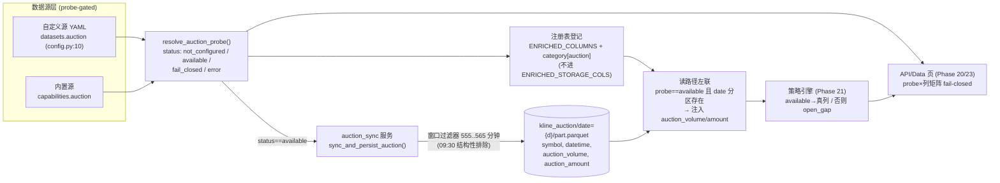

# Phase 20: 竞价数据层 (Auction Data) - Research

**Researched:** 2026-08-05
**Domain:** A股集合竞价 (9:15–9:25 call auction) 数据层 — 数据湖落盘、受管增强列、probe 门控、虚拟成交语义
**Confidence:** HIGH (代码 seam 全部逐行核验 + live probe 实测; 外部口径以交易所/数据源官方文档佐证)

## Summary

Phase 20 把 v1.3 已落地但"只探测不落盘"的竞价能力深化为一条端到端、**probe 门控 + fail-closed** 的生产数据路径:真实 09:15–9:25 集合竞价撮合数据(竞价量/竞价金额)经 `auction_sync` 服务按 `date=` hive 分区写入 `kline_auction/` 湖,作为受管增强列在日线帧上按 probe 判定有条件呈现;不可用时整条链路 fail-closed 回退到派生 `open_gap`,绝不静默填充,也绝不把 09:30 连续竞价 bar 标为集合竞价数据。

**Live probe 实测(本 session 执行):** `resolve_auction_probe()` 返回 `status: not_configured`(`window: "09:15-09:25"`, `fallback: "open_gap"`, detail="尚未配置竞价数据源…")——这是本期设计的**基准事实**:生产路径必须以 not_configured 为默认态可运行、可验收,`available` 仅当用户配置了带 `auction` 数据集的自定义源并探测到窗口内行时才成立。

**Primary recommendation:** 竞价数据是**独立于日K/分钟K 的第三类湖**(`data/kline_auction/date={d}/part.parquet`),由新建 `app/services/auction_sync.py` 服务写入;增强列 `auction_volume` / `auction_amount` **不进** `ENRICHED_STORAGE_COLS`(不可从 OHLCV 重算、存在性是 probe 条件),而是在读路径上按日期左联进日线帧;读写两侧都以 `resolve_auction_probe().status == "available"` 为唯一准入闸门;09:30 bar 的排除点在**写湖过滤器**(与 provider 归一化同一谓词 `555..565` 分钟)双重锁死。未匹配金额 proxy(DATA-06,P2)独立命名 `auction_unmatched_amount` 并显式标注"派生估算",输入不可得时策略回退量比+金额强度。

## Phase Constraints (from ROADMAP / REQUIREMENTS / task context)

> 本期无 `CONTEXT.md`(phase 目录为空,discuss-phase 未产出锁定决策)。以下约束来自 `.planning/ROADMAP.md` Phase 20、`.planning/REQUIREMENTS.md` DATA-04/05/06 与任务上下文,视为等同 locked decisions。

- **DATA-04**: probe `available` 时,日线帧出现受管增强列 `auction_volume`(竞价量)与 `auction_amount`(竞价金额,canonical 单位 **股/元**);probe 非 `available` 时这些列**缺席**,功能 fail-closed 回退派生 `open_gap`,**从不静默填充**。
- **DATA-05**: `auction_sync` 服务把真实窗口行按 `date=` 分区写入 `kline_auction/` 湖;湖内只存真实竞价窗口行,09:30 连续竞价 bar **结构性排除**(回归锁死)。
- **DATA-06 (P2)**: 委托量输入可得时,研究者可查看派生竞价未匹配金额(unmatched-order proxy)列;输入不可得时策略回退量比 + 金额强度。
- **成功标准 4**: probe 非 `available` 时,策略与 UI 都看不到竞价列,只能看到派生列与 `open_gap`;没有任何 UI/策略把 09:30 bar 标为集合竞价数据。
- **架构约束**(REQUIREMENTS Out of Scope): 零新增外部运行时依赖;外部数据库/消息队列禁区;akshare/tushare 整 SDK 集成不在本期(接入点=现有 provider chain + `get_auction` seam)。

<phase_requirements>
## Phase Requirements

| ID | Description | Research Support |
|----|-------------|------------------|
| DATA-04 | probe 门控的受管增强列 `auction_volume`/`auction_amount`(股/元);非 available 缺席并 fail-closed 到 `open_gap` | §Governed Columns: 注册进 `ENRICHED_COLUMNS` + `ENRICHED_COLUMNS_BY_CATEGORY["auction"]`,不进 `ENRICHED_STORAGE_COLS`;读路径按 probe×日期左联湖;probe×列矩阵回归 |
| DATA-05 | `auction_sync` + `kline_auction/date={d}/` hive 湖;仅窗口行;09:30 结构性排除 | §Lake Design: 镜像 `sync_and_persist_minute`(kline_sync.py:829-926)的按日分区 + `_atomic_write_parquet`;写湖过滤器与 `provider._normalize_auction` 同一谓词;排除点回归测试 |
| DATA-06 (P2) | 派生竞价未匹配金额列;委托量输入不可得时回退量比+金额强度 | §Unmatched Proxy: 独立命名 `auction_unmatched_amount` + "估算"标注;语义 = Level-2 虚拟未匹配量 × 虚拟参考价;列缺席即回退 |

</phase_requirements>

## Architectural Responsibility Map

| Capability | Primary Tier | Secondary Tier | Rationale |
|------------|-------------|----------------|-----------|
| 竞价数据探测判定 | API/Backend (service) | — | `resolve_auction_probe` 服务端权威,前端只渲染(AuctionProbeCard 无客户端合成) |
| `auction_sync` 湖摄入 | API/Backend (service) | Database/Storage | 新服务负责拉取、窗口过滤、原子写 `kline_auction/` |
| `kline_auction` 分区湖 | Database/Storage | — | hive 分区 Parquet,按 `date={d}` 组织,读路径只读 |
| 竞价增强列注入日线帧 | API/Backend (indicators 层) | Database/Storage | 受管列注册 + 读路径左联;不在 `compute_indicators` 内计算 |
| 未匹配金额 proxy | API/Backend | — | 派生列,依赖委托量输入,显式标注估算 |
| 读路径门控 (probe×列矩阵) | API/Backend | Frontend | 非 available 一律缺列;UI(Phase 23)只渲染服务端状态 |
| 竞价列展示 | Frontend | — | Phase 23 职责;本期只保证后端 DTO 正确缺列/带列 |

## Standard Stack

### Core

本期**不引入任何新外部运行时依赖**(REQUIREMENTS Out of Scope: 零新增依赖)。全部工作在既有栈上完成:

| Library | Version | Purpose | Why Standard |
|---------|---------|---------|--------------|
| Polars | >=1.0 (pyproject.toml:17) | 窗口过滤、按日分区、原子写 Parquet | 全仓数据管道统一栈;`kline_sync`/`indicators.pipeline` 均用它 |
| DuckDB | >=1.0 (pyproject.toml:18) | `read_parquet('{d}/kline_auction/**/*.parquet')` 视图 + schema 探测 | repository 视图重建的唯一权威实现 |
| FastAPI | >=0.115 | probe 端点(`/api/data/auction-probe` 已存在)与数据页面板契约 | 既有 API 层 |

### Supporting

| Library | Version | Purpose | When to Use |
|---------|---------|---------|-------------|
| `app.services.kline_sync` (repo) | 1.2.0 | `_atomic_write_parquet`、`sync_and_persist_minute` 模式复用 | auction_sync 按同一模式实现,禁止另造写路径 |
| `app.services.auction_probe` (repo) | 1.2.0 | `resolve_auction_probe` 权威判定 | 生产与读取两侧的唯一闸门 |
| `app.indicators.pipeline` (repo) | 1.2.0 | `ENRICHED_COLUMNS`/`ENRICHED_COLUMNS_BY_CATEGORY` 注册表 | 竞价列作为受管增强列登记 |

### Alternatives Considered

| Instead of | Could Use | Tradeoff |
|------------|-----------|----------|
| 独立 `kline_auction/` 湖 | 把竞价列塞进 `ENRICHED_STORAGE_COLS` 日K增强分区 | 竞价数据源探针不可用时会写全 null 列,污染窄表、且不可从 OHLCV 重算;独立湖保持"有才有列" |
| 独立 `auction_sync` 服务 | 在 `sync_and_persist_minute` 里顺带拉竞价 | 竞价有独立 probe 门、独立单位、独立窗口,混进分钟同步会耦合门控语义 |
| 读路径左联湖 | 写入时把竞价列物化进 enriched 分区 | 物化把"今天可用"固化为"历史已存";probe 从 fail→available 或反之需要回填/清理;左联保持单一事实源 |

**Version verification:** 无新包安装;Polars/DuckDB/FastAPI 版本见 `backend/pyproject.toml:17-18`。运行环境由 `uv run` 管理(实测 `uv run python -c "import polars"` 成功)。

## Package Legitimacy Audit

> 本期**不安装任何外部包**。所有改动复用仓库内既有模块(`auction_probe` / `kline_sync` / `indicators.pipeline` / `preferences` / `api.data`)与既有依赖(Polars/DuckDB/FastAPI,已在 pyproject 锁定)。无新增供应链风险,无需 checkpoint:human-verify。

| Package | Registry | Age | Downloads | Source Repo | Verdict | Disposition |
|---------|----------|-----|-----------|-------------|---------|-------------|
| polars | PyPI | — | — | github.com/pola-rs/polars | OK | 既有依赖,版本锁定 >=1.0 |
| duckdb | PyPI | — | — | github.com/duckdb/duckdb | OK | 既有依赖 |
| fastapi | PyPI | — | — | github.com/fastapi/fastapi | OK | 既有依赖 |

**Packages removed due to [SLOP] verdict:** none
**Packages flagged as suspicious [SUS]:** none

## Architecture Patterns

### System Architecture Diagram



### Recommended Project Structure

```
backend/app/
├── services/
│   ├── auction_sync.py      # 新增: 拉取 + 窗口过滤 + 按日分区原子写 kline_auction/
│   └── auction_probe.py     # 既有(只读,不改语义)
├── jobs/
│   └── daily_pipeline.py    # run_now 增加 Step 2.6: auction_sync (probe 门 + auction_sync_enabled 偏好)
├── indicators/
│   └── pipeline.py          # ENRICHED_COLUMNS/ENRICHED_COLUMNS_BY_CATEGORY 登记竞价列;附"外部联入非计算列"注释
├── api/
│   └── data.py              # _SCHEMA_VIEWS/_TABLE_FIELD_DESC 增加 kline_auction;竞价列 schema 描述
├── tickflow/
│   └── repository.py        # rebuild_views 增加 kline_auction 视图 (读路径权威)
└── services/
    └── preferences.py       # auction_sync_enabled / auction_sync_symbols 偏好旋钮 (镜像 minute)
data/
└── kline_auction/
    └── date={YYYY-MM-DD}/
        └── part.parquet     # canonical 列: symbol, datetime, auction_volume, auction_amount
```

### Pattern 1: `auction_sync` 湖摄入 — 按日分区 + 原子替换 (DATA-05)

**What:** 新服务 `sync_and_persist_auction(symbols, repo, capset, trade_date)`,镜像 `sync_and_persist_minute`(kline_sync.py:829-926):先 `get_auction` 拉 canonical 列,再按 `datetime.date()` 分区,`_atomic_write_parquet` 合并写 `kline_auction/date={d}/part.parquet`。
**When to use:** 盘后管道新增 stage(推荐在 `sync_minute` 之后、`refresh_views` 之前);也支持按日补拉。
**09:30 结构性排除点:** 写湖前对每一行应用与 `provider._normalize_auction` 完全一致的窗口谓词(见下 Code Example),非窗口行直接丢弃——**湖物理上不存在 09:30 连续竞价 bar 的存放位置**。

```python
# Source: backend/app/services/auction_sync.py (proposed) — 镜像 kline_sync.sync_and_persist_minute
_WINDOW_START_MIN = 9 * 60 + 15   # 555
_WINDOW_END_MIN = 9 * 60 + 25     # 565

def sync_and_persist_auction(
    symbols: list[str], repo: KlineRepository, capset: CapabilitySet, trade_date: date,
) -> int:
    verdict = resolve_auction_probe()                     # 生产侧闸门
    if verdict.status != AuctionProbeStatus.available:
        return 0                                          # fail-closed: 不写湖
    provider = _first_auction_provider()                  # 探测候选源
    df = provider.get_auction(symbols, trade_date)        # canonical: symbol/datetime/auction_volume/auction_amount
    if df.is_empty():
        return 0
    _mins = pl.col("datetime").dt.hour() * 60 + pl.col("datetime").dt.minute()
    df = df.filter((_mins >= _WINDOW_START_MIN) & (_mins <= _WINDOW_END_MIN))  # 09:30 结构性排除
    df = df.with_columns(pl.col("datetime").dt.date().alias("_trade_date"))
    for day_df in df.partition_by("_trade_date"):         # 镜像 sync_and_persist_minute 的按日分区
        out = repo.store.data_dir / "kline_auction" / f"date={day_df['_trade_date'][0]}" / "part.parquet"
        out.parent.mkdir(parents=True, exist_ok=True)
        if out.exists():
            existing = pl.read_parquet(out)
            day_df = pl.concat([existing, day_df.drop("_trade_date")]).unique(
                subset=["symbol", "datetime"], keep="last")
        else:
            day_df = day_df.drop("_trade_date")
        _atomic_write_parquet(day_df.sort("symbol", "datetime"), out)
    return df.height
```

### Pattern 2: probe-gated 受管增强列 — 注册表 + 读路径左联 (DATA-04)

**What:** 竞价列登记进 `ENRICHED_COLUMNS`(供 schema 端点/AI 审查/策略引用)与 `ENRICHED_COLUMNS_BY_CATEGORY` 新分类 `"auction"`;**不加入** `ENRICHED_STORAGE_COLS`(那 15 列是"可从 OHLCV 重算"的窄表存储列)。实际数值在**读路径**按 `(probe available && kline_auction/date={d} 分区存在)` 左联注入。
**When to use:** 所有消费日线帧的地方(策略引擎帧、API 返回、Data 页 schema)统一走这一个注入点,避免各自判 probe。

```python
# Source: backend/app/indicators/pipeline.py (proposed additions)
# 在 ENRICHED_COLUMNS 增加:
#   "auction_volume":  "竞价量 (集合竞价撮合成交量, 单位: 股; 仅 probe available 时存在)",
#   "auction_amount":  "竞价金额 (集合竞价撮合成交额, 单位: 元; 仅 probe available 时存在)",
# 在 ENRICHED_COLUMNS_BY_CATEGORY 增加:
#   "auction": ["auction_volume", "auction_amount"],
# 并在 _ALL_INDICATOR_COLS 上方加注释:
#   "auction_* 列不由 compute_indicators 计算, 由读路径从 kline_auction 湖左联注入; 缺列即 probe 不可用。"
```

### Pattern 3: read-path 门控 + probe×列矩阵 (fail-closed)

**What:** 服务端唯一权威矩阵:probe 状态 × 竞价列返回。只有 `available` 才注入真实竞价列;其余状态一律缺列、状态标识保持 probe 原值,`error` 详情截断 200 字符。
**When to use:** 任何新增竞价列消费路径都按此矩阵回归(沿 PITFALLS #11)。

| probe status | 真实 `auction_volume/amount` | 派生 `open_gap` | UI/策略呈现 |
|---|---|---|---|
| `available` | ✅ 注入(需该 date 分区有行) | ✅ 恒在 | 真实竞价列 + 派生列并存 |
| `not_configured` | ❌ 缺列 | ✅ | 诚实"未配置"文案,无竞价列 |
| `fail_closed` | ❌ 缺列 | ✅ | `FAIL_CLOSED_DETAIL` 文案(verbatim) |
| `error` | ❌ 缺列 | ✅ | 截断异常详情(≤200 字符),按未接入处理 |

### Anti-Patterns to Avoid

- **把 09:30 分钟 bar 的 volume 当 `auction_volume`:** 分钟 K `_minute_ts` 锚定 093000、`_bucket_minutes` 丢弃盘前 bar(PITFALLS #8);竞价量只来自 `get_auction` canonical 窗口行。
- **probe 非 available 时静默回退不换状态标识:** 任何回退必须显式 fail-closed,沿用 `FAIL_CLOSED_DETAIL` 原样文案,绝不静默(PITFALLS #11)。
- **把 `auction_*` 加进 `compute_indicators` 的列闭包:** 这些列不可从 OHLCV 计算;混入会破坏 `_resolve_needed` 的"计算闭包=可重算"不变量。
- **写湖不原子:** 必须走 `_atomic_write_parquet`(临时文件 `.tmp` + 同目录 rename),否则 kill -9 留半截 parquet 会污染整条 `read_parquet('**')` 链。
- **把派生未匹配 proxy 与真实竞价列同列/同公式:** 独立命名 + "估算"标注,永不相加比较(PITFALLS #12)。

## Don't Hand-Roll

| Problem | Don't Build | Use Instead | Why |
|---------|-------------|-------------|-----|
| 原子写 Parquet | 自写临时文件逻辑 | `kline_sync._atomic_write_parquet` / `repository._atomic_write_parquet` | 既有实现同语义(kline_sync.py:73-84),`.tmp` 后缀不匹配 `*.parquet` glob |
| 按日分区合并写 | 自写 partition_by 循环 | 镜像 `sync_and_persist_minute`(kline_sync.py:892-912) | `unique(subset=["symbol","datetime"], keep="last")` 合并语义已锁定 |
| probe 判定 | 读 YAML / provider 能力声明自行推断 | `resolve_auction_probe()` | 服务端权威;只有窗口内行才 `available`(T-16-01) |
| 视图重建 | 手写 SQL 视图 | `repo.rebuild_views()` / `_refresh_single_view` 的 paths 表 | 唯一权威实现;`union_by_name=true` 扫描 |
| 竞价窗口过滤 | 每个消费端各写一遍 | `get_auction`/`_normalize_auction` + 写湖过滤器同一谓词 | 单一窗口事实源 `555..565` 分钟 |

**Key insight:** 竞价数据是"有才有列"的探针门控数据——最贵的错误是绕过 probe 用近似值填充(09:30 bar、按比例折算"虚拟竞价量"),它们不报错、只让研究结论失真。把门控做成服务端唯一闸门 + 湖里只有真窗口行,消费端就无法静默 fail-open。

## Common Pitfalls

### Pitfall 1: 09:30 连续竞价 bar 混入竞价湖或竞价列 (PITFALLS #8)
**What goes wrong:** 新代码把 09:30 分钟 bar 的 volume 标成"竞价量",用户按盘前决策实为开盘后数据。
**Why it happens:** 分钟 K 结构上没有 9:15–9:25 数据;图省事时最容易复制 09:30 bar。
**How to avoid:** 湖写入前强制 `(mins >= 555) & (mins <= 565)` 过滤(provider 归一化 + 写湖双重);回归测试"输入仅 09:30+ 行 → 湖写入 0 行"。
**Warning signs:** 湖里出现 `datetime.hour==9 && datetime.minute>=30` 的行;策略 filter 直接读 `kline_minute` 且描述含"竞价"。

### Pitfall 2: probe 非 available 时静默 fail-open (PITFALLS #11)
**What goes wrong:** 竞价列照常返回非空/默认值,或状态标识没跟着回退,前端继续渲染成"竞价可用"。
**Why it happens:** 消费路径绕过 probe 判定,或回退时不更新状态标识。
**How to avoid:** 生产与读取两侧都以 `resolve_auction_probe()` switch 分发;非 available → 缺列 + 状态保持 probe 原值;新增 `probe 状态 × 竞价列返回` 矩阵回归测试。
**Warning signs:** `resolve_auction_probe` 返回值被当"尽力而为"而非 switch;UI 竞价列有值但 probe 面板显示 fail_closed/error。

### Pitfall 3: 单位歧义 手/股/元/万元 (PITFALLS #12)
**What goes wrong:** 不同源返回不同单位,下游量比/金额强度因子全部失真。
**Why it happens:** A股成交量存在手(100 股)与股两种口径;金额有元与万元口径;`get_auction` canonical 列不携带单位元数据。
**How to avoid:** canonical 单位锁死 **股 / 元**(上交所 LDDS Level-2 明确"股票为股,金额为人民币元";tushare `stk_auction_o` 样例 vol×close=amount 佐证);单位换算在 `get_auction` provider 边界完成,越界后只认 canonical;加 fixture 换算测试(1 手=100 股)。
**Warning signs:** 两个 provider 的 `auction_volume` 数量级差 ~100 倍;UI 表头无单位;`auction_amount` 数值看起来像"万"级。

### Pitfall 4: per-date 可用性被全局 probe 掩盖
**What goes wrong:** probe 只探测"最近交易日"一个日期;某源仅部分日期有数据时,全局 `available` 让所有历史日都"看似有列",实际左联后全 null。
**Why it happens:** `resolve_auction_probe` 的 `_last_trade_date()` 是单一探测日(auction_probe.py:71-83);湖分区存在性天然按日。
**How to avoid:** 列注入条件是 `probe==available && kline_auction/date={d} 分区存在且有行` 双重判定;无分区日期诚实缺列。
**Warning signs:** 全局 available 但多数历史日左联出 null;没有按分区的存在性检查。

### Pitfall 5: 派生未匹配 proxy 冒充真实竞价列
**What goes wrong:** 未匹配金额/虚拟成交被当作真实竞价量展示或进同一公式。
**Why it happens:** DATA-06 的输入(委托量)与真实撮合成交列语义不同,命名/描述不区分时极易混排。
**How to avoid:** 独立命名 `auction_unmatched_amount`,列描述写"估算,非真实成交";列 schema/UI 标注派生;真实/派生永不相加比较。
**Warning signs:** 派生产生列名不带 `unmatched`/`virtual` 前缀;UI 混排无标注。

## Code Examples

### 1. 竞价窗口谓词 — provider 归一化 (既有权威实现)
```python
# Source: backend/app/data_providers/custom/provider.py:150-160 (VERIFIED)
@staticmethod
def _normalize_auction(df: pl.DataFrame) -> pl.DataFrame:
    if df.is_empty():
        return df
    if "datetime" in df.columns:
        if df.schema["datetime"] != pl.Datetime("us"):
            df = df.with_columns(pl.col("datetime").cast(pl.Datetime("us"), strict=False))
        _mins = pl.col("datetime").dt.hour().cast(pl.Int32) * 60 + pl.col("datetime").dt.minute().cast(pl.Int32)
        df = df.filter((_mins >= 555) & (_mins <= 565))
    keep = [c for c in ("symbol", "datetime", "auction_volume", "auction_amount") if c in df.columns]
    return df.select(keep) if keep else pl.DataFrame()
```

### 2. probe 权威判定与窗口常量
```python
# Source: backend/app/services/auction_probe.py:19-24, 33-49 (VERIFIED)
WINDOW_START = time(9, 15, 0)
WINDOW_END = time(9, 25, 59)
_WINDOW_START_MIN = 9 * 60 + 15
_WINDOW_END_MIN = 9 * 60 + 25
# AuctionProbeStatus: not_configured / available / fail_closed / error
# AuctionProbeVerdict.window 默认 "09:15-09:25", fallback 默认 "open_gap"
```

### 3. 原子写 + 按日分区合并 (既有权威实现, auction_sync 直接复用模式)
```python
# Source: backend/app/services/kline_sync.py:73-84, 892-912 (VERIFIED)
def _atomic_write_parquet(df: pl.DataFrame, out) -> None:
    tmp = out.with_name(out.name + ".tmp")
    df.write_parquet(tmp)
    tmp.replace(out)  # 同目录 rename, POSIX/NTFS 均为原子操作
# ...
for day_df in df.partition_by("_trade_date"):
    out = repo.store.data_dir / "kline_minute" / f"date={trade_date}" / "part.parquet"
    out.parent.mkdir(parents=True, exist_ok=True)
    if out.exists():
        existing = pl.read_parquet(out)
        day_df = pl.concat([existing, day_df.drop("_trade_date")]).unique(
            subset=["symbol", "datetime"], keep="last")
    day_df = day_df.sort("symbol", "datetime")
    _atomic_write_parquet(day_df, out)
```

### 4. 策略消费端 fail-closed (缺失列静默跳过是既有行为, 竞价列依赖它)
```python
# Source: backend/app/strategy/engine.py:496-497 (VERIFIED)
for col, weight in weights.items():
    if col not in df.columns:
        continue   # 缺失列被静默跳过 — 竞价列缺席时策略自动退化, 不报错
```

### 5. probe 端点 (既有, 30s TTL)
```python
# Source: backend/app/api/data.py:626-650 (VERIFIED)
@router.get("/auction-probe")
def auction_probe() -> dict:
    ...
    verdict = resolve_auction_probe().to_dict()
    _auction_probe_cache = verdict
    return verdict
```

## State of the Art

| Old Approach | Current Approach | When Changed | Impact |
|--------------|------------------|--------------|--------|
| 无竞价数据,只派生 `open_gap` (v1.3) | probe 门控的真实 `auction_volume/amount` 落 `kline_auction/` 湖 (v2.0) | 本期 | 盘前因子从"开盘涨幅近似"升级到"真实撮合量/额" |
| 竞价可用性靠人工配置猜测 | `resolve_auction_probe()` 服务端权威,只有窗口内行才 `available` | v1.3 已锁定 (DATA-03) | 诚实性契约:09:30 bar 永不 `available` |
| 未匹配/虚拟成交无定义 | `auction_unmatched_amount` 派生列,语义 = 虚拟未匹配量 × 虚拟参考价 | 本期 (DATA-06, P2) | 委托量输入可得时多一维盘前强度 |

**Deprecated/outdated:**
- `docs/custom-data-source.md` 仍写"分钟K、财务、深度盘口暂时仍走 TickFlow",且支持范围表只列 daily/adj_factor/realtime——**代码已支持 `minute`/`financial`/`auction` 数据集**(config.py:10 的 DatasetName Literal 含全部六个),文档需在本期对账更新。
- tushare 旧式"开盘集合竞价"概念(`stk_auction_o` 盘后更新)与 Level-2 实时竞价快照(UA3202)是两种口径;本平台 canonical 列走 **Level-2 语义**(窗口内行、虚拟参考价/虚拟匹配量),与 tushare 盘后聚合口径不同,接入自定义源时需在 `get_auction` 边界换算。

## Assumptions Log

> 所有标记 `[ASSUMED]` 的声明;planner/discuss-phase 需用户确认。

| # | Claim | Section | Risk if Wrong |
|---|-------|---------|---------------|
| A1 | 未匹配金额 proxy 公式 = 未匹配量(=\|总买量−总卖量\|) × 虚拟参考价 | Unmatched Proxy | 不同源对"未匹配量"口径不同(Level-2 买二/卖二虚拟未匹配量 vs 总买/总卖差);需按源适配 |
| A2 | 竞价可用性按日变化(部分源仅部分日期有数据),全局 probe 需叠加分区存在性检查 | Common Pitfall 4 | 若源实际是全市场全覆盖,分区存在性检查仅多一次目录 stat,代价小 |
| A3 | 用户需要 `auction_sync_enabled` 偏好(默认 False,镜像 minute)来显式开启竞价同步 | Open Questions | 若完全自动(probe available 即同步),会改变盘后管道行为且无用户可见开关 |
| A4 | `auction_sync` 作为 daily_pipeline 新 stage(Step 2.6)插入 | Open Questions | 若改为独立 job,调度/进度协议需另行设计 |
| A5 | 自定义源 `auction` dataset 的 field_map 由用户在 YAML 配置,平台不内置具体供应商适配 | Open Questions | 供应商字段命名差异大,需文档示例(mock_server 可扩展) |

## Open Questions

1. **Source availability toggle (数据源可用性开关)**
   - What we know: probe 是自动探测(custom 源带 `auction` dataset 或内置源 `capabilities.auction`);`resolve_auction_probe` 只探测最近交易日。
   - What's unclear: 是否需要显式 `auction_sync_enabled` 偏好(默认 False,镜像 `get_minute_sync_enabled` preferences.py:89-90)让用户开关竞价同步,还是 probe==available 即自动同步?
   - Recommendation: 加 `auction_sync_enabled`(默认 False)+ `auction_sync_symbols` 范围旋钮(镜像 `get_minute_sync_symbols`),与分钟同步一致的"显式开启"语义;probe available 是必要非充分条件。

2. **Units 手/股/元 (单位契约)**
   - What we know: 上交所 LDDS Level-2 明确"股票数量单位为股,金额为人民币元";tushare `stk_auction_o` 样例 vol(45400)×close(5.00)=amount(227000)佐证股/元。
   - What's unclear: 自定义供应商可能返回手/万元;换算在哪个边界做、是否记录 source 原始单位。
   - Recommendation: canonical 锁死股/元;换算在 `get_auction`/`_normalize_auction` provider 边界完成;fixture 测试锁定(1 手=100 股)。

3. **Per-date availability gate (按日可用性门)**
   - What we know: probe 是全局最近交易日判定;湖分区按 `date=` 存在。
   - What's unclear: 列注入是否要求"该 date 分区有行"叠加判定;某日无分区时是缺列还是 null 列。
   - Recommendation: 双重判定——`probe==available`(功能级)+ `kline_auction/date={d} 分区存在且有行`(日期级);无分区诚实缺列,不写 null。

4. **竞价列的注入点 (join injection point)**
   - What we know: `compute_enriched` 是纯 OHLCV→enriched(kline 前复权 + 指标);竞价列来自独立湖。
   - What's unclear: 注入是 (a) run_pipeline 后置 `attach_auction_columns(df, trade_date)` 步骤、(b) repository 视图层 `kline_enriched` LEFT JOIN `kline_auction`、(c) 策略引擎取数时再联。
   - Recommendation: (a) 服务层后置注入,保持 `compute_indicators` OHLCV 纯净;视图层不强行 union(union_by_name 会让缺列日期全 null,破坏"有才有列")。

5. **湖的可见性与 schema 端点**
   - What we know: `_SCHEMA_VIEWS` / `_TABLE_FIELD_DESC`(api/data.py:725-818)与 `_refresh_single_view` paths 表(daily_pipeline.py:629-643)是 Data 页 schema/视图的权威登记处。
   - What's unclear: `kline_auction` 是否作为独立视图/表出现在 Data 页(让用户看到湖与分区数),还是仅内部读路径使用。
   - Recommendation: 登记进 `_SCHEMA_VIEWS`(表名 `kline_auction`,视图 `kline_auction`)+ `_TABLE_FIELD_DESC` + `_refresh_single_view` paths,Data 页可显示"竞价湖覆盖 N 天";竞价列的中文描述(含单位)复用 `ENRICHED_COLUMNS` 登记。

## Environment Availability

> 本期无新增外部服务依赖;全部依赖已在仓库锁定并实测可用。

| Dependency | Required By | Available | Version | Fallback |
|------------|------------|-----------|---------|----------|
| Python 3.11+ (uv) | 全部 | ✓ | 3.x (uv run 实测) | — |
| polars | 窗口过滤/分区/原子写 | ✓ | >=1.0 | — |
| duckdb | 视图/schema | ✓ | >=1.0 | — |
| FastAPI | probe 端点 | ✓ | >=0.115 | — |
| 自定义竞价源 (auction dataset) | DATA-05 湖写入 | ✗ (live probe: not_configured) | — | 本期默认 fail-closed;`docs/examples/custom-data-source/mock_server.py` 可扩展 auction 端点供验收 |

**Missing dependencies with no fallback:**
- 无。(not_configured 是本期的**合法默认态**,不是阻塞态。)

**Missing dependencies with fallback:**
- 竞价数据源:无真实源时整条生产路径 fail-closed;验收用 mock_server 扩展 `auction` dataset + probe 注入假 provider(test_auction_probe.py 已有 `FakeAuctionProvider` 模式)。

## Validation Architecture

> `workflow.nyquist_validation: true`(config.json),本节必含。

### Test Framework
| Property | Value |
|----------|-------|
| Framework | pytest >=8.0(pyproject.toml:79;`--import-mode=importlib`, `asyncio_mode=auto`) |
| Config file | backend/pyproject.toml `[tool.pytest.ini_options]` |
| Quick run command | `uv run pytest tests/test_auction_probe.py tests/test_auction_sync.py -x` (from `backend/`) |
| Full suite command | `uv run pytest -x` (从 backend/;抽样按 Wave) |

### Phase Requirements → Test Map
| Req ID | Behavior | Test Type | Automated Command | File Exists? |
|--------|----------|-----------|-------------------|-------------|
| DATA-04 | probe available → 日线帧注入 `auction_volume/amount`;非 available → 缺列(矩阵) | unit | `uv run pytest tests/test_auction_columns.py -x` | ❌ Wave 0 |
| DATA-04 | 单位 canonical: 股/元,1 手=100 股 换算 fixture | unit | `uv run pytest tests/test_auction_columns.py::test_unit_normalization -x` | ❌ Wave 0 |
| DATA-05 | `auction_sync` 写 `kline_auction/date={d}/` 分区,canonical 列序 | unit | `uv run pytest tests/test_auction_sync.py -x` | ❌ Wave 0 |
| DATA-05 | 09:30 结构性排除: 仅 09:30+ 输入 → 湖 0 行 | unit | `uv run pytest tests/test_auction_sync.py::test_0930_excluded -x` | ❌ Wave 0 |
| DATA-06 | 委托量输入可得 → `auction_unmatched_amount` 派生列;不可得 → 缺列 | unit | `uv run pytest tests/test_auction_sync.py::test_unmatched_proxy -x` | ❌ Wave 0 |
| DATA-03 回归 | probe 四状态 × 竞价列返回矩阵 (fail-closed) | unit | `uv run pytest tests/test_auction_probe.py -x` | ✅ 既有 (test_auction_probe.py) |

### Sampling Rate
- **Per task commit:** `uv run pytest tests/test_auction_sync.py tests/test_auction_columns.py -x`
- **Per wave merge:** `uv run pytest tests/test_auction_probe.py tests/test_auction_sync.py tests/test_auction_columns.py tests/test_minute_sync_verify.py -x`
- **Phase gate:** 全量 `uv run pytest -x` 绿(含 test_pool_hub.py POOL-03 守卫等既有回归)

### Wave 0 Gaps
- [ ] `backend/tests/test_auction_sync.py` — 湖写入/分区/原子性/09:30 排除/unmatched proxy(DATA-05, DATA-06)
- [ ] `backend/tests/test_auction_columns.py` — 增强列注册 + probe×列矩阵 + 单位换算(DATA-04)
- [ ] 复用 `backend/tests/test_auction_probe.py` 的 `FakeAuctionProvider` 模式(既有,无需新建)

## Security Domain

> `workflow.security_enforcement: true`(config.json),本节必含。`security_asvs_level: 1`。

### Applicable ASVS Categories

| ASVS Category | Applies | Standard Control |
|---------------|---------|-----------------|
| V2 Authentication | no | 本期无新会话/认证面;probe 端点沿既有鉴权 |
| V3 Session Management | no | 无新会话状态 |
| V4 Access Control | no | 无新资源边界;湖文件走既有 data_dir 访问控制 |
| V5 Input Validation | yes | `datetime` 解析 fail-closed(解析失败即缺列/不写湖,沿 `_has_in_window_rows` try/except 模式);probe error 详情截断 `_ERROR_DETAIL_MAX=200` |
| V6 Cryptography | no | 无加解密 |

### Known Threat Patterns for {stack}

| Pattern | STRIDE | Standard Mitigation |
|---------|--------|---------------------|
| probe error 详情透出数据源内部地址/凭据 | Information Disclosure | 沿用 `_ERROR_DETAIL_MAX = 200` 截断(auction_probe.py:30),只透出截断异常 |
| 湖写入路径绕过 probe 写入伪造/污染数据 | Tampering | 写湖前双重门:probe==available + 窗口谓词过滤;原子替换防半截文件 |
| 读路径把派生/虚拟列当真实列暴露 | Spoofing | probe×列矩阵唯一权威;派生列独立命名 + "估算"描述;09:30 永不 available(T-16-01) |

## Sources

### Primary (HIGH confidence)
- 代码核验: `backend/app/services/auction_probe.py`(状态枚举/窗口/verdict/probe 判定)— 本 session 逐行读取
- 代码核验: `backend/app/data_providers/custom/provider.py:129-160`(get_auction canonical 列 + 窗口裁剪)
- 代码核验: `backend/app/data_providers/custom/config.py:10`(DatasetName Literal 含 auction)
- 代码核验: `backend/app/services/kline_sync.py:73-84, 829-926`(原子写 + sync_and_persist_minute 模式)
- 代码核验: `backend/app/indicators/pipeline.py:57-67, 164-179, 289-319`(ENRICHED_STORAGE_COLS / BY_CATEGORY / _INDICATOR_DEPS)
- 代码核验: `backend/app/services/preferences.py:89-99`(minute 偏好旋钮)
- 代码核验: `backend/app/api/data.py:626-650, 725-818`(probe 端点 + schema 登记)
- Live probe 实测: `uv run python -c "from app.services.auction_probe import resolve_auction_probe; print(resolve_auction_probe().to_dict())"` → `not_configured` (2026-08-05)
- 既有研究: `.planning/research/PITFALLS.md`(v2.0, PITFALLS #8/#10/#11/#12)与 `.planning/research/v1.3-auction/PITFALLS.md`

### Secondary (MEDIUM confidence)
- [CITED: sseinfo.com LDDS 系统竞价 Level-2 行情接口说明书 v2.0.9] — UA3202 竞价快照: 申买价一/申卖价一为虚拟参考价格, 申买量一/申卖量一为虚拟匹配量, 申买量二/申卖量二为虚拟未匹配量; 单位: 股票为股, 金额为人民币元
- [CITED: tushare.pro/document/2?doc_id=353] — `stk_auction_o` 开盘集合竞价数据: vol/amount 样例 vol×close=amount, 佐证股/元单位
- [CITED: sse.com.cn 上海证券交易所交易规则(2026修订)] — 9:15–9:25 为开盘集合竞价时间, 9:30 起连续竞价
- [CITED: forum.trae.cn (A股集合竞价数据模块)] — 竞价未匹配量 = |总买量 − 总卖量|; 未匹配率 = 未匹配量/(总买量+总卖量) (第三方口径, 仅作 proxy 公式参考)

### Tertiary (LOW confidence)
- [ASSUMED] 未匹配金额 proxy = 未匹配量 × 虚拟参考价 的精确实现需按源适配(A1)
- [ASSUMED] 竞价可用性按日变化, 需分区存在性叠加(A2)

## Metadata

**Confidence breakdown:**
- Standard stack: HIGH — 零新依赖,全部复用既有锁定栈与仓库模块
- Architecture: HIGH — 湖/服务/注册表/读路径门控均映射到已核验的既有 seam(sync_and_persist_minute、_atomic_write_parquet、ENRICHED_COLUMNS、resolve_auction_probe、_SCHEMA_VIEWS)
- Pitfalls: HIGH — 直接继承 `.planning/research/PITFALLS.md` #8/#10/#11/#12(基于 v1.3 落地代码逐条核验)并补充 per-date 与派生列语义

**Research date:** 2026-08-05
**Valid until:** 2026-09-04(30 天;数据源可用性是唯一快速变化面,重探测后可续)
