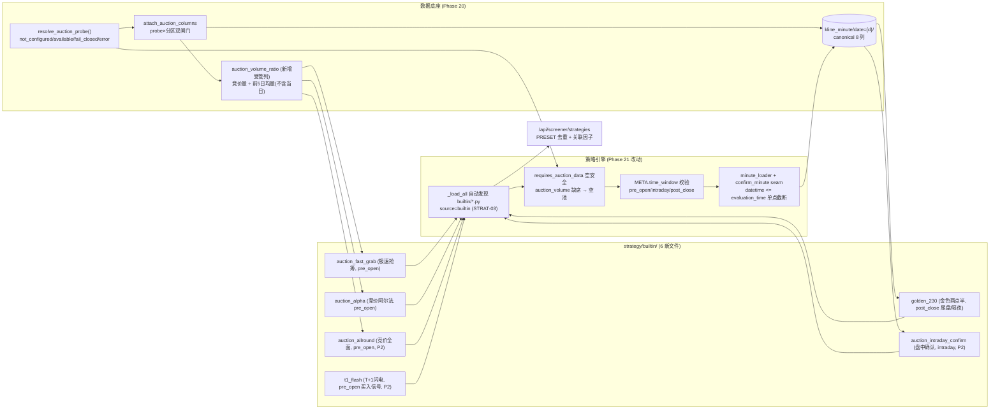

# Phase 21: 竞价策略族 (Auction Strategy Family) - Research

**Researched:** 2026-08-05
**Domain:** A股竞价/尾盘策略族 — 六策略第一性原理因子定义、`strategy/builtin/` 注册/发现、缺列 fail-closed、`evaluation_time` 分钟帧截断与 `time_factor` 折算、STRAT-09 无 lookahead
**Confidence:** HIGH (代码 seam 全部逐行核验; 因子阈值按 A 股第一性原理与 v1.3/v2.0 研究基线校准, 标 `[ASSUMED]` 处需 discuss 确认)

## Summary

Phase 21 在 Phase 20 的 probe 门控竞价列地基上落地**六个第一性原理策略**——极速抢筹 / 竞价阿尔法 / 金色两点半 / 竞价全面策略 / T+1闪电 / 盘中确认——全部以 `strategy/builtin/` 内置文件自动发现（STRAT-03 不变，无第三条注册轨道），每个策略诚实声明**可计算时间窗**（`pre_open` / `intraday` / `post_close`），所需列缺席时整池 **fail-closed 为空**（绝不部分/0 填充）。关键发现：**引擎目前没有 `requires_auction_data`、`time_window`、`evaluation_time` 或分钟级 loader seam**（grep 逐字核验无匹配），这些必须在本期新增；而 **STRAT-06 金色两点半与 STRAT-09 盘中确认都需要一个"分钟帧按评估时刻截断 + `time_factor` 折算"的引擎 seam**，该 seam 镜像既有 `filter_history`（engine.py:287-301）模式。

**基准事实（live probe，Phase 20 实测）:** `resolve_auction_probe()` 返回 `status: not_configured`（`.planning/phases/20-auction-data/20-RESEARCH.md`）。因此六个策略里消费真实竞价列的五类（极速抢筹/竞价阿尔法 real 分支/竞价全面/盘中确认初筛）在默认态下**竞价列缺席 → 空池**是**合法默认态**，不是缺陷；唯一有显式派生回退的是竞价阿尔法（STRAT-05 按 REQUIREMENTS 明确"available 时消费真列，否则 fail-closed 回退派生因子"）。

**Primary recommendation:** 两计划并行（Phase 20 风格，文件零重叠）：**21-01** = 引擎 seam（`requires_auction_data` 空安全 + `time_window`/`evaluation_time` 元数据 + 分钟 loader/confirm seam）+ 受管列 `auction_volume_ratio`（前 5 日均量分母的诚实竞价量比，PIT-safe）+ 3 个 P1 策略（极速抢筹/竞价阿尔法/金色两点半）；**21-02** = 3 个 P2 策略（竞价全面/T+1闪电/盘中确认）+ 文档计数对账。金色两点半**永远不混入竞价窗口**——`time_window: "post_close"`、描述明示"尾盘/隔夜"，文件 id 不用 `auction_` 前缀。

## Phase Constraints (from ROADMAP / REQUIREMENTS / task context)

> 本期 phase 目录为空（无 CONTEXT.md，discuss-phase 未产出锁定决策）。以下约束来自 `.planning/ROADMAP.md` Phase 21、`.planning/REQUIREMENTS.md` STRAT-04..09、`.planning/STATE.md` 与任务上下文，视为等同 locked decisions。

- **STRAT-04**: 极速抢筹 = 竞价量比 + 竞价金额 + 盘前涨幅甜点区（2.8%–3.5%、>7% 风险带）过滤，`strategy/builtin/` 内置策略、诚实命名。
- **STRAT-05**: 竞价阿尔法 = `open_gap` + 竞价量/额强度综合；probe `available` 消费真实竞价列，否则 fail-closed 回退派生因子（`open_gap` + 量比/金额强度）；真实与派生**永不混用**（probe×分区双闸门，20-RESEARCH 铁律）。
- **STRAT-06**: 金色两点半诚实归类**尾盘/隔夜**（T 日涨幅 3%–5% + 14:30 尾盘分钟确认、次日持有），从不混入竞价窗口（STATE.md:65 已锁）。
- **STRAT-07 / STRAT-08 / STRAT-09** (P2): 竞价全面（全因子复合）/ T+1闪电（竞价买入 + 次日早盘分钟 K 卖出确认）/ 盘中确认（09:30–10:00 分钟帧截断到 `evaluation_time`，绝不 lookahead）。
- **成功标准 5**: 每个策略声明可计算时间窗（pre_open/intraday/post_close）且所需列缺席时返回空池（fail-closed）；策略仅经 `strategy/builtin/` 自动发现，无第三条注册轨道（STRAT-03 不变）。
- **约束链**: 零新增运行时依赖；probe×分区双闸门（非 available → 竞价列缺席 → fail-closed 派生 `open_gap`）；09:30 bar 结构性排除；真实 vs 派生永不混用；缺列即空池（无部分/0 填充策略）。

<phase_requirements>
## Phase Requirements

| ID | Description | Research Support |
|----|-------------|------------------|
| STRAT-04 | 极速抢筹：竞价量比 + 竞价金额 + 盘前涨幅甜点区(2.8%–3.5%, >7% 风险带) | §RQ2-STRAT-04：受管列 `auction_volume_ratio`(前5日均量分母) + `auction_amount` 下限 + `open_gap` 甜点带；缺竞价列 → `requires_auction_data` 短路空池 |
| STRAT-05 | 竞价阿尔法：`open_gap` + 竞价量/额强度；probe available 真列、否则派生回退 | §RQ2-STRAT-05：双分支 filter（列存在性分支）+ 超集 scoring 权重和=1.0（引擎对缺失列归一化重缩放） |
| STRAT-06 | 金色两点半：诚实尾盘/隔夜（T日涨幅3%–5% + 14:30尾盘分钟确认、次日持有） | §RQ2-STRAT-06：`time_window: "post_close"` + 日线 `change_pct` 带 + 尾盘分钟确认（分钟 seam，P2 增强）；id 不用 `auction_` 前缀 |
| STRAT-07 | 竞价全面：全因子复合（P2） | §RQ2-STRAT-07：`pre_open` 窗口合规因子集（禁 change_pct/vol_ratio_5d/amount 等 EOD 列） |
| STRAT-08 | T+1闪电：竞价买入 + 次日早盘分钟 K 卖出确认（P2） | §RQ2-STRAT-08：池= T日竞价信号（无 lookahead）；T+1 卖出为 EXIT/描述语义（EXIT_SIGNALS + MAX_HOLD_DAYS=1），不进池计算 |
| STRAT-09 | 盘中确认：09:30–10:00 分钟帧截断到 `evaluation_time`（P2） | §RQ3：引擎单点截断 `datetime <= evaluation_time` + `time_factor = 240/elapsed`；"确认时刻之后无输入"回归 |

</phase_requirements>

## Architectural Responsibility Map

| Capability | Primary Tier | Secondary Tier | Rationale |
|------------|-------------|----------------|-----------|
| 策略注册/发现/去重 | API/Backend (engine + api/screener) | — | `StrategyEngine._load_all` 扫 builtin 目录（engine.py:149-169）；`/api/screener/strategies` 对 `PRESET_STRATEGIES` 去重（api/screener.py:218-251）；无第三条轨道 |
| 缺列 fail-closed 空池 | API/Backend (engine + 策略 filter) | — | `requires_auction_data` 引擎短路 + 策略 filter `pl.lit(False)` 守卫双保险；绝不 0 填充 |
| 竞价列消费 | API/Backend (strategy) | Database/Storage | 策略只消费 `_load_enriched_for_date` 注入的 as-of 帧（含 probe 门控竞价列 + `auction_volume_ratio`） |
| 分钟帧读取/截断 | API/Backend (engine seam) | Database/Storage | 新增分钟 loader seam 镜像 `filter_history`；`repo.get_minute_batch`（repository.py:1259-1276）为唯一读取路径 |
| `evaluation_time` 截断 + `time_factor` | API/Backend (engine seam) | — | 引擎单点截断 `datetime <= eval_time`；`time_factor = 240/elapsed`（market_time.py:14 + pipeline.py:1408-1411 既有折算规约） |
| 因子阈值/权重 | API/Backend (builtin META) | — | 每策略 META 参数化阈值 + `scoring` 权重和=1.0（既有引擎归一化兜底） |
| 诚实标签/命名 | API/Backend (builtin META) | Frontend(Phase 23) | META name/description 第一性原理、不暗示专有配方；金色两点半 `post_close` 尾盘归类 |
| 关联因子 hit_factors | API/Backend | — | `factor_hits.build_factor_hits`（factor_hits.py:19-43）纯函数聚合，Phase 22 交叉共振复用 |

## Standard Stack

### Core

本期**零新增外部运行时依赖**（REQUIREMENTS Out of Scope + 约束链）。全部在既有锁定栈上完成:

| Library | Version | Purpose | Why Standard |
|---------|---------|---------|--------------|
| Polars | >=1.0 (backend/pyproject.toml) | 策略 filter 表达式、分钟帧截断、受管列注入 | 全仓数据管道统一栈; 全部 builtin 策略 `import polars as pl` 铁律（strategy-guide.md:6,269） |
| DuckDB | >=1.0 | `kline_minute`/`kline_auction` 视图注册（repository.py:160-163） | 分钟/K线观测面唯一权威 |
| FastAPI | >=0.115 | 策略清单/run API（api/screener.py） | 既有 API 层 |

### Supporting

| Library | Version | Purpose | When to Use |
|---------|---------|---------|-------------|
| `app.strategy.engine` (repo) | 1.2.0 | `requires_auction_data` 空安全 + `time_window` 元数据 + 分钟 loader seam | 本期唯一引擎改动面（21-01） |
| `app.services.auction_columns` (repo) | 1.2.0 | 读路径注入竞价列 + 新派生 `auction_volume_ratio` | 竞价策略的 as-of 帧来源（`_attach_auction`, screener.py:271-286） |
| `app.market_time` (repo) | 1.2.0 | `trading_minutes_elapsed_from_dt` 折算评估时刻 | STRAT-09/STRAT-06 分钟确认的 `time_factor` 分母 |
| `app.tickflow.repository` (repo) | 1.2.0 | `get_minute_batch(symbols, trade_date)` 分钟帧读取 | 分钟 seam 的唯一数据访问点 |

### Alternatives Considered

| Instead of | Could Use | Tradeoff |
|------------|-----------|----------|
| 引擎新增 `minute_loader`/`confirm_minute` seam | 在日线帧上预计算"分钟确认"布尔列（loader 层注入） | 预计算把 `evaluation_time` 固化进 loader，多评估时刻不可配、且与 `filter_history` 既有模式不一致；seam 让策略声明评估时刻、引擎统一截断（PITFALLS #7 规约） |
| 策略 filter 内自行判 `evaluation_time` 截断 | 引擎单点截断 | 引擎外截断无法被回归锁死，未来某策略漏截断即 lookahead；单点截断 + "确认时刻之后无输入"测试是硬验收 |
| `requires_auction_data` 只靠 filter `pl.lit(False)` | 引擎短路空池 | 只靠 filter 需每个策略手写守卫，漏写即 ColumnNotFoundError（非 fail-closed）；引擎短路 + filter 守卫双保险，且 `requires_auction_data` 元数据供 API/前端显示"为何空池" |
| `auction_volume_ratio` 用 `auction_volume/(volume/vol_ratio_5d)` 内联 | 受管列（前5日均量分母） | 内联分母含当日 EOD volume → `pre_open` 窗口 lookahead；受管列前 5 日均量（不含当日）PIT-safe，且全策略复用 |

**Version verification:** 无新包安装；Polars/DuckDB/FastAPI 已在 backend/pyproject.toml 锁定（Phase 20 已实测 `uv run python -c "import polars"` 成功）。

## Package Legitimacy Audit

> 本期**不安装任何外部包**。全部改动复用仓库既有模块（`engine.py` / `auction_columns.py` / `pipeline.py` / `market_time.py` / `repository.py`）与既有依赖。无新增供应链风险，无需 checkpoint:human-verify。

| Package | Registry | Age | Downloads | Source Repo | Verdict | Disposition |
|---------|----------|-----|-----------|-------------|---------|-------------|
| polars | PyPI | — | — | github.com/pola-rs/polars | OK | 既有依赖，版本锁定 >=1.0 |
| duckdb | PyPI | — | — | github.com/duckdb/duckdb | OK | 既有依赖 |
| fastapi | PyPI | — | — | github.com/fastapi/fastapi | OK | 既有依赖 |

**Packages removed due to [SLOP] verdict:** none
**Packages flagged as suspicious [SUS]:** none

## Architecture Patterns

### System Architecture Diagram



### Recommended Project Structure

```
backend/app/
├── strategy/
│   ├── engine.py                  # 21-01: requires_auction_data 空安全 + time_window/evaluation_time 元数据 + minute_loader/confirm_minute seam (镜像 filter_history)
│   └── builtin/
│       ├── auction_fast_grab.py   # [NEW] 极速抢筹 (STRAT-04, pre_open, requires_auction_data)
│       ├── auction_alpha.py       # [NEW] 竞价阿尔法 (STRAT-05, pre_open, 真实/派生双分支)
│       ├── golden_230.py          # [NEW] 金色两点半 (STRAT-06, post_close, 尾盘/隔夜, 非 auction_ 前缀)
│       ├── auction_allround.py    # [NEW] 竞价全面策略 (STRAT-07, pre_open, P2)
│       ├── t1_flash.py            # [NEW] T+1闪电 (STRAT-08, pre_open 买入 + 次日卖出语义, P2)
│       └── auction_intraday_confirm.py  # [NEW] 盘中确认 (STRAT-09, intraday, minute seam, P2)
├── services/
│   └── auction_columns.py         # 21-01: attach_auction_columns 增 auction_volume_ratio 派生 (PIT-safe)
├── indicators/
│   └── pipeline.py                # 21-01: ENRICHED_COLUMNS 增 auction_volume_ratio 描述 (不进存储窄表/闭包)
backend/tests/
├── test_auction_strategy_family.py    # 21-01: P1 策略 + 引擎 seam
└── test_auction_strategy_family_p2.py # 21-02: P2 策略 + 分钟确认 stage
docs/
├── features.md                   # 21-02: 策略计数 21 → 27 对账
├── strategy.md                   # 21-02: 18 → 27 对账
└── (backend/app/strategy/prompts/strategy-guide.md)  # 21-02: 时间窗/分钟确认契约文档
```

### RQ1 — Registry/discovery 现状与时间窗声明的落点

**自动发现（VERIFIED，本 session 逐行核验）:** `StrategyEngine._load_all`（engine.py:149-169）对每个 `strategy_dir` glob `*.py`、跳过 `_` 前缀文件，逐个 `_load_file`（171-229）。`_load_file` 读取模块 `META`（`meta.setdefault("id", path.stem)` 等默认值），`source` 由路径判定——`engine.py:207-209`:

```python
source = "custom"
if "builtin" in str(path).replace("\\", "/"):
    source = "builtin"
```

`list_strategies()`（engine.py:239-244）返回 `{**s.meta, "source": s.source}`——**META 新增字段天然流入 API**。

**API 去重（VERIFIED）:** `api/screener.py:218-251` `strategies()`：先遍历 `PRESET_STRATEGIES`（screener.py:28-185，12 个键：trend_breakout/ma_golden_cross/macd_golden/volume_price_surge/low_volatility_leader/broken_board_recovery/oversold_bounce/boll_breakout/bullish_alignment/consecutive_limit_ups/pullback_to_support/n_day_low_reversal，与 `auction_*`/`golden_230`/`t1_flash` 零碰撞）填 `seen_ids`，再 `engine.list_strategies()` 跳过已见 id；`load_errors` 显式暴露。**无第三条注册轨道**（17-01-PLAN Task 3 已回归锁定）。

**时间窗字段: 不存在，必须新增（VERIFIED grep 无匹配）:** `backend/app/strategy` 全目录 grep `requires_auction_data|evaluation_time|time_window` → **0 命中**。ROADMAP/研究基线（v1.3 research ARCHITECTURE.md）把 `requires_auction_data` 规划为引擎改动，尚未落地。**推荐新增 META 字段**（引擎读取、API 透传、Phase 23 前端可显示）：

| META 字段 | 类型 | 取值 | 用途 |
|-----------|------|------|------|
| `time_window` | str | `"pre_open" \| "intraday" \| "post_close"` | 可计算时间窗声明（ROADMAP 成功标准 5） |
| `evaluation_time` | str "HH:MM" | 如 `"09:45"` / `"15:00"` | 盘中/尾盘分钟确认的截断时刻 |
| `requires_auction_data` | bool | true/false | 竞价列缺席时引擎短路空池 + API 提示 |

**缺列门控现状（VERIFIED）:** 引擎 `run()` 对 filter 无列存在性 gate——filter 引用缺失列会抛 `ColumnNotFoundError`；现有唯一"缺列静默跳过"是 **scoring**（engine.py:496-497 `if col not in df.columns: continue`）。因此 fail-closed 空池必须由 (a) 引擎 `requires_auction_data` 短路 + (b) 策略 filter 对每个必需列 `if "col" not in df.columns: return pl.lit(False)` **双保险**实现。Phase 20 已锁：竞价列缺席 = probe 非 available 或缺分区（`attach_auction_columns`, auction_columns.py:53-102 原样返回 df）。

### RQ2 — 六策略因子规格（列 / 阈值 / 边界 / 诚实描述）

> 因子阈值按 A 股第一性原理 + v1.3/v2.0 研究基线（`research/v1.3-auction/FEATURES.md:36-38,67-71` 与 `research/PITFALLS.md:151`）校准，**非专有配方**。所有 `pre_open` 策略**禁**用 EOD 列（`change_pct`/`vol_ratio_5d`/`amount`/`close`/`turnover_rate`）——它们只在收盘后可算，盘前引用即 lookahead（PITFALLS #7）。

**受管列新增（Phase 21 地基）:** `auction_volume_ratio`（竞价量比）= `auction_volume / 前5日均量(不含当日)`。由 `auction_columns.attach_auction_columns` 在读路径注入（与真实竞价列同门：probe available 且分区有行），分母取 `repo.get_enriched_history(trade_date, 6)` 过滤 `date < trade_date` 后 tail 5 的 `volume` 均值（PIT-safe，仅前日数据）。注册进 `ENRICHED_COLUMNS` + `ENRICHED_COLUMNS_BY_CATEGORY["auction"]`，**不进** `ENRICHED_STORAGE_COLS`/`_ALL_INDICATOR_COLS`（20-RESEARCH 硬边界 4）。这是唯一诚实的盘前竞价量比——用 `volume/vol_ratio_5d` 内联推导会引入当日 EOD 量，违反 `pre_open` 窗口。

| # | 策略 (id) | time_window | 必需列 | 阈值/区间（默认, 参数化） | 边界行为（缺列/边界值） |
|---|-----------|-------------|--------|--------------------------|--------------------------|
| STRAT-04 | 极速抢筹 (`auction_fast_grab`) | `pre_open` | `auction_volume_ratio`, `auction_amount`, `open_gap` | `auction_volume_ratio >= 1.5`（可调 0.5–5.0 step 0.1）；`auction_amount >= 2_000_000` 元（可调）；甜点区 `open_gap >= 0.028 & open_gap <= 0.035`；风险带 `open_gap > 0.07` **剔除** | 竞价列缺席（probe 非 available）→ `requires_auction_data` 短路空池，**永不**回退 open_gap-only；null `open_gap` fail-closed 剔除 |
| STRAT-05 | 竞价阿尔法 (`auction_alpha`) | `pre_open` | 真列分支: `auction_volume_ratio`, `auction_amount`, `open_gap`；派生分支: `open_gap`, `vol_ratio_5d`, `amount` | 真列分支 `auction_volume_ratio >= 1.0 & open_gap >= 0.015 & auction_amount >= 1_000_000`；派生分支 `open_gap >= 0.02 & vol_ratio_5d >= 1.2 & amount >= 1_000_000` | 双分支按列存在性互斥（`if "auction_volume_ratio" in df.columns`），**真实/派生永不混用**；scoring 超集 `{"open_gap":0.25,"auction_volume_ratio":0.25,"auction_amount":0.25,"vol_ratio_5d":0.15,"amount":0.10}` 和=1.0，引擎对缺失列重归一化 |
| STRAT-06 | 金色两点半 (`golden_230`) | `post_close` | 日线: `change_pct`, `close`, `open`；分钟确认(可增强): `kline_minute` 14:30–15:00 | `change_pct >= 0.03 & change_pct <= 0.05`；`close > open`（收阳）；分钟确认(有分钟数据时): 尾盘 30 分钟 `close` 不低于当日 14:30 开盘（"尾盘不弱"） | 诚实**尾盘/隔夜**：id 不带 `auction_`；描述明示"次日持有，非竞价窗口"；分钟数据缺席 → 日线核心池仍诚实产出（描述注明"分钟确认为可选增强"），不静默标竞价 |
| STRAT-07 | 竞价全面 (`auction_allround`, P2) | `pre_open` | `open_gap`, `auction_volume_ratio`, `auction_amount`, `auction_unmatched_amount`(有则用), `turnover_rate`(可选) | 核心 AND: `open_gap >= 0.02 & auction_volume_ratio >= 1.2 & auction_amount >= 1_000_000`；可选 `turnover_rate >= 0.03`（仅当列存在，EOD 语义标注"参考盘后换手"——或按 PITFALLS #7 直接排除） | 缺竞价列 → 短路空池；**禁用 `change_pct`/`vol_ratio_5d`/`amount`**（pre_open 窗口 EOD 列 = lookahead）；`auction_unmatched_amount` 缺席时自动跳过（既有缺失列静默跳过语义） |
| STRAT-08 | T+1闪电 (`t1_flash`, P2) | `pre_open`（池）+ 次日卖出语义 | `open_gap`, `auction_volume_ratio`, `auction_amount` | 买入信号: `open_gap >= 0.025 & auction_volume_ratio >= 2.0 & auction_amount >= 2_000_000` | **池只含 T 日竞价买入信号（无 lookahead）**；"次日早盘分钟 K 卖出"实现为 `EXIT_SIGNALS`/描述语义（`MAX_HOLD_DAYS=1`，回测用），**不**用 T+1 数据计算池成员；缺竞价列 → 空池 |
| STRAT-09 | 盘中确认 (`auction_intraday_confirm`, P2) | `intraday` | 初筛: `open_gap`, `auction_volume_ratio`(可选)；确认: `kline_minute` 09:30–`evaluation_time` | `EVALUATION_TIME = time(9,45)`（可配）；初筛 `open_gap >= 0.02`；确认: 截至 eval 的分钟帧 `close >= open` 且累计量 `* time_factor >= 阈值`（量价齐升/不破开盘价） | 引擎单点截断 `datetime <= evaluation_time`（"确认时刻之后无输入"回归）；只消费分钟帧内统计，**绝不**引用 EOD `change_pct`/`close`；分钟数据缺席 → 空池（fail-closed） |

**诚实描述样例（META.description）:** 极速抢筹 = "集合竞价量比(竞价量/前5日均量) + 竞价金额强度 + 盘前涨幅甜点区 2.8%–3.5%、>7% 风险带剔除。需要 probe available 的真实竞价列，缺列即空池（第一性原理，非专有配方）。"

### RQ3 — `evaluation_time` 截断 + `time_factor` 折算规约

**既有分钟帧约定（VERIFIED 逐行核验）:**
- `kline_minute` canonical 列: `["symbol", "datetime", "open", "high", "low", "close", "volume", "amount"]`（kline_sync.py:535-537）；按 `date={d}` 分区。
- 09:30 锚定: `_minute_ts` 当日起点兜底 `093000`（free_stockdb_provider.py:481）；`_bucket_minutes` 上午会话 `(hour > 9) | ((hour == 9) & (minute >= 30))`（free_stockdb_provider.py:533-540）——**结构上无 09:15–09:25 数据**，09:30 bar 是连续竞价起点（09:30 永不标竞价）。
- 竞价窗口常量: `_WINDOW_START_MIN = 9*60+15 = 555` / `_WINDOW_END_MIN = 9*60+25 = 565`（auction_probe.py:23-24），写湖/归一化同一谓词（provider.py:150-160）。

**`time_factor` 既有折算（VERIFIED）:** `market_time.py:14` `_TRADING_TOTAL_MINUTES = 240`（9:30–11:30 120 + 13:00–15:00 120）；`trading_minutes_elapsed_from_dt(dt)`（market_time.py:31-47）返回 0..240（盘前 0、午休保持 120、收盘 240）。盘中量比折算（pipeline.py:1408-1411）:

```python
if elapsed_minutes and elapsed_minutes > 0:
    time_factor = 240.0 / elapsed_minutes  # 盘中折算: 部分量 → 全天量级
else:
    time_factor = 1.0  # 盘后/无效时间: 不折算(此时 volume 已是全天量)
```

**STRAT-09 规约（推荐）:** 引擎新增 `minute_loader(symbols, trade_date)` + `confirm_minute(df_minute, params) -> pl.Expr` 钩子（镜像 `filter_history_fn` 模式，engine.py:287-301），`StrategyDef` 增 `minute_confirm_fn`/`evaluation_time` 字段。执行序：日线初筛 → 对候选 symbols 调 `repo.get_minute_batch(candidates, as_of)`（repository.py:1259-1276）→ **引擎单点** `df_minute.filter(pl.col("datetime") <= evaluation_time)` → `confirm_minute` 计算"截至 eval"统计 → 只保留确认的 candidates 进评分。策略内 `elapsed = trading_minutes_elapsed_from_dt(evaluation_time)`；盘中量比 = `cum_volume * (240/elapsed) / 前5日均量`。示例（09:45 eval，elapsed=15，tf=16.0）。

**无 lookahead 硬验收:** (1) 截断点只在引擎，策略拿到的分钟帧物理上不含 eval 后 bar；(2) 回归测试喂 eval 后 bar → 断言未参与（"确认时刻之后无输入"）；(3) STRAT-09 日线初筛只允许 `pre_open` 可算列（open_gap/竞价列），EOD 列一票否决。

### RQ4 — 两计划并行拆分（Phase 20 风格，文件零重叠）

| 计划 | Wave | 职责 | 文件（零重叠） | 策略子集 |
|------|------|------|----------------|----------|
| **21-01-PLAN** | 1 | 引擎 seam（`requires_auction_data` 空安全 + `time_window`/`evaluation_time` 元数据 + `minute_loader`/`confirm_minute`）+ 受管列 `auction_volume_ratio` + P1 三策略 | `backend/app/strategy/engine.py`, `backend/app/services/auction_columns.py`, `backend/app/indicators/pipeline.py`, `strategy/builtin/auction_fast_grab.py`, `strategy/builtin/auction_alpha.py`, `strategy/builtin/golden_230.py`, `tests/test_auction_strategy_family.py` | STRAT-04, STRAT-05, STRAT-06（日线核心 + 尾盘分钟确认经 seam） |
| **21-02-PLAN** | 1 | P2 三策略（复用 21-01 的 seam，无引擎改动）+ 文档对账 | `strategy/builtin/auction_allround.py`, `strategy/builtin/t1_flash.py`, `strategy/builtin/auction_intraday_confirm.py`, `tests/test_auction_strategy_family_p2.py`, `docs/features.md`, `docs/strategy.md`, `backend/app/strategy/prompts/strategy-guide.md` | STRAT-07, STRAT-08, STRAT-09 |

**拆分理由:** 引擎.py 只被 21-01 触碰（避免并行 executor 对同一文件的写冲突，Phase 20 两计划文件零重叠的前例）；21-02 的盘中确认只是以不同 `evaluation_time` 复用同一 seam，无需引擎改动。P1（STRAT-04/05/06）先行落地让成功标准 1–3 在 Wave 1 即可验收；P2（STRAT-07/08/09）与文档计数对账（21 → 27，`docs/features.md:11` 现 21、`docs/strategy.md:11` 现 18 **已漂移**）在 21-02 关闭。

### RQ5 — Threat Model（详见 Security Domain + 以下注册表）

| Threat ID | 类别 | 组件 | Severity | Mitigation |
|-----------|------|------|----------|------------|
| T-21-01 | Spoofing (lookahead) | STRAT-09 分钟帧 | critical | 引擎单点 `datetime <= evaluation_time` 截断；回归"确认时刻之后无输入"；STRAT-09 初筛禁用 EOD 列 |
| T-21-02 | Spoofing (label drift) | 金色两点半 META | high | `time_window: "post_close"` + id 不带 `auction_` 前缀 + 描述明示尾盘/隔夜；test 断言 META 归类 |
| T-21-03 | Tampering (fail-open) | `requires_auction_data` 门 | high | 引擎短路空池 + filter `pl.lit(False)` 双保险；遍历 probe 三态断言空池 |
| T-21-04 | Tampering (lookahead pre_open) | 竞价全面/极速抢筹 EOD 列引用 | high | 窗口白名单 fixture：`pre_open` 策略 filter 只含允许列（grep 门禁） |
| T-21-05 | Tampering (time_factor 误算) | `confirm_minute` 量比 | medium | `time_factor = 240/elapsed` 复用 market_time.py 折算；eval=09:45 → elapsed=15 → tf=16.0 fixture |
| T-21-06 | Tampering (scoring 权重漂移) | 全部新策略 scoring | medium | 权重和=1.0 fixture（沿 test_auction_strategies.py:105-108）；缺失评分列静默跳过既有语义（engine.py:496-497） |
| T-21-07 | Spoofing (命名暗示配方) | 六策略 META | medium | 描述含第一性原理因子定义；test 断言 description 无"复刻/对标"字样 |

## Don't Hand-Roll

| Problem | Don't Build | Use Instead | Why |
|---------|-------------|-------------|-----|
| 分钟帧读取 | 自写 parquet 扫描 | `repo.get_minute_batch(symbols, trade_date)`（repository.py:1259-1276） | 既有 predicate pushdown + 排序实现，一次 scan 读多标的 |
| 交易分钟折算 | 自写时段判断 | `market_time.trading_minutes_elapsed_from_dt`（market_time.py:31-47） | 固定北京时间、午休保持、非交易日 240 语义已锁定；`time_factor = 240/elapsed`（pipeline.py:1408-1411） |
| 策略评分归一化 | 自写 min-max | 引擎 `_apply_scoring`（engine.py:485-512） | 缺列静默跳过 + 权重归一化既有行为；新策略只声明权重和=1.0 |
| 关联因子聚合 | 自写 hit 聚合 | `factor_hits.build_factor_hits`（factor_hits.py:19-43） | 纯函数、确定性排序，Phase 22 交叉共振消费同一契约 |
| 注册/去重 | 建第三条注册轨道 | builtin 目录自动发现 + `PRESET_STRATEGIES` seen_ids 去重（api/screener.py:218-251） | STRAT-03 铁律（17-01-PLAN Task 3 已回归锁定） |
| 竞价量比分母 | `auction_volume/(volume/vol_ratio_5d)` 内联 | 受管列 `auction_volume_ratio`（前5日均量分母） | 内联分母含当日 EOD 量 → pre_open lookahead；受管列 PIT-safe |

**Key insight:** 这期最贵的错误是"看起来能跑的 lookahead"——`pre_open` 策略引用了 `change_pct`/`vol_ratio_5d`/`amount`（EOD 列）、STRAT-09 忘了截断、T+1 用次日数据算池成员。它们不报错、只让研究结论在盘前不可复现。把窗口声明 + 引擎单点截断 + 缺列短路做成硬约束，消费端就无法静默 fail-open。

## Common Pitfalls

### Pitfall 1: `pre_open` 策略引用 EOD 列（lookahead）
**What goes wrong:** 极速抢筹/竞价阿尔法/竞价全面把 `change_pct`、`vol_ratio_5d`、`amount`、`turnover_rate` 当盘前因子；`vol_ratio_5d` 的当日 volume 只有收盘后可知。
**Why it happens:** as-of 日线帧所有指标列都是 EOD 计算；图省事直接引用最顺手。
**How to avoid:** 每策略 META 声明 `time_window`；fixture 只喂窗口允许列 + grep 门禁断言 filter 不引用 EOD 列；竞价量比走受管列 `auction_volume_ratio`。
**Warning signs:** `pre_open` 策略的 filter 出现 `change_pct`/`vol_ratio_5d`/`close`；描述称"盘前可用"但依赖当日成交量。

### Pitfall 2: STRAT-09 漏截断 / 未来 bar 回看
**What goes wrong:** 09:45 确认用了 10:00 后的分钟 bar；回放同一 as_of 在不同时刻得到不同池。
**Why it happens:** 截断点散落在策略内、或干脆没截断。
**How to avoid:** 截断只在引擎（`datetime <= evaluation_time` 单点）；"确认时刻之后无输入"回归测试；回放时同一 eval 时刻确定性。
**Warning signs:** 策略里出现 `df_minute` 无 `<= eval_time` 过滤；回放结果随"当前时间"漂移。

### Pitfall 3: 金色两点半被当作竞价策略（label drift）
**What goes wrong:** 用户按"竞价策略族"分组理解，以为它消费 09:15–09:25 竞价数据，实际是尾盘选股。
**Why it happens:** 参考 UI 把五个标签并排；图省事给 id 加 `auction_` 前缀。
**How to avoid:** `time_window: "post_close"`、id `golden_230`（无 `auction_`）、描述明示"尾盘 14:30 后选股、次日持有，非竞价窗口"；test 断言归类。
**Warning signs:** `golden_230` 的 filter 引用 `auction_*` 列；文件 id 含 `auction_`。

### Pitfall 4: 缺列静默 fail-open
**What goes wrong:** probe 非 available 时策略照常出池（用 open_gap 顶替竞价列，状态标识不变）。
**Why it happens:** filter 没判列存在性，直接引用竞价列 → 要么 ColumnNotFoundError 崩溃、要么被兜底逻辑悄悄填充。
**How to avoid:** `requires_auction_data` 引擎短路 + 每个必需列 filter `pl.lit(False)` 守卫；遍历 `not_configured/fail_closed/error` 三态断言空池。
**Warning signs:** 竞价策略在 probe 面板显示 fail_closed 却仍有非空池。

### Pitfall 5: `time_factor` 误算（量比系统性失真）
**What goes wrong:** 盘中累计量直接除以全天 5 日均量，量比被低估 N 倍；或 eval 时刻 elapsed 取错。
**Why it happens:** 不用 `trading_minutes_elapsed_from_dt(evaluation_time)`，而是用当前墙钟或固定 240。
**How to avoid:** `elapsed = trading_minutes_elapsed_from_dt(eval_time)`；`time_factor = 240/elapsed`；fixture 断言 eval=09:45 → elapsed=15 → tf=16.0。
**Warning signs:** 盘中量比在 09:45 只有收盘量比的 ~1/16；换算常数不是 240。

### Pitfall 6: 文档计数漂移
**What goes wrong:** 加 6 策略后 `docs/features.md`(21)/`docs/strategy.md`(18) 与源码不符（现状已漂移）。
**Why it happens:** 策略文件自动发现，无人工对账。
**How to avoid:** 21-02 内对账 `features.md`/`strategy.md` 到 27；提交含计数更新（research/PITFALLS #6 警告）。
**Warning signs:** 文档声称数量 ≠ `strategy/builtin/*.py` 文件数。

## Code Examples

### 1. 内置策略 META 模式（VERIFIED，`strong_open.py` / `auction_bullish.py`）
```python
# Source: backend/app/strategy/builtin/auction_bullish.py:4-19 (VERIFIED)
META = {
    "id": "auction_bullish",
    "name": "竞价多头",
    "description": "开盘涨幅 (open/prev_close−1) 与日涨幅 (change_pct) 双动量同时达标",
    "tags": ["竞价", "高开", "动量"],
    "params": [
        {"id": "min_open_gap", "label": "最低开盘涨幅%", "type": "float",
         "default": 2.0, "min": 0.0, "max": 10.0, "step": 0.5},
    ],
    "scoring": {"open_gap": 0.5, "change_pct": 0.5},
    "order_by": "score",
    "descending": True,
    "limit": 50,
}
```
Phase 21 新策略在此 META 追加 `"time_window": "pre_open"` / `"evaluation_time": "09:45"` / `"requires_auction_data": True`。

### 2. filter 缺列 fail-closed 守卫（推荐模式，沿 20-RESEARCH Code Example 4 的缺失列静默跳过语义）
```python
def filter(df: pl.DataFrame, params: dict) -> pl.Expr:
    # 必需列缺席 → 整池为假 → 空池 (fail-closed, 绝不部分/0 填充)
    if "auction_volume_ratio" not in df.columns or "auction_amount" not in df.columns:
        return pl.lit(False)
    vol_r = params.get("min_auction_vol_ratio", 1.5)
    amt = params.get("min_auction_amount", 2_000_000)
    return (
        (pl.col("open_gap") >= 0.028) & (pl.col("open_gap") <= 0.035)
        & (pl.col("open_gap") <= 0.07)                      # >7% 风险带剔除
        & (pl.col("auction_volume_ratio") >= vol_r)
        & (pl.col("auction_amount") >= amt)
    )
```

### 3. 分钟帧截断 + time_factor（既有规约 VERIFIED）
```python
# Source: backend/app/market_time.py:14,31-47 (VERIFIED) + pipeline.py:1408-1411 (VERIFIED)
# _TRADING_TOTAL_MINUTES = 240
# elapsed = trading_minutes_elapsed_from_dt(evaluation_time)   # eval=09:45 → 15.0
# time_factor = 240.0 / elapsed if elapsed > 0 else 1.0        # → 16.0
# intraday_vol_ratio = cum_volume * time_factor / prior_5d_avg_volume
```

### 4. 引擎缺列短路空池（推荐新增，镜像 run() 现有空帧早退）
```python
# Source: backend/app/strategy/engine.py:302-307 (VERIFIED 空帧早退模式; 新增 requires_auction_data 分支)
# 在 run() 数据加载后、基础过滤前插入:
if s.meta.get("requires_auction_data") and "auction_volume" not in df.columns:
    return StrategyResult(as_of=as_of, strategy_id=strategy_id)   # fail-closed 空池
```

### 5. 引擎缺失评分列静默跳过（VERIFIED，strategy filter 消费竞价列依赖它）
```python
# Source: backend/app/strategy/engine.py:496-497 (VERIFIED)
for col, weight in weights.items():
    if col not in df.columns:
        continue   # 缺失列被静默跳过 — 派生分支/缺席列自动退化, 不报错
```

## State of the Art

| Old Approach | Current Approach | When Changed | Impact |
|--------------|------------------|--------------|--------|
| v1.3 三策略只用 `open_gap`/`change_pct`/`vol_ratio_5d`（EOD 派生，17-01-PLAN） | v2.0 六策略消费 probe 门控真实竞价列 + `auction_volume_ratio`，窗口声明 + 分钟确认 | Phase 21 | 盘前因子从"开盘涨幅近似"升级到"真实撮合量/额 + 盘前可算量比" |
| 引擎无时间窗/列门控（引用缺失列即崩溃） | `time_window`/`evaluation_time`/`requires_auction_data` 元数据 + 短路空池 | Phase 21 | fail-closed 成为引擎契约而非策略自觉 |
| 无分钟级复评能力 | `minute_loader`/`confirm_minute` seam（`<= eval_time` 单点截断 + `time_factor`） | Phase 21 | STRAT-09 盘中确认 / STRAT-06 尾盘确认落地，无 lookahead |

**Deprecated/outdated:**
- `docs/strategy.md:11` 写"18 个内置策略"、`docs/features.md:11` 写"21 个内置策略"，源码现 21 个——本期 +6 后为 27，需在 21-02 对账（两处都改）。
- `docs/strategy.md`/`strategy-guide.md` 尚无 `time_window`/`evaluation_time`/`requires_auction_data`/`confirm_minute` 契约——21-02 须补写，否则 AI/自定义策略不知该字段。

## Assumptions Log

| # | Claim | Section | Risk if Wrong |
|---|-------|---------|---------------|
| A1 | `auction_volume_ratio` 分母 = 前 5 个交易日日均量（不含当日，经 `get_enriched_history(trade_date, 6)` 取 tail 5 均值） | RQ2 受管列 | 若接受含当日 EOD 量的 `vol_ratio_5d` 反推，则 pre_open 窗口 lookahead；需 discuss 确认分母口径 |
| A2 | 极速抢筹/竞价全面 在竞价列缺席时**严格空池**（不退化 open_gap-only） | RQ2 | 若无真列时希望有"派生版"池子，应仿 STRAT-05 增加显式派生分支；但 REQUIREMENTS 只给 STRAT-05 授权派生回退 |
| A3 | STRAT-06 日线核心（change_pct 带 + 收阳）在分钟数据缺席时仍诚实产出，分钟确认为可选增强 | RQ2-STRAT-06 | 若成功标准要求"分钟确认是必需因子"，缺分钟数据应 fail-closed 空池；需 discuss 确认 |
| A4 | `evaluation_time` 默认 09:45（STRAT-09）与 15:00（STRAT-06 尾盘）为可配参数 | RQ3 | 默认时刻影响池子规模与可复现性；需 discuss 确认默认值 |
| A5 | STRAT-08 的 T+1 卖出确认只作为 EXIT/描述语义，不计算池成员 | RQ2-STRAT-08 | 若用户期待池子含"次日可卖出"确认，需引入 T+1 分钟数据 → 池变 lookahead；强烈建议维持现推荐 |

## Open Questions (RESOLVED)

> 下列开放项全部在 21-01/21-02 计划中以 must_haves / task 规格落定，标记 RESOLVED：

1. **`auction_volume_ratio` 分母口径（A1）— RESOLVED in 21-01 Task 2**（采用前 5 日均量不含当日，`get_enriched_history(trade_date,6)` + `date < trade_date` + `tail(5)` 均值；禁用反推 `vol_ratio_5d` 含当日 EOD 量的 lookahead 口径）
   - What we know: 前 5 日均量（不含当日）PIT-safe；`vol_ratio_5d` 反推含当日 EOD 量（lookahead）。
   - What's unclear: 是否接受 `get_enriched_history` 每日期扫描的开销（可加 per-date 缓存）。
   - Recommendation: 采用前 5 日均量（不含当日），在 `attach_auction_columns` 内按 (trade_date) 缓存；若扫描成本不可接受，改为在 `_compute_enriched_full` warmup 路径顺带计算。

2. **STRAT-06 分钟确认的必需性（A3）— RESOLVED in 21-01 Task 3**（日线核心池 + 分钟确认增强；`minute_confirm_required=False`，分钟数据缺席时跳过确认保留日线池，`test_golden_230_minute_confirm_optional` 锁死）
   - What we know: 成功标准 3 列出"14:30 尾盘分钟确认"；平台分钟同步默认未开启时该日分钟数据可能缺席。
   - What's unclear: 缺分钟数据时是空池（严格）还是日线代理池（诚实标注）。
   - Recommendation: 日线核心池 + 分钟确认增强（有数据才收窄），描述诚实标注；若 discuss 倾向严格，改 `minute_confirm_required=True`。

3. **STRAT-09 默认 `evaluation_time`（A4）— RESOLVED in 21-02 Task 1**（默认 09:45，参数化可调；`test_time_factor` 锁 09:45→elapsed=15→time_factor=16.0）
   - What we know: ROADMAP 写 09:30–10:00；PITFALLS #7 用 `df.filter(datetime <= eval_time)`。
   - What's unclear: 09:30/09:45/10:00 哪个默认。
   - Recommendation: 默认 09:45（15 分钟已交易，`time_factor=16.0` 直观），参数化可调。

4. **P2 三策略的验收口径（STRAT-07/08/09）— RESOLVED in 21-02 Task 2/1**（竞价全面核心 AND 严格 `pre_open` 合规禁 EOD 列；`turnover_rate` 明确标注"盘后参考（EOD，默认关）"为白名单显式例外；T+1 闪电卖出=EXIT 语义不进池；盘中确认 `minute_confirm_required=True` 缺分钟空池）
   - What we know: 三者为 P2；ROADMAP 成功标准 4 要求"研究者可以运行"。
   - What's known (resolved): 竞价全面核心 AND 引用 EOD `turnover_rate` 仅在 `use_turnover=True` 且帧已含该列时收窄，description/params 显式标注"盘后参考（EOD 列，默认关）"为 pre_open 白名单例外，绝不冒充盘前可算。
   - Resolution: 采用"显式标注例外"路线（21-02 Task 2）：核心 AND 严格 `pre_open` 合规；`turnover_rate` 作为默认关的可选收窄，标注盘后参考；grep 门禁禁列清单（`change_pct`/`vol_ratio_5d`/`amount`/`close`）不含 `turnover_rate`。

## Environment Availability

> 本期无新增外部服务依赖；全部依赖已在仓库锁定并实测可用（Phase 20 实测）。竞价数据源默认 `not_configured` 是**合法默认态**（策略空池），不是阻塞态。

| Dependency | Required By | Available | Version | Fallback |
|------------|------------|-----------|---------|----------|
| Python 3.11+ (uv) | 全部 | ✓ | 3.x (uv run 实测) | — |
| polars | 策略 filter / 分钟截断 | ✓ | >=1.0 | — |
| duckdb | kline_minute/kline_auction 视图 | ✓ | >=1.0 | — |
| FastAPI | 策略 API | ✓ | >=0.115 | — |
| `kline_minute` 湖 | STRAT-06 尾盘确认 / STRAT-09 | ✗ (视 minute 同步偏好) | — | STRAT-06 日线核心池；STRAT-09 空池 |
| 真实竞价源 (auction dataset) | 极速抢筹/竞价阿尔法真列/竞价全面/盘中确认初筛 | ✗ (live probe: not_configured) | — | 默认空池（fail-closed）或 STRAT-05 派生分支 |

**Missing dependencies with no fallback:**
- 无。（not_configured 与分钟数据缺席均为**合法 fail-closed 态**。）

**Missing dependencies with fallback:**
- 竞价数据源: 无真实源时真列策略空池；验收用 `test_auction_probe.py` 的 `FakeAuctionProvider` 模式 + monkeypatch probe verdict（沿 20-01/20-02 测试约定）。
- 分钟数据: STRAT-09 验收用手工写 `kline_minute/date={d}/part.parquet` fixture（canonical 8 列）。

## Validation Architecture

> `workflow.nyquist_validation: true`（.planning/config.json），本节必含。

### Test Framework
| Property | Value |
|----------|-------|
| Framework | pytest >=8.0（backend/pyproject.toml；`--import-mode=importlib`, `asyncio_mode=auto`） |
| Config file | backend/pyproject.toml `[tool.pytest.ini_options]` |
| Quick run command | `uv run pytest tests/test_auction_strategy_family.py tests/test_auction_strategy_family_p2.py -x`（from `backend/`） |
| Full suite command | `uv run pytest -x`（从 backend/；抽样按 Wave） |

### Phase Requirements → Test Map
| Req ID | Behavior | Test Type | Automated Command | File Exists? |
|--------|----------|-----------|-------------------|-------------|
| STRAT-04 | 甜点区 2.8–3.5% + >7% 剔除 + 量比/金额阈值 | unit | `uv run pytest tests/test_auction_strategy_family.py::test_fast_grab_bands -x` | ❌ Wave 0 |
| STRAT-04 | 缺竞价列 → 空池（probe 三态遍历） | unit | `tests/test_auction_strategy_family.py::test_fast_grab_fail_closed -x` | ❌ Wave 0 |
| STRAT-05 | 真列分支 vs 派生分支互斥、永不混用 | unit | `tests/test_auction_strategy_family.py::test_alpha_branch_exclusive -x` | ❌ Wave 0 |
| STRAT-05 | scoring 超集权重和=1.0 + 缺失列重归一化 | unit | `tests/test_auction_strategy_family.py::test_alpha_scoring -x` | ❌ Wave 0 |
| STRAT-06 | `post_close` 归类 + 3%–5% 带 + 收阳；id 非 auction_ | unit | `tests/test_auction_strategy_family.py::test_golden_230_window -x` | ❌ Wave 0 |
| STRAT-07 (P2) | pre_open 白名单（禁 EOD 列）+ 缺列空池 | unit | `tests/test_auction_strategy_family_p2.py::test_allround_whitelist -x` | ❌ Wave 0 |
| STRAT-08 (P2) | 池= T日信号；无 T+1 数据参与 | unit | `tests/test_auction_strategy_family_p2.py::test_t1_flash_no_lookahead -x` | ❌ Wave 0 |
| STRAT-09 (P2) | `<= evaluation_time` 截断；eval 后 bar 未参与 | unit | `tests/test_auction_strategy_family_p2.py::test_intraday_truncation -x` | ❌ Wave 0 |
| STRAT-09 (P2) | `time_factor = 240/elapsed`（09:45→15→16.0） | unit | `tests/test_auction_strategy_family_p2.py::test_time_factor -x` | ❌ Wave 0 |
| STRAT-03 回归 | 6 新 id 仅 builtin 发现、PRESET 无碰撞、API 恰好一次 | unit | `tests/test_auction_strategy_family.py::test_no_third_registry -x` | ❌ Wave 0 |
| 引擎空安全 | `requires_auction_data=True` + 无 auction_volume → 空 StrategyResult | unit | `tests/test_auction_strategy_family.py::test_engine_short_circuit -x` | ❌ Wave 0 |
| 既有回归 | 既有 21 内置策略加载/运行不回归 | unit | `uv run pytest tests/test_auction_strategies.py -x` | ✅ 既有 |

### Sampling Rate
- **Per task commit:** `uv run pytest tests/test_auction_strategy_family.py -x`（21-01）或 `tests/test_auction_strategy_family_p2.py -x`（21-02）
- **Per wave merge:** `uv run pytest tests/test_auction_strategy_family.py tests/test_auction_strategy_family_p2.py tests/test_auction_strategies.py tests/test_auction_columns.py -x`
- **Phase gate:** 全量 `uv run pytest -x` 绿（含 test_pool_hub.py POOL-03 守卫等既有回归）

### Wave 0 Gaps
- [ ] `backend/tests/test_auction_strategy_family.py` — P1 策略 + 引擎 seam + STRAT-03 回归（21-01）
- [ ] `backend/tests/test_auction_strategy_family_p2.py` — P2 策略 + 截断/time_factor 回归（21-02）
- [ ] 复用 `backend/tests/test_auction_strategies.py` 的 `_governed_fixture`/`_engine`/`_screener_client` helper（既有，可扩展）

## Security Domain

> `workflow.security_enforcement: true`（config.json），本节必含。`security_asvs_level: 1`。

### Applicable ASVS Categories

| ASVS Category | Applies | Standard Control |
|---------------|---------|-----------------|
| V2 Authentication | no | 本期无新会话/认证面；策略 API 沿既有鉴权 |
| V3 Session Management | no | 无新会话状态 |
| V4 Access Control | no | 无新资源边界；分钟/竞价湖走既有 data_dir 访问控制 |
| V5 Input Validation | yes | `evaluation_time` 解析 fail-closed（非法时刻 → 策略空池/加载错误可见）；META 字段校验在 `_load_file` 归一化；probe error 详情沿用 `_ERROR_DETAIL_MAX=200` 截断 |
| V6 Cryptography | no | 无加解密 |

### Known Threat Patterns for {stack}

| Pattern | STRIDE | Standard Mitigation |
|---------|--------|---------------------|
| STRAT-09 lookahead（未来 bar 进"当前确认"） | Spoofing | 引擎单点 `datetime <= evaluation_time` 截断 + "确认时刻之后无输入"回归（T-21-01） |
| `pre_open` 策略引用 EOD 列（change_pct/vol_ratio_5d/amount） | Spoofing | 窗口白名单 fixture + grep 门禁（T-21-04） |
| 缺列静默 fail-open（竞价列缺席仍出池） | Tampering | `requires_auction_data` 引擎短路 + filter `pl.lit(False)` 双保险；probe 三态空池断言（T-21-03） |
| 金色两点半冒充竞价策略（label drift） | Spoofing | `time_window: "post_close"` + id 非 auction_ + 描述明示尾盘/隔夜（T-21-02） |
| 命名暗示专有配方 | Spoofing | META 描述含第一性原理因子定义；"复刻/对标"字样 grep 断言（T-21-07） |
| `time_factor` 误算致量比失真 | Tampering | 复用 `market_time` 折算；fixture 断言 eval→elapsed→tf（T-21-05） |

## Sources

### Primary (HIGH confidence)
- 代码核验（本 session 逐行读取）: `backend/app/strategy/engine.py`（_load_all 149-169 / _load_file 171-229 / source 207-209 / list_strategies 239-244 / run 259-362 / scoring 485-512 含 496-497 / StrategyDef 96-113）
- 代码核验: `backend/app/strategy/factor_hits.py:16,19-43`（HIT_FACTORS_COLUMN + build_factor_hits）
- 代码核验: `backend/app/strategy/builtin/auction_bullish.py` / `auction_preopen_quant.py` / `auction_early_star.py` / `strong_open.py` / `volume_price_surge.py` / `near_limit_up.py` / `broken_board_recovery.py`（META/filter/scoring 既有模式）
- 代码核验: `backend/app/services/auction_probe.py:23-24,33-37`（555/565 + AuctionProbeStatus 四值 verbatim）
- 代码核验: `backend/app/services/auction_columns.py:53-102`（attach_auction_columns probe×分区双闸门）
- 代码核验: `backend/app/services/screener.py:28-185,217-286`（PRESET_STRATEGIES + _load_enriched_for_date + _attach_auction）
- 代码核验: `backend/app/api/screener.py:218-251`（strategies 去重）
- 代码核验: `backend/app/indicators/pipeline.py:57-67,75-184,1404-1416`（ENRICHED_* + time_factor）
- 代码核验: `backend/app/market_time.py:13-18,31-78`（240 + trading_minutes_elapsed_from_dt/from_ts）
- 代码核验: `backend/app/services/kline_sync.py:535-537,829-913`（minute canonical 列 + 按日分区）
- 代码核验: `backend/app/data_providers/free_stockdb_provider.py:476-482,520-545`（_minute_ts 093000 锚定 + _bucket_minutes 09:30 起）
- 代码核验: `backend/app/tickflow/repository.py:160-163,1259-1276,1666-1669`（kline_minute/kline_auction 视图 + get_minute_batch + rebuild_views）
- 代码核验: `backend/app/strategy/prompts/strategy-guide.md:15-145,250-273`（文件结构 + filter_history + 禁引用数据 + import 铁律）
- 代码核验: `backend/tests/test_auction_strategies.py:23-55,105-108`（fixture/engine/权重和=1.0 约定）
- 既有研究: `.planning/research/v1.3-auction/PITFALLS.md` 与 `.planning/research/PITFALLS.md`（v2.0，Pitfall 6/7/8/9/10/11）与 `.planning/research/v1.3-auction/FEATURES.md`（甜点区 2.8–3.5%、>7% 风险带、金色两点半诚实归类、STRAT-05 盘中确认）、`ARCHITECTURE.md`（requires_auction_data 规划）、`STACK.md`/`SUMMARY.md`
- 基线文档: `.planning/phases/20-auction-data/20-RESEARCH.md`（probe 门控/双闸门/受管列纪律）与 `17-01-PLAN.md`/`17-02-PLAN.md`（v1.3 三策略模式 + STRAT-03 回归）

### Secondary (MEDIUM confidence)
- [CITED: 上交所交易规则] — 9:15–9:25 开盘集合竞价、9:30 起连续竞价（20-RESEARCH 已引用）
- [CITED: 大智慧金色两点半 / 尾盘选股法] — 14:30 后尾盘选股、次日 09:30–10:00 卖出（v1.3 research FEATURES.md:45 记录）

### Tertiary (LOW confidence)
- [ASSUMED] A1 竞价量比分母口径 / A2 严格空池 / A3 STRAT-06 分钟确认可选 / A4 默认 eval 时刻 / A5 T+1 卖出不进池 — 见 Assumptions Log，planner/discuss-phase 需确认。

## Metadata

**Confidence breakdown:**
- Standard stack: HIGH — 零新依赖，全部复用既有锁定栈与仓库模块（engine/auction_columns/pipeline/market_time/repository）
- Architecture: HIGH — 注册/去重/缺列门控/分钟 seam 均映射到已核验的既有 seam（`filter_history_fn`、`get_minute_batch`、`trading_minutes_elapsed_from_dt`、`_apply_scoring`、`PRESET_STRATEGIES` 去重）
- Pitfalls: HIGH — 直接继承 `.planning/research/PITFALLS.md` #6/#7/#8/#9/#10/#11 并补充 pre_open EOD 列白名单与 time_factor fixture

**Research date:** 2026-08-05
**Valid until:** 2026-09-04（30 天；因子阈值与数据源可用性是快速变化面，live probe 重探测后可续）
