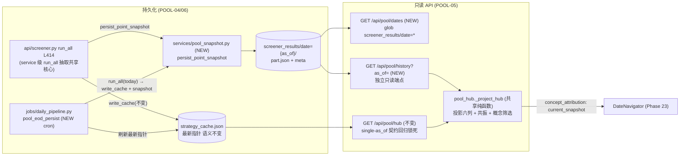

# Phase 22: 股池日期导航 (Pool Hub Date Navigation) - Research

**Researched:** 2026-08-05
**Domain:** 冻结式点快照持久化 (POOL-04) + 日期列表/as_of 只读端点 (POOL-05) + 盘后 EOD 持久化 job (POOL-06) — 零新增运行时依赖
**Confidence:** HIGH (全部 seam 逐行核验; 磁盘数据布局实测; 现有 38 个回归测试基线实测通过)

## Summary

Phase 22 在 Phase 20/21 的 `run_all` 逐日期可产出地基上落地**历史股池日期导航**。核心事实：现有 `strategy_cache.write_cache` 的单日合并是 **union 语义**——`strategy_cache.py:118-145` 把当日多次运行的 `today_ever_rows` 做并集（`combined = {**old_map, **cur_map}`，L134），因此**绝不能**把 `strategy_cache.json` 当历史快照归档。POOL-04 必须引入**冻结式点快照**：把当次 `run_all` 的 `results`（不含 `today_ever_rows`）原样持久化到 `screener_results/date={as_of}/`，携带 `as_of + computed_at + strategy_version` 指纹。磁盘实测：`data/screener_results/` 是**空占位目录**（全仓无写入方，仅 repository.py:68-72 建目录、data.py:513/665 统计），`kline_daily_enriched/` 有 247 个 `date=` 分区（最新 2026-08-04），`strategy_cache.json` 的 as_of=**2026-07-31**（已陈旧——EOD job 顺带修复）。

POOL-05 的关键边界：`GET /api/pool/hub` 的 single-as_of 契约**不可改动**（`pool_hub.py:79-80` 反漂移回显 + `test_pool_hub.py:432-440` 回归锁死）。历史取池必须走**独立只读端点**（推荐 `GET /api/pool/history?as_of=`），复用 `build_pool_hub` 的投影核心（重构为共享纯函数 `_project_hub`），快照缺失日返回诚实空态标记（`available:false`，非 404）。日期列表 `GET /api/pool/dates` 的 source of truth = `screener_results/date=*` 分区 glob（沿 daily_pipeline.py:409/580 既有模式），无需 DuckDB。

POOL-06：apscheduler 3.11.2 已在启动时接线（`main.py:513-514` `start_scheduler`），现有 5 个 cron job（`daily_pipeline.py:977-1075`），**无** EOD 股池持久化 job——需新增。推荐**独立 job**（`_run_tracked("pool_eod_persist")`），调用 service 级 run_all（从 `api/screener.py run_all` L414 抽取共享核心），同时刷新 `strategy_cache.json`（修复陈旧）并持久化点快照。全部在既有锁定栈上完成，**零新增依赖**（polars 1.40.1 / duckdb 1.5.3 / fastapi 0.136.1 / apscheduler 3.11.2 / pyarrow 24.0.0，本 session 实测可 import）。

**Primary recommendation:** 新 service `services/pool_snapshot.py`（`persist_point_snapshot` / `load_point_snapshot` / `list_snapshot_dates` + `strategy_fingerprint`），写 `screener_results/date={as_of}/part.json`（temp+`os.replace` 原子写，沿 strategy_cache.py:150-152）；`api/pool.py` 新增两个 GET-only 端点 `/pool/dates` + `/pool/history`（复用 `build_pool_hub` 投影核心）；`daily_pipeline.py` 新增 EOD 持久化 job；`test_pool_hub.py` Task 3 AST 守卫**分拆**：投影文件保持严格无写断言，快照服务改断言"只写 `screener_results` 且不碰运行时缓存"。

## Phase Constraints (from ROADMAP / REQUIREMENTS / task context)

> 本期 phase 目录为空（无 CONTEXT.md，discuss-phase 未产出锁定决策）。以下约束来自 `.planning/ROADMAP.md` Phase 22、`.planning/REQUIREMENTS.md` POOL-04..06、`.planning/STATE.md` 与任务上下文，视为等同 locked decisions。

- **POOL-04**: 冻结式点快照——`as_of` + `computed_at` + strategy-version 指纹持久化到 `screener_results/date={as_of}/`；**绝不落 `today_ever_rows` union**；绝不回填/追加。
- **POOL-05**: `GET /api/pool/dates` 列出可用日期 + 独立只读端点按 `as_of=YYYY-MM-DD` 取池；`GET /api/pool/hub` 的 single-as_of 契约**保持原样、回归锁死**。
- **POOL-06**: 盘后定时 `run_all` job 预生成当日快照，历史浏览自给自足——**首个历史日请求不被请求内重算阻塞**。
- **成功标准 4**: 全部 `/api/pool/*` 保持只读且零执行权；POOL-03 AST 守卫扩展覆盖新路由。
- **约束链**: 零新增运行时依赖；data-lake-first（Parquet hive 分区，SQLite 仅操作状态）；原子写 temp+`os.replace`；诚实标签（09:30 连续竞价 bar 永不标 auction；real vs derived 永不混用）；POOL-03 不 import 执行族模块/无写路径。
- **数据事实（实测）**: `data/screener_results/` 空占位；`kline_daily_enriched/` 247 分区最新 2026-08-04；`strategy_cache.json` as_of=2026-07-31（陈旧）；`ext_gn_ths`/`ext_hy_ths` 均为 `mode: "snapshot"` 无历史。

<phase_requirements>
## Phase Requirements

| ID | Description | Research Support |
|----|-------------|------------------|
| POOL-04 | 冻结式点快照：`as_of + computed_at + strategy_version` 持久化到 `screener_results/date={as_of}/`，永不落 `today_ever_rows` union | §RQ1：`results` 为当次行集（strategy_cache.py:140-145）；快照独立于运行时缓存；`strategy_version` = sha256(list_strategies() meta + 源文件) |
| POOL-05 | `GET /api/pool/dates` + 独立只读 `as_of` 取池；`GET /api/pool/hub` single-as_of 契约不破坏 | §RQ2：`/pool/history` 新端点复用投影核心 `_project_hub`；快照缺失 → 空态标记；`/pool/hub` 与 17 个回归测试零改动 |
| POOL-06 | 盘后定时 `run_all` job 预生成快照，自给自足无阻塞回放 | §RQ3：`start_scheduler`（daily_pipeline.py:957）新增 `pool_eod_persist` job；service 级 run_all 抽取共享；apscheduler 已锁 3.11.2 |

</phase_requirements>

## Architectural Responsibility Map

| Capability | Primary Tier | Secondary Tier | Rationale |
|------------|-------------|----------------|-----------|
| 点快照持久化/读取 | API/Backend (services/pool_snapshot NEW) | Database/Storage (screener_results 湖) | 新 service 封装 temp+`os.replace` 原子写；快照为运行态研究投影，非时间序列 |
| 日期列表 | API/Backend (api/pool.py + pool_snapshot) | — | `screener_results/date=*` 分区 glob（daily_pipeline.py:409/580 既有模式）；DuckDB 仅缩放路径 |
| 历史 as_of 取池 | API/Backend (api/pool.py + pool_hub 投影核心) | — | `build_pool_hub` 投影核心 `_project_hub` 复用，卡片/明细/共振/概念筛选语义一致 |
| 运行时最新缓存 | API/Backend (api/screener.py + strategy_cache) | — | `strategy_cache.json` 语义不变（single-as_of 指针）；EOD job 顺带刷新修复陈旧 |
| EOD 预生成 | API/Backend (jobs/daily_pipeline.py) | — | 独立 cron job + `_run_tracked` 单飞；不阻塞请求路径 |
| 概念板块归属 | API/Backend (pool_hub) | Frontend (Phase 23) | 当前快照标注 `concept_attribution: "current_snapshot"`（历史 ext 分区不存在） |
| 零执行权守卫 | API/Backend (tests/test_pool_hub.py AST) | — | 守卫分拆：投影文件无写断言；快照服务只写 `screener_results` |

## Standard Stack

### Core

本期**零新增外部运行时依赖**（REQUIREMENTS Out of Scope + 约束链）。全部在既有锁定栈上完成（本 session 在 `backend/.venv` 实测 import 成功）：

| Library | Version | Purpose | Why Standard |
|---------|---------|---------|--------------|
| Python (stdlib `json`/`os`/`hashlib`/`threading`) | 3.11.2 | 快照 JSON 序列化、temp+`os.replace` 原子写、strategy_version 指纹 | 与 `strategy_cache.py:150-152` 既有原子写完全同构 |
| Polars | 1.40.1 | （可选缩放路径）`scan_parquet(hive_partitioning=True)` 冷读快照 | 全仓数据管道统一栈；快照默认 JSON 时非必需 |
| DuckDB | 1.5.3 | （可选缩放路径）冷 SQL 日期索引 | 既有冷 → 温 → 热分层；分区数小时 glob 足够 |
| FastAPI | 0.136.1 | 新增 GET-only `/api/pool/dates` + `/api/pool/history` | 既有 API 层；可选 query-param 模式已达标 |
| APScheduler | 3.11.2 | EOD `pool_eod_persist` cron job | 已在 `daily_pipeline.py:19-21` 引入、`main.py:513-514` 接线 |
| pyarrow | 24.0.0 | Parquet 底层（仅若走 Parquet 快照） | 已锁定；默认 JSON 快照时非必需 |

### Supporting

| Library | Version | Purpose | When to Use |
|---------|---------|---------|-------------|
| `app.services.strategy_cache` (repo) | — | 运行时缓存 `read_cache`/`write_cache`（**不改签名/语义**） | 默认最新视图；快照服务不触碰它 |
| `app.services.pool_hub` (repo) | — | `build_pool_hub` 投影核心抽 `_project_hub` 复用 | 历史取池与最新视图共用同一投影 |
| `app.strategy.engine` (repo) | — | `list_strategies()` meta 指纹 + `run_all` | strategy_version 与 EOD run_all 来源 |
| `app.services.screener.ScreenerService` (repo) | — | `_load_enriched_for_date` / `_load_enriched_history` / run_all 核心 | service 级 run_all 抽取的宿主 |
| `app.jobs.daily_pipeline` (repo) | — | `start_scheduler` + `_run_tracked` 单飞 | EOD job 注册与单飞复用 |

### Alternatives Considered

| Instead of | Could Use | Tradeoff |
|------------|-----------|----------|
| 快照存 `part.json`（分区目录内） | `part.parquet` 宽表 | Parquet 是 lake-first 正统，但 `results` 是嵌套 dict-of-dicts：宽表化会**丢失 total=0 的空策略**（无行 → 卡片消失），且需重建 `results` 形状；JSON 精确往返、空策略保留、投影零漂移。缩放期再迁 Parquet + 策略注册表 sidecar |
| 日期列表用 DuckDB 冷 SQL | 文件系统 glob `screener_results/date=*` | 分区数小（每交易日 1 目录），glob 是 daily_pipeline.py:409/580 既有模式；DuckDB 留给 1k-10k 用户缩放 |
| 在 `GET /api/pool/hub` 上加历史参数 | 独立 `GET /api/pool/history` | 原地扩写会破坏 single-as_of 反漂移契约（test_pool_hub.py:432-440 回归锁死）；独立端点零改动既有契约 |
| EOD 任务塞进 `_pipeline_then_refresh` | 独立 `pool_eod_persist` cron job | 独立 job 失败隔离、可单独重跑；管道内耦合则一次阶段失败连带股池持久化失败 |
| 概念标签随快照冻结 | 投影时实时 join + `concept_attribution: "current_snapshot"` 标注 | 历史 ext 分区不存在（ext_gn_ths/ext_hy_ths 是 snapshot mode），冻结今日标签到历史快照 = 伪造 D 日归属；实时 join + 显式标注是唯一诚实基线 |

**Version verification:** 本 session 在 `backend/.venv` 实测 `import polars 1.40.1 / duckdb 1.5.3 / fastapi 0.136.1 / apscheduler 3.11.2 / pyarrow 24.0.0` 全部成功；无新包安装。

## Package Legitimacy Audit

> 本期**不安装任何外部包**。全部改动复用仓库既有模块与既有依赖。无新增供应链风险，无需 checkpoint:human-verify。

| Package | Registry | Age | Downloads | Source Repo | Verdict | Disposition |
|---------|----------|-----|-----------|-------------|---------|-------------|
| polars | PyPI | — | — | github.com/pola-rs/polars | OK | 既有依赖，已锁定 |
| duckdb | PyPI | — | — | github.com/duckdb/duckdb | OK | 既有依赖 |
| fastapi | PyPI | — | — | github.com/fastapi/fastapi | OK | 既有依赖 |
| apscheduler | PyPI | — | — | github.com/agronholm/apscheduler | OK | 既有依赖 |
| pyarrow | PyPI | — | — | github.com/apache/arrow | OK | 既有依赖 |

**Packages removed due to [SLOP] verdict:** none
**Packages flagged as suspicious [SUS]:** none

## Architecture Patterns

### System Architecture Diagram



### Recommended Project Structure

```
backend/app/
├── services/
│   ├── pool_snapshot.py          # [NEW] 点快照持久化/读取/日期列表 + strategy_fingerprint
│   └── pool_hub.py               # [MOD] build_pool_hub 抽 _project_hub 共享核心; 新增 build_pool_hub_snapshot
├── api/
│   ├── pool.py                   # [MOD] 新增 GET /api/pool/dates + GET /api/pool/history (仅 GET, 零写)
│   └── screener.py               # [MOD] run_all 末尾调用 persist_point_snapshot; run_all 核心抽 service
├── services/screener.py          # [MOD] 新增 run_all_with_hits 共享核心 (路由与 EOD job 共用)
└── jobs/
    └── daily_pipeline.py         # [MOD] start_scheduler 注册 pool_eod_persist job
backend/tests/
├── test_pool_hub.py              # [MOD] Task 3 AST 守卫分拆 + 新增快照/端点守卫
├── test_pool_snapshot.py         # [NEW] 点快照 round-trip/原子写/指纹/空策略保留
└── test_guest_masking.py         # [MOD] 游客白名单加 /pool/dates + /pool/history
data/
└── screener_results/date={YYYY-MM-DD}/part.json   # [NEW] 冻结式点快照 (每交易日一目录)
```

### Pattern 1: 冻结式点快照 + 最新指针分离

**What:** 每次 `run_all(as_of)` 同时 (a) 原子更新 `strategy_cache.json`（最新指针，语义不变），(b) 把当次 `results` 原样持久化到 `screener_results/date={as_of}/part.json`（点快照）。历史浏览读快照目录，默认视图读指针。

**When to use:** 需要"按交易日回看"但不允许破坏既有单一数据源契约（D-01/D-02）与 monitor 叠加路径时。

**Trade-offs:** 文件数随交易日线性增长（每日期 JSON 几十 KB~几百 KB，个人部署可忽略）；快照只读不重算，回放确定性。

**Example（实现骨架，见 Code Examples 完整版）:**
```python
# services/pool_snapshot.py — 点快照: 只落当次 results, 绝不落 today_ever_rows
payload = {
    "as_of": as_of,
    "computed_at": computed_at,
    "strategy_version": strategy_version,
    "snapshot_type": "point",
    "schema_version": 1,
    "results": results,        # 当次行集 (含 hit_factors, total 权威)
}
tmp = path.with_name(path.name + ".tmp")
tmp.write_text(json.dumps(payload, ensure_ascii=False, default=_json_default), encoding="utf-8")
os.replace(tmp, path)
```

### Pattern 2: hive-partition 目录 + 原子 JSON 写

**What:** 目录名 `screener_results/date={as_of}/` 保持 hive 分区布局（lake-first 目录方案）；分区文件用 `part.json`，写侧 temp + `os.replace` 原子替换（strategy_cache.py:150-152 同构）。

**When to use:** 负载是嵌套运行态投影（dict-of-dicts，含 total=0 空策略），需精确往返时。

**Trade-offs:** JSON 不是 Polars 可直扫的宽表（缩放期再迁 Parquet）；换取 `build_pool_hub` 投影零漂移、空策略保留、读写实现最简。

### Pattern 3: 独立只读端点复用投影核心

**What:** `build_pool_hub` 的投影循环（pool_hub.py:93-118）抽成纯函数 `_project_hub(results, as_of, updated_at, concept, name_for, data_dir)`；`build_pool_hub`（运行时缓存）与 `build_pool_hub_snapshot`（快照）都调用它。

**When to use:** 历史取池必须与最新视图共享同一 total/rows/共振/概念筛选语义，且现有端点不可破坏时。

**Trade-offs:** 一次小重构（抽函数）；换取历史/最新双路径语义 bit-identical。

### Anti-Patterns to Avoid

- **把 union 当点快照归档**: 快照文件出现 `today_ever_rows`/`today_ever_matched` 即失败。
- **原地扩写 `GET /api/pool/hub`**: 破坏 single-as_of 反漂移契约与 17 个回归测试。
- **在请求内回放 run_all**: 首个历史日请求内重算卡页面；EOD job 必须预生成。
- **快照不存 total**: `total` 与 `len(rows)` 在 display_limit 截断时不等（screener.py:488-491）；快照必须显式存 total。
- **历史快照 join 今日概念标签**: 用当前 ext 标注 D 日 = 向后漂移；必须 `concept_attribution: "current_snapshot"` 标注。

## RQ1 — 冻结式点快照持久化 (POOL-04)

### 现状: write_cache 的 union 语义（VERIFIED 逐行核验）

`strategy_cache.py:118-145` `_write_cache_locked`：

```python
old = _read_cache_unlocked(data_dir)                              # L119
old_ever_rows = old.get("today_ever_rows", {}) if old else {}     # L121
current_row_maps = {sid: _rows_to_symbol_map(r.get("rows", []))   # L123-126
                    for sid, r in results.items()}
if old_as_of and old_as_of == as_of and old_ever_rows:            # L129
    # 同一天: 合并 — 用当前行数据更新旧数据
    combined = {**old_map, **cur_map}                              # L134  ← union
    today_ever_rows = merged_rows
else:
    today_ever_rows = current_row_maps                             # L137  ← 新一天
payload = {"as_of", "results", "today_ever_matched",               # L140-145
           "today_ever_rows", "enriched_mtime", "updated_at"}
```

- `payload["results"]` = **当次运行**的行集（`{sid: {total, as_of, rows}}`）；`payload["today_ever_rows"]` = 当日多次运行**累计并集**（L134 `{**old_map, **cur_map}`）。
- `results` 的 rows 是完整 enriched 行 + hit_factors（run_all 在 L519-520 attach 后传入）。实测 `data/user_data/strategy_cache.json` 行含 `symbol/date/open/high/low/close/volume/amount/raw_*/prev_close/ma*/hit_factors` 全列。

**结论：冻结对象 = `results` 行集，绝不落 `today_ever_rows`。** 与 REQUIREMENTS POOL-04 与 v2.0 research PITFALLS Pitfall 1 完全一致。

### 磁盘布局决策: `screener_results/date={as_of}/part.json`（推荐）

- **目录**: `data/screener_results/date={as_of}/`（REQUIREMENTS 强制；保持 hive 分区布局）。
- **文件**: `part.json`（推荐）。理由：
  1. `results` 是嵌套 dict-of-dicts（per-strategy 的 rows 列表），JSON 精确往返；Parquet 宽表化会**丢失 total=0 的空策略**（无行 → 重建后卡片消失）。
  2. 投影零漂移：`load_point_snapshot` 直接产出 `results` 形状喂给 `_project_hub`。
  3. 原子写 JSON 模式已在 `strategy_cache.py:150-152` 证明（tmp + `os.replace`）。
  4. `part.parquet` 留作缩放路径（1k-10k 用户时迁，需策略注册表 sidecar 解决空策略问题）。
- **注意**: `screener_results` 目前是空占位（repository.py:68-72 建目录；无写入方）。写侧需 `mkdir(parents=True, exist_ok=True)` 建 `date={as_of}`。

### 随快照携带的元数据

| 字段 | 类型 | 说明 |
|------|------|------|
| `as_of` | str `YYYY-MM-DD` | 交易日（分区键，快照内冗余便于单文件自描述） |
| `computed_at` | str ISO8601 | 盘后 run_all 完成时刻（诚实区分 10:00 与 15:30 计算） |
| `strategy_version` | str sha256[:16] | 策略集指纹（见下） |
| `snapshot_type` | str `"point"` | 显式判别器，与 union 区分 |
| `schema_version` | int `1` | 未来迁移用 |
| `results` | dict | 当次行集 `{sid: {total, as_of, rows}}` |

**strategy_version 指纹计算（推荐）**: `hashlib.sha256` 对排序后的策略声明集 + 源文件内容：

```python
def strategy_fingerprint(engine) -> str:
    meta_blob = json.dumps(
        sorted(engine.list_strategies(), key=lambda m: m["id"]),
        sort_keys=True, default=str,
    )
    file_blob = b""
    for s in engine._strategies.values():          # StrategyDef.file_path (engine.py:263)
        p = Path(s.file_path)
        if p.exists():
            file_blob += hashlib.sha256(p.read_bytes()).digest()
    return hashlib.sha256(meta_blob.encode() + file_blob).hexdigest()[:16]
```

- `list_strategies()` 返回 `{**meta, "source"}`（engine.py:275-280），meta 含 params 默认值/scoring/阈值——任何策略声明或代码变化都会改指纹。
- `engine._strategy_dirs` 覆盖 builtin/custom/ai（main.py:550-554），指纹天然覆盖全部策略来源。
- 语义目标：同一策略集 + 同一代码 → 同指纹；任何变化 → 新指纹，历史快照不被静默重解释。

### 写钩子落点

- **新 service `services/pool_snapshot.py`**：`persist_point_snapshot(data_dir, as_of, results, strategy_version, computed_at)` + `load_point_snapshot(data_dir, as_of)` + `list_snapshot_dates(data_dir)`。
- **调用点 1**: `api/screener.py run_all` —— 在 hit_factors attach（L519-520）与 `write_cache`（L522）**之后**追加 `persist_point_snapshot(...)`。手动 run_all 也落快照。
- **调用点 2**: EOD job（RQ3）。
- **契约不变**: `read_cache`/`write_cache` 签名与语义零改动；快照是独立 artifact，不写 `strategy_cache.json`，不触发 run_all。

## RQ2 — 日期列表 + as_of 取池 (POOL-05)

### GET /api/pool/dates

- **source of truth**: `screener_results/date=*` 分区目录中**含 `part.json`** 的目录。一个日期"可用" ⟺ 其快照存在。
- **实现**: `pool_snapshot.list_snapshot_dates` 用 `data_dir.glob("screener_results/date=*")` 过滤含 `part.json` 者，返回按 ISO 排序（desc）。沿 daily_pipeline.py:409（`enriched_dir.glob("date=*")`）与 :580（`minute_dir.glob("date=*")`）既有模式。DuckDB 冷 SQL 仅当分区数增长到千级才启用（缩放路径）。
- **与 `kline_daily_enriched` 的关系**: 不必交集——快照日期即"有池可用"；enriched 有但快照无的日期属于 POOL-06 回填规划（可加 `?include_status=true` 返回 `backfill_needed`，本期可不做）。
- **响应形状**: `{"dates": ["2026-08-04", ...], "count": N, "latest": "2026-08-04"}`。GET-only、零写、零执行。

### 独立只读 as_of 取池端点

- **不可改动** `GET /api/pool/hub`：single-as_of 反漂移契约在 `pool_hub.py:79-80`（`resolved_as_of = as_of if (as_of and as_of == cache_as_of) else cache_as_of`），由 `test_pool_hub.py:432-440` `test_get_pool_hub_mismatched_as_of_returns_cache_date` 锁死。
- **新端点** `GET /api/pool/history?as_of=YYYY-MM-DD&concept=`：
  - 返回与 hub 同形状：`{as_of, updated_at, strategies, resonance_count, mode}`（mode 由 guest_masking 决定，vip/guest）。
  - 快照存在 → `resolved_as_of = 请求日期`（不跳日、不回显缓存日期）；`as_of` 严格校验 `^\d{4}-\d{2}-\d{2}$` 再拼路径。
  - 快照缺失 → `{"as_of": null, "available": false, "strategies": [], "resonance_count": 0, "updated_at": null, "mode": ...}`（200 空态，非 404；供 FRONT-01 无数据日空态）。
- **服务层**: `pool_hub.build_pool_hub_snapshot(data_dir, as_of, concept, name_for)`：
  - 把现有 `build_pool_hub` 的投影循环（pool_hub.py:93-118）抽为纯函数 `_project_hub(results, as_of, updated_at, concept, name_for, data_dir)`；
  - `build_pool_hub`（L87 读运行时缓存）与 `build_pool_hub_snapshot`（读 `load_point_snapshot`）都调 `_project_hub`。
  - 保证历史与最新的 total/rows/共振/概念筛选语义 bit-identical（D-02/D-03/D-04 不破）。
- **字节兼容**: `GET /api/pool/hub` 行为不变；17 个 test_pool_hub 测试零改动通过（本 session 基线实测 17 passed）。

## RQ3 — EOD 持久化 job (POOL-06)

### 现状（VERIFIED）

- 盘后管道: `run_now`（daily_pipeline.py:184-633），阶段 sync_instruments→resolve_universe→sync_daily→sync_adj→compute_enriched→sync_index→sync_minute→sync_auction→refresh_views（L205-608）。
- 调度: `start_scheduler`（L957-1083）在 `main.py:513-514` 接线（fixture_mode 除外 L506-510）。现有 job：`pre_market_instruments`（L977-983，09:10）、`daily_pipeline`（L1011-1017，盘后默认 15:30，`preferences.py:329-332`）、`depth_finalize`（L1029-1037）、`reprobe_capabilities`（L1061-1064，60min）、`scheduled_review`（L1074-1075）。
- **无 EOD 股池持久化 job**——需新增。
- run_all 今天的调用方式: `api/screener.py run_all`（L414，POST 路由，逻辑内联）与 `api/strategy.py run_all`（L228，POST 路由）。两者都走 HTTP；EOD job **不得**经 HTTP 自调。

### 推荐实现

1. **service 级 run_all 抽取**: 把 `api/screener.py run_all`（L414-524）的核心（`_load_enriched_for_date` → 逐策略 run/run_preset → `build_factor_hits`+attach → 返回 results）抽为 `ScreenerService.run_all_with_hits(as_of, strategy_ids=None) -> dict`；路由与 EOD job 共用。`_load_enriched_history` 的 PIT 语义（L377-430，filter `date <= target_date`）由既有 loader 保证。
2. **新 job `pool_eod_persist`**（推荐独立 cron，而非塞进 `_pipeline_then_refresh`）:
   - 在 `start_scheduler` 中注册，cron `day_of_week="mon-fri"`，时刻 = `preferences.get_pipeline_schedule()` 偏移（如默认 15:30 管道完成后，可配 `pool_eod_schedule` 或直接复用管道时间 + 固定 offset，本期建议直接复用管道时间 +5min 常量并加偏好函数）。
   - 包裹 `_run_tracked("pool_eod_persist")`（L722-760 单飞语义复用：已有活跃任务则跳过）。
   - 逻辑: `as_of = ScreenerService(repo).latest_date()`（stock）；`results = run_all_with_hits(as_of)`；`strategy_cache.write_cache(data_dir, str(as_of), results)`（刷新最新指针，修复实测陈旧 as_of=2026-07-31 → 2026-08-04）；`persist_point_snapshot(data_dir, as_of, results, fingerprint, computed_at)`。
3. **阻塞防护**: 首个历史日请求**只读快照**，不触发 run_all → 自给自足（成功标准 3）。回填缺口（enriched 有、快照无的历史日）由手动 run_all（调用点 1）补齐；本期不做首日一次性全量回填（标 OPEN，见 Open Questions）。

### 无新依赖

apscheduler 3.11.2 已锁定并引入（daily_pipeline.py:19-21），`start_scheduler` 已在启动接线（main.py:513-514）。**确认零新增运行时依赖**。

## RQ4 — 概念板块 PIT 缺口

### 现状（VERIFIED 逐行核验）

- `_build_concept_map`（pool_hub.py:48-73）→ `ExtConfigStore(data_dir).load_all()`（ext_data.py:182-194）→ `_read_ext_rows`（market_overview_builder.py:184-207）。
- `ext_gn_ths`/`ext_hy_ths` 的 config `mode: "snapshot"`（实测 `data/ext_data/ext_gn_ths/config.json`）。`_ext_files`（market_overview_builder.py:172-182）snapshot mode 读 `base/*.parquet`——**当前快照，无 date 分区**；timeseries mode 也 filter `date == latest`（L194-196）。
- **结论: 概念归属是当下快照，无历史。** `data/ext_data/` 实测仅 `ext_gn_ths/{config,part}.json/parquet` + `ext_hy_ths/...`，无历史分区。

### 决策: 实时归属 + 显式标注（推荐）

- **快照/投影不冻结概念标签**，投影时实时 join 当前 ext，并在 Hub 响应加 `concept_attribution: "current_snapshot"`（或 per-strategy `concept_board_note: "当前板块归属，非该日快照"`）。前端（Phase 23）渲染 badge/tooltip。
- **理由（诚实性）**: 历史 ext 分区不存在，把**今日**标签冻结进历史快照 = 用今天板块归属标注 D 日股票 = 向后漂移（milestone PITFALLS Pitfall 2 明示"概念归属要么随快照冻结，要么 UI 标注'当前板块归属'"）。冻结仅当 as_of == run 日（EOD 当日）才成立，且对回填历史日必然错误。实时 join + 显式标注是唯一对所有路径都诚实的基线。
- **Tradeoff**: 同一快照的 concept_board 随 ext 更新漂移——标注使其可见而非隐瞒。若未来引入 date 分区化的历史 ext 数据集，可升级为 PIT 冻结（v2.1+ 增强，见 Open Questions OPEN-3）。

## RQ5 — POOL-03 AST 守卫扩展

### 现状（test_pool_hub.py:460-546）

- `_EXECUTION_TOKEN`（L466-470）：`broker|order|execution|trade|portfolio|watchlist|position|account|transaction|下单|委托` 禁出现在 import。
- `_WRITE_PATTERNS`（L472-478）：`open(...,w/wb/a)` / `write_parquet` / `os.replace` / `unlink(` / `mkdir(` 禁出现在投影源。
- `_feature_sources()`（L482-488）：只读 `pool_hub.py` + `pool.py`。
- 4 个守卫测试：`test_pool_hub_no_execution_imports`（L505）、`test_pool_api_is_get_only`（L515）、`test_build_pool_hub_has_no_write_path`（L522）、`test_hub_response_has_no_execution_vocabulary`（L539）。

### 扩展方案（精确断言）

| # | 新断言/修改 | 位置 | 内容 |
|---|------------|------|------|
| E1 | `_feature_sources()` 扩源 | L482-488 | 追加读 `services/pool_snapshot.py`（若历史路由独立文件也追加）。现有 4 测试自动覆盖新文件的 import/路由/响应守卫 |
| E2 | 写路径守卫**分拆** | L522 附近 | `test_build_pool_hub_has_no_write_path` 保持对 `pool_hub.py` 严格；新增 `test_pool_snapshot_writes_only_screener_results`：对 `pool_snapshot.py` 的每个 `os.replace`/`mkdir`/`open(w)` 断言路径含 `screener_results`（快照服务是写入者，不能沿用投影的无写断言） |
| E3 | 运行时缓存隔离 | 新增 | `test_pool_snapshot_never_writes_runtime_cache`：`pool_snapshot.py` 不得 import/reference `strategy_cache`、不得出现 `strategy_cache.json`/`write_cache` |
| E4 | GET-only 扩展 | L515 | `test_pool_api_is_get_only` 的 `@router.(get\|post\|put\|delete\|patch)` 断言天然覆盖 `pool.py` 新路由；若新路由在独立 API 文件，把该文件并入断言 |
| E5 | 禁止计算触发 | 新增 | `test_pool_api_no_compute_trigger`：`pool.py`（及新 API 文件）不得出现 `run_all`/`run_preset`/`write_cache`/`persist_point_snapshot` 调用（API 层只读，持久化只由 run_all 路由与 EOD job 触发） |
| E6 | 响应词汇扩展 | L539 | `test_hub_response_has_no_execution_vocabulary` 的 `_all_keys` 遍历扩展到 `/api/pool/history`（同 hub 形状）与 `/api/pool/dates` 响应 |
| E7 | 游客白名单 | test_guest_masking.py:405-427 | `test_guest_cannot_read_authed_surfaces` 与 `test_guest_read_paths_are_get_only` 的路径元组加入 `/api/pool/dates` + `/api/pool/history`（游客日期导航与游客 hub 读一致） |

**不变量**（延续 T-18-01）：pool 特性不 import 执行族；所有 `/api/pool/*` 仅 GET；投影无写路径；快照服务只写 `screener_results` 且不碰运行时缓存；任何端点/job 不能把股池推向实盘。

## RQ6 — 回归面

**必须保持通过**（本 session 基线实测）：

| 文件 | 测试 | 理由 |
|------|------|------|
| `tests/test_pool_hub.py` | 全部 17 个（L153-546） | Task 1 投影（L153-341）、Task 2 端点（L388-459）、Task 3 AST 守卫（L505-546）；**基线 17 passed** |
| `tests/test_guest_masking.py` | 全部 15 个（L200-474） | `build_pool_hub` + `mask_guest_hub` + 游客白名单（L405-427）；**基线通过**；白名单测试需**扩展**（E7） |
| `tests/test_factor_hits.py::test_run_all_rows_carry_hit_factors` | L152-201 | run_all API 回归：每行 hit_factors、total/as_of 不变（T-17-05/06）；run_all 核心抽取不得改变输出形状 |
| `tests/test_auction_strategy_family*.py` | — | grep 确认不触碰 pool/strategy_cache（无 run_all/write_cache/build_pool_hub 引用） |

**注意**: 当前无直接单元测试覆盖 `write_cache` 的 union 语义——新增 `test_pool_snapshot.py` 断言"快照持久化后的文件不含 `today_ever_rows`"即锁定 POOL-04 铁律。

## Recommended Architecture Deltas (NEW/MOD)

| 文件 | 类型 | 改动 |
|------|------|------|
| `backend/app/services/pool_snapshot.py` | NEW | `persist_point_snapshot` / `load_point_snapshot` / `list_snapshot_dates` / `strategy_fingerprint`；temp+`os.replace` 原子写 |
| `backend/app/services/pool_hub.py` | MOD | 抽 `_project_hub` 纯函数；新增 `build_pool_hub_snapshot`；`build_pool_hub` 签名/行为不变 |
| `backend/app/api/pool.py` | MOD | 新增 GET `/pool/dates` + GET `/pool/history`（仅 GET；`as_of` 严格正则校验防路径穿越） |
| `backend/app/api/screener.py` | MOD | `run_all` 末尾调用 `persist_point_snapshot`；核心抽 `ScreenerService.run_all_with_hits` |
| `backend/app/services/screener.py` | MOD | 新增 `run_all_with_hits`（路由与 EOD job 共用） |
| `backend/app/jobs/daily_pipeline.py` | MOD | `start_scheduler` 注册 `pool_eod_persist` job（`_run_tracked` 单飞） |
| `backend/tests/test_pool_snapshot.py` | NEW | 点快照 round-trip/原子写/指纹/空策略/日期列表 |
| `backend/tests/test_pool_hub.py` | MOD | Task 3 守卫扩展（RQ5 E1-E6） |
| `backend/tests/test_guest_masking.py` | MOD | 游客白名单加新端点（E7） |
| `data/screener_results/date={as_of}/part.json` | NEW | 冻结式点快照（每交易日一目录） |

## Don't Hand-Roll

| Problem | Don't Build | Use Instead | Why |
|---------|-------------|-------------|-----|
| 原子文件写 | 自写多步写 | temp + `os.replace`（strategy_cache.py:150-152 既有模式） | 进程被杀不留下半写文件 |
| JSON 序列化 | 自写 date/datetime 处理 | `strategy_cache._json_default`（strategy_cache.py:11-19） | 既有 isoformat 转换 |
| 日期列表 | 自写 DuckDB SQL / 缓存表 | `glob("screener_results/date=*")`（daily_pipeline.py:409/580 既有模式） | 分区数小，glob 即 source of truth；DuckDB 留缩放 |
| Hub 投影 | 为历史视图重写一套投影 | `_project_hub` 共享纯函数（pool_hub.py:93-118 抽取） | total/rows/共振/概念筛选语义 bit-identical，D-02/D-03/D-04 不破 |
| 策略版本指纹 | 建策略注册表/版本号 | `sha256(list_strategies() meta + 源文件内容)` | `StrategyDef.file_path`（engine.py:263）与 `list_strategies()`（engine.py:275-280）已含全部所需 |
| run_all 执行 | EOD job 内自写策略循环 | `ScreenerService.run_all_with_hits` 抽取共享核心 | 路由与 job 一条代码路径；PIT loader 既有（screener.py:377-430） |
| 运行时缓存 | 快照服务碰 `strategy_cache.json` | 快照独立 artifact；运行时缓存只由 run_all 路由与 EOD job 写 | 隔离语义；AST 守卫 E3 锁定 |

**Key insight:** 这期最贵的错误是"把 union 当点快照"和"为历史视图破坏 single-as_of 契约"——两者都不报错、只在回看时给出错误的历史结论。冻结式快照（只落 `results`）+ 独立只读端点（不动 `/pool/hub`）是把诚实与兼容做成**结构约束**而非约定。

## Common Pitfalls

### Pitfall 1: 快照文件落入 `today_ever_rows`（union 冒充点快照）
**What goes wrong:** 历史日池子显示的是当天多次运行累计并集，而非某个时刻的点快照。
**Why it happens:** 复用 `write_cache` 的合并分支或直接把 `strategy_cache.json` 归档。
**How to avoid:** `persist_point_snapshot` 只接收 `results`；测试断言快照文件无 `today_ever_rows`。
**Warning signs:** 同一 as_of 两次浏览 total 不同且无 computed_at 区分；快照含 ever 字段。

### Pitfall 2: 空策略消失（total=0 无 rows）
**What goes wrong:** 某策略当日零命中，重建 `results` 后该策略卡从 Hub 消失。
**Why it happens:** 宽表/行集合只存有行数据，total=0 的策略产生零行。
**How to avoid:** JSON 快照保留 `{sid: {total: 0, rows: []}}`；round-trip 测试断言零命中策略仍存在。
**Warning signs:** `_project_hub` 后某策略 id 不在 `strategies` 列表。

### Pitfall 3: 破坏 single-as_of 契约
**What goes wrong:** 为支持历史浏览改动 `GET /api/pool/hub`，反漂移回显失效。
**Why it happens:** 在 hub 上加 date 参数后按需重算/返回多日期混合。
**How to avoid:** 独立 `GET /api/pool/history`；`build_pool_hub` 签名不变；17 个回归测试零改动。
**Warning signs:** `test_get_pool_hub_mismatched_as_of_returns_cache_date` 失败；pool.py 出现非 GET 路由。

### Pitfall 4: `as_of` 路径穿越
**What goes wrong:** `as_of=../../user_data` 拼进 `screener_results/date={as_of}/part.json` 读到/写到目录外。
**Why it happens:** 直接把 query 参数拼路径。
**How to avoid:** 严格 `^\d{4}-\d{2}-\d{2}$` 校验 + `date.fromisoformat` 解析后再拼；测试断言非法 as_of 拒绝。
**Warning signs:** 新端点无格式校验。

### Pitfall 5: 概念标签向后漂移
**What goes wrong:** 历史快照显示今日板块归属，用户误认为 D 日归属。
**Why it happens:** `_build_concept_map` 只读当前 ext（无历史分区）。
**How to avoid:** `concept_attribution: "current_snapshot"` 标注；UI badge（Phase 23）。
**Warning signs:** 快照渲染无归属标注。

### Pitfall 6: EOD job 阻塞或重复
**What goes wrong:** 首个历史日请求内 run_all 卡页面；或 EOD job 与手动 run_all 并发写。
**Why it happens:** 无预生成 job；或 job 不经单飞。
**How to avoid:** EOD job 预生成；`_run_tracked` 单飞（daily_pipeline.py:722-760 复用）。
**Warning signs:** `/api/pool/history` 请求耗时秒级；job_store 出现并发写日志。

### Pitfall 7: 守卫误伤快照服务
**What goes wrong:** 快照服务含 `os.replace`/`mkdir`，被既有 `_WRITE_PATTERNS` 判失败。
**Why it happens:** 守卫不分投影/写服务。
**How to avoid:** RQ5 E2 分拆：投影文件无写断言，快照服务断言"只写 `screener_results`"。
**Warning signs:** 新增写服务后 `test_build_pool_hub_has_no_write_path` 需放宽（不应放宽投影文件）。

## Code Examples

### 快照持久化（services/pool_snapshot.py 骨架）
```python
# Source: 本 research 设计骨架（镜像 strategy_cache.py:150-152 原子写 + _json_default）
_SNAPSHOT_ROOT = "screener_results"
_DATE_RE = re.compile(r"^\d{4}-\d{2}-\d{2}$")

def persist_point_snapshot(data_dir, as_of: str, results: dict,
                           strategy_version: str, computed_at: str) -> Path:
    if not _DATE_RE.fullmatch(as_of):
        raise ValueError(f"invalid as_of: {as_of!r}")
    part_dir = data_dir / _SNAPSHOT_ROOT / f"date={as_of}"
    part_dir.mkdir(parents=True, exist_ok=True)
    path = part_dir / "part.json"
    payload = {
        "as_of": as_of, "computed_at": computed_at,
        "strategy_version": strategy_version,
        "snapshot_type": "point", "schema_version": 1,
        "results": results,          # 只落当次行集; 绝不落 today_ever_rows
    }
    tmp = path.with_name(path.name + ".tmp")
    tmp.write_text(json.dumps(payload, ensure_ascii=False, default=_json_default), encoding="utf-8")
    os.replace(tmp, path)            # 原子替换
    return path

def load_point_snapshot(data_dir, as_of: str) -> dict | None:
    if not _DATE_RE.fullmatch(as_of):
        return None
    path = data_dir / _SNAPSHOT_ROOT / f"date={as_of}" / "part.json"
    if not path.exists():
        return None
    return json.loads(path.read_text(encoding="utf-8"))

def list_snapshot_dates(data_dir) -> list[str]:
    root = data_dir / _SNAPSHOT_ROOT
    if not root.exists():
        return []
    return sorted(
        (d.name[5:] for d in root.glob("date=*") if (d / "part.json").exists()),
        reverse=True,
    )
```

### 投影核心抽取（services/pool_hub.py 改造）
```python
# Source: 本 research 设计骨架（从 pool_hub.py:87-126 抽取; build_pool_hub 行为不变）
def _project_hub(results: dict, resolved_as_of, updated_at, concept,
                 name_for, data_dir) -> dict:
    concept_map = _build_concept_map(data_dir)          # pool_hub.py:48-73 实时归属
    needle = concept.strip().lower() if concept else ""
    strategies, resonance_symbols = [], set()
    for sid, result in results.items():                 # 与 L93-118 同循环
        rows = result.get("rows", []) if isinstance(result, dict) else []
        total = result.get("total", len(rows))          # total 权威, 非 len(rows)
        projected_rows = [...]                           # 六列投影 + 共振 + 概念筛选
        strategies.append({"id": sid, "name": resolver(sid), "total": total,
                           "rows": projected_rows})
    return {"as_of": str(resolved_as_of), "updated_at": updated_at,
            "strategies": strategies, "resonance_count": len(resonance_symbols),
            "concept_attribution": "current_snapshot"}

def build_pool_hub(data_dir, as_of=None, concept=None, name_for=None) -> dict:
    cache = strategy_cache.read_cache(data_dir)          # L87 不变
    if cache is None:
        return {"as_of": None, "updated_at": None, "strategies": [],
                "resonance_count": 0}
    cache_as_of = cache.get("as_of")
    resolved = as_of if (as_of and as_of == cache_as_of) else cache_as_of  # L79-80
    return _project_hub(cache.get("results", {}), resolved, cache.get("updated_at"),
                        concept, name_for, data_dir)

def build_pool_hub_snapshot(data_dir, as_of, concept=None, name_for=None) -> dict:
    snap = pool_snapshot.load_point_snapshot(data_dir, as_of)
    if snap is None:
        return {"as_of": None, "available": False, "strategies": [],
                "resonance_count": 0, "updated_at": None,
                "concept_attribution": "current_snapshot"}
    return _project_hub(snap["results"], snap["as_of"], snap["computed_at"],
                        concept, name_for, data_dir)
```

### EOD job（jobs/daily_pipeline.py 新增）
```python
# Source: 本 research 设计骨架（镜像 _pipeline_then_refresh L988-1009 + _run_tracked 单飞）
_POOL_EOD_JOB_ID = "pool_eod_persist"

def _pool_eod_persist(on_progress=None):
    app_state = _get_app_state()
    repo = app_state.repo
    svc = ScreenerService(repo)
    as_of = svc.latest_date()
    if not as_of:
        return {"as_of": None, "skipped": "no data date"}
    data_dir = repo.store.data_dir
    results = svc.run_all_with_hits(as_of)               # service 级共享核心
    strategy_cache.write_cache(data_dir, str(as_of), results)   # 刷新最新指针
    pool_snapshot.persist_point_snapshot(
        data_dir, str(as_of), results,
        strategy_version=pool_snapshot.strategy_fingerprint(app_state.strategy_engine),
        computed_at=datetime.now().isoformat(timespec="seconds"),
    )
    return {"as_of": str(as_of), "strategies": len(results)}

# start_scheduler 内注册 (L1074 附近)
scheduler.add_job(
    lambda: _run_tracked(_pool_eod_persist, "pool_eod_persist"),
    trigger=CronTrigger(day_of_week="mon-fri",
                        hour=pool_hour, minute=pool_minute,   # 管道时间 + 偏移
                        timezone="Asia/Shanghai"),
    id=_POOL_EOD_JOB_ID, misfire_grace_time=3600, replace_existing=True,
)
```

## Assumptions Log

| # | Claim | Section | Risk if Wrong |
|---|-------|---------|---------------|
| A1 | `part.json`（而非 part.parquet）为快照格式，分区目录保留 hive `date=` 布局 | RQ1 / Standard Stack | 若平台要求湖内文件也强制 Parquet，需宽表化 + 策略注册表 sidecar 解决空策略丢失；投影层加 schema 适配 |
| A2 | `strategy_version` = sha256(list_strategies() meta + 源文件内容) 足够标识策略集版本 | RQ1 | 若需区分"同一 meta 不同运行时参数"，可把 `strategy_overrides` 目录并入指纹 |
| A3 | EOD job 复用管道时间 + 固定偏移（默认约 15:35） | RQ3 | 若用户管道时间早于 15:00 或跑批超长，需独立 `pool_eod_schedule` 偏好（本 session 已确认偏好模式存在，preferences.py:329-332 可镜像） |
| A4 | 概念归属采用"实时 join + `current_snapshot` 标注"，不冻结 | RQ4 | 若用户要求严格 PIT 概念标签，需先建历史 ext 分区（当前不存在，为 v2.1+ 增强） |
| A5 | 日期列表 source of truth = 快照分区 glob；不与 enriched 交集 | RQ2 | 若前端需要展示"enriched 有但池未生成"的日期，需加 `backfill_needed` 字段（本期可不做） |

## Open Questions / Risks

| # | 问题 | 状态 | 处置 |
|---|------|------|------|
| OQ-1 | 历史日**回填策略**：enriched 有（247 分区）但快照无（当前 0 个）的历史日，是否本期做"首日一次性后台回填"？ | **OPEN** | 推荐本期**不做**（EOD 只向前生成）；回填由用户手动 run_all（调用点 1 自动落快照）触发。若产品要求历史全覆盖，需加一次性回填 job（逐日期 run_all，耗时与分区数线性）——列为计划 checkpoint 待用户确认 |
| OQ-2 | 快照格式 JSON vs Parquet | **RESOLVED**（推荐 JSON） | RQ1 A1；若用户确认必须 Parquet，改走宽表 + 空策略 sidecar，且 `load_point_snapshot` 需 schema 适配 |
| OQ-3 | 概念标签历史 PIT | **RESOLVED**（实时 + 标注） | RQ4 A4；历史 ext 分区缺失是硬事实，冻结即造假 |
| OQ-4 | EOD job 是否顺带刷新 `strategy_cache.json`（修复实测陈旧 as_of=2026-07-31） | **RESOLVED**（是） | 与手动 run_all 行为对齐（write_cache 是既有写路径，非新副作用） |
| OQ-5 | 非交易日/无快照日的精确响应形状 | **RESOLVED**（200 + `available:false` 空态） | 对齐 FRONT-01 "无数据日空态"；404 会让前端无法区分"日期不存在"与"日期无效" |

## Environment Availability

| Dependency | Required By | Available | Version | Fallback |
|------------|------------|-----------|---------|----------|
| Python (stdlib json/os/hashlib) | 快照写/指纹 | ✓ | 3.11.2 | — |
| polars | run_all/历史 loader（既有） | ✓ | 1.40.1 | — |
| duckdb | （缩放路径） | ✓ | 1.5.3 | glob 足够时不用 |
| fastapi | 新端点 | ✓ | 0.136.1 | — |
| apscheduler | EOD job | ✓ | 3.11.2 | — |
| pyarrow | （缩放路径 Parquet） | ✓ | 24.0.0 | 默认 JSON 不用 |
| 数据目录 `screener_results/` | 快照写入 | ✓ | 空占位 | 首次写自动 `mkdir` |
| enriched 分区 | EOD run_all 输入 | ✓ | 247 分区至 2026-08-04 | 无当日分区时 job 跳过（latest_date 前置） |

**Missing dependencies with no fallback:** none（零新增依赖，全部既有栈实测可用）。
**Missing dependencies with fallback:** duckdb/pyarrow 仅缩放路径需要（分区数小时 glob/JSON 足够）。

## Validation Architecture

> `.planning/config.json` `workflow.nyquist_validation: true` → 本期需测试基础设施。

### Test Framework
| Property | Value |
|----------|-------|
| Framework | pytest（backend/.venv，Python 3.11.2） |
| Config file | 无独立 pytest.ini 需改（既有 backend 测试直跑） |
| Quick run command | `cd backend && .venv/bin/python -m pytest tests/test_pool_snapshot.py -x -q` |
| Full suite command | `cd backend && .venv/bin/python -m pytest tests/test_pool_hub.py tests/test_pool_snapshot.py tests/test_guest_masking.py tests/test_factor_hits.py -q` |

### Phase Requirements → Test Map
| Req ID | Behavior | Test Type | Automated Command | File Exists? |
|--------|----------|-----------|-------------------|-------------|
| POOL-04 | 点快照只落当次 `results`，含 `as_of/computed_at/strategy_version`，无 `today_ever_rows` | unit | `pytest tests/test_pool_snapshot.py::test_snapshot_roundtrip_no_ever_rows -x -q` | ❌ Wave 0 |
| POOL-04 | 快照原子写（无 .tmp 残留）、同 as_of 幂等重写 | unit | `pytest tests/test_pool_snapshot.py::test_snapshot_atomic_and_idempotent -x -q` | ❌ Wave 0 |
| POOL-04 | total=0 空策略在快照中保留 | unit | `pytest tests/test_pool_snapshot.py::test_snapshot_preserves_empty_strategy -x -q` | ❌ Wave 0 |
| POOL-04 | strategy_version 指纹稳定/敏感 | unit | `pytest tests/test_pool_snapshot.py::test_strategy_fingerprint_stability -x -q` | ❌ Wave 0 |
| POOL-05 | `/api/pool/dates` 返回排序日期、GET-only、无执行词汇 | api | `pytest tests/test_pool_hub.py::test_pool_dates_api -x -q` | ❌ Wave 0 |
| POOL-05 | `/api/pool/history?as_of=` 返回快照 hub；缺失日 → `available:false` 空态 | api | `pytest tests/test_pool_hub.py::test_pool_history_snapshot -x -q` | ❌ Wave 0 |
| POOL-05 | `GET /api/pool/hub` 契约不变（17 个既有测试） | api | `pytest tests/test_pool_hub.py -x -q` | ✅ 现有 17 |
| POOL-05 | `as_of` 非法格式拒绝（防路径穿越） | api | `pytest tests/test_pool_hub.py::test_pool_history_rejects_bad_as_of -x -q` | ❌ Wave 0 |
| POOL-06 | EOD persist 写快照 + 刷新运行时缓存 | unit | `pytest tests/test_pool_snapshot.py::test_eod_persist_writes_snapshot_and_cache -x -q` | ❌ Wave 0 |
| POOL-03 | AST 守卫扩展（RQ5 E1-E7） | unit | `pytest tests/test_pool_hub.py -k "guard or execution or get_only or write_path or vocabulary" -x -q` | ✅ 现有 4 + ❌ 新 3 |

### Sampling Rate
- **Per task commit:** `cd backend && .venv/bin/python -m pytest tests/test_pool_snapshot.py -x -q`
- **Per wave merge:** `cd backend && .venv/bin/python -m pytest tests/test_pool_hub.py tests/test_pool_snapshot.py tests/test_guest_masking.py tests/test_factor_hits.py -q`
- **Phase gate:** Full suite green before `/gsd-verify-work`

### Wave 0 Gaps
- [ ] `tests/test_pool_snapshot.py` — NEW：POOL-04/06 全部 + POOL-05 快照读路径
- [ ] `tests/test_pool_hub.py` — MOD：`/pool/dates` + `/pool/history` API + as_of 校验 + AST 守卫扩展（E1-E6）
- [ ] `tests/test_guest_masking.py` — MOD：游客白名单加 `/pool/dates` + `/pool/history`（E7）
- [ ] 无新增框架依赖（pytest 既有；fixtures 复用 `tmp_path` + hermetic `_write_strategy_cache` 模式）

## Security Domain

> `.planning/config.json` `security_enforcement: true` → 本期需 ASVS 归类。

### Applicable ASVS Categories

| ASVS Category | Applies | Standard Control |
|---------------|---------|-----------------|
| V2 Authentication | yes | 既有 session 中间件 + `mask_guest_hub`（服务端权威 DTO 边界）；新端点同 `reviewer_principal` 判定 |
| V3 Session Management | no | 新端点无会话写入 |
| V4 Access Control | yes | 游客可读 `/api/pool/dates` + `/api/pool/history`（与 hub 一致）；非 GET 方法拒绝（test_guest_masking.py:405-427 扩展） |
| V5 Input Validation | yes | `as_of` 严格 `^\d{4}-\d{2}-\d{2}$` + `date.fromisoformat` 后再拼路径（防路径穿越）；`concept` 子串匹配非 SQL |
| V6 Cryptography | no | `strategy_version` 用 sha256 仅作指纹（非机密） |

### Known Threat Patterns for {stack}

| Pattern | STRIDE | Standard Mitigation |
|---------|--------|---------------------|
| `as_of` 路径穿越 → 读写目录外 | Tampering | 正则 + `date.fromisoformat` 双重校验（RQ5 E4/E5 + `test_pool_history_rejects_bad_as_of`） |
| 把 union 当点快照持久化/展示（数据完整性） | Tampering | 快照只接收 `results`；测试断言无 `today_ever_rows` |
| 破坏 single-as_of 反漂移契约 | Tampering | `build_pool_hub` 签名/行为不变；17 个回归测试锁死 |
| 快照/端点引入执行族 import 或写路径 | Elevation of Privilege | AST 守卫分拆（RQ5）：投影无写、快照只写 `screener_results`、API 仅 GET 且禁 `run_all/write_cache` |
| EOD job 与手动 run_all 并发写 | Denial of Service | `_run_tracked` 单飞（daily_pipeline.py:722-760）+ job_store run-slot |
| 概念标签向后漂移误导研究 | Spoofing | `concept_attribution: "current_snapshot"` 显式标注（RQ4） |

## Sources

### Primary (HIGH confidence)
- 源码核验（本 session 逐行）：`services/strategy_cache.py`（union 语义 L118-145、原子写 L150-152）、`services/pool_hub.py`（single-as_of L79-80、概念 join L48-73、投影 L87-126）、`api/pool.py`（仅 GET /hub L20-47）、`api/screener.py`（run_all L414、write_cache L215/L522、cached 叠加 L337、hit_factors attach L519-520）、`strategy/engine.py`（_load_all L172-192、list_strategies L275-280、run_all L428-464、StrategyDef.file_path L263）、`services/screener.py`（_load_enriched_for_date L217、_load_enriched_history L377-430 PIT filter、latest_date L676）、`jobs/daily_pipeline.py`（run_now L184-633、_run_tracked L722-760、start_scheduler L957-1083、_pipeline_then_refresh L988-1009）、`main.py`（start_scheduler 接线 L513-514、strategy_dirs L550-554）、`forecast/calendar.py`、`services/ext_data.py`（ExtConfigStore L182-194）、`services/market_overview_builder.py`（_read_ext_rows L184-207、_ext_files L172-182）、`tickflow/repository.py`（base dirs L68-72）
- 测试基线实测（本 session）：`test_pool_hub.py` 17 passed、`test_guest_masking.py` + `test_factor_hits.py` 21 passed
- 磁盘实测：`data/screener_results/` 空；`data/kline_daily_enriched/` 247 分区至 2026-08-04；`data/user_data/strategy_cache.json` as_of=2026-07-31；`data/ext_data/ext_gn_ths/config.json` mode=snapshot
- 规划文档：`.planning/REQUIREMENTS.md`（POOL-04/05/06）、`.planning/ROADMAP.md`（Phase 22 成功标准）、`.planning/research/SUMMARY.md` / `ARCHITECTURE.md` / `PITFALLS.md`（v2.0 研究基线）

### Secondary (MEDIUM confidence)
- `.planning/phases/21-auction-strategy-family/21-RESEARCH.md`（格式与策略集现状参照）；`.planning/phases/20-auction-data/20-RESEARCH.md`（竞价列/受管列边界）

### Tertiary (LOW confidence)
- 无 —— 本期全部事实以仓库源码与磁盘实测为准；残余不确定项（OQ-1 回填策略）标记 OPEN 待用户确认

## Metadata

**Confidence breakdown:**
- Standard stack: HIGH — 零新依赖，全部既有栈本 session 实测可 import
- Architecture: HIGH — 全部 seam 逐行核验；快照格式（JSON vs Parquet）为显式设计决策（OQ-2/A1）
- Pitfalls: HIGH — union 语义、single-as_of 契约、路径穿越均以源码/测试/磁盘三重证据锁定

**Research date:** 2026-08-05
**Valid until:** 2026-09-04（30 天；策略集/数据分区为快速变化面，EOD job 上线后快照分区自增）
