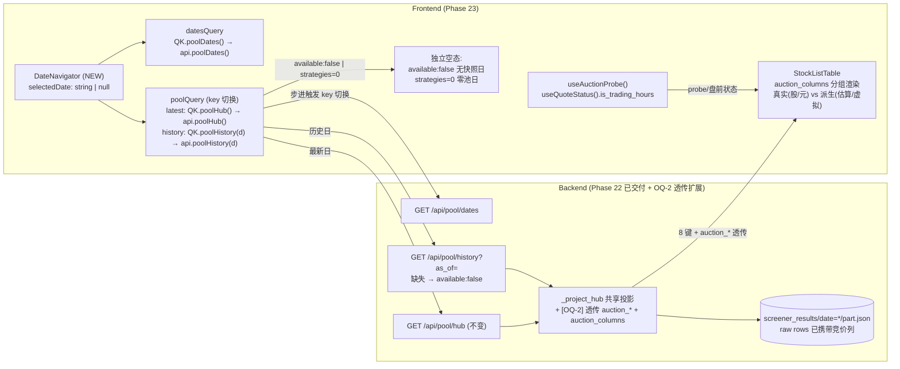

# Phase 23: 前端 (Frontend) — DateNavigator 按交易日浏览 + 竞价列钻取 - Research

**Researched:** 2026-08-05
**Domain:** 前端 (React 18 + Vite + TanStack Query v5 + Tailwind) — FRONT-01/02
**Confidence:** HIGH（全部 seam 逐行核验；后端端点/快照/投影/游客掩码源码已读；唯一中置信项为竞价列从后端投影透传的跨层设计，见 OQ-2）

## Summary

Phase 23 是 v2.0 里程碑的**前端收尾面**：在既有 PoolHubPage 上落地 (1) DateNavigator ‹ › 步进 + 日期列表，消费 Phase 22 交付的 `GET /api/pool/dates` / `GET /api/pool/history?as_of=`，每次步进触发 as_of 重取刷新卡片与明细；(2) 股池钻取竞价列展示——真实集合竞价（`auction_volume` 竞价量/股、`auction_amount` 竞价金额/元）与派生/虚拟成交（`auction_volume_ratio` 竞价量比、`auction_unmatched_amount` 虚拟未匹配金额估算、`open_gap` 开盘涨幅）明确分组标注，probe/窗口状态诚实展示。**零新增运行时依赖**（lucide-react 已有 `ChevronLeft/ChevronRight` 图标，DatePicker.tsx:143-147 同款在册）。

**三个关键事实（本 session 代码核验）：**

1. **后端 `_project_hub` 目前不透传竞价列**。投影循环 `pool_hub.py:116-125` 只产出 8 键 `symbol/code/name/open_gap/change_pct/concept_board/hit_factors/cross_resonance`；快照 `part.json` 的 raw rows（`run_all_with_hits` → `df.to_dicts()`，services/screener.py:638/797）在 probe available 时**确实携带** `auction_volume/auction_amount/auction_volume_ratio`（auction_columns.py 注入），但投影把它们全部剥掉（`test_pool_hub.py:246-253` 的 `expected_keys` 锁死 8 键）。**FRONT-02 的「竞价列钻取」必须先扩展 `_project_hub` 透传竞价列**（见 RQ4 / OQ-2），这是本期唯一跨层改动——否则前端拿不到任何竞价数据。
2. **「最新」与「历史」是两条不同契约**：`/api/pool/hub` 单 as_of 反漂移回显（pool_hub.py:173，17 回归锁死），**不能**拿它查历史；历史必须走 `/api/pool/history`，缺失日返回 200 `available:false` 空态（pool_hub.py:204-212），非法 as_of → 400（api/pool.py:88-94 双重校验）。前端按「选中日期是否为空」切换查询源（RQ1/RQ3/OQ-3）。
3. **无数据日 ≠ 零池日**：`available:false`（快照不存在）与 `strategies.length === 0`（快照存在但全策略零命中）是两种诚实空态，UI 文案必须区分（成功标准 2 明示「非误导性的零池」）。

**Primary recommendation:** PoolHubPage 增加 `datesQuery`（`QK.poolDates()`）+ `selectedDate: string | null` state（null=最新）；`poolQuery` 按 `selectedDate` 切换 `QK.poolHub()`/`QK.poolHistory(selectedDate)`；新增 `DateNavigator` 组件（`frontend/src/components/pool-hub/DateNavigator.tsx`）：‹ › 在 `dates` 列表内步进（到达边界禁用，非交易日天然不可达）、下拉列出可用日期（禁选不在列表内的日期，绝不静默跳日）、`latest` 快捷复位；`available:false` 渲染独立 EmptyState「该日期无股池快照」。竞价列：后端 `_project_hub` 透传 `auction_volume/auction_amount/auction_volume_ratio/auction_unmatched_amount` 并加服务端声明字段 `auction_columns: { real: [...], derived: [...] }`（对齐 GUEST-01「只消费 server 声明」哲学），前端 StockListTable 按该字段分组渲染（真实组标注单位 股/元，派生组标注「估算/虚拟」），`useAuctionProbe()` + `useQuoteStatus().is_trading_hours` 渲染 probe/盘前状态徽标。

## User Constraints (from CONTEXT.md / ROADMAP / task contract)

> Phase 23 目录为空（无 CONTEXT.md，discuss-phase 未产出锁定决策）。以下约束来自 `.planning/ROADMAP.md` Phase 23、`.planning/REQUIREMENTS.md` FRONT-01/02、`.planning/STATE.md` 与任务上下文，视为等同 locked decisions。

- **FRONT-01**: 用户可以用 DateNavigator（‹ › 步进 + 日期列表）按交易日浏览股池，数据源 `GET /api/pool/dates`；每次步进触发 as_of 重取并刷新卡片计数与钻取明细；非交易日禁用且不静默跳日；无快照日期显示诚实空态/状态文案，而非误导性零池。
- **FRONT-02**: 用户在股池钻取中能看到竞价列（竞价量/金额），真实集合竞价 vs 派生/虚拟成交明确分开展示并标注单位（股/元）；probe 非 `available` 或盘前时 UI 诚实展示 probe/窗口状态（fail-closed 空态或派生标注），绝不暗示存在真实竞价数据。
- **后端契约（Phase 22 已交付，不可破坏）**:
  - `GET /api/pool/dates` → `{dates: ["YYYY-MM-DD",...] ISO desc, count, latest}`；空 → `{dates: [], count: 0, latest: null}`（api/pool.py:55-65；test_pool_dates_api 锁死）。
  - `GET /api/pool/history?as_of=` → 有快照: 与 hub 同形状（`{as_of, updated_at, strategies, resonance_count, concept_attribution, mode}`）；缺失: 200 `{as_of:null, available:false, strategies:[], resonance_count:0, updated_at:null, concept_attribution:"current_snapshot"}`；非法 as_of → 400（api/pool.py:67-102 + 校验 :88-94；pool_hub.py:204-212）。**注意：实际代码缺失分支无 `reason` 键**（任务合同提到 reason，但实现无——见 RQ3）。
  - `GET /api/pool/hub` single-as_of 契约（反漂移回显 + 17 回归）**零改动**；历史取池**必须**走 `/api/pool/history`。
  - 游客会话: `/api/pool/dates` + `/api/pool/history` 已入 `_GUEST_READ_GET_PATHS`（main.py:778-783），游客读历史返回脱敏行（guest_masking.py）。
- **诚实规则**: 真实竞价列 `auction_volume`/`auction_amount` 只在 probe available 且分区有行时存在（auction_columns.py 双闸门）；派生列 `auction_volume_ratio`/`auction_unmatched_amount`/`open_gap` 独立命名；09:30 连续竞价 bar 永不标集合竞价；real/derived 永不混用、永不相加。
- **零新增运行时依赖**: 不新增 npm 包（除非已在 frontend/package.json）。
- **前端现状**: React 18 + Vite + TanStack Query v5 + Tailwind；tsconfig path alias `@/` → src/；**无 vitest/jest**，测试 = Playwright e2e（frontend/e2e/pool-hub.spec.ts 已有）+ `npm run build`（tsc -b && vite build）。
- **约束**: `frontend/src/pages/Watchlist.tsx` 是用户未提交改动，绝不触碰。

<phase_requirements>
## Phase Requirements

| ID | Description | Research Support |
|----|-------------|------------------|
| FRONT-01 | DateNavigator 按交易日浏览：‹ › 步进 + 日期列表 + as_of 重取 + 非交易日禁用 + 无快照日诚实空态 | §RQ1/RQ2/RQ3 + OQ-1/3/4：dates 端点形状（api/pool.py:55-65）；history 缺失 `available:false`（pool_hub.py:204-212）；LimitUpLadder asOf state 既有模式（LimitUpLadder.tsx:1391/1474-1476）；DatePicker 仅 min/max 无任意日期禁用集（DatePicker.tsx:47-56/143-147） |
| FRONT-02 | 股池钻取竞价列：真实集合竞价 vs 派生/虚拟成交分开展示 + 单位（股/元）+ probe/盘前诚实状态 | §RQ4/RQ5 + OQ-2/5：`_project_hub` 现不透传竞价列（pool_hub.py:116-125，test_pool_hub.py:246-253 锁 8 键）；快照 raw rows 携带竞价列（screener.py:638/797 + auction_columns.py）；probe 判定词汇（auction_probe.py:31-61/99-121）；`useAuctionProbe` 30s stale（useSharedQueries.ts:58-63）；`useQuoteStatus().is_trading_hours`（api.ts quoteStatus） |

</phase_requirements>

## Architectural Responsibility Map

| Capability | Primary Tier | Secondary Tier | Rationale |
|------------|-------------|----------------|-----------|
| 日期列表获取 | Frontend (Browser) | API/Backend | 前端 `datesQuery` 消费 `GET /api/pool/dates`；后端只读 glob（pool_snapshot.list_snapshot_dates） |
| DateNavigator ‹ › 步进 + 日期列表 | Frontend (Browser) | — | 纯客户端状态：`selectedDate: string \| null`（null=最新），在 dates 数组内步进；非交易日天然不在数组内 |
| as_of 重取 | Frontend (Browser) | API/Backend | TanStack Query key 切换触发重取；历史走 `/api/pool/history`（独立只读端点），最新走 `/api/pool/hub` |
| 无快照日空态 | Frontend (Browser) | API/Backend | `available:false` 是服务端诚实声明（pool_hub.py:204-212，非 404），前端渲染独立 EmptyState，区别于「零池」 |
| 竞价列透传 | API/Backend | — | **跨层改动**：`_project_hub` 需把 raw rows 的 `auction_volume/auction_amount/auction_volume_ratio/auction_unmatched_amount` 透传进投影行 + 服务端声明 `auction_columns` 分组字段（见 OQ-2） |
| 竞价列展示（真实 vs 派生分组 + 单位） | Frontend (Browser) | — | StockListTable 按服务端 `auction_columns` 分组渲染：真实组 股/元，派生组 估算/虚拟 标注 |
| probe/盘前诚实状态 | Frontend (Browser) | API/Backend | `useAuctionProbe()`（30s stale）+ `useQuoteStatus().is_trading_hours`；probe 判定是服务端权威（AuctionProbeVerdict） |
| 游客掩码保留 | API/Backend | Frontend | `mask_guest_hub` 的 `_GUEST_VISIBLE` 白名单（guest_masking.py:18-24）自动丢弃竞价列；前端只渲染服务端返回字段 |
| 概念筛选 / 交叉共振 | Frontend + Backend | — | 既有 ConceptFilter 客户端投影 + `cross_resonance` 服务端派生，日期切换后同逻辑复用，不破坏 |

## Standard Stack

### Core

本期**零新增外部运行时依赖**（REQUIREMENTS 约束链 + task 明确）。全部复用既有锁定栈：

| Library | Version (package.json) | Purpose | Why Standard |
|---------|------------------------|---------|--------------|
| React | ^18.3.1 | 组件/状态 | 既有全局栈 |
| TanStack Query v5 | ^5.55.0 | `useQuery` key 切换触发 as_of 重取；`placeholderData` 平滑切换 | PoolHubPage/LimitUpLadder/Dashboard 既有模式 |
| lucide-react | ^0.439.0 | `ChevronLeft`/`ChevronRight`/`Calendar`/`Info` 图标 | DatePicker.tsx:143-147 已用同款图标 |
| Tailwind | ^3.4.10 | 样式（`text-accent/bull/bear/muted` 等既有 token） | 全仓统一 |
| framer-motion | ^11.5.0 | 卡片/日期区切换动画（`useReducedMotion`） | PoolHubPage 既有 |
| Vite + tsc | ^5.4.3 / ^5.5.4 | `npm run build` = `tsc -b && vite build`（package.json scripts） | 构建/类型门禁 |

### Supporting

| Library | Version | Purpose | When to Use |
|---------|---------|---------|-------------|
| Playwright | 1.61.1 (devDep) | e2e：DateNavigator 步进 + 竞价列 + 空态 mock 载荷 | frontend/e2e/pool-hub.spec.ts 既有夹具扩展（testDir=`.`，desktop-chromium） |
| `@/lib/format` (repo) | — | `fmtPct`（%）/ `fmtBigNum`（万/亿）/ `NUM_CELL_CLASS` | 派生列百分比 / 金额格式化；竞价量(股)需自定义 `fmtShares`（见 OQ-7） |
| `@/lib/api` (repo) | — | 新增 `api.poolDates()` / `api.poolHistory(asOf)`；扩展 `PoolHubResponse`/`PoolHubRow` 类型 | 唯一 API 入口（api.ts:1-27 request 封装） |
| `@/lib/queryKeys` (repo) | — | 新增 `QK.poolDates` / `QK.poolHistory(asOf)` | queryKey 集中管理（queryKeys.ts:52 已有 poolHub 先例） |
| `useSharedQueries` (repo) | — | `useAuctionProbe`（30s stale）/ `useQuoteStatus` | probe/盘前状态消费（useSharedQueries.ts:58-63） |

### Alternatives Considered

| Instead of | Could Use | Tradeoff |
|------------|-----------|----------|
| 自定义 DateNavigator 下拉 + ‹ › | 复用 DatePicker | DatePicker **只支持 min/max，不支持任意日期禁用集**（DatePicker.tsx:47-56 的 disabled 仅按 min/max 计算）；非交易日禁用需求要求「白名单式日期集」——下拉 `select` 天然只列可用日期，零改造 |
| 历史日期复用 `api.poolHub(asOf)` | 新增 `api.poolHistory(asOf)` 走 `/api/pool/history` | `/api/pool/hub?as_of=` 反漂移回显缓存日期（pool_hub.py:173），拿历史会静默返回最新日——**错误数据**；独立 history 端点缺失日返回 `available:false` 诚实空态 |
| 前端按行值推导 real/derived | 服务端声明 `auction_columns` 分组字段 | 对齐 GUEST-01「只消费 server mode，绝不从行值推导」哲学（PoolHubPage.tsx:37-39）；null 值行无法区分「列缺席」与「列存在但该标的缺席」，只有服务端知道投影时列是否存在 |
| 竞价量用 `fmtVolume`（万/亿） | 自定义 `fmtShares`（股原样 + 万/亿） | 成功标准 3 要求**标注单位 股/元**；既有 `fmtVolume`（format.ts:20-25）输出「万/亿」无单位，需新增带「股」后缀格式化或表头承载单位 |

**Version verification:** 本 session 读取 `frontend/package.json`（devDependencies/dependencies 全部列在上方）；**未安装任何新包**。

## Package Legitimacy Audit

> 本期**不安装任何外部 npm 包**。全部改动复用 `frontend/package.json` 既有依赖（React/TanStack Query/lucide-react/framer-motion/Tailwind/Playwright）。无新增供应链风险，无需 checkpoint:human-verify。

| Package | Registry | Age | Downloads | Source Repo | Verdict | Disposition |
|---------|----------|-----|-----------|-------------|---------|-------------|
| react | npm | — | — | github.com/facebook/react | OK | 既有依赖 |
| @tanstack/react-query | npm | — | — | github.com/TanStack/query | OK | 既有依赖 |
| lucide-react | npm | — | — | github.com/lucide-icons/lucide | OK | 既有依赖 |
| framer-motion | npm | — | — | github.com/motiondivision/motion | OK | 既有依赖 |
| tailwindcss | npm | — | — | github.com/tailwindlabs/tailwindcss | OK | 既有依赖 |
| @playwright/test | npm | — | — | github.com/microsoft/playwright | OK | 既有 devDep（e2e） |

**Packages removed due to [SLOP] verdict:** none
**Packages flagged as suspicious [SUS]:** none

## Architecture Patterns

### System Architecture Diagram



### Recommended Project Structure

```
frontend/src/
├── components/pool-hub/
│   ├── DateNavigator.tsx      # [NEW] ‹ › 步进 + 日期下拉 + latest 复位 + 无数据日禁用
│   └── StockListTable.tsx     # [MOD] 按 auction_columns 分组渲染竞价列（真实/派生 + 单位）
├── pages/
│   └── PoolHubPage.tsx        # [MOD] datesQuery + selectedDate state + poolQuery 切换 + 空态分流
├── lib/
│   ├── api.ts                 # [MOD] api.poolDates()/api.poolHistory(asOf)；PoolHubResponse+Row 类型扩展
│   └── queryKeys.ts           # [MOD] QK.poolDates / QK.poolHistory(asOf)
├── e2e/
│   └── pool-hub.spec.ts       # [MOD] 新增 DateNavigator/竞价列/空态 mock 用例
└── backend/app/               # [OQ-2 跨层改动]
    ├── services/pool_hub.py   # [MOD] _project_hub 透传 auction_* + auction_columns 声明字段
    └── tests/test_pool_hub.py # [MOD] expected_keys 扩展 + 透传/诚实缺列测试
```

### Pattern 1: DateNavigator — 白名单式交易日步进（不静默跳日）

**What:** 组件持 `selectedDate: string | null`（null=最新）。`dates`（`GET /api/pool/dates` 返回的 ISO desc 数组）是**唯一可选日集合**：‹ › 在当前日期在 `dates` 中的下标上 ±1，到达 `dates[0]`（最新）/ `dates[last]`（最旧）时对应按钮 `disabled`；日期下拉只列 `dates` 中存在的日期（非交易日/无快照日根本不在列表内 → 天然禁用）；提供「最新」复位按钮把 `selectedDate` 置 null 回 `/api/pool/hub`。

**When to use:** 需要「逐交易日浏览 + 非交易日禁用 + 绝不静默跳日」时。成功标准 2 的「非交易日禁用且不静默跳日」由**数据结构本身保证**——用户只能在快照日期之间移动，不存在「跳到最近有效日」的语义。

**Example（状态/切换骨架，详见 Code Examples）:**
```tsx
// PoolHubPage.tsx — 单一 query 按选中日期切换数据源 (QK.poolHub 先例 queryKeys.ts:52)
const [selectedDate, setSelectedDate] = useState<string | null>(null)   // null = 最新
const datesQuery = useQuery({ queryKey: QK.poolDates(), queryFn: api.poolDates })
const poolQuery = useQuery({
  queryKey: selectedDate ? QK.poolHistory(selectedDate) : QK.poolHub(),
  queryFn: () => selectedDate ? api.poolHistory(selectedDate) : api.poolHub(),
  retry: 1,
  placeholderData: (prev) => prev,   // 切换日期时保留旧数据, 避免整页闪空 (Dashboard.tsx:510 同款)
})
```

### Pattern 2: as_of 重取 — queryKey 驱动，不手动 refetch

**What:** 每次步进只改 `selectedDate`，TanStack Query 依据 key 变化自动重取（`QK.poolHistory(d)` 天然带日期维度，历史日各自缓存互不覆盖；`QK.poolHub()` 保持最新视图缓存）。与 LimitUpLadder 的 `queryKey: [QK.limitLadder(asOf || undefined), ...]`（LimitUpLadder.tsx:1474-1476）同构。

**When to use:** 以日期为查询维度的只读列表页。**Why:** 手动 `refetch()` 无法区分「同 key 刷新」与「换 key 换数据」，缓存语义会乱；key 驱动自动获得 per-date 缓存 + 回退切换。

### Pattern 3: 竞价列诚实分组 — 服务端声明字段 + 前端分组渲染

**What:** 后端 `_project_hub` 把 raw rows 的竞价列透传（见 OQ-2），并加顶层声明 `auction_columns: { real: ["auction_volume","auction_amount"], derived: ["auction_volume_ratio","auction_unmatched_amount","open_gap"] }`（由投影时该快照/缓存的列存在性决定，real 只在该日 probe available 时非空）。前端 StockListTable 按该字段渲染两组表头（真实集合竞价 / 派生·虚拟成交），列头带单位（竞价量 股 / 竞价金额 元 / 竞价量比 ×倍 / 未匹配金额 元·估算），空值渲染 `—`。

**When to use:** real/derived 混在同一张表且必须诚实分离时。**Tradeoff:** 后端加一个派生字段 + 前端分组表头；换取「列存在性」由服务端声明（对 null 行/缺失列无歧义），前端零猜测。

### Pattern 4: probe/盘前诚实状态 — 服务端判定 + 冻结列存在性双轨

**What:** (a) 每快照的 real/derived 由**冻结的列存在性**决定（快照计算时 probe 是否 available，OQ-2 的 `auction_columns` 声明）；(b) 页面级 probe 状态徽标消费 `useAuctionProbe()`（QK.auctionProbe，30s stale，useSharedQueries.ts:58-63），盘前状态消费 `useQuoteStatus().is_trading_hours`。二者**不混用**：冻结列存在性回答「这张快照有没有真实竞价列」，实时 probe 回答「当前数据源/时段状态」。

**When to use:** 数据是「有才有列」的 probe 门控型、且要同时展示历史快照与当前状态时。**Tradeoff:** 需要 OQ-2 的服务端声明字段；换取对历史快照的诚实（快照 D 日 probe available，今天 probe 挂了，历史列仍显示真实数据——不因今日状态抹掉历史事实）。

### Anti-Patterns to Avoid

- **拿 `/api/pool/hub?as_of=` 查历史**: 反漂移回显缓存日期（pool_hub.py:173），会**静默返回最新日数据**——最危险的错误数据形态。历史必须走 `/api/pool/history`。
- **把 `available:false` 渲染成「当日无股池结果」**: 无快照 ≠ 零命中；零池是 `strategies.length===0`（PoolHubPage.tsx:125-132），无快照是 `available===false`（pool_hub.py:207）——文案必须区分，否则成功标准 2 违规。
- **用 DatePicker 做非交易日禁用**: DatePicker 只支持 min/max（DatePicker.tsx:47-56），无法表达白名单日期集；硬塞会把周末/节假日也当可选日。
- **前端按行值推导 real/derived**: null 值行无法区分「列缺席」与「该标的缺席」；且违反 GUEST-01 哲学（PoolHubPage.tsx:37-39）。
- **把竞价量当普通量格式化**: `fmtVolume`（format.ts:20-25）输出无单位「万/亿」；成功标准 3 要求单位 股/元 明确标注。
- **破坏单 as_of hub 契约**: 任何为「历史」而改造 `/api/pool/hub` 的尝试都会击穿 17 回归 + 反漂移守卫。

## RQ1 — PoolHubPage 当前数据流（查询、as_of、钻取、列、概念筛选）

### 查询与 queryKey（VERIFIED 逐行）

`frontend/src/pages/PoolHubPage.tsx:22-32`：

```tsx
const hubQuery = useQuery({
  queryKey: QK.poolHub(),            // = ['pool-hub', 'latest']  (queryKeys.ts:52)
  queryFn: () => api.poolHub(),      // = GET /api/pool/hub        (api.ts:2071-2079)
  retry: 1,
})
const strategiesQuery = useQuery({
  queryKey: QK.screenerStrategies('stock'),   // = ['screener-strategies', 'stock']
  queryFn: () => api.screenerStrategies('stock'),
  staleTime: 5 * 60_000, retry: 1,
})
```

- `QK.poolHub: (asOf?: string) => ['pool-hub', asOf ?? 'latest']`（queryKeys.ts:52）——**已支持 asOf 参数**，但语义绑定 `/api/pool/hub`（反漂移），历史浏览不能用它。
- `api.poolHub(asOf?, concept?)` 拼 `/api/pool/hub?as_of=&concept=`（api.ts:2071-2079）。**前端默认不传 concept**——概念筛选是客户端投影（注释「concept 为可选，前端默认客户端投影不传」）。
- 无 `api.poolDates()` / `api.poolHistory()`——**Phase 23 需新增**。

### as_of 与 mode 处理（VERIFIED）

- `const asOf = data?.as_of ?? null`（PoolHubPage.tsx:36）；`mode` 只消费服务端声明，缺失回退 vip（:37-39）：
  ```tsx
  const mode = data?.mode === 'guest' ? 'guest' : 'vip'
  ```
- `activeStrategy = data?.strategies.find(s => s.id === activeId) ?? data?.strategies[0] ?? null`（:42-44）——默认选第一个策略，进入页面即有明细。

### 钻取链路（VERIFIED）

策略卡片 → 明细表：

```
StrategyCardGrid (策略卡片, 计数 total)  --onSelect=setActiveId-->  activeStrategy
   → StockListTable (明细 rows=filteredRows, total=activeStrategy.total)
```

- `StrategyCardGrid.tsx:39-101`：卡片四态（统计中 / 无命中 / 数据不可用 / active）；`unavailable = !hub`（策略不在 payload → 数据不可用）。
- `StockListTable.tsx`：VIP 六列 `['代码','名称','开盘涨幅','涨跌幅','概念板块','关联因子']`（:18），guest 五列去掉 开盘涨幅（:17）；`open_gap` 仅 VIP 渲染（:205-206 `<PctCell value={row.open_gap} />`）；行渲染 board tag / concept chips / hit_factors tags / 交叉共振徽标（:144-229）。

### 概念筛选（VERIFIED）

客户端投影（ConceptFilter.tsx:1-5 docstring「只在已加载的单 as_of 载荷内筛选, 输入绝不触发第二次 fetch」）；PoolHubPage.tsx:60-74 对 `activeStrategy.rows` 按 `r.concept_board` 子串过滤；footer 显示「筛选后 N 只 / 共 total 只」且 total 权威（StockListTable.tsx:240-250）。

### 空态（VERIFIED）

- 加载失败：`role=alert` + 重试（PoolHubPage.tsx:91-97）。
- **当日无股池结果**（`data.strategies.length === 0`，:125-132）：
  ```tsx
  <EmptyState icon={ScanSearch} title="当日无股池结果"
    hint={`截至 ${asOf ?? '—'}，竞价策略均无命中个股。…`} />
  ```
  这是「零池日」空态；**与 `available:false`（无快照日）不同**，Phase 23 必须新增后者（RQ3）。

### RQ1 结论

PoolHubPage 是单 as_of 契约的忠实消费者（卡片/明细同源 PITFALL #10）。Phase 23 最小改动面：`hubQuery` 升级为按 `selectedDate` 切换的 `poolQuery`（Pattern 1/2），新增 `datesQuery`，PageHeader 显示选中日期，空态分流。`StockListTable` 的 VIP_COLUMNS 常量 + open_gap 列是竞价列插入点。

## RQ2 — 前端约定（queryKeys / 表格 / 单位格式化 / EmptyState / 样式）

### queryKeys 集中管理（VERIFIED）

`queryKeys.ts` 全部 key 集中；SSE 失效靠 `SSE_INVALIDATE_PREFIXES` 前缀列表（queryKeys.ts:186-200）。`pool-hub` **不在**该列表（股池按日静态，不需要行情 tick 刷新）——历史/最新股池查询均不需加入 SSE 失效。新增 key 只需加一行：`poolDates: ['pool-dates'] as const` + `poolHistory: (asOf: string) => ['pool-history', asOf] as const`。

### 表格构建（VERIFIED）

- 股池钻取用**专用轻表** `pool-hub/StockListTable.tsx`（非通用 `stock-table/StockDataTable`）。前者是简单 `<table>` + 列名常量 + `PctCell`/`ConceptChips` 局部组件；后者是列配置驱动（`list-columns.ts` ColumnConfig + `renderBuiltinDataCell`）。
- **Phase 23 竞价列应加在 StockListTable**（专用表），不必改通用 StockDataTable——股池钻取只需竞价列，且已含 guest 列裁剪逻辑。
- 数值单元格规范：`NUM_CELL_CLASS = 'num tabular-nums'`（stock-table.ts:55）；金额 `fmtBigNum`（万/亿）、百分比 `fmtPct`（+x.xx%，format.ts:12-17）、颜色 `priceColorClass`（红涨绿跌，format.ts:35-40）。

### 单位格式化（VERIFIED）

`format.ts`：
- `fmtPct(v)` → `+1.23%`（:12-17）；`fmtVolume(v)` → `1.23亿/4.56万` 无单位（:20-25）；`fmtBigNum(v)` → 万亿/亿/万（:44-52）。
- **竞价量(股)无现成格式化**：`fmtVolume` 缺单位且语义是「手/股不明」；Phase 23 需新增 `fmtShares(v)`（如 `123.4万 股`）或在表头承载「股」单位、单元格用 `fmtBigNum`。**推荐表头承载单位（竞价量 股 / 竞价金额 元），单元格 `fmtBigNum` 显示数值**（对齐 LimitUpLadder 的 `fmtSealVol`/`fmtSealAmount` 大数转万/亿模式，LimitUpLadder.tsx:96-107）。

### EmptyState（VERIFIED）

`EmptyState.tsx:10-23`：`{ icon, title, hint }`，居中 `h-full grid place-items-center`，`h2` + hint。既有零池用法 PoolHubPage.tsx:125-132。**Phase 23 的 `available:false` 空态复用同一组件**（icon 可换 `CalendarX`/`Info`，lucide 在册）。

### 样式约定（VERIFIED）

Tailwind 语义 token：`text-accent/bull/bear/muted/secondary/foreground`、`bg-surface/elevated/base`、`border-border`、`rounded-card/rounded-btn/rounded-input`、`max-md:min-h-11` 触控目标、`num tabular-nums` 等宽数字。按钮 `h-9 px-3 rounded-btn border border-border bg-surface`（PoolHubPage.tsx:79-83 刷新按钮样板）。`cn()` 合并类（lib/cn.ts）。

## RQ3 — DateNavigator 设计（既有日期模式 + 非交易日禁用 + as_of 获取）

### 既有日期导航模式（VERIFIED）

| 页面 | 状态 | queryKey | 说明 |
|------|------|----------|------|
| LimitUpLadder | `const [asOf, setAsOf] = useState('')`（:1391） | `[QK.limitLadder(asOf \|\| undefined), extColumnsParam, direction]`（:1474-1476） | asOf 进 key 自动重取；DatePicker `value={dateValue} onChange={onDateChange}`（:785）；`displayDate = data?.as_of ?? asOf`（:1482） |
| Dashboard | `const [selectedDate, setSelectedDate] = useState<string \| undefined>()`（:499） | `QK.overviewMarket(selectedDate)`（:507） | DatePicker `min={dataStatus.data?.enriched?.earliest_date}`（:663-666）；`placeholderData: (prev) => prev` 平滑切换（:510） |
| RpsRotationDialog | `days` number state | `QK.rpsRotation(days)`（:82） | 非日期字符串，仅作参考 |

**结论**: asOf/selectedDate 进 queryKey 是仓库既有模式；`placeholderData` 保持旧数据避免闪烁是 Dashboard 已验证手法。**DateNavigator 采用同构**：`selectedDate: string | null`（null=最新）+ `QK.poolHistory(d)` 切换。

### DatePicker 局限（VERIFIED）

`DatePicker.tsx` 的格子 `disabled: !!min && ds < min || !!max && ds > max`（:47-56 三处）——**只支持 min/max 区间，无法表达白名单日期集**。非交易日禁用需求 = 只允许 `dates` 数组内的日期 → 原生 `<select>`/自定义下拉天然只列可用日期（**推荐**），或扩展 DatePicker 加 `disabledDates?: Set<string>` prop（备选，改共用组件需谨慎）。

### 非交易日禁用 + 不静默跳日（设计）

- `dates` = `GET /api/pool/dates` 返回的 ISO desc 数组 = **有快照的交易日**（pool_snapshot.list_snapshot_dates 的 glob 语义，pool_snapshot.py:117-124）。
- ‹ › 步进：`idx = dates.indexOf(currentAsOf)`；`‹ disabled = idx === dates.length - 1`（已最旧），`› disabled = idx === 0 || idx === -1`（已最新/无匹配）。**用户只能在有效快照日期间移动 → 非交易日/无快照日物理不可达，无「静默跳日」语义**。
- 日期下拉：options = `dates` 数组；`value = currentAsOf ?? latest`；无 `dates`（空数组）时下拉禁用 + 显示「暂无历史日期」。
- 「最新」复位：`selectedDate=null` → 回 `/api/pool/hub`。
- **边界**: 若 `data.as_of`（服务端回显）不在 `dates`（如缓存被清但 hub 仍返回旧 as_of），步进按钮按 `-1` 处理禁用，不猜测。

### 无快照日诚实空态（VERIFIED 形状）

`GET /api/pool/history?as_of=` 缺失分支（pool_hub.py:204-212）实际返回（**无 `reason` 键**，任务合同提到的 reason 未实现）：

```python
return {
    "as_of": None, "available": False, "strategies": [],
    "resonance_count": 0, "updated_at": None,
    "concept_attribution": "current_snapshot",
}
```

前端 `PoolHubResponse` 类型需加 `available?: boolean`（现有 api.ts:702-709 无此键）。当 `available === false` 时渲染独立 EmptyState（如 title「该日期无股池快照」hint「YYYY-MM-DD 无股池快照（非交易日或尚未生成）。请选择其他日期或返回最新。」），**绝不**渲染「当日无股池结果」（那是 `strategies.length===0` 的零池语义）。

### as_of 获取模式（设计）

```tsx
const poolQuery = useQuery({
  queryKey: selectedDate ? QK.poolHistory(selectedDate) : QK.poolHub(),
  queryFn: () => selectedDate ? api.poolHistory(selectedDate) : api.poolHub(),
  retry: 1,
  placeholderData: (prev) => prev,
})
```
刷新按钮 `refresh()` 改为 `void poolQuery.refetch()`（沿用 PoolHubPage.tsx:83-85）。`data.available === false` 分支在渲染最前（先于零池分支）短路。

## RQ4 — 竞价列（后端 schema / 真实 vs 派生 / 流向 hub 行 / 列定义）

### 后端竞价列 schema（VERIFIED）

`indicators/pipeline.py:157-184` 受管列注册表：

```python
"auction_volume":          "竞价量 (集合竞价撮合成交量, 单位: 股; 仅 probe available 时存在)",
"auction_amount":          "竞价金额 (集合竞价撮合成交额, 单位: 元; 仅 probe available 时存在)",
"auction_unmatched_amount": "派生未匹配金额 (估算, 非真实成交; 委托量输入可得时存在)",
"auction_volume_ratio": "竞价量比 (竞价量/前5日均量(不含当日), 仅 probe available 且分区有行时存在)",
# …
"auction":  ["auction_volume", "auction_amount", "auction_unmatched_amount", "auction_volume_ratio"],
```

- **真实列**（`_AUCTION_REAL_COLS = ("auction_volume", "auction_amount")`，auction_columns.py:31）：`kline_auction` 湖 canonical 列，**只在 probe available 且当日分区有行时注入**（auction_columns.py:100-131 双闸门 `resolve_auction_probe().status == available` + `kline_auction/date={d}/part.parquet` 存在且有行）。
- **派生列**：
  - `auction_volume_ratio` = 竞价量 ÷ 前 5 日均量（不含当日，PIT-safe 防 lookahead，auction_columns.py:54-87）；无历史 → 列缺席。
  - `auction_unmatched_amount` = 虚拟未匹配量 × 虚拟参考价（估算，auction_columns.py:35-51）；委托量输入可得才派生。
  - `open_gap` = 开盘涨幅（open/prev_close − 1），**fail-closed 基准恒在**（test_auction_columns.py:112「fail-closed 基准恒在」）。

### 哪些策略消费竞价列（VERIFIED）

builtin 竞价策略族（Phase 21）在 `pre_open` 白名单内引用竞价列，缺列 → 空池（fail-closed）：`auction_fast_grab.py:46-60`、`auction_alpha.py:53-61`（真列/派生双分支互斥）、`auction_allround.py:36-46`、`t1_flash.py:35-45`、`golden_230` 等；引擎侧 `requires_auction_data` + 缺 `auction_volume` → 短路空 StrategyResult（engine.py:346-348）。策略 META 的 `scoring` 引用 `open_gap/auction_volume_ratio/auction_amount`。

### 流向 hub 行（VERIFIED — 关键缺口）

- **快照 raw rows 携带竞价列**：`run_all_with_hits` → 每策略 `df.to_dicts()`（services/screener.py:638/797）→ rows 含 enriched 全列 + `_attach_auction` 注入的竞价列（services/screener.py:299-314 → auction_columns.attach_auction_columns）→ `persist_point_snapshot` 原样冻结（pool_snapshot.py:70-91）。
- **但 `_project_hub` 投影只留 8 键，剥掉竞价列**（pool_hub.py:116-125）：
  ```python
  projected = {
      "symbol": symbol, "code": symbol.split(".", 1)[0],
      "name": str(row.get("name") or ""),
      "open_gap": _safe_num(row.get("open_gap")),
      "change_pct": _safe_num(row.get("change_pct")),
      "concept_board": concept_map.get(symbol.upper(), []),
      "hit_factors": hit_factors, "cross_resonance": cross_resonance,
  }
  ```
  `test_pool_hub.py:246-253` 的 `expected_keys` 锁死这 8 键（`symbol/code/name/open_gap/change_pct/concept_board/hit_factors/cross_resonance`）。
- **结论**: FRONT-02 必须先扩展 `_project_hub` 透传 `auction_volume/auction_amount/auction_volume_ratio/auction_unmatched_amount`（`_safe_num` 消毒后加入 projected），并更新 `expected_keys` 测试（8→12+ 键）。这是**跨层改动**，但属 FRONT-02 交付范围（前端要展示，后端必须先给数据）。见 OQ-2。

### 前端现有列定义（VERIFIED）

- `screener-columns.ts` / `list-columns.ts` / `watchlist-columns.ts` 是**通用策略/自选表**列配置（ColumnConfig），**不含 auction_* 列**（grep 全仓零命中——frontend 无任何 auction_volume/auction_amount 渲染）。
- `StockListTable.tsx:17-18` 是股池钻取唯一列定义：`GUEST_COLUMNS` / `VIP_COLUMNS` 常量数组。**竞价列插入点在此**。
- 后端 `api/data.py:771-773` 已有 schema 描述「auction_volume: 竞价量, 单位: 股」「auction_amount: 竞价金额, 单位: 元」——Data 页 schema 面可用，但股池钻取不依赖它。

### 真实 vs 派生分离设计（详见 OQ-5）

- 表头分组：两组 `colgroup`/表头行——「真实集合竞价」列：竞价量（股）、竞价金额（元）；「派生 / 虚拟成交」列：竞价量比（×）、开盘涨幅（%）、虚拟未匹配金额（元·估算）。
- 诚实信号：服务端 `auction_columns` 声明（OQ-2）驱动「真实组是否渲染」；`auction_columns.real` 为空 → 真实组整组不渲染 + 派生组上方 warning 徽标「竞价数据未接入，仅展示派生列」。

## RQ5 — Probe/窗口状态（现有 UI 呈现 + 端点 + 诚实态设计）

### 现有 probe UI（VERIFIED）

`AuctionProbeCard.tsx`（Data 页，Data.tsx:906-908）已实现四态词汇（注释 :5-13 + renderVerdict）：
- `not_configured` → 竞价数据未配置（muted + detail）
- `available` → 竞价数据可用（accent + CheckCircle2，**只能来自服务端 status === "available"**，无客户端合成）
- `fail_closed` → 未接入竞价数据（已退化派生因子）（warning + AlertTriangle）
- `error` → 竞价数据探测失败：{message}。已按未接入处理…（danger + role=alert）

**诚实规则**（AuctionProbeCard.tsx:12-13）：「本面板从不把 09:30 起的连续竞价 bar 标记为集合竞价数据；available 处理只对服务端 status === 'available' 渲染」。

### Probe 端点与 hook（VERIFIED）

- `GET /api/data/auction-probe`（api.ts:2181）→ `AuctionProbeVerdict`：`{status, source, probed_at, window: "09:15-09:25", fallback: "open_gap", detail}`（api.ts:67-75；auction_probe.py:55-64 to_dict）。
- `useAuctionProbe()`（useSharedQueries.ts:58-63）：`QK.auctionProbe` + 30s staleTime（与服务端 30s TTL 对齐）。
- 盘前/盘中：`useQuoteStatus().is_trading_hours`（api.ts quoteStatus 响应含 `is_trading_hours`；Dashboard.tsx:615/654 消费 `quote_status.running/is_trading_hours`）。

### 股池钻取诚实态设计（详见 OQ-6）

| 场景 | 判定信号 | 渲染 |
|------|----------|------|
| 真实竞价列可用 | 快照行含 `auction_volume/auction_amount`（OQ-2 的 `auction_columns.real` 非空） | 真实组 + 派生组完整渲染；表头上方 info 徽标「竞价数据可用（窗口 09:15-09:25）」 |
| probe 非 available（fail_closed/not_configured/error） | `useAuctionProbe().data.status !== 'available'` | 真实组不渲染；派生组渲染 + warning 徽标「竞价数据未接入，仅展示派生列」 |
| 盘前（今日竞价未开始） | `useQuoteStatus().is_trading_hours === false` 且当前日 == 今日 | 上方 status 徽标「盘前/休市 · 竞价窗口 09:15-09:25 未开始」；快照列为历史冻结值（诚实标注） |
| 无快照日 | `poolQuery.data.available === false` | 独立 EmptyState「该日期无股池快照」（RQ3），无竞价列 |

**关键诚实原则**：冻结列存在性（快照计算时 probe 状态）决定**数据列**，实时 probe/时段决定**状态徽标**——历史快照不因今日 probe 状态被重写（见 Pattern 4）。

## RQ6 — 构建/测试（package.json 脚本、Playwright、smoke）

### package.json（VERIFIED）

`frontend/package.json` scripts：`dev: vite` / `build: tsc -b && vite build` / `preview: vite preview` / `lint: eslint .`。**无 vitest/jest 脚本**；devDependencies 含 `@playwright/test: 1.61.1`（测试即 Playwright e2e）。

### 既有 e2e（VERIFIED）

- `frontend/playwright.config.ts`：`testDir: '.'`、`workers: 1`、webServer = vite 4173、projects 含 `desktop-chromium` / `mobile-chromium-320` / `visual-desktop` / `visual-mobile-375` / `phase4-fastapi-host`。
- `frontend/e2e/pool-hub.spec.ts`（734 行）：mock `/api/pool/hub` 载荷（hubPayload/emptyHubPayload/zeroHitHubPayload/guest 变体 + visual 变体），覆盖 populated/guest/empty/error/loading/concept-filter。**Phase 23 扩展点**：新增 `/api/pool/dates` + `/api/pool/history` mock 路由 + DateNavigator 步进/空态/竞价列用例。
- `installShell(page)`（spec :76-105）已 mock `**/api/**` 未覆盖请求大声失败——新增路由需显式 mock。

### Smoke 验证（设计）

1. `cd frontend && npm run build`（tsc -b + vite build）——**类型 + 构建门禁**（本期唯一强制自动化验证，无单测框架）。
2. 可选：`npm run dev` + 浏览器手动核验 PoolHubPage 步进/下拉/空态/竞价列；或 `npx playwright test e2e/pool-hub.spec.ts`（需后端或全 mock）。

## 设计决策（Open Questions → 推荐）

| # | 问题 | 推荐（决策） | 依据 |
|---|------|--------------|------|
| OQ-1 | DateNavigator 放置与状态 | `PoolHubPage` 内新增 state `selectedDate: string \| null`（null=最新）；组件 `components/pool-hub/DateNavigator.tsx` 置于 PageHeader 下方、ConceptFilter 上方（或 PageHeader.right 与刷新按钮并排） | LimitUpLadder asOf state（:1391）先例；组件只读受控（`value/onChange/disabled` props） |
| OQ-2 | 竞价列如何到前端（**跨层**） | 扩展 `_project_hub`（pool_hub.py:116-125）透传 `auction_volume/auction_amount/auction_volume_ratio/auction_unmatched_amount`（`_safe_num` 消毒），并加顶层 `auction_columns: { real: [...], derived: [...] }` 声明字段；`test_pool_hub.py:246-253` expected_keys 同步扩展 | raw rows 已携带（screener.py:638/797）；列存在性只能服务端声明；GUEST-01 哲学 |
| OQ-3 | 最新 vs 历史查询 | 单 `poolQuery` 按 `selectedDate` 切换 `QK.poolHub()`/`QK.poolHistory(d)`；历史**必走** `/api/pool/history` | /hub 反漂移（pool_hub.py:173）拿历史是错误数据 |
| OQ-4 | 非交易日禁用 | 下拉只列 `dates` 数组内日期；‹ › 在数组下标步进，边界禁用；无「跳到最近日」逻辑 | 数据结构保证不静默跳日；DatePicker 无白名单集（DatePicker.tsx:47-56） |
| OQ-5 | 竞价列分组 UI | StockListTable 表头两组（真实集合竞价 / 派生·虚拟成交）；列头带单位（股/元/×/估算）；`auction_columns.real` 为空 → 真实组整组不渲染 + warning 徽标 | 成功标准 3 明示分组 + 单位 |
| OQ-6 | probe/盘前诚实态 | 冻结列存在性驱动数据列；`useAuctionProbe()`（30s stale）+ `useQuoteStatus().is_trading_hours` 驱动状态徽标；二者不混用 | Pattern 4；历史快照不因今日 probe 重写 |
| OQ-7 | 单位格式化 | 表头承载单位（竞价量 股 / 竞价金额 元），单元格 `fmtBigNum`（万/亿）；`auction_volume_ratio` 用 `fmtPct`? 否——量比是倍数用 `toFixed(2) + '×'` | 对齐 LimitUpLadder fmtSealVol/fmtSealAmount（:96-107）；既有 fmtVolume 无单位不可用 |
| OQ-8 | `available:false` vs 零池空态 | 新增独立 EmptyState「该日期无股池快照」（icon CalendarX/Info）；零池保持「当日无股池结果」（PoolHubPage.tsx:125-132） | 成功标准 2 明示非误导性 |
| OQ-9 | guest 竞价列 | 不额外处理：`mask_guest_hub` 的 `_GUEST_VISIBLE` 白名单（guest_masking.py:18-24）自动丢弃竞价列（不在白名单）；新增守卫测试锁死 | 游客契约「仅展示涨跌幅与概念板块」 |
| OQ-10 | `updated_at` 类型不一致 | 后端 hub 回 epoch ms（strategy_cache.py:166 `int(time.time()*1000)`），history 回 ISO 串（snap["computed_at"]）；前端类型改 `number \| string \| null` 且仅显示（如需） | 实测两源类型不同；本期可不展示 updated_at |

## 实现清单（按成功标准）

### SC1 — DateNavigator 步进 + 日期列表 + as_of 重取

- [ ] `queryKeys.ts` 新增 `poolDates: ['pool-dates']` + `poolHistory: (asOf) => ['pool-history', asOf]`
- [ ] `api.ts` 新增 `poolDates(): request<{dates: string[]; count: number; latest: string | null}>('/api/pool/dates')` + `poolHistory(asOf: string): request<PoolHistoryResponse>(\`/api/pool/history?as_of=${asOf}\`)`
- [ ] `PoolHubPage` 加 `selectedDate` state + `datesQuery` + `poolQuery` 切换（Pattern 1/2）
- [ ] 新建 `DateNavigator.tsx`：‹ › 步进（边界禁用）+ 日期下拉（只列 dates）+ 「最新」复位
- [ ] PageHeader subtitle 显示选中日期（沿用 `asOf ? \`竞价策略 · 数据日期 ${asOf} …\`` 模式）
- [ ] 刷新按钮改 `poolQuery.refetch()`（刷新当前日期）
- [ ] `QK.poolHistory` 查询 key 携带日期 → 历史日各自缓存

### SC2 — 非交易日禁用 + 无快照日诚实空态

- [ ] ‹ › 仅在 `dates` 下标内步进；无 dates 时双按钮禁用
- [ ] 下拉 options 只含 dates；`available:false` 渲染独立 EmptyState（「该日期无股池快照」），**不**复用「当日无股池结果」
- [ ] `available === false` 分支短路于零池分支之前；`mode` 仍按服务端声明渲染 guest 横幅（若需）

### SC3 — 竞价列（真实 vs 派生 + 单位）

- [ ] （跨层，OQ-2）`_project_hub` 透传 4 竞价列 + `auction_columns` 声明字段；`test_pool_hub.py` expected_keys 扩展 + 透传/缺列测试
- [ ] `PoolHubRow` 类型加 `auction_volume/auction_amount/auction_volume_ratio/auction_unmatched_amount?: number | null`
- [ ] `PoolHubResponse` 类型加 `available?: boolean` + `auction_columns?: { real: string[]; derived: string[] }`
- [ ] `StockListTable` 按 `auction_columns` 分组渲染：真实组（竞价量 股 / 竞价金额 元）+ 派生组（竞价量比 × / 开盘涨幅 % / 虚拟未匹配金额 元·估算）
- [ ] 空值 `—`（沿用 `PctCell` 模式）；列头带单位；guest 列集不含竞价列（后端已丢弃）

### SC4 — probe/盘前诚实状态

- [ ] 钻取区消费 `useAuctionProbe()` + `useQuoteStatus().is_trading_hours`
- [ ] `auction_columns.real` 空 → 真实组不渲染 + warning 徽标「竞价数据未接入，仅展示派生列」
- [ ] 盘前（is_trading_hours false + 当日）→ status 徽标「盘前/休市 · 竞价窗口 09:15-09:25 未开始」
- [ ] 绝不把 09:30 连续竞价 bar 标为集合竞价（沿用 AuctionProbeCard 诚实词汇）

## 常见陷阱（PIT）

### PIT-1: 用 `/api/pool/hub?as_of=` 查历史 → 静默返回最新日（最高危）
**What goes wrong:** DateNavigator 步进到历史日后页面仍显示最新日数据，无任何报错。
**Why:** `build_pool_hub` 反漂移 `resolved_as_of = as_of if (as_of and as_of == cache_as_of) else cache_as_of`（pool_hub.py:173）——不一致时回显缓存日期。
**How to avoid:** 历史必走 `api.poolHistory(asOf)` → `/api/pool/history`；`QK.poolHistory` 与 `QK.poolHub` 分离。
**Warning signs:** 步进后 subtitle 的 as_of 不变。

### PIT-2: 把无快照日渲染成「零池」（误导性空态）
**What goes wrong:** `available:false` 被 `strategies.length === 0` 分支吞掉，显示「当日无股池结果」。
**Why:** 现有代码只有零池分支（PoolHubPage.tsx:125-132）；新 `available` 键未接入。
**How to avoid:** 渲染序：`available === false` → 独立「无快照」EmptyState；`strategies.length === 0` → 零池 EmptyState。**Warning:** EmptyState title 文案可被测试断言。

### PIT-3: 前端按行值推导 real/derived（猜测列存在性）
**What goes wrong:** 快照 D 日 probe available 但某标的在分区缺席 → `auction_volume: null`；前端若按「值非 null」判断会误判「该日无真实竞价列」，整组消失。
**Why:** null 无法区分「列缺席」与「该标的缺席」。
**How to avoid:** 服务端 `auction_columns` 声明字段（OQ-2）——投影时已知列存在性。
**Warning signs:** 同一日期部分行有值、部分 null，UI 抖动。

### PIT-4: real/derived 混排或相加
**What goes wrong:** 把派生 `auction_volume_ratio` 与真实 `auction_amount` 放同一数值分组，或做合计。
**Why:** 违反诚实规则「real/derived 永不混用、永不相加」（auction_columns.py:25-27 docstring）。
**How to avoid:** 两组表头物理分隔；派生列头带「估算/虚拟」标注；无求和逻辑。
**Warning signs:** 列头无单位/无分组。

### PIT-5: 非交易日静默跳日（用户预期破坏）
**What goes wrong:** 用户在周末日期上点下一步，页面跳到周一。
**Why:** 若实现「找最近有效日」逻辑。
**How to avoid:** ‹ › 严格在 `dates` 下标步进；下拉只列有效日；无「跳到最近日」分支。
**Warning signs:** 步进跨日跳变。

### PIT-6: 破坏 single-as_of hub 契约（后端回归）
**What goes wrong:** 为历史改造 `/api/pool/hub`，击穿反漂移守卫与 17 回归。
**Why:** 契约锁死（test_pool_hub.py:432-440 等）。
**How to avoid:** hub 零改动；只扩展 `_project_hub` 透传字段（OQ-2）并同步更新 `expected_keys`。
**Warning signs:** `test_pool_hub.py` 失败。

### PIT-7: 游客泄露竞价列 / open_gap 语义破坏
**What goes wrong:** guest 响应出现竞价列或开盘涨幅。
**Why:** `_project_hub` 透传后未过掩码；`mask_guest_hub` 的 `_GUEST_VISIBLE` 白名单（guest_masking.py:18-24）不含竞价列——**自动丢弃，安全**；但若未来把列加入白名单则泄露。
**How to avoid:** 保持 `_GUEST_VISIBLE` 不变；新增守卫测试断言 guest 响应无 `auction_*` / `open_gap` 键。
**Warning signs:** guest 明细表出现 6 位代码/竞价值。

### PIT-8: 类型不一致（updated_at / available）
**What goes wrong:** `updated_at` 类型 hub=number / history=ISO string（strategy_cache.py:166 vs pool_hub.py:216）；`available` 键缺失时 TS 报错。
**How to avoid:** `PoolHubResponse` 扩展 `available?: boolean`、`updated_at: number | string | null`；本期不展示 updated_at 则不阻塞。
**Warning signs:** tsc 对 `data.available` 报属性不存在。

## 验证架构（Validation Architecture）

> `.planning/config.json` `workflow.nyquist_validation: true`（缺失/true 视为启用），本期含前端渲染面，需纳入验证节。

### 测试框架

| Property | Value |
|----------|-------|
| 框架 | Playwright 1.61.1（`@playwright/test`，frontend/package.json devDependencies）+ `tsc -b && vite build` 类型门禁 |
| 配置文件 | `frontend/playwright.config.ts`（testDir=`.`，desktop-chromium/mobile 等项目） |
| 快速命令（单任务提交） | `cd frontend && npm run build`（类型+构建，无单测框架时的最小自动化门禁） |
| 全量命令 | `cd frontend && npx playwright test e2e/pool-hub.spec.ts`（需 mock 或后端） |
| 后端跨层（OQ-2） | `cd backend && .venv/bin/python -m pytest tests/test_pool_hub.py -x -q` |

### Phase Requirements → 测试映射

| Req ID | 行为 | 测试类型 | 自动化命令 | 文件存在? |
|--------|------|----------|-----------|----------|
| FRONT-01 | DateNavigator 步进/下拉/最新复位 | e2e (Playwright mock) | `npx playwright test e2e/pool-hub.spec.ts` | ❌ Wave 0 — 新增用例 |
| FRONT-01 | 无快照日 `available:false` 空态 | e2e (Playwright mock) | 同上 | ❌ Wave 0 — 新增用例 |
| FRONT-02 | 竞价列分组渲染 + 单位 | e2e (Playwright mock) | 同上 | ❌ Wave 0 — 新增用例 |
| FRONT-02 | probe/盘前状态徽标 | e2e (Playwright mock) | 同上 | ❌ Wave 0 — 新增用例 |
| FRONT-02 | `_project_hub` 透传竞价列 + `auction_columns` 声明 | 后端单元 | `pytest tests/test_pool_hub.py -x -q` | ✅ 既有文件，扩展 |
| FRONT-02 | guest 响应无竞价列 | 后端单元 | `pytest tests/test_guest_masking.py -x -q` | ✅ 既有文件，扩展 |

### 抽样率
- **每任务提交:** `cd frontend && npm run build`（前端任务）；OQ-2 后端任务 `pytest tests/test_pool_hub.py -x -q`
- **每 wave 合并:** `cd frontend && npm run build` + 目标 Playwright 用例
- **Phase 门禁:** 前端 `npm run build` 全绿 + 后端 60 目标测试全绿 + Playwright pool-hub 用例全绿，再 `/gsd-verify-work`

### Wave 0 缺口
- [ ] `frontend/e2e/pool-hub.spec.ts` — 扩展 `/api/pool/dates` + `/api/pool/history` mock + DateNavigator/竞价列/空态用例
- [ ] （OQ-2）`backend/tests/test_pool_hub.py` — `expected_keys` 扩展 + 透传/诚实缺列测试
- [ ] （OQ-2）`backend/tests/test_guest_masking.py` — guest 响应无竞价列守卫
- [ ] 前端无单测框架（vitest/jest 不存在）——诚实记录：除 build 门禁 + Playwright 外无单元层；不接受「假装有单测」

## 安全域（Security Domain）

> `workflow.security_enforcement: true`（缺失/true 视为启用）。

### 适用 ASVS 类别

| ASVS 类别 | 适用 | 标准控制 |
|-----------|------|----------|
| V2 认证 | 是 | 既有 session/guest 中间件（main.py `_GUEST_READ_GET_PATHS`，Phase 22 E7 已含 dates/history） |
| V3 会话管理 | 否 | 无新会话语义 |
| V4 访问控制 | 是 | guest 白名单 GET-only（test_guest_masking.py E7）；竞价列不透传 guest（_GUEST_VISIBLE 白名单） |
| V5 输入校验 | 是 | 后端 as_of 双重校验防路径穿越（api/pool.py:88-94 `_AS_OF_RE` + `date.fromisoformat`，Phase 22 已锁）；前端 `QK.poolHistory(asOf)` 只传白名单日期 |
| V6 密码学 | 否 | 无加密需求 |

### 已知威胁模式

| 模式 | STRIDE | 标准缓解 |
|------|--------|----------|
| as_of 路径穿越（若后端未校验） | Tampering | 已由后端 `_AS_OF_RE.fullmatch` + `fromisoformat` 双重校验封死（api/pool.py:88-94）；前端只从 `/api/pool/dates` 白名单取日期 |
| 游客身份泄露（竞价量/开盘涨幅属价格/量敏感数据） | Information Disclosure | `_GUEST_VISIBLE` 白名单（guest_masking.py:18-24）自动丢弃竞价列/open_gap；新增守卫测试锁死 |
| 误导性数据呈现（把派生标为真实/把最新日当历史） | Spoofing | 诚实规则：`auction_columns` 服务端声明 + 分组标注单位/估算；历史走 history 端点（PIT-1） |
| 前端注入非白名单日期 | Tampering | 前端只步进/下拉 `dates` 白名单；`api.poolHistory` 不对日期做格式过滤（后端是权威），但 UI 不构造任意日期 |

## 环境可用性（Environment Availability）

| 依赖 | 需要者 | 可用 | 版本 | 回退 |
|------|--------|------|------|------|
| Node.js | 前端构建 | ✓（仓库既有） | — | — |
| pnpm | 包管理 | ✓（packageManager pnpm@11.17.0） | 11.17.0 | npm（脚本不变） |
| Vite | dev/build | ✓ | ^5.4.3 | — |
| TypeScript | tsc -b 类型门禁 | ✓ | ^5.5.4 | — |
| Playwright | e2e | ✓（devDep 1.61.1 + config） | 1.61.1 | 仅 build 门禁 |
| 后端 FastAPI /api | 数据 | ✓（Phase 22 交付） | — | Playwright mock 载荷 |
| Chromium (Playwright) | e2e 浏览器 | 未验证（本 session 未跑） | — | `npx playwright install chromium` |

**缺失且无回退:** none（本期零新增外部服务）。
**缺失但有回退:** Playwright 浏览器二进制——若未安装，回退 `npm run build` + 手动浏览器核验。

## 来源（Sources）

### Primary（HIGH 置信，本 session 逐行读取）
- `frontend/src/pages/PoolHubPage.tsx` — 查询/as_of/mode/钻取/空态（:22-32, 36-44, 60-74, 91-132, 158-168）
- `frontend/src/lib/api.ts` — `poolHub`（:2071-2079）、`AuctionProbeVerdict`（:67-75）、`PoolHubRow/Strategy/Response`（:683-709）、`auctionProbe`（:2181）、`quoteStatus`（:1709-1712）
- `frontend/src/lib/queryKeys.ts` — `QK.poolHub`（:52）、`SSE_INVALIDATE_PREFIXES`（:186-200）
- `frontend/src/components/pool-hub/StockListTable.tsx` — 列定义（:17-18）、open_gap（:205-206）、行渲染
- `frontend/src/components/pool-hub/StrategyCardGrid.tsx` — 卡片四态（:39-101）
- `frontend/src/components/pool-hub/ConceptFilter.tsx` / `GuestModeBanner.tsx` — 客户端投影 / 游客横幅
- `frontend/src/components/DatePicker.tsx` — min/max-only disabled（:47-56）
- `frontend/src/components/EmptyState.tsx` — props 形状（:10-23）
- `frontend/src/lib/format.ts` — `fmtPct`/`fmtVolume`/`fmtBigNum`（:12-52）
- `frontend/src/lib/useSharedQueries.ts` — `useAuctionProbe` 30s stale（:58-63）
- `frontend/src/pages/LimitUpLadder.tsx` / `Dashboard.tsx` — asOf/selectedDate 模式（:1391, 1474-1476 / :499, 507-510, 663-666）
- `frontend/package.json` / `playwright.config.ts` / `e2e/pool-hub.spec.ts` — 脚本 / e2e 基建 / 既有 mock
- `backend/app/services/pool_hub.py` — `_project_hub`（:78-130, 116-125）、`build_pool_hub`（:149-182, 170-174）、`build_pool_hub_snapshot`（:185-220, 204-212）
- `backend/app/services/pool_snapshot.py` — `persist_point_snapshot`（:70-91）、`list_snapshot_dates`（:117-124）
- `backend/app/api/pool.py` — `/dates`（:86-92）、`/history`（:94-128, as_of 校验 :100-113）
- `backend/app/services/auction_columns.py` — real/derived 列（:31-32, 35-51, 54-87, 100-131）
- `backend/app/services/auction_probe.py` — `AuctionProbeStatus`/`AuctionProbeVerdict`/窗口（:31-61, 99-121）
- `backend/app/services/guest_masking.py` — `_GUEST_VISIBLE`（:18-24）
- `backend/app/services/screener.py` — `run_all_with_hits`（:723-811）、rows=to_dicts（:638/797）
- `backend/app/indicators/pipeline.py` — 受管列注册表（:157-184）
- `backend/tests/test_pool_hub.py` — `expected_keys`（:246-253）、history 空态（:455-465, 665-686）
- `.planning/ROADMAP.md` / `REQUIREMENTS.md` / `STATE.md` — FRONT-01/02 成功标准
- `.planning/phases/22-pool-date-navigation/22-01-SUMMARY.md` / `22-VERIFICATION.md` — Phase 22 交付物与守卫证据

### Secondary（MEDIUM）
- `.planning/phases/20-auction-data/20-UI-SPEC.md` / `20-VALIDATION.md` — 竞价列 UI 面契约与 Phase 23 归属
- `.planning/phases/21-auction-strategy-family/21-*SUMMARY.md` — 策略 META 透传（time_window/requires_auction_data）供前端展示（本期范围外）

### Tertiary（LOW）
- none（本期无未核验的第三方主张）

## 元数据（Metadata）

**Confidence breakdown:**
- 标准栈：HIGH — 全部版本/脚本来自 package.json 本 session 读取；零新包
- 架构：HIGH — 后端端点/投影/掩码源码逐行读取；唯一中置信为 OQ-2 跨层透传（影响面小、语义清晰）
- 陷阱：HIGH — 每项 PIT 均有代码证据（反漂移/available 键/白名单/DatePicker 局限）

**研究日期:** 2026-08-05
**有效至:** 2026-09-04（30 天；前端栈稳定，后端竞价列/快照为快速变化面——若 Phase 24+ 引入历史 ext 分区或竞价列 schema 变更需复查 OQ-2）
