# Phase 32 Research — 竞价历史回填 (Auction History Backfill)

**Researched:** 2026-08-06 · **Researcher:** ResearcherP32 · **Consumes:** `research/v2.3-data-depth/AUCTION-BACKFILL.md` (domain probe evidence, verified live 2026-08-06)
**Requirements:** AQ-01..06 (`REQUIREMENTS.md`) · **Roadmap:** Phase 32 (`ROADMAP.md`) · **Constraint:** zero new runtime deps; read-only research; write only this file.

---

## 0. Verdict

**Implementation-ready: YES** — every seam AQ-01..06 requires already exists in code and is line-verified below. No new runtime dependencies, no new write path (the backfill reuses the `auction_sync` lake-write segment), and the probe/capability unlock is a one-flag declaration plus one method. The only genuinely unknown quantities are operational (upstream rpm cap, 2010-2024 date coverage beyond the 2024-01-02 sample, MCP endpoint stability) — all are handled by fail-closed honesty gates already designed into the seam, not by new research.

**Sandbox facts verified this session:**
- `data/kline_daily`: 248 partitions, `2025-07-29..2026-08-05`; 5537 distinct symbols across all partitions (SZ 2894 / SH 2310 / BJ 333); per-day ~5293 rows (2026-08-05 sample).
- `data/kline_auction`: **0 partitions** today — the whole lake is a backfill target.
- kline_daily symbol convention is fully-qualified `000001.SZ` / `600519.SH` / `920146.BJ` (verified by reading partition parquet, not inferred).
- kline_daily partitions have **schema drift** (`quote_ts` exists on later partitions only) — any universe/date reader must be column-scoped or `union_by_name`-tolerant (the DuckDB view already is, `repository.py:162-164`).

---

## 1. Q1 — xyz_provider internals + `get_auction` design

### Current internals (`backend/app/data_providers/xyz_provider.py`, read in full)
- Base URL: `_DEFAULT_MCP_URL = "http://8.138.149.215:7898/mcp"` — line 41; constructor `__init__(mcp_url=..., timeout=8.0)` with a persistent `httpx.Client` — lines 57-62.
- Capabilities: `ProviderCapabilities(instruments=True, daily=True, adj_factor=False, minute=True, realtime=False, financial=False)` — lines 48-56. **`auction` absent → defaults False** (`base.py:19-26`, field at :26).
- HTTP client: **httpx** (already a runtime dep — no new deps). JSON-RPC 2.0 `tools/call` envelope in `_call_tool` — lines 151-177; `"error" in data` → log + return `""`; exception → log + return `""` (**errors swallowed into empty payload — feeds honesty gate (a), §8**).
- Payload parsing: `_parse_payload` — lines 179-195 (JSON first, tolerant `'`→`"` fallback, `[]` on failure); `_parse_iso` 196-205; `_num` 207-215.
- `_price_frame(symbols, start_time, end_time, frequency)` — lines 107-149: strips suffix (`str(s).split(".")[0]`), builds `{"security": [...], "frequency": ...}` + optional `start_date`/`end_date` (ISO strings), calls `stockdb_get_price`, maps `code→symbol` (stripped!), `time/date→datetime`, `volume/money→volume/amount`. Docstring documents the endpoint rejects a `fields` arg — **do not pass `fields` to `call_auction` either** (probe #2 fetched full rows without fields; `fields` is optional upstream).
- Singleton wiring: `chain.xyz_provider()` lines 40-48; `chain._get_provider("xyz")` lines 74-75.

### `get_auction` design (AQ-01)
```python
def get_auction(
    self,
    symbols: list[str],
    start_date: date | datetime | None = None,
    end_date: date | datetime | None = None,
) -> pl.DataFrame:
```
- **1 symbol per request** (upstream bandwidth cap — AUCTION-BACKFILL probe #7: multi-symbol → error `带宽限制批量请求，检测到 N 个代码`). Provider **guards `len(symbols) == 1`** → `ValueError` otherwise (fail fast, honest; job and probe both comply).
- `end_date is None` → single-trade-date form: `start_date = end_date = trade_date`. **Required for probe compatibility** — `auction_probe._default_fetcher` (lines 117-118) calls `provider.get_auction(symbols, trade_date)` with one `date`; `custom/provider.py:129` has the same single-date signature. AQ-01's `(symbols, start_date, end_date)` range form is the backfill path; the optional `end_date` default serves both.
- Request: `args = {"security": [str(symbols[0]).split(".")[0]], "start_date": ..., "end_date": ...}` → `self._call_tool("stockdb_get_call_auction", args)` (envelope reused verbatim). No `fields` arg.
- Response mapping (upstream row → canonical, per AUCTION-BACKFILL §5 schema table):
  - `code` → `symbol` = **the requested suffixed symbol** (`symbols[0]`), with defensive map `{str(s).split(".")[0]: s for s in symbols}` fallback to `code`. **Deliberate divergence from `_price_frame`** (which strips): the auction canonical schema and the `kline_auction` merge-upsert key (`["symbol","datetime"]`, `auction_sync.py:153-158`) require suffix-consistent symbols matching `kline_daily`, else a backfilled row and a live EOD row for the same stock collide as two different keys (§4).
  - `time` → `datetime` via `_parse_iso` (always `09:25:00` per probes #2-#6; kept verbatim — the write seam enforces the window, §8).
  - `volume` → `auction_volume` (`_num`); `money` → `auction_amount`; `current` → `auction_virtual_price` (**optional column** — present only when upstream provides it).
  - `auction_unmatched_volume`: **never produced** (upstream has no such field; only 5-level order book `b/a1-5_v/p`, which is not real unmatched volume — AUCTION-BACKFILL §5).
- Output columns: `["symbol", "datetime", "auction_volume", "auction_amount", ("auction_virtual_price")]` — a subset of `CANONICAL_AUCTION_COLS + OPTIONAL_AUCTION_COLS` (`auction_sync.py:33-43`), so the seam's crop passes through.
- Network error → `""` → `[]` → empty `pl.DataFrame()` (no crash); caller-side gates (§8) distinguish empty-from-down.
- Capability: add `auction=True` to the `ProviderCapabilities(...)` call (lines 48-56). Nothing else — `base.py:26` exists, probe and seam auto-discover (§3).

---

## 2. Q2 — Symbol universe + suffix mapping

### Where the platform's A-share list lives
- `daily_pipeline._resolve_universe` (`backend/app/jobs/daily_pipeline.py:141-165`): with `KLINE_DAILY_BATCH` capability → `get_pool("CN_Equity_A", refresh=True)` (TickFlow universe, 沪深京 A 股); Free-tier fallback = `DEMO_SYMBOLS + get_pool("watchlist") + instruments.parquet["symbol"]`. Returns **sorted fully-qualified symbols** (`.SZ/.SH/.BJ`).
- `tickflow/pools.py:91-110`: `CN_Equity_A` → `tf.quotes.get_by_universes` (suffixed), fallback SW1 industry aggregate.
- `extend_history._resolve_universe` (`extend_history.py:48-64`): independent copy of the same shape.
- Local snapshot: `data/instruments/instruments.parquet` — 5540 rows, `symbol` already suffixed (`603196.SH` verified).

### Naming convention (verified against the lake, not inferred)
- `kline_daily/date=2026-08-05/part.parquet`: `symbol` = `000001.SZ`, `000002.SZ`, …, `920146.BJ` — **6-digit code + `.SH/.SZ/.BJ` suffix**.
- 5537 distinct symbols across 248 partitions: SZ 2894 / SH 2310 / BJ 333.
- API-side validation regex: `^\d{6}\.(SH|SZ|BJ)$` (`api/auction_history.py:31`, used at :87) — reuse for the backfill endpoint's symbol param.

### Backfill universe (AQ-05 "same universe kline_daily covers")
**Recommendation: derive the universe from the lake itself**, not the TickFlow pool:
- Universe = `SELECT DISTINCT symbol FROM kline_daily` via `repo.db` (view registered in `repository.py`, `union_by_name=true` — drift-tolerant), or `pl.scan_parquet(...).select("symbol").unique()` column-scoped (drift, §0).
- Dates = **physical partition dirs** `data/kline_daily/date=*` — mirrors `auction_probe._last_trade_date` scan (`auction_probe.py:71-84`) and `pool_snapshot.list_enriched_dates` (`pool_snapshot.py:144`).
- Why lake-first: same universe by construction, offline (no TickFlow dependency in the backfill run), includes `.BJ`.
- Take the universe once at job start (a multi-hour run must not drift against concurrently-added partitions).
- Optional `symbols` subset param overrides the universe (AQ-05 subset-scoped runs).

---

## 3. Q3 — Probe integration mechanics (verified exact)

`auction_probe._default_sources` (`backend/app/services/auction_probe.py:86-116`), read in full:
1. **(a) custom sources** (lines 92-101): sorted custom providers declaring the `"auction"` dataset (`custom/config.py` DatasetName includes `"auction"`). `data/data_sources/` empty → none.
2. **(b) builtin chain members** (lines 103-114): `known = union of ALL `_BUILTIN_CHAIN.values()` (`chain.py:20-26`) — **auction needs NO chain key**; every builtin provider name is scanned, `provider.capabilities.auction == True` selects it. `_get_provider("xyz")` → `chain.xyz_provider()` singleton (`chain.py:74-75`). With `auction=True` on xyz only, xyz is the **sole** candidate.
3. `resolve_auction_probe` (lines 139-186): `candidates[0]` fetched via `_default_fetcher` (lines 117-118) with `PROBE_SYMBOL="000001"` (line 17) on `_last_trade_date()` (lines 71-84: latest `kline_daily` partition — today `2026-08-05`, upstream returns a row, probes #2/#3). `_has_in_window_rows` (lines 120-137) requires ≥1 row with `datetime ∈ [09:15, 09:25:59]` → `available`.
4. **Behavioral consequence**: `resolve_auction_probe()` is currently `not_configured` with zero network I/O; after AQ-01 it makes **one live HTTP call per invocation** (1.6s nominal, 8s timeout worst case). Call sites: `auction_sync.can_sync_auction` (EOD), `GET /api/kline/auction/history` per request, validation/premarket consumers. Source-down → `error`/`fail_closed` verdict → no writes anywhere (fail-closed) but latency added to those endpoints — Risk R3 (§10).
5. `_first_auction_provider` (`auction_sync.py:57-84`) duplicates the same enumeration → same `candidates[0]` — **probe and write land on the same source** (verdict `available` implies `_first_auction_provider()` non-None).

---

## 4. Q4 — EOD live-path interplay (no regression risk)

- Scheduled path is **double-gated** (`daily_pipeline._run_auction_sync`, `daily_pipeline.py:696-708`):
  1. `_prefs.get_auction_sync_enabled()` — `preferences.py:129-132`, **default `False`**;
  2. `auction_sync.can_sync_auction(capset)` — probe `available` (`auction_sync.py:87-95`).
- Flipping `xyz.capabilities.auction=True` flips gate 2 (`not_configured`→`available`) but **gate 1 stays `False` by default** → scheduled EOD path remains off. The backfill is operator-triggered and MUST NOT consult `auction_sync_enabled` (mirror `pool_backfill`, which depends on no preference).
- When an operator enables it, the live path works with zero wiring: `_resolve_auction_symbols` (`daily_pipeline.py:685-695`, honors `auction_sync_symbols` preference, default full universe) → `sync_and_persist_auction(symbols, repo, capset, trade_date)` (`auction_sync.py:97-165`): probe gate → `_first_auction_provider` → 555..565 filter → canonical crop → per-date partition merge-upsert → `.tmp` atomic rename.
- **Same-day collision rule (new, §1)**: live EOD writes suffixed symbols (from `_resolve_universe`); the backfill must too, or the upsert key treats the same stock as two rows. Pinned by unit test (§7).
- No other scheduled consumer touches `kline_auction`; minute path `sync_and_persist_minute` (`kline_sync.py:829`) unchanged (AQ-06).

---

## 5. Q5 — Job shape (`backend/app/services/auction_backfill.py`)

Mirror `pool_backfill.run_pool_backfill` (`backend/app/services/pool_backfill.py:30-123`):

```python
def run_auction_backfill(
    repo: KlineRepository,
    *,
    symbols: list[str] | None = None,   # subset; None = full kline_daily universe
    start: str | None = None,           # ISO date; None = earliest kline_daily partition
    end: str | None = None,             # None = latest kline_daily partition
    rpm: int = 30,                      # pacing 1..60, operator-tunable
    on_progress: Callable | None = None,
    job_id: str | None = None,
) -> dict:
```

**Steps:**
1. **Probe gate** (AQ-03a): `resolve_auction_probe().status == available` — else return `{"requested":0,"backfilled":0,"failed":0,"failed_symbols":[],"reason":"source_unavailable"}` with **0 writes** (fail-closed; direct call, `auction_sync.py:90-93` precedent, no capset).
2. **Scope**: dates = kline_daily partition dir dates ∩ [start,end] (AQ-03b); symbols = subset param or lake-distinct (§2), taken once.
3. **Preflight reachability** (AQ-03a): one real `get_auction([symbols[0]], start, end)`; exception/empty-with-coverage → fail-closed record, 0 writes. (Per-symbol failures still tracked below.)
4. **Per-symbol serial loop** (upstream: 1 symbol/request):
   - pacing: `sleep_between_batches(i, rpm)` (`rate_limits.py:76-83`, shared `_reserve_slot` throttle `rate_limits.py:18-32`); rpm=30 → 2s/symbol → full 5537 × ~3.6s ≈ **~5.5h worst case**; rpm≈37 (natural 1.6s pace) ≈ ~3h — AUCTION-BACKFILL estimates 1.5-3h; operator-tunable.
   - **cooperative cancel** (mirror `pool_backfill.py:88-91`): `j = job_store.get(job_id); if j is None or j["status"] == "failed": break`.
   - `df = provider.get_auction([sym], start, end)` via `_first_auction_provider()` (`auction_sync.py:57-84`).
   - **empty handling**: empty while `sym` has kline_daily rows in the aligned range → `failed_symbols.append({"symbol": sym, "reason": "empty_response"})`; exception → `reason = str(e)[:200]` (mirror `_ERROR_DETAIL_MAX`, `auction_probe.py:29-30`).
   - **date alignment at the write boundary** (AQ-03b, load-bearing): `df.filter(pl.col("datetime").dt.date().is_in(aligned_dates))` — upstream rows for dates absent from local kline_daily are dropped, never phantom-written.
   - **write via the seam**: `write_auction_partitions(df, repo)` (extracted helper, below) — the ONLY write path.
   - progress: `emit("auction_backfill", pct, f"{i}/{tot}", stage_pct=...)`.
5. **Terminal state** (AQ-03c):
   `{"requested": N, "backfilled_symbols": N, "rows": R, "dates": K, "failed": M, "failed_symbols": [{"symbol","reason"},...], "origin": "backfill", "rpm": rpm}` — parallels `pool_backfill`'s result shape (pool_backfill.py:66-77).

**Write-seam extraction (AQ-04, single source of truth):** factor the lake-write segment out of `sync_and_persist_auction` (`auction_sync.py:126-164`: 555..565 window filter → canonical crop :137 → per-`date=` partition merge-upsert `unique(subset=["symbol","datetime"], keep="last")` → `_atomic_write_parquet` :45-55):

```python
def write_auction_partitions(df: pl.DataFrame, repo: KlineRepository) -> int: ...
```
- `sync_and_persist_auction` keeps probe gate + `_first_auction_provider` + single-date fetch, then calls the helper (behavior unchanged — existing `test_auction_sync.py` stays green; pure move).
- `run_auction_backfill` calls the helper directly per symbol. One write path, two entry points; window predicate + crop + upsert + atomic rename never duplicated.
- **Rejected**: calling `sync_and_persist_auction` per (symbol, date) — 5537 × 248 = 1.37M provider calls.

**Lifecycle** (AQ-02): single-flight `job_store.create()` (`pipeline_jobs.py:99`), heavy slot `try_acquire_run_slot()/release_run_slot()` (`pipeline_jobs.py:252-267`), `start/progress/succeed/fail` (`pipeline_jobs.py:132/171/140/155`), status/cancel via the **existing** `GET /api/pipeline/jobs/{id}` + `POST /api/pipeline/jobs/{id}/cancel` (shared process-global store). Pacing helpers all existing (`rate_limits.py:64-83`).

---

## 6. Q6 — API surface

**New module `backend/app/api/auction_backfill.py`** — do NOT add to `api/auction_history.py` (its POOL-03 AST guard forbids any mutating route: `tests/test_auction_history.py:313` scans `@router.(post|put|delete|patch)`).

```python
router = APIRouter(prefix="/api/kline/auction", tags=["kline"])   # same prefix as auction_history.py:28

@router.post("/backfill")
async def auction_backfill(request: Request) -> dict:
    """body: {"symbols":[..]|null, "start":"YYYY-MM-DD"|null, "end":"YYYY-MM-DD"|null, "rpm":int|30|null}"""
    # -> {"status": "started"|"reused", "job_id": "..."}
```

- **Validation** mirrors `api/pipeline.py:104-122`: dates `^\d{4}-\d{2}-\d{2}$` + `date.fromisoformat`, `start <= end`; `rpm` int 1..60 (bool rejected); `symbols` optional list, each `_SYMBOL_RE` fullmatch (`auction_history.py:31`), length cap (≤6000). 400 on violation.
- **Execution** mirrors `api/pipeline.py:90-166`: `job_store.reap_stale()` → `create()` (single-flight, `reused` on active) → task: `try_acquire_run_slot()` (fail-fast if heavy task running) → module-local `_long_task_executor` (`_cf.ThreadPoolExecutor(max_workers=2)`, mirror `pipeline.py:17`) → `run_in_executor(lambda: run_auction_backfill(...))` → `succeed/fail` → `invalidate_storage_cache()` (mirror `pipeline.py:159-162`) → `release_run_slot()` in `finally`.
- **Registration**: `app.include_router(auction_backfill.router)` in `main.py` after line 853, inside the `# 路由` block (main.py:845-881). POST is not guest-readable (`_is_guest_readable` admits only two pool GETs, `main.py:791-793`) — no whitelist change.
- **Contract**: `job_id` returned immediately; client polls `GET /api/pipeline/jobs/{id}` (stage `auction_backfill`); cancel via existing endpoint (cooperative, per symbol). Terminal result = §5 dict. No new job UI.

---

## 7. Q7 — Test plan (repo conventions)

Conventions: hermetic unit tests (no network); production imports inside test functions (`test_auction_sync.py:7-9`); fake providers `rows`/`exc`-injectable (`test_auction_sync.py:14-31` `FakeAuctionProvider`); fake repo + `tmp_path` partition dirs (`test_pool_backfill.py` `_FakeRepo`/`_make_env`); endpoint tests via minimal FastAPI + `TestClient` + poll helpers (`test_pool_backfill.py` `_make_backfill_app`/`_wait_job_terminal`/`_wait_slot_free`). No `test_extend_history.py` exists — `test_pool_backfill.py` is the template.

**32-01 (provider + probe + seam):**
- `test_xyz_get_auction_maps_rows_to_canonical` — monkeypatch `XYZProvider._call_tool` → canned `call_auction` payload; assert suffixed symbol, datetime, auction_volume/amount, auction_virtual_price.
- `test_xyz_get_auction_single_date_form` — `get_auction(["000001.SZ"], date)` → request `start_date == end_date`.
- `test_xyz_get_auction_rejects_multi_symbol` — `ValueError` on 2+ symbols (AQ-05 upstream cap).
- `test_xyz_get_auction_empty_payload_on_error` — `_call_tool` → `""` → empty df, no raise.
- `test_default_sources_discovers_auction_capability` — provider cache with `auction=True` → xyz in `_default_sources()`; probe `available` (mirror `test_auction_probe.py` verdict forcing).
- `test_write_auction_partitions_preserves_suffix_key` — `000001.SZ` vs bare `000001` distinct upsert keys (§1/§4 rule).
- existing `test_auction_sync.py` suite stays green post-extraction (run unchanged).

**32-02 (job + API):**
- `test_auction_backfill_only_writes_kline_daily_aligned_dates` — fake row for a date with no kline_daily partition → not written (AQ-03b, load-bearing).
- `test_auction_backfill_source_down_zero_writes` — probe not available / first fetch raises → 0 partitions + fail-closed record (AQ-03a).
- `test_auction_backfill_per_symbol_failure_recorded` — provider raises for symbol B → `failed_symbols` has B; A written; terminal reflects partial failure (AQ-03c).
- `test_auction_backfill_idempotent_rerun` — re-run same rows via merge-upsert, no duplication (AQ-04).
- `test_auction_backfill_atomic_no_tmp_left` — no `*.tmp` remnants (mirror `test_atomic_write_leaves_no_tmp`).
- `test_auction_backfill_0930_excluded` — 09:30+ rows excluded before write (mirror `test_0930_excluded`).
- `test_auction_backfill_unmatched_col_absent` — upstream without unmatched → partition has no `auction_unmatched_volume` and no `auction_unmatched_amount` (honest column absence, AQ-04; mirror `test_sync_without_optional_cols_stays_four_cols`).
- `test_auction_backfill_one_symbol_per_request` — each provider call receives exactly 1 symbol (AQ-05).
- `test_auction_backfill_cooperative_cancel` — job failed mid-loop → remaining symbols not fetched (mirror `test_pool_backfill_cooperative_cancel`).
- `test_auction_backfill_bounds` — subset symbols + start/end respected.
- `test_auction_backfill_rate_limit_pacing` — `sleep_between_batches` invoked with configured rpm (monkeypatch time).
- `test_auction_backfill_endpoint_singleflight_and_reuse` (mirror `test_backfill_endpoint_singleflight_and_reuse`).
- `test_auction_backfill_endpoint_parameter_validation` — bad date/symbol/rpm → 400 (mirror `test_backfill_endpoint_parameter_validation`).
- `test_auction_backfill_endpoint_runs_in_executor_and_succeeds` (mirror pool_backfill endpoint test 3).
- `test_auction_backfill_router_registered_in_main` — main.py includes the new router (mirror `test_main_guest_whitelist_and_router_registration`, `test_auction_history.py:324-329`).

**32-03 (cross-check + docs, network-gated):**
- `test_auction_virtual_price_equals_daily_open` — **skip unless `RUN_NETWORK_TESTS=1`**; after a real subset backfill, read `kline_auction` vs `kline_daily.open` for `000001.SZ` on ≥3 dates, assert equal (success criterion 4; sandbox has 248 real daily partitions — feasible to run once during the phase; hermetic CI never runs it).
- Canned variant (always on): `test_auction_backfill_cross_check_canned` — fixture kline_daily open values equal fake `current` → written `auction_virtual_price` matches daily open.
- AQ-06: doc-only (below), no test.

---

## 8. Q8 — Honesty details

- **(a) Source reachable + in-window rows, else 0 writes**: probe gate (§3) + preflight call (§5.3) before any write; `_call_tool` swallows errors to `""` (`xyz_provider.py:151-177`) so the job's empty-vs-coverage heuristic (`§5.4` empty handling) is what distinguishes "no data" from "down"; all-empty-everywhere terminal state reports `reason:"source_unavailable"` implicitly via 0 backfilled + all symbols failed with `empty_response` — plus the explicit preflight fail-closed path.
- **(b) kline_daily-aligned dates only**: two layers — scope layer (dates = partition dirs ∩ range, `pool_snapshot.py:144` idiom) and **write-boundary filter** `datetime.date().is_in(aligned_dates)` inside the job before `write_auction_partitions` (covers upstream returning extra dates; AQ-03b).
- **(c) Per-symbol failure recorded**: `failed_symbols: [{"symbol", "reason"}]`, terminal state reflects partial failure honestly (AQ-03c; pool_backfill.py:66-77 shape).
- **Idempotency/atomicity (AQ-04)**: partition merge-upsert `unique(subset=["symbol","datetime"], keep="last")` (`auction_sync.py:153-158`) + `.tmp` same-dir rename (`auction_sync.py:45-55`) — re-runs only fill gaps; interrupted runs never corrupt.
- **`auction_unmatched_volume` never written**: upstream lacks the field → `get_auction` never emits it → seam crop (existence-based `keep`, `auction_sync.py:137-141`) never writes it; no 0-fill anywhere; derived `auction_unmatched_amount` stays unavailable under the real source (read path `attach_auction_columns` computes it only when input exists — unchanged). Pinned by `test_auction_backfill_unmatched_col_absent`.
- **`origin="backfill"`**: not a column in `kline_auction` (the seam has no provenance column today and AQ-01..06 don't add one — the lake's provenance is partition presence); the job's terminal dict carries `origin:"backfill"` mirroring pool_backfill. If provenance-by-partition is later desired it's a seam change out of Phase 32 scope — flag for the planner, do not invent.
- **09:30+ exclusion**: the 555..565 window predicate lives in the write seam (`auction_sync.py:126-135`) AND provider normalization (`custom/provider.py:150-167`) — both exclude; upstream only ever emits 09:25:00 rows anyway (probes #2-#6).
- **`datetime` type normalization**: seam casts to `pl.Datetime("us")` before window filter (`auction_sync.py:128-131`) — `get_auction` may return naive `us` datetimes directly.

---

## 9. Data flow

```mermaid
flowchart LR
    OP[Operator POST /api/kline/auction/backfill] --> API[api/auction_backfill.py]
    API --> JS[JobStore single-flight + run slot]
    JS --> JOB[services/auction_backfill.py run_auction_backfill]
    JOB --> PROBE{probe available?}
    PROBE -- no --> R0[0 writes, fail-closed record]
    PROBE -- yes --> SCOPE[dates = kline_daily partitions ∩ range<br/>symbols = lake distinct ∪ subset]
    SCOPE --> PRE[preflight 1 request]
    PRE -- down --> R0
    PRE -- ok --> LOOP{per symbol serial}
    LOOP --> PACE[sleep_between_batches rpm]
    PACE --> G[XyzProvider.get_auction 1 symbol]
    G --> CANCEL{cancel?} -- yes --> DONE
    CANCEL -- no --> ALIGN[filter to kline_daily-aligned dates]
    ALIGN --> SEAM[auction_sync.write_auction_partitions<br/>555..565 + crop + merge-upsert + .tmp rename]
    SEAM --> FAIL{empty/error?} -- yes --> REC[failed_symbols append]
    SEAM --> LOOP
    REC --> LOOP
    LOOP --> DONE[terminal dict: requested/backfilled/failed/origin]
    DONE --> JS2[job_store.succeed]
    DONE --> V[kline_auction date=* partitions]
    V --> READ[existing read paths: history/validation/premarket]
```



Write path is exclusively `auction_sync.write_auction_partitions`; fetch path is exclusively `xyz_provider.get_auction`; job_store is the only orchestration.

---

## 10. Risks & unknowns

- **R1 [UNKNOWN] upstream rpm cap**: single-symbol/request verified; no stress test done (AUCTION-BACKFILL §6). Mitigation: rpm param default 30 (2s interval), range 1..60, shared `_reserve_slot` throttle; job records actual pace in terminal dict. If 429s appear, lower rpm and re-run (idempotent).
- **R2 [UNKNOWN] 2010-2024 date coverage**: only 2024-01-02 sampled upstream. Mitigation: kline_daily-aligned gate means the sandbox range (2025-07-29..2026-08-05) is what gets written anyway; dates upstream cannot serve → empty → per-symbol `empty_response` records, never fabricated.
- **R3 [KNOWN] probe now performs live HTTP per invocation** (after AQ-01): 1.6s nominal / 8s timeout added to `GET /api/kline/auction/history` and EOD gate when source is up/down. Acceptable (endpoint is not hot-polled); if it becomes an issue, a short-TTL probe cache is a follow-up — do not scope-creep into 32-01.
- **R4 [KNOWN] MCP endpoint stability**: `8.138.149.215:7898` is a public IP; if down, every gate fail-closes (0 writes) — by design, but EOD `auction_sync` (if enabled) and history endpoint degrade with latency; monitor via probe status surface.
- **R5 [KNOWN] runtime**: full 5537-symbol run ≈ 3-5.5h (1.6s/request × 5537 + pacing); operator subset runs + rpm tuning cover it; job is cancelable and idempotent.
- **R6 [KNOWN] kline_daily schema drift (`quote_ts`)**: universe/date readers must be column-scoped or view-based (DuckDB `union_by_name=true`).
- **R7 [KNOWN] job_store single-flight is global**: a running pool backfill (or EOD) blocks auction backfill via `try_acquire_run_slot` fail-fast — correct and intended (same parquet-adjacent heavy task family); surfaced as `"已有数据任务在运行"` fail record.
- **R8 [INFERENCE] `.BJ` coverage upstream**: probe only verified 000001.SZ; upstream claims 股票 2010-present. BJ stocks may be absent/empty upstream → honest `empty_response` records for those symbols; kline_daily still gates dates. Do not pre-fill.

---

## 11. Phase breakdown (3 plans)

- **32-01 — Provider + probe unlock** (AQ-01): `xyz_provider.get_auction` (mapping + single-symbol guard + single-date form), `capabilities.auction=True`; extract `auction_sync.write_auction_partitions` (pure move, existing suite green); unit tests (§7 32-01 list). Acceptance: probe resolves `available` in the sandbox (network permitting), existing `test_auction_sync.py` passes unchanged, `test_auction_probe.py` passes.
- **32-02 — Backfill job + API** (AQ-02..05): `services/auction_backfill.py` (gates, loop, cancel, progress, terminal dict), `api/auction_backfill.py` endpoint + validation + single-flight + executor, `main.py` registration; unit + endpoint tests (§7 32-02 list). Acceptance: endpoint runs a 2-symbol subset end to end on sandbox data (network), re-run idempotent, cancel stops early.
- **32-03 — Tests + docs + honesty guards** (AQ-06 + success criterion 4): network-gated cross-check `test_auction_virtual_price_equals_daily_open` executed once in sandbox (≥3 dates, real kline_daily vs real MCP), canned cross-check always-on, docs/features.md AQ-06 deferral note (minute-history backfill CLOSED — xyz 1m ≈21 trading days, ifzq/sina trailing windows, TickFlow minute gated at pro+; evidence pointer to AUCTION-BACKFILL.md §4/§6), honesty-invariant review (unmatched col absent, origin dict, fail-closed) + operator notes (rpm guidance, subset runs, expected runtime). Acceptance: cross-check green on sandbox, docs updated, final audit checklist.

---

## 12. Confidence

| Section | Confidence | Basis |
|---|---|---|
| §1 provider internals + get_auction | HIGH | full-file read; probe payloads in AUCTION-BACKFILL |
| §2 universe + suffix | HIGH | parquet-verified (5537 syms, .SZ/.SH/.BJ), repo view verified |
| §3 probe mechanics | HIGH | `_default_sources`/`resolve_auction_probe` read in full |
| §4 EOD interplay | HIGH | `_run_auction_sync` + preferences read; double gate confirmed |
| §5 job shape | HIGH | pool_backfill/extend_history/rate_limits read in full |
| §6 API surface | HIGH | pipeline.py endpoint + main.py registration read |
| §7 test plan | HIGH | conventions from test_pool_backfill/test_auction_sync |
| §8 honesty details | HIGH | seam + probe code read in full |
| R1/R2 (rpm cap, 2010-2024 coverage) | MEDIUM | single-point sampling (AUCTION-BACKFILL) |

---

## 13. Evidence index (file:line)

- `backend/app/data_providers/xyz_provider.py:41` (`_DEFAULT_MCP_URL`), `:48-56` (capabilities, no auction), `:57-62` (`httpx.Client`), `:107-149` (`_price_frame`), `:151-177` (`_call_tool` swallows errors → `""`), `:179-195` (`_parse_payload`)
- `backend/app/data_providers/base.py:19-26` (`ProviderCapabilities.auction: bool = False` at :26)
- `backend/app/data_providers/chain.py:20-26` (`_BUILTIN_CHAIN`, no auction key — not needed), `:40-48` (`xyz_provider` singleton), `:74-75` (`_get_provider("xyz")`)
- `backend/app/data_providers/custom/provider.py:129-148` (`get_auction` single-date precedent), `:150-167` (`_normalize_auction` 555..565 + crop)
- `backend/app/services/auction_probe.py:17` (`PROBE_SYMBOL`), `:71-84` (`_last_trade_date` partition scan), `:86-116` (`_default_sources`: custom + builtin-capability scan), `:117-118` (`_default_fetcher` single-date call), `:120-137` (`_has_in_window_rows`), `:139-186` (`resolve_auction_probe`)
- `backend/app/services/auction_sync.py:29-30` (window mins), `:33-43` (canonical 4+2 cols), `:45-55` (`_atomic_write_parquet` .tmp rename), `:57-84` (`_first_auction_provider`), `:87-95` (`can_sync_auction` probe gate), `:97-165` (`sync_and_persist_auction`: 555..565 filter :126-135, crop :137-141, per-date merge-upsert :145-164)
- `backend/app/jobs/daily_pipeline.py:141-165` (`_resolve_universe` CN_Equity_A), `:685-695` (`_resolve_auction_symbols`), `:696-708` (`_run_auction_sync` double gate)
- `backend/app/services/preferences.py:129-132` (`auction_sync_enabled` default False), `:134-140` (`auction_sync_symbols`)
- `backend/app/services/pool_backfill.py:30-123` (`run_pool_backfill`: gap set, cancel :88-91, terminal dict :66-77)
- `backend/app/services/extend_history.py:48-64` (universe), `:102-226` (`run_extend_history` job shape)
- `backend/app/api/pipeline.py:17` (`_long_task_executor`), `:44-88` (single-flight run), `:90-166` (backfill endpoint: validation :104-122, `job_store.create` :134, executor task :138-163)
- `backend/app/services/pipeline_jobs.py:99` (create), `:132/140/155/171` (start/succeed/fail/progress), `:199` (get), `:252-267` (run slot)
- `backend/app/api/auction_history.py:28` (router prefix), `:31` (`_SYMBOL_RE`), `:87` (validation)
- `backend/app/main.py:845-881` (router block), `:853` (auction_history registration), `:791-793` (guest whitelist)
- `backend/app/tickflow/repository.py:162-164` (`kline_auction` view, union_by_name), `:1462-1503` (earliest/latest daily date)
- `backend/app/tickflow/rate_limits.py:18-32` (`_reserve_slot` shared throttle), `:64` (batch_interval), `:69` (chunked), `:76-83` (sleep_between_batches)
- `backend/app/services/pool_snapshot.py:144` (list_enriched_dates), `:157-164` (list_backfill_gaps gap-set idiom)
- `backend/app/services/kline_sync.py:130-156` (`sync_daily_batch` chunked + failed_out precedent), `:829` (`sync_and_persist_minute`, unchanged per AQ-06)
- Data: `data/kline_daily` 248 partitions 2025-07-29..2026-08-05, 5537 distinct symbols (SZ 2894/SH 2310/BJ 333); `data/kline_auction` 0 partitions; `data/instruments/instruments.parquet` 5540 rows (verified via polars)
- Probe evidence: `.planning/research/v2.3-data-depth/AUCTION-BACKFILL.md` §4 probes #1-#11, §5 schema mapping, §6 seam design
