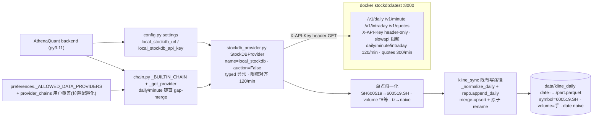

# Phase 40: stockdb 本地通道接入 (Local Source Channel) - Research

**Researched:** 2026-08-07
**Domain:** 本机 stockdb HTTP 数据源适配器 (httpx) + 配置注册 + 归一化契约 + 日K/分钟旁路
**Confidence:** HIGH
**方法:** 只读侦察 (源码 file:line 核实) + live probe (curl 127.0.0.1:8000, 仅 GET, 零写入) + 湖内 parquet 交叉验证; 零代码修改, 零 commit; 未触碰 `frontend/src/pages/Watchlist.tsx`。

## Summary

Phase 40 在 AthenaQuant 接入本机 stockdb (运行在 `:8000` 的 **docker 容器** `stockdb:latest`, 非宿主机进程, 见 Environment Availability) 作为 daily/minute 受管通道。研究确认: 通道形态 = HTTP 适配器 (镜像 `FreeStockDBProvider` httpx 模式), **零新增运行时依赖** (httpx>=0.27 / pydantic / polars 均在 backend deps)。服务端 41 路径全枚举 (37 path 模板 / 39 operations: 34 GET + 4 POST + 1 DELETE), 日K `/v1/daily[/{symbol}]`、分钟 `/v1/minute[/{symbol}]`、分时 `/v1/intraday[/{symbol}]`、快照 `/v1/quotes[/{symbol}]` 全部 X-API-Key header 鉴权 (实测 401 body `{"error":"unauthorized","detail":"invalid api key","code":401}`), 限频档位 live 实测 (daily/minute/intraday 120/min、quotes 300/min、ticks 60/min、plates 30/min), 429 实测 body `{"error":"rate_limit_exceeded","detail":null,"code":429,"retry_after":50}` + `Retry-After` 头 + `X-RateLimit-*` 头。

**归一化三差异有实测锚点** (非假设): ① symbol — stockdb 输出 `SH600519` 前缀形态 (contracts/schemas.py:25 正则 `^(SH|SZ|BJ)\d{6}$`), 湖内为 `600519.SH` 后缀形态 (实测 `data/kline_daily/date=2026-08-05/part.parquet` symbol 列) → 适配器需前缀→后缀转换; ② 量单位 — stockdb `volume_hand` (手) 实测 = 湖内 `volume` **同值同单位 (手)** (600519@2026-08-05: stockdb 42689 == 湖内 42689.0; 全分区 ratio≈100 交叉验证) → **归一化应为恒等 (×1), 不是 ×100** — 与 LOCAL-03 需求文本「手→股 ×100」**冲突**, 需用户在 discuss 确认 (见 Assumptions A1); ③ 时区 — stockdb `date`/`bar_time` 为 Asia/Shanghai aware (实测 `"2026-08-05T00:00:00+08:00"`), 湖内 daily 为 naive Date、minute 契约为 naive 北京墙钟 (test_minute_timestamp_convention.py) → 适配器剥 tz。

**链位决策:** `_BUILTIN_CHAIN` (chain.py:20-27) daily/minute 链首插入 `local_stockdb`; 运行期权威链是 `preferences.get_provider_chain()` (kline_sync.py:70), **必须同步把 `local_stockdb` 加入 `_ALLOWED_DATA_PROVIDERS` 白名单** (preferences.py:159) + `_get_provider` 分支 + lazy singleton + health_check 分支 + api/settings.py builtin 列表, 否则出现「切换成功但实际永远走 tickflow」的静默假象 (preferences.py:155-158 已文档化的陷阱)。写湖唯一经既有 `kline_sync` merge-upsert 路径 (`repo.append_daily` → `_write_daily_partition` unique(keep="last") + 原子 rename, tickflow/repository.py:1705-1722)。

**Primary recommendation:** 按 6 个研究问题定稿的实现蓝本在本文各节; 硬验收 = 契约测试锁死三差异 (symbol 双键/volume 恒等而非 100×/时区 aware→naive), 夹具用本次 live 实测的真实响应体 (canned JSON, 零网络, CI hermetic)。

## Architectural Responsibility Map

| Capability | Primary Tier | Secondary Tier | Rationale |
|------------|-------------|----------------|-----------|
| stockdb HTTP 抓取 (daily/minute) | API / Backend | — | 适配器是 backend 进程内 httpx 客户端, 无前端/无 SSR 参与 |
| X-API-Key 凭证持有与注入 | API / Backend | — | config.py settings 注入, 适配器 header-only, 禁 URL 传参 (服务端 CR-02, 实测 WS/REST 均仅 header) |
| 归一化 (symbol/单位/时区) | API / Backend | — | 适配器单点归一化 + 契约测试; 湖内落盘列契约由 kline_sync 既有写路径承载 |
| 限频纪律 | API / Backend | — | sleep_between_batches 对齐服务端 120/min; 429 带 Retry-After 回退; 服务端按 key 分桶 (专用 key 隔离) |
| 链位与单源选择 | API / Backend | — | chain.py `_get_provider` + `_BUILTIN_CHAIN` + preferences 白名单; auction 能力诚实声明 False → 不进竞价链 (auction_probe.py:103-110 按 capabilities.auction 枚举) |
| 写湖持久化 | Database / Storage | API / Backend | 唯一经既有 `repo.append_daily` merge-upsert + 原子 rename; 湖无 provenance 列 (铁律), 通道身份进台账 |

## Standard Stack

### Core

零新增依赖 — 全部已在 `backend/pyproject.toml` deps:

| Library | Version (deps 声明) | Purpose | Why Standard |
|---------|---------|---------|--------------|
| httpx | >=0.27 | HTTP 客户端 | 镜像 FreeStockDBProvider 既有模式 (`httpx.Client` + `.get()`); 服务端 SDK 本身即 httpx 客户端 |
| polars | >=1.0 | 响应→规范 DataFrame | 湖内 parquet 与 kline_sync/normalizer 全链路 polars; 响应行直接 `pl.DataFrame(rows)` |
| pydantic / pydantic-settings | >=2.7 / >=2.4 | config settings | 新 settings `local_stockdb_url` / `local_stockdb_api_key` 镜像 `free_stockdb_url` (config.py:63-66) |
| python-dotenv | >=1.0 | .env 注入 | pydantic-settings `env_file` 已接线 (config.py:44-47, 项目根 .env) |

### Supporting

| Library | Version | Purpose | When to Use |
|---------|---------|---------|-------------|
| — (无) | — | — | 无需新依赖; 限频对齐用既有 `app.tickflow.rate_limits.sleep_between_batches` (custom/provider.py:17,67 同一工具) |

### Alternatives Considered

| Instead of | Could Use | Tradeoff |
|------------|-----------|----------|
| HTTP 适配器 (零依赖) | 进程内 import `stockdb` SDK | SDK 需 Python>=3.12 (PEP 695, stream.py:30), AQ 运行时 3.11.2 实测 SyntaxError (v2.5 SUMMARY); SDK 本身即 httpx HTTP 客户端, 嵌入零数据面收益 — **HTTP 适配器为定案** |
| GenericHTTPProvider custom-source YAML | 专用 `stockdb_provider.py` 类 | custom-source YAML 是 HTTP JSON 形态 (research STACK.md 已排除); 专用类才能做单点归一化 + typed 异常 + 契约测试 |
| 批端点 (symbols 逗号分隔 ≤200) | 单 symbol 端点 | 批端点 1 请求覆盖 ≤200 标的 (实测 dict 形状 `{sym: [bars]}`), 记账 1 次/批 (service.py daily_batch WR-07), 限频效率最高 — **批端点为主, 单端点兜底** |

**Installation:** 无 (零新增依赖)。

**Version verification:** 本阶段不安装任何外部包 — Package Legitimacy Gate 不适用 (见下节)。

## Package Legitimacy Audit

> 本阶段**不安装任何外部包** (零新增运行时依赖为 v2.5 铁律)。无 npm/PyPI/crates 引入, 无需 legitimacy 检查; 适配器复用 backend 既有 httpx/pydantic/polars。

| Package | Registry | Verdict | Disposition |
|---------|----------|---------|-------------|
| (无) | — | N/A | 不适用 — 零新增依赖 |

**Packages removed due to [SLOP] verdict:** 无
**Packages flagged as suspicious [SUS]:** 无

## Phase Requirements

| ID | Description (REQUIREMENTS.md) | Research Support |
|----|-------------|------------------|
| LOCAL-01 | `stockdb_provider.py` 镜像 FreeStockDBProvider httpx 模式: name=`local_stockdb`, `ProviderCapabilities` 诚实声明 `auction=False`, X-API-Key header-only, `sleep_between_batches` 对齐限频档位, 零新增依赖 | 服务端 41 路径全枚举 + 限频档位逐端点核实 (routes.py:273-1082); 401/429 body 实测; 批端点 ≤200 语义; `sleep_between_batches` 复用点定位 (tickflow/rate_limits.py:59-75); 适配器方法签名建议见 Architecture Patterns |
| LOCAL-02 | config.py `local_stockdb_url` (默认 `http://127.0.0.1:8000`) + `local_stockdb_api_key`; chain.py `_get_provider` 分支 + lazy singleton + `_BUILTIN_CHAIN` 插槽 (daily/minute 链首, 受管源优先, 位置配置化) | 配置键名与 env 惯例实测 (config.py:63-66 镜像; .env 键名 UPPER_SNAKE); 链机制全链路核实 (chain.py:20-27/64-82, preferences.py:159/200-224, api/settings.py:429-465) — **关键增量: `_ALLOWED_DATA_PROVIDERS` 白名单必须同步加 `local_stockdb`**, 否则 sanitize 过滤回 tickflow |
| LOCAL-03 | 适配器单点归一化 (SH600519→600519.SH + 手→股×100 + 时区统一, 镜像 `kline_sync.py:93-132 _normalize_daily`), 契约测试锁死三差异 | **三差异全部实测定稿**: symbol 双键实测 (stockdb `SH600519` vs 湖 `600519.SH`); **volume 恒等 ×1 而非 ×100 (实测证据见 Summary/归一化锚点)** — 与需求文本冲突, 见 Open Questions Q1; 时区 aware→naive 实测; `_normalize_daily` 复用点 (kline_sync.py:106-135, filter_halt_days 内含) |
| LOCAL-04 | daily/minute 流经新通道进链首 gap-merge 走既有 kline_sync 写路径; 双源分区守卫沿用现有机制 (单源选择 + run-slot 互斥 + 幂等写) | gap-merge 机制核实 (chain.py:95-157 fetch_with_chain); merge-upsert + 原子 rename 写路径核实 (tickflow/repository.py:1705-1722); **风险: sync_daily_by_quotes 用 flush 覆写当日分区 (tickflow/repository.py:1787-1791), 与 merge 路径并发时可能互踩 — 建议日K旁路只走 append_daily merge 路径** |

## Architecture Patterns

### System Architecture Diagram



### Recommended Project Structure

```
backend/app/data_providers/
├── stockdb_provider.py      # 新增: StockDBProvider (name="local_stockdb", httpx 适配器)
├── chain.py                 # 修改: _BUILTIN_CHAIN 插槽 + _get_provider 分支 + 单例 + health_check
├── base.py                  # 不动 (MarketDataProvider protocol :24-48)
└── normalizer.py            # 复用 (normalize_daily :29-49, 含 filter_halt_days)
backend/app/config.py        # 修改: local_stockdb_url + local_stockdb_api_key settings
backend/app/services/
├── preferences.py           # 修改: _ALLOWED_DATA_PROVIDERS += "local_stockdb" (:159)
├── kline_sync.py            # 不动 (写路径复用 _normalize_daily + repo.append_daily)
└── (api/settings.py)        # 修改: builtin 源列表加 local_stockdb 条目 (health + base_url, :429-465)
backend/tests/
├── fixtures/stockdb/        # 新增: live 实测响应体 canned JSON (每日K/分钟/401/429)
├── test_stockdb_provider.py # 新增: 归一化契约 (三差异) + 错误契约 + 批语义
└── test_provider_chain.py   # 扩展: local_stockdb 链首 gap-merge 用例
```

### Pattern 1: HTTP 适配器 — 镜像 FreeStockDBProvider (链成员契约)

**What:** `MarketDataProvider` protocol 成员, 镜像 free_stockdb_provider.py 的 httpx 模式 (`httpx.Client`, `get_daily/get_minute` 返回规范 polars 列), 但**窄捕获类型化异常** (严禁复制 catch-all 空帧模式 — PITFALLS P2)。
**When to use:** 任何走 `fetch_with_chain` gap-merge 的链成员。

```python
# 建议签名 (镜像 base.py:24-48 protocol + free_stockdb_provider.py 结构)
class StockDBProvider:
    name = "local_stockdb"
    capabilities = ProviderCapabilities(
        instruments=False, daily=True, adj_factor=False,
        minute=True, realtime=False, financial=False, auction=False,  # 诚实声明无竞价
    )
    _MINUTE_UNIT = {"1m": 1, "5m": 5, "15m": 15, "30m": 30, "60m": 60}  # 服务端 freq 为 int

    def __init__(self, base_url: str = "", api_key: str = "",
                 timeout: float = 20.0, rpm: int = 120) -> None:
        # base_url/api_key 缺省回退 settings.local_stockdb_url / _api_key
        self._client = httpx.Client(timeout=timeout)   # X-API-Key 注入点

    def get_daily(self, symbols, start_time=None, end_time=None,
                  asset_type="stock") -> pl.DataFrame: ...
    def get_minute(self, symbols, start_time=None, end_time=None,
                   freq: str = "1m") -> pl.DataFrame: ...
    def close(self) -> None: ...
```

### Pattern 2: 归一化单点 (三差异锁死)

**What:** 适配器内部唯一转换点, 输出即湖内规范列; 契约测试锁死三差异 (同股双键/100×量失真/时区漂移永不发生)。
**When to use:** 任何跨源数据进湖前必经。

**归一化映射表 (stockdb 响应 → 湖内规范列) — 全部实测锚定:**

| stockdb 字段 (实测值) | 类型/单位 | → 湖内列 | 转换规则 (实测证据) |
|---|---|---|---|
| `symbol` (`"SH600519"`) | str 前缀形态 (schemas.py:25 `^(SH\|SZ\|BJ)\d{6}$`) | `symbol` (`"600519.SH"`) | 前缀→后缀: `f"{digits}.{market}"` — 湖实测 symbol 列 `600519.SH` (kline_daily/date=2026-08-05) |
| `date` (`"2026-08-05T00:00:00+08:00"`) | Asia/Shanghai aware | `date` (pl.Date, naive) | `aware.date()` — 当日 00:00+08:00 的 date 即交易日 |
| `bar_time` (`"2026-08-07T09:30:00+08:00"`) | Asia/Shanghai aware | `datetime` (naive 北京墙钟) | `aware.replace(tzinfo=None)` (已 +08:00); 湖分钟契约为 naive (test_minute_timestamp_convention.py) |
| `open/high/low/close` (`1328.36`…) | float 原始价 | 同名 | 恒等 (复权在服务端读取时算, qfq/hfq 只缩放 OHLC, 实测无 factor 列) |
| `volume_hand` (`42689`) | int **手** | `volume` (`42689.0`, Float64 **手**) | **恒等 ×1** — stockdb 42689 == 湖 42689.0 实测同值; 全分区 amount/(close×volume)≈100 证实湖=手 |
| `amount_yuan` (`null` 或元) | int 元, 可为 null (腾讯日K 无成交额) | `amount` (Float64) | 恒等; null 保留 (三态: None=字段不存在, 非错误) |
| `freq` (分钟, int 1/5/15/30/60) | int | `freq` | pass-through (镜像 free_stockdb `_MINUTE_UNIT_MINUTES` 映射) |
| `source`/`fetched_at`/`ingested_at`/`schema_version` | provenance | — | 丢弃 (湖无 provenance 列铁律, 通道身份进台账) |

### Pattern 3: 错误契约分类 (服务端实测形状)

**What:** 按 **HTTP 状态码**分类 (不解析 body — 实测 401 body 跨部署可能不同, 见 Pitfall 5), typed 异常窄捕获。

| 状态码 | 实测 body | 适配器行为 |
|---|---|---|
| 401 | `{"error":"unauthorized","detail":"invalid api key","code":401}` | `StockDBAuthError` (配置错误信号, 不重试) |
| 429 | `{"error":"rate_limit_exceeded","detail":null,"code":429,"retry_after":50}` + `Retry-After: 59` + `X-RateLimit-Limit/Remaining/Reset` | `StockDBRateLimited(retry_after)`; 遵守 Retry-After 重试 1 次, 仍 429 → 上抛 (fetch_with_chain 捕获跳过, 不假装空数据) |
| 400 | `{"error":"bad_request","detail":…,"code":400}` (非法 adjust/freq/批量超限) | `StockDBBadRequest` (编程错误信号) |
| 304 | 空 body (ETag) | 可选用 if-none-match 优化; v1 可不实现 |
| 200 + `[]` | 空数组 | 真空 (该窗口无数据) — 合法空态, 返回空 df 不抛 |

### Pattern 4: 链位注册全链路 (LOCAL-02 完整清单)

1. `chain.py _BUILTIN_CHAIN` (:20-27): `daily`/`minute` 链首插 `"local_stockdb"` (受管源优先; 位置可由 preferences `provider_chains` 用户覆盖 = 「位置配置化」已有机制, 零新代码).
2. `chain.py _get_provider` (:64-82): 新增 `if name == "local_stockdb": return local_stockdb_provider()` 分支 + `local_stockdb_provider()` lazy singleton (镜像 `free_stockdb_provider()` :33-39).
3. `chain.py health_check` (:147-179): `local_stockdb` 并入 free_stockdb 同款 probe 分支 (`get_daily(["000001"])` 非空判断).
4. **`preferences.py _ALLOWED_DATA_PROVIDERS` (:159) += `"local_stockdb"`** — 缺失则该源被 `_sanitize_chain` (:196-206) 过滤回 tickflow, 正是 :155-158 文档化的静默假象陷阱.
5. `api/settings.py` builtin 源列表 (:429-465) 加 `{"name": "local_stockdb", "datasets": ["daily","minute"], "health": health_check("local_stockdb"), "base_url": settings.local_stockdb_url}` — 保持前端 settings 面板可切换与后端白名单一致.
6. config.py: `local_stockdb_url: str = "http://127.0.0.1:8000"` + `local_stockdb_api_key: str = ""`; env `LOCAL_STOCKDB_URL` / `LOCAL_STOCKDB_API_KEY`; 根 `.env.example` 同步加注释占位 (镜像 STOCKDB_API_KEYS 注释风格).

### Pattern 5: 批语义与限频对齐 (实测)

- 批端点 `GET /v1/daily?symbols=a,b` (≤200/次, 超限 400) 返回 `{sym: [bars]}` dict (实测); 适配器 `chunked(symbols, 200)` (tickflow/rate_limits.py:42-47) + `sleep_between_batches(i, rpm=120)` (:59-75, 进程级共享槽).
- 服务端限频按 **key 短哈希分桶** (app.py:29-37 `_rate_limit_key`; 非法 key 归 host/anon 桶) → **专用 AthenaQuant key 提供限频桶隔离 + 审计归因** (LOCAL-02 已要求; 服务端 `STOCKDB_API_KEYS` 逗号分隔多 key, auth.py:18-23, 加专用 key 即生效).
- 日K窗口语义: `start`/`end` 为 `YYYY-MM-DD`, **日K含 end 日** (实测 `start=end=2026-08-05` 返回该日行; kernel/daily.py:42-44 `_sh_datetime` + `<=` 比较).
- 分钟窗口语义: **不含 end 日** (实测 `end=2026-08-05` 返回 0 行、`end=2026-08-06` 返回 08-05 全天 267 行; kernel/minute.py read_minute `bar_time <= _sh_datetime(end)` 日粒度边界, 与 service.intraday :331-337 Rule 1 修正同因) → **适配器取某日分钟必须传 `end = date + 1day`**.

### Anti-Patterns to Avoid

- **复制 free_stockdb 的 catch-all 空帧吞错** (`_vals`/`_keys` `except Exception: return []`): PITFALLS P2 明令适配器窄捕获类型化异常; 429/401 绝不伪装成「无数据」.
- **适配器内做 ×100 量转换**: 湖实测 = 手, 恒等才是正确映射; ×100 将造成 100× 量失真 (见 Q1).
- **把 `amount_yuan=null` 当错误**: 腾讯日K 源合法缺成交额 (schemas.py:31-33 三态), null 直接透传.
- **只验 401 门不验 200 body**: 契约测试必须断言行级字段形状 (dep-02 教训).

## Don't Hand-Roll

| Problem | Don't Build | Use Instead | Why |
|---------|-------------|-------------|-----|
| HTTP 客户端/重试 | 手写 requests/socket 层 | httpx (既有 dep) | 镜像 free_stockdb; httpx.Client 连接复用; 零新依赖 |
| 链 gap-merge | 自研合并逻辑 | `chain.fetch_with_chain` (chain.py:95-157) | (symbol,date) 去重 + 前序覆盖 drop + diagonal_relaxed 合并已实现 |
| 限频对齐 | 自研 sleep 公式 | `app.tickflow.rate_limits.sleep_between_batches` | 进程级共享时间轴槽 (rate_limits.py:13-33), 并发调用方聚合不超速 |
| 写湖 merge-upsert | 自研分区写 | `repo.append_daily` → `_write_daily_partition` | unique(subset=["symbol","date"], keep="last") + 原子 tmp.replace (repository.py:1688-1722) |
| 归一化列规范 | 自研列重命名 | `normalize_daily` (normalizer.py:29-49) + `filter_halt_days` | 湖内规范列 + 停牌过滤 (open/high 0) 既有语义, 契约测试镜像此列集 |
| 配置加载 | 自研 env 读取 | pydantic-settings (config.py 既有) | env_file 已接线根 .env; UPPER_SNAKE 自动映射 |

**Key insight:** 本阶段全部「难的部分」在 AQ 侧已有既有实现 (chain/kline_sync/repository/normalizer/rate_limits); 新代码唯一真正的创新点 = 服务端响应形状 → 湖内规范列的**单点归一化** (三差异) + typed 错误分类。服务端本身无任何需逆向的协议 (openapi 3.1.0 + 源码可读), 契约测试夹具直接冻结 live 实测体。

## Common Pitfalls

### Pitfall 1: [CRITICAL] 三差异任一漏归一 → 分区键分裂 / 100× 量失真
**What goes wrong:** symbol 双键 (同股 SH600519 与 600519.SH 两行并存)、volume 100× 失真、时区漂移导致跨日错位; 混写后无法区分 (湖无 provenance 列)。
**Why it happens:** 适配器遗漏单点转换; 或按需求文本「手→股×100」实现而湖实测=手。
**How to avoid:** 适配器单点归一化 + 契约测试锁死三差异 (symbol 精确断言 `600519.SH`、volume 断言 `42689.0` 且 **not** `4268900.0`、datetime 断言 naive)。
**Warning signs:** 契约测试断言体积类数字 (非仅列存在)。

### Pitfall 2: [CRITICAL] 429/401 伪装成空数据 (吞错链)
**What goes wrong:** 限频/凭证错误被 catch-all 吞为 `[]` → gap-merge 误判「该窗口无数据」→ 静默降级或真空误报; 5537 标的批量逐请求 429 全记空 (36-03 事故模式)。
**How to avoid:** typed 异常 (StockDBAuthError/StockDBRateLimited), 429 按 Retry-After 重试 1 次; fetch_with_chain 捕获跳过并记 warning; 空帧只对 200+`[]` 真空。
**Warning signs:** 日志无 warning 且数据缺失。

### Pitfall 3: [HIGH] 分钟窗口 end 日语义不对称
**What goes wrong:** 取某日分钟传 `end=当日` → 返回 0 行 (实测) → 误判真空。
**Why it happens:** 服务端分钟 `bar_time <= end日00:00` 日粒度边界 (kernel/minute.py:43-45), 与日K含 end 语义不同。
**How to avoid:** 适配器内部统一: 日K `[start, end]` 原样传; 分钟 `[start, end+1day]`。
**Warning signs:** 单日分钟请求恒空。

### Pitfall 4: [HIGH] 白名单漏注册 → 切换静默失效
**What goes wrong:** `_BUILTIN_CHAIN` 加了但 `_ALLOWED_DATA_PROVIDERS` 没加 → `_sanitize_chain` 过滤掉 local_stockdb → 用户配置的链实际永远走 tickflow, 无任何报错。
**How to avoid:** LOCAL-02 验收含白名单断言 (preferences.py:159 含 `local_stockdb`), 及 `chain_for("daily")[0] == "local_stockdb"`。
**Warning signs:** 配置了链首但数据源选择面板不显示新源。

### Pitfall 5: [MEDIUM] 401/429 body 跨部署不一致
**What goes wrong:** 适配器解析 body 判断错误类型会误判。
**Why it happens:** 本次探测早期观察到与 ApiError 不同的 401 形态 (容器早期状态), 最终收敛为 `{"error":"unauthorized","detail":"invalid api key","code":401}`; 容器镜像与宿主源码可不同步 (运行中容器 = docker `stockdb:latest` 镜像 ID 50b2d89144ca)。
**How to avoid:** 只按状态码分类, body 仅作日志; 契约测试夹具冻结**本次实测**形状并注明「按状态码分类, body 不参与判断」。
**Warning signs:** 断言 body 内容过于具体。

### Pitfall 6: [MEDIUM] 容器环境与部署形态
**What goes wrong:** `:8000` 是 docker 容器 (非宿主进程); AQ 容器内 `127.0.0.1:8000` 不通 → 需 host 网关 (DEP-01 前置)。
**How to avoid:** 适配器 base_url 可配置 (默认 loopback 仅本地开发); 部署日容器内连通性验证属 Phase 44, 本阶段配置项预留即可。
**Warning signs:** 容器内冒烟 401/超时 (连通性, 非鉴权)。

### Pitfall 7: [MEDIUM] flush 覆写 vs merge 并发
**What goes wrong:** `sync_daily_by_quotes` 用 `flush_live_daily` **覆写**当日分区 (tickflow/repository.py:1787-1791); 若 stockdb 日K旁路同写当日分区, 可能互踩。
**How to avoid:** 本通道只走 `append_daily` merge 路径 (kline_sync.py:254); 不在本 phase 改 flush 语义, 但计划中注明双路径共存现状。
**Warning signs:** 当日分区行数突降。

## Code Examples

### 归一化契约测试骨架 (三差异锁死, 夹具 = live 实测体)

```python
# backend/tests/test_stockdb_provider.py — 夹具文件: tests/fixtures/stockdb/daily_sh600519_20260805.json
# 内容 = 本次 live 实测响应体 (逐字段冻结):
#   [{"source":"tencent","fetched_at":"2026-08-07T08:24:37.315358Z","schema_version":1,
#     "symbol":"SH600519","date":"2026-08-05T00:00:00+08:00","open":1328.36,"high":1333.8,
#     "low":1303.5,"close":1306.45,"volume_hand":42689,"amount_yuan":null,...}]

def _provider(routes):  # 镜像 test_ifzq_provider.py _JsonTransport 注入模式, 零网络
    p = StockDBProvider()
    p._client = _JsonTransport(routes)
    return p

def test_daily_normalizes_symbol_to_suffix_form():
    p = _provider({"/v1/daily?symbols=SH600519": _load_fixture("daily_sh600519_20260805.json")})
    df = p.get_daily(["SH600519"])
    assert df["symbol"][0] == "600519.SH"          # 差异①: 前缀→后缀, 同股单键

def test_daily_volume_is_identity_not_hand_to_share():
    df = _provider(...).get_daily(["SH600519"])
    assert df["volume"][0] == 42689.0               # 差异②: 恒等 (湖实测=手)
    assert df["volume"][0] != 42689.0 * 100         # 回归: 永不做 ×100 失真

def test_daily_date_is_naive_trade_date():
    df = _provider(...).get_daily(["SH600519"])
    assert str(df["date"][0]) == "2026-08-05"       # 差异③: aware → naive date
    assert df["date"].dtype == pl.Date

def test_401_raises_typed_auth_error_not_empty():
    p = _provider({"/v1/daily": ("401", _load_fixture("error_401.json"))})
    with pytest.raises(StockDBAuthError):
        p.get_daily(["SH600519"])

def test_429_honors_retry_after_then_raises():
    p = _provider({"/v1/daily": [("429", _load_fixture("error_429.json"), {"Retry-After": "50"}), ...]})
    # 首请求 429 → 等 Retry-After → 重试 1 次 → 仍 429 → 上抛 (不伪装空数据)
    with pytest.raises(StockDBRateLimited):
        p.get_daily(["SH600519"])
```

### 适配器核心请求骨架

```python
# 镜像 free_stockdb_provider.py _vals 结构, 但窄捕获 + typed 异常 + header 鉴权
def _get_json(self, path: str, params: dict) -> Any:
    resp = self._client.get(self.base_url + path, params=params,
                            headers={"X-API-Key": self.api_key})  # header-only, 禁 URL 传参
    if resp.status_code == 401:
        raise StockDBAuthError(f"stockdb auth failed: {resp.text[:200]}")
    if resp.status_code == 429:
        retry_after = int(resp.headers.get("Retry-After", resp.json().get("retry_after", 1)))
        raise StockDBRateLimited(retry_after)
    if resp.status_code == 400:
        raise StockDBBadRequest(resp.text[:200])
    resp.raise_for_status()
    return resp.json()

def get_daily(self, symbols, start_time=None, end_time=None, asset_type="stock") -> pl.DataFrame:
    rows: list[dict] = []
    for i, chunk in enumerate(chunked(symbols, 200)):   # 服务端批上限 200 (DAILY-02)
        sleep_between_batches(i, self.rpm)              # rpm=120 对齐服务端档位
        payload = self._get_json("/v1/daily", {
            "symbols": ",".join(chunk),
            "start": start_time.strftime("%Y-%m-%d") if start_time else None,
            "end": end_time.strftime("%Y-%m-%d") if end_time else None,
            "adjust": "none",                           # 原始价进湖 (复权读取时算)
        })
        for sym, bars in payload.items():               # 批响应 = {sym: [bars]} (实测)
            rows += [self._map_daily_row(b) for b in bars]
    if not rows:
        return pl.DataFrame()
    df = pl.DataFrame(rows)
    df = df.with_columns(
        pl.col("symbol").map_elements(_to_suffix, return_dtype=pl.String),  # SH600519→600519.SH
        pl.col("date").dt.date(),                                           # aware→naive date
        pl.col("volume_hand").cast(pl.Float64).alias("volume"),             # 恒等 (×1)
    ).drop(["volume_hand", "amount_yuan", "source", "fetched_at", "ingested_at", "schema_version"])
    return normalize_daily(df, source=self.name)   # 复用湖内规范 (含 filter_halt_days)
```

### 配置键名 (镜像 config.py:63-66 惯例)

```python
# backend/app/config.py — 追加于 free_stockdb_url 之后
local_stockdb_url: str = Field(
    default="http://127.0.0.1:8000",
    description="Base URL of the local stockdb HTTP service (docker :8000)",
)
local_stockdb_api_key: str = Field(
    default="",
    description="Dedicated X-API-Key for stockdb (server STOCKDB_API_KEYS member); env LOCAL_STOCKDB_API_KEY",
)
# 根 .env / .env.example 键名: LOCAL_STOCKDB_URL / LOCAL_STOCKDB_API_KEY (UPPER_SNAKE, 与 TICKFLOW_API_KEY 同惯例)
```

## State of the Art

| Old Approach | Current Approach | When Changed | Impact |
|--------------|------------------|--------------|--------|
| daily/minute 仅 free_stockdb(7899 C++) / ifzq / xyz / tickflow | 链首插入 local_stockdb (本机 python stockdb :8000) | Phase 40 | 受管本地源优先; xyz 2h 配额窗不再是日K/分钟主路径; 复权读取时计算, 湖不污染 |
| 手/股单位依赖各 provider 自决 (ifzq ×100 手→股, 见 ifzq_provider.py:166/231) | 湖内实测口径 = 手; 适配器恒等 | 本 phase 定稿 | 消除若实现 ×100 引入的 100× 失真风险; **注: ifzq ×100 与湖实测口径不一致是既有隐患, 超出本 phase 范围, 记录不修** |

**Deprecated/outdated:**
- `stockdb` SDK 进程内 import (PEP 695 需 py3.12): 明确不采用, HTTP 适配器定案 (v2.5 STACK.md, 实测 3.11.2 SyntaxError)。
- 前次 research 的「手→股×100」映射表述: 与本次湖内实测 (手) 冲突, 以实测为准 (见 Q1)。

## Assumptions Log

| # | Claim | Section | Risk if Wrong |
|---|-------|---------|---------------|
| A1 | 湖内 daily `volume` 恒等于 stockdb `volume_hand` (均=手), 归一化应恒等 ×1 而非 ×100 | 归一化映射表 / Q1 | 若用户/需求坚持 ×100, 湖内将出现 100× 量失真 (所有下游量比/指标错误); 实测证据强 (全分区 ratio≈100 + 同值交叉), 但仍需 discuss 确认 |
| A2 | 分钟湖 (kline_minute, 当前为空) 若写入, volume 单位应与 daily 湖同口径 (手, 恒等) | 归一化映射表 | 分钟湖为空无法实测; 若实际契约期望 股, 分钟路径需 ×100 — Phase 42 backfill-minute 前须再确认 |
| A3 | 服务端 401/429 body 形状跨部署可能变化 (容器镜像与宿主源码可能不同步), 分类只依状态码 | Pitfall 5 | 若部署的镜像行为不同 (如早期观察到的非 ApiError 形态), 仅状态码分类仍安全; body 解析仅用于日志 |
| A4 | `:8000` 的 stockdb 是 docker 容器 (镜像 ID 50b2d89144ca, `0.0.0.0:8000->8000`), 非宿主进程; 宿主 `../stockdb/.env` 的 `STOCKDB_API_KEYS` 与容器一致 (实测 key 有效) | Environment Availability | 若部署环境改为宿主进程或不同 compose, 连通性/密钥来源需重验 (Phase 44 DEP-01 职责) |
| A5 | 本阶段范围不含 realtime/ticks/xdxr/factors 端点 (LOCAL-01/04 只到 daily/minute; realtime=False 声明) | 端点表 | 若后续需要 quotes 旁路 (tencent 失效回退), 需另开阶段; 端点已实测, 扩展成本低 |

## Open Questions

> **状态注记 (2026-08-07, plan-check 后):** Q1/Q2/Q3 全部实质闭环 —
> **Q1 RESOLVED**: 需求 LOCAL-03 已按实测修正 (commit, `REQUIREMENTS.md` 现文本: 「实测 stockdb 输出 volume_hand 手 == 湖内手, 恒等 ×1」), 契约测试断言 `volume==42689.0 且 != 4268900.0`;
> **Q2 RESOLVED**: 默认只改 `_BUILTIN_CHAIN` (未配置用户链时生效), 已配置用户链经 settings UI 自行加源 (白名单已含) — 40-02 PLAN 含偏好默认行为测试;
> **Q3 RESOLVED (scope)**: quotes 旁路不纳入本 phase (LOCAL-01..04 无 realtime 需求), 留作未来。

1. **[量单位映射方向] 需求 LOCAL-03「手→股 ×100」与实测冲突 — 归一化应为恒等 (×1)** — **RESOLVED: 采用恒等映射 (实测锚定), 需求文本已修正; 契约测试断言 `volume==42689.0 且 != 4268900.0`**
   - What we know: 湖内 `kline_daily` 全部采样分区 (2025-08-25/2026-01-15/2026-08-04/2026-08-05) `amount/(close×volume) ≈ 100`, 即 volume 单位=手; stockdb `volume_hand` 对 600519 两日 (37450/42689) 与湖内同值精确相等; 唯一 ×100 出处是 ifzq_provider.py:166/231 (腾讯 fqkline 路径), 与湖实测口径不一致 (既有隐患)。
   - What's unclear: 需求文本的 ×100 依据 (可能假设湖=股, 或参照 ifzq 口径)。
   - Recommendation: **discuss-phase 显式确认**: 采用恒等映射 (推荐, 实测锚定), 契约测试断言 `volume==42689.0 且 != 4268900.0`; 若用户坚持 ×100, 须先迁移湖内既有 手 口径数据 (超出本 phase), 且 ifzq 需同步改造。

2. **[链首插槽行为] local_stockdb 置链首对既有 sync 的风险面**
   - What we know: gap-merge (chain.py:95-157) 前序覆盖 + 去重, 服务端 120/min 批 ≤200; 空帧=真空走回退; 429 上抛被跳过。
   - What's unclear: 若用户已有 `provider_chains` 持久化配置 (不含 local_stockdb), 新源默认不进用户链 — 期望是「默认链首」还是「用户链不动」?
   - Recommendation: 计划默认改 `_BUILTIN_CHAIN` (未配置用户时生效); 已配置用户链的用户经 settings UI 自行加源 (白名单已含); 计划含偏好默认行为测试。

3. **[quotes 旁路] 是否纳入本 phase**
   - What we know: `/v1/quotes` 实测可用 (300/min, `SH600519` + volume_hand 手 + amount_yuan 元 + depth), 但 LOCAL-01..04 均未列 realtime 需求。
   - What's unclear: 是否期望实时旁路作为 tencent 失效回退。
   - Recommendation: 超出本 phase 范围 (capabilities.realtime=False 诚实声明); 端点已实测, 若需要另立阶段。

## Environment Availability

| Dependency | Required By | Available | Version | Fallback |
|------------|------------|-----------|---------|----------|
| stockdb 服务 (:8000) | 适配器数据面 | ✓ (live probe 全通过) | docker 容器 `stockdb:latest` (镜像 50b2d89144ca, `0.0.0.0:8000->8000`; 另有 stockdb-collector 容器同镜像未映射端口) | 无 — 本 phase 唯一数据源; 服务不可用则链回退 free_stockdb/ifzq/tickflow (既有链) |
| X-API-Key | 鉴权 | ✓ (宿主 `../stockdb/.env` `STOCKDB_API_KEYS` 首个 key 实测有效) | — | 建议新建专用 key (逗号分隔多 key 支持, auth.py:18-23) |
| Python | 适配器运行 | ✓ | 3.11.2 (backend/.venv) | — (HTTP 适配器形态无需 3.12) |
| httpx / polars / pydantic | 适配器依赖 | ✓ | httpx>=0.27 / polars 1.40.1 / pydantic>=2.7 (backend deps) | — |
| 网络 (本机 loopback) | 适配器请求 | ✓ (127.0.0.1:8000 通) | — | AQ 容器内 loopback 可能不通 → host 网关 (Phase 44 DEP-01, 本 phase 预留 base_url 可配置) |
| CI 测试网络 | 契约测试 | ✗ (hermetic 约束) | — | 夹具 = 冻结的 live 响应体 JSON, 零网络 (test_provider_chain/test_ifzq 同款注入模式) |

**Missing dependencies with no fallback:**
- 无 (本 phase 全部依赖已可用或已有回退路径)。

**Missing dependencies with fallback:**
- AQ 容器内访问 stockdb: 宿主探测通, 容器内需 host 网关配置 — Phase 44 DEP-01 前置, 本 phase 仅保证 base_url 可配置。

## Validation Architecture

> workflow.nyquist_validation = true (config.json) → 本 section 必填。

### Test Framework

| Property | Value |
|----------|-------|
| Framework | pytest 9.x (backend/.venv 实测 `pytest-9.0.3`; pyproject.toml:108-115 `[tool.pytest.ini_options]`, `asyncio_mode="auto"`, `--import-mode=importlib`) |
| Config file | `backend/pyproject.toml:108` |
| Quick run command | `cd backend && .venv/bin/python -m pytest tests/test_stockdb_provider.py -x` |
| Full suite command | `cd backend && .venv/bin/python -m pytest tests/ -x` |

### Phase Requirements → Test Map

| Req ID | Behavior | Test Type | Automated Command | File Exists? |
|--------|----------|-----------|-------------------|-------------|
| LOCAL-01 | 适配器镜像 httpx 模式: name/capabilities/header-only/限频对齐 | unit | `pytest tests/test_stockdb_provider.py -x` | ❌ Wave 0 (新增) |
| LOCAL-01 | 401→typed 异常 / 429→Retry-After 重试1次后上抛 / 200+[]→真空 | unit | `pytest tests/test_stockdb_provider.py -k "error or retry" -x` | ❌ Wave 0 |
| LOCAL-02 | config 默认 url/key + env 覆盖; `_get_provider("local_stockdb")` 单例 | unit | `pytest tests/test_config.py tests/test_provider_chain.py -k "local" -x` | ❌ Wave 0 |
| LOCAL-02 | `_ALLOWED_DATA_PROVIDERS` 含 local_stockdb; `chain_for("daily")[0]=="local_stockdb"` | unit | `pytest tests/test_provider_chain.py -k "chain" -x` | 部分 (test_provider_chain.py 存在) |
| LOCAL-03 | 三差异契约: symbol 后缀断言 / volume 恒等非 100× / datetime naive | unit (硬验收) | `pytest tests/test_stockdb_provider.py -k "normalize or symbol or volume or date" -x` | ❌ Wave 0 |
| LOCAL-04 | 链首 gap-merge: local_stockdb + free_stockdb 互补合并 (symbol,date) 去重 | unit | `pytest tests/test_provider_chain.py -k "merge" -x` | 部分 |

### Sampling Rate
- **Per task commit:** `cd backend && .venv/bin/python -m pytest tests/test_stockdb_provider.py -x`
- **Per wave merge:** `cd backend && .venv/bin/python -m pytest tests/test_stockdb_provider.py tests/test_provider_chain.py -x`
- **Phase gate:** 全量 `cd backend && .venv/bin/python -m pytest tests/ -x` 绿后 `/gsd-verify-work`

### Wave 0 Gaps
- [ ] `backend/tests/test_stockdb_provider.py` — 新增: 三差异契约 + 错误契约 + 批语义 + 限频对齐 (夹具 `backend/tests/fixtures/stockdb/*.json` 随附)
- [ ] `backend/tests/fixtures/stockdb/` — live 实测响应体冻结: `daily_sh600519_20260805.json` / `daily_sh600519_qfq_20260803_05.json` / `minute_sh600519_20260805.json` (节选数行) / `intraday_sh600519.json` / `error_401.json` / `error_429.json`
- [ ] 无框架安装缺口 (pytest 既有)

## Security Domain

> `workflow.security_enforcement = true` (config.json) → 必填。ASVS L1。

### Applicable ASVS Categories

| ASVS Category | Applies | Standard Control |
|---------------|---------|-----------------|
| V2 Authentication | yes | X-API-Key header-only (服务端 `require_api_key`, auth.py:69-76 常数时间比较; 客户端 header 注入, 禁 URL 传参 — CR-02 镜像) |
| V3 Session Management | no | 无会话; 每请求 header 凭证 |
| V4 Access Control | partial | 专用 AthenaQuant key → 服务端限频桶隔离 + key_hash 审计归因 (app.py:29-37, audit.py); 无 RBAC 需求 |
| V5 Input Validation | yes | 响应 schema 校验 fail-closed (契约测试冻结字段); 请求参数本地生成 (symbols ≤200/批, start/end 日期格式) |
| V6 Cryptography | no | 无加解密; key 经 env 注入不落 git/.env 不入库 (config.py extra="ignore"); 服务端 key_hash 审计不落明文 |

### Known Threat Patterns for {stack}

| Pattern | STRIDE | Standard Mitigation |
|---------|--------|---------------------|
| API key 泄露 (URL/日志) | Information Disclosure | 仅 header 传参; 服务端 uvicorn access log query-string 脱敏 (app.py:39-48 `_RedactQueryString`); 客户端不落日志 |
| 密钥误提交 git | Information Disclosure | `local_stockdb_api_key` 默认空串, .env 被 .gitignore 忽略 (stockdb .env.example 同纪律); .env.example 只留注释占位 |
| 429 洪水 (凭证共享) | DoS | 专用 key 隔离桶; 适配器 sleep_between_batches 进程级共享槽聚合不超速 (rate_limits.py:13-33) |
| 401 误报为数据真空 | Repudiation / Integrity | typed 异常上抛, 不伪装空帧 (PITFALLS P2); 台账 reason 三态契约 (Phase 41 HON-01) |
| 响应注入 (恶意服务端) | Tampering | 契约测试冻结字段白名单; 适配器只映射已知列, 丢弃未知列; 湖写走既有 merge-upsert |

## Sources

### Primary (HIGH, 本次 live 实测 + 源码逐行核实)
- **Live probe (2026-08-07, 本 session):** `curl 127.0.0.1:8000/openapi.json` (openapi 3.1.0, 37 path 模板 / 39 operations); `/v1/daily/SH600519` 原始价/qfq/批量/ETag-304/全史 4024 行; `/v1/minute` freq=1 端日语义 (end=08-05 → 0 行, end=08-06 → 267 行); `/v1/intraday` 09:30 竞价 bar (volume_hand=173); `/v1/quotes` (volume_hand=24975, amount_yuan=3266919424); `/v1/ticks` (今日有、历史空); `/v1/symbols`; 401 body (4 端点一致); 429 body + Retry-After + X-RateLimit-* (并发 31 连打 /v1/plates 实测 3×429)
- **stockdb 源码:** `src/stockdb/api/routes.py:273-1085` (逐端点限频档位 + adjust/freq 枚举 + 批语义 + ETag), `src/stockdb/api/app.py:24-93` (限频分桶 key + 429 标准化 handler), `src/stockdb/api/errors.py` (ApiError 契约), `src/stockdb/api/auth.py` (401 + header-only), `src/stockdb/contracts/schemas.py:23-133` (DailyBar/MinuteBar/IntradayBar 字段与单位显式命名), `src/stockdb/contracts/symbol.py:40-66` (normalize_symbol → SH600519 前缀), `src/stockdb/kernel/daily.py:42-44,133-180` (日期口径/复权纯函数), `src/stockdb/kernel/minute.py:43-45` (分钟端日边界)
- **AthenaQuant 源码:** `backend/app/data_providers/chain.py:20-27,64-82,95-157,147-179`; `base.py:24-48`; `free_stockdb_provider.py:27-180,307-463`; `normalizer.py:29-49`; `config.py:44-47,63-66`; `services/kline_sync.py:100-135,254,324-371`; `services/preferences.py:155-159,196-224`; `tickflow/repository.py:1688-1722,1787-1791`; `tickflow/rate_limits.py:13-75`; `api/settings.py:329,429-465`; `ifzq_provider.py:166,231,338`; `indicators/pipeline.py:857`
- **湖内实测:** `data/kline_daily/date=2026-08-05/part.parquet` (schema: symbol/date/open/high/low/close/volume/amount/quote_ts; 600519.SH: close=1306.45, volume=42689.0, amount=5.6006e9); 4 分区 ratio≈100 交叉验证
- **测试契约:** `backend/tests/test_ifzq_provider.py` (`_JsonTransport` 注入 + `volume == *100 手→股` 断言), `test_provider_chain.py:1-83` (fake provider + monkeypatch `chain._get_provider`), `test_xyz_provider.py` (canned payload + 空帧契约), `test_minute_timestamp_convention.py` (naive 墙钟契约), `test_stocksdk_provider.py` (monkeypatch 注入)

### Secondary (MEDIUM)
- `.planning/research/v2.5-honesty-local-source/SUMMARY.md` (前次 research; 41 路径/限频档位/3.11 vs 3.12 结论 — 本次以 live 实测复核, 路径计数修正为 37 模板/39 operations)
- `../stockdb/.env` / `.env.example` (`STOCKDB_API_KEYS` 逗号分隔多 key 语义, auth.py:18-23 佐证)

### Tertiary (LOW / 需探测)
- 401 body 早期观察到的非 ApiError 形态 (容器早期状态, 已收敛为 ApiError; 结论: 分类只依状态码)
- ifzq ×100 与湖实测口径不一致的既有隐患 (超出本 phase, 记录不修)

## Metadata

**Confidence breakdown:**
- Standard stack: HIGH — 零新增依赖由 pyproject.toml 核实; httpx 模式镜像 free_stockdb 既有代码
- Architecture: HIGH — 链/gap-merge/写路径/白名单全链路源码核实 + live 响应实测
- Pitfalls: HIGH — 全部证据锚点为实测 (三差异同值交叉、端日边界、429 body/头) 或源码 (白名单陷阱、吞错链)
- 唯一 UNKNOWN → 需求文本「手→股 ×100」与实测冲突 (Q1), 需用户 discuss 确认 (计划不能替用户定)

**Research date:** 2026-08-07
**Valid until:** 2026-09-06 (30 天; stockdb 服务端若改端点/限频, 需重探)
