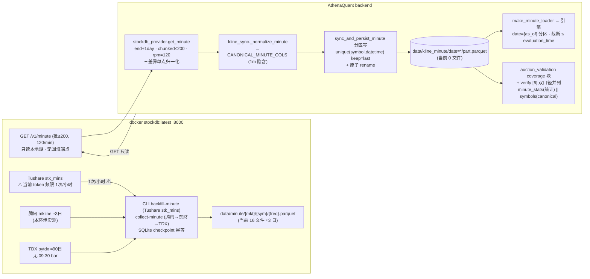

# Phase 42: 分钟湖扩湖 (Minute Lake Expansion) - Research

**Researched:** 2026-08-07
**Domain:** stockdb 分钟数据通道回填 + kline_minute 湖扩湖 + 历史竞价统计口径解锁 + 诚实标注
**Confidence:** MEDIUM（核心机制 HIGH，但 MIN-01 源可用性受凭证/环境硬约束，见 Summary）
**方法:** 只读侦察（stockdb/AthenaQuant 源码 file:line 核实）+ live probe（curl 127.0.0.1:8000 只读 GET + docker exec 容器内只读数据源探针，零湖写入、零代码修改、零 commit）；未触碰 `frontend/src/pages/Watchlist.tsx`。

## Summary

MIN-01 的隐含前提（stockdb 服务端能用 Tushare stk_mins 全量回填 5537 标的分钟历史，随后 AQ 以 120/min 读侧复制 ≈46min）**在本环境被凭证档位硬阻断**：live 实测当前 Tushare token 的 `stk_mins` 频限为 **1 次/小时**（两次 40203 响应，消息从 "1次/分钟" 升级为 "1次/小时"），5537 标的 × 每标的 4-116 页的 stk_mins 全量回填按此档位需数年，**不可行**。备选源的深度同样实测封顶：腾讯 mkline 本环境仅 ≈3 交易日（count>800 的请求只回最近 320 根，跨 3 标的复测一致）；TDX 可达且含 ≈90 交易日月度深历史，但 **TDX 1min 数据无 09:30 bar**（每日首根为 09:31，且 09:31 量 = 竞价 521手 + 首分钟 644手 合并，实测 116,500 股 = 1,165 手）→ TDX 无法提供 MIN-02 所需的**纯净 09:30 竞价统计 bar**；东财分钟在本文档标注的海外环境不可达。**结论：本环境无任何可达源能按 5537 标的全量提供含 09:30 竞价 bar 的深历史分钟数据** —— MIN-01 的「≈46min」只是 AQ 读侧节奏（5537 × 1 GET /v1/minute ÷ 120/min = 46.1min），服务端填充前置无法达成。

其余五个研究问题全部实测落定，且与设计意图一致：② 09:30 bar = 集合竞价统计**已双源证实**（stockdb DATA_CONTRACTS §7 引用 tushare 官方原句 + live 实测 600519 09:30 bar OHLC 全等 1328.36 / vol 521手 / amount 69,207,556 元 = 521×1328.36×100 精确闭合），与 AQ kline_minute 湖的 09:30 锚定约定（test_minute_sync_verify「09:30 anchor」）一致，双侧均只存原始价（复权读取时算）；③ 列映射单点已由 Phase 40 `stockdb_provider._map_minute_row` 承载（symbol 前缀→后缀 / bar_time aware→naive / volume 恒等×1 / amount 透传 / freq 丢弃——湖隐含 1m 无 freq 列）；④ 覆盖报告双口径并入点 = `auction_validation.build_report` 的 `coverage` 块（新增 `minute_stats` 统计口径子块，与 canonical `symbols` 块并列，绝不相加）+ `scripts/verify_auction_backfill.py` [6] 覆盖行（当前 canonical 湖仅 44 符号，覆盖 44/5538 ≈ 0.79%，统计口径是 FA-04 ≥0.94 的唯一现实路径）；⑤ T-21-01 截断无回归风险（loader 只读 `date={as_of}` 分区、截断按 `datetime.time() <= evaluation_time` 在分区内过滤，扩湖不改变 as_of 日语义；唯一需更新的是 auction_backtest 硬编码 `_MINUTE_NOTE`「kline_minute 历史 CLOSED / 不随湖覆盖增长」过期文本——属 MIN-03 诚实标注范畴）；⑥ 幂等双保险已存在（服务端 SQLite checkpoint 按 job_id=`tushare:minute:{sym}:{freq}:{range}` 断点续跑 + 写侧 `(symbol,bar_time,freq)` 去重保新；AQ 侧 `unique(subset=["symbol","datetime"], keep="last")` + 原子 rename），增量续跑语义安全。

**Primary recommendation:** MIN-01 的**数据源选择必须显式决策**：要么升级 Tushare token 档位（stk_mins ≥ 200/min 才可能 46min 量级，需用户/凭证侧动作，planner 插 `checkpoint:human-verify`），要么把回填源抽象为 provider seam（Tushare 全量 / 腾讯 3 日 / TDX 90 日无竞价 bar 三档）并在**部署目标机（3018，可能境内）重探源深度**（本环境海外实测不可外推，见 Open Questions）。回填驱动本身（日期范围 + 全宇宙 + 逐 symbol 幂等跳过 + merge-upsert 落 kline_minute 分区）与 MIN-02 统计口径消化、MIN-03 诚实标注均可**零源依赖**地先用 canned 夹具构建并测试；源插件的深度决定实际覆盖。**不要把「46min」写进计划验收**——它是读侧节奏，不是端到端时长。

<phase_requirements>
## Phase Requirements

| ID | Description (REQUIREMENTS.md) | Research Support |
|----|-------------|------------------|
| MIN-01 | 分钟湖扩湖 — stockdb 通道 backfill-minute (Tushare stk_mins 源) 落 `kline_minute` 分区; 5537 标的 ≈46min (120/min 限频对齐); 增量续跑幂等 | **源可用性 BLOCKED 实测**：无 HTTP 回填端点（openapi 37 路径仅 GET 读 + disabled /tushare compat）；CLI `backfill-minute`（collect.py:740-781，Tushare stk_mins，SQLite checkpoint 断点续跑）存在但当前 token stk_mins 频限 1 次/小时（两次 40203 实测）→ 全量不可行；备选源深度实测封顶（腾讯 ≈3 日 / TDX ≈90 日无 09:30 bar / 东财不可达）。≈46min = AQ 读侧（5537×1 GET @120/min），前置填充无法达成。幂等机制双保险核实（服务端 checkpoint + AQ merge-upsert） |
| MIN-02 | 历史竞价统计路径 — 分钟 09:30 bar = 集合竞价统计 (量/额) 进入竞价覆盖报告 (独立统计口径, 绝不算逐笔); FA-04/RC-02 统计口径解锁门 (≥0.94 或诚实 partial, 双口径并列报告) | 09:30 bar 语义双源证实（DATA_CONTRACTS §7 原句 + live 实测 OHLC 全等/521手/69,207,556 元闭合）；量/额映射（volume 恒等手 / amount 元；腾讯 mkline 无 amount 列但纯净竞价 bar 可 vol×price×100 精确派生，实测 521×1328.36×100=69,207,556）；双口径并入点 = auction_validation coverage 块 + verify_auction_backfill [6]（canonical 湖当前 44/5538≈0.79%，统计口径是 ≥0.94 唯一现实路径）；报告 API = research_auction.py |
| MIN-03 | 分钟诚实标注 — 09:30 bar 标注「集合竞价统计」非逐笔; canonical 竞价湖只收 09:25 撮合行 (09:15-09:24 委托统计绝不入湖); T-21-01 分钟截断语义不回归 (evaluation_time 截断保持) | canonical 湖结构性排除已存在（auction_sync 555..565 窗口谓词，09:30 物理无存放位）；新标注面 = 覆盖报告/manifest（auction_backtest `_MINUTE_NOTE` 硬编码「kline_minute 历史 CLOSED / 不随湖覆盖增长」将过期，需随扩湖更新 + test_auction_backtest.py:489 断言同步改）；T-21-01 无回归风险（engine.py:385-387 截断只作用于 date={as_of} 分区内 time-of-day 过滤，扩湖不改变语义）；v1.3「09:30 bar 永不标集合竞价」立场演进为「可标集合竞价统计（非逐笔）」——需显式兼容既有诚实回归（test_0930_excluded / probe 窗口 09:15-09:25 不变） |
</phase_requirements>

## Architectural Responsibility Map

| Capability | Primary Tier | Secondary Tier | Rationale |
|------------|-------------|----------------|-----------|
| 服务端分钟历史回填（Tushare stk_mins / 腾讯 / TDX 源面） | API / Backend | — | stockdb CLI `backfill-minute` / `collect-minute` 在 stockdb 进程内执行；无前端参与；AQ 不直接握 Tushare |
| AQ 读侧拉取（GET /v1/minute 批 ≤200 @120/min） | API / Backend | — | Phase 40 `stockdb_provider.get_minute` 已实现 end+1day 语义与限频对齐 |
| 单点归一化（symbol/时区/单位） | API / Backend | — | `stockdb_provider._map_minute_row` + `kline_sync._normalize_minute` 既有单点 |
| kline_minute 分区写（merge-upsert 幂等） | Database / Storage | API / Backend | `sync_and_persist_minute` 分区循环 + `unique(subset=["symbol","datetime"], keep="last")` + 原子 rename（kline_sync.py:892-912） |
| 竞价统计口径消化（09:30 bar → 覆盖 digest） | API / Backend | Database / Storage | 只读扫描 kline_minute 09:30 行聚合覆盖；绝不写 canonical kline_auction（555..565 排除保持） |
| 双口径覆盖报告 | API / Backend | — | auction_validation.build_report coverage 块扩展 + verify_auction_backfill [6] 并行行 |
| T-21-01 分钟截断 | API / Backend | — | 引擎单点截断（engine.py:371-392）不动；扩湖数据流经同一截断 |
| 诚实标注（统计口径 vs 逐笔） | API / Backend | — | manifest/报告字段级 caliber 标注 + `_MINUTE_NOTE` 更新；canonical 湖排除保持 |

## Standard Stack

### Core

零新增依赖（v2.5 铁律）——全部为既有组件：

| 组件 | 位置 | Purpose | Why Standard |
|---------|---------|---------|--------------|
| `stockdb_provider.StockDBProvider`（httpx） | backend/app/data_providers/stockdb_provider.py | GET /v1/minute 批拉取 + 单点归一化 | Phase 40 已交付；`get_minute` 已含 end+1day / chunked ≤200 / rpm=120 / 429 Retry-After |
| `kline_sync.sync_and_persist_minute` | backend/app/services/kline_sync.py:829-912 | 分钟同步 + 按日分区 merge-upsert 写 | 既有写路径（唯一写面）；MIN-01 回填驱动应复用其分区写语义 |
| `kline_sync.CANONICAL_MINUTE_COLS` | kline_sync.py:535-538 | 湖内规范列 | `["symbol", "datetime", "open", "high", "low", "close", "volume", "amount"]` — 隐含 freq=1m，无 freq 列 |
| `minute_loader.make_minute_loader` | backend/app/services/minute_loader.py | 引擎分钟注入（date={as_of} 分区） | Phase 38 已接线；扩湖后自动读到历史分区（解锁语义） |
| `polars` / `duckdb`（既有） | backend deps | parquet 读写 / 视图 | 湖全链路既有；零新依赖 |
| stockdb `backfill_minute` / `collect_minute` | stockdb/src/stockdb/collectors/backfill.py:346 / pipeline.py:870 | 服务端回填原语 | 已存在；源面 = Tushare stk_mins（backfill）/ 腾讯→东财→TDX 联邦（collect） |

### Supporting

| 组件 | 位置 | When to Use |
|---------|---------|-------------|
| `auction_validation.AuctionValidationService.build_report` | backend/app/services/auction_validation.py:131 | 双口径报告主体扩展点（coverage 块） |
| `verify_auction_backfill.py` [6] 覆盖行 | backend/scripts/verify_auction_backfill.py:281-283 | FA-04 验收脚本；新增统计口径覆盖行并列打印 |
| `auction_backtest._MINUTE_NOTE` | backend/app/services/auction_backtest.py:66-70 | MIN-03 诚实标注更新点（硬编码文本将过期） |
| stockdb CLI `collect backfill-minute` / `collect-minute` | stockdb/src/stockdb/cli/collect.py:740 / (collect 子命令) | 服务端回填执行面（容器内 `python -m stockdb.cli.collect`） |

### Alternatives Considered

| Instead of | Could Use | Tradeoff |
|------------|-----------|----------|
| Tushare stk_mins（MIN-01 原定源） | 腾讯 mkline（collect_minute 主链） | 腾讯本环境仅 ≈3 日深度（实测硬封顶）→ 只够「点亮」不构成历史统计路径 |
| Tushare stk_mins | TDX pytdx（90 日深度可达） | TDX 无 09:30 竞价 bar（合并进 09:31，实测 116,500 股 = 521+644 手）→ 无法供 MIN-02 统计口径 |
| Tushare stk_mins | 东财 push2his | 本文档标注海外不可达（klt≠101 全空），本环境未再复测（source 已实证） |
| 服务端回填 + AQ 读 | POST /v1/tushare 代理 | 实测 404「tushare compat disabled」（STOCKDB_ENABLE_TUSHARE_COMPAT 未开）→ 不可用；且该路径不落 stockdb 湖 |

**Installation:** 无（零新增依赖；stockdb CLI 经 `docker exec stockdb python -m stockdb.cli.collect ...` 或宿主机 stockdb venv 执行）。

**Version verification:** 本阶段不安装任何外部包。运行面版本实测：docker 29.6.1 / 容器 python 3.12.13 / AQ venv python 3.11.2 / stockdb 容器镜像 `stockdb:latest` (50b2d89144ca)。

## Package Legitimacy Audit

> 本阶段**零新增外部包**（v2.5 铁律）。所有消费面为仓库内既有模块，Package Legitimacy Gate 不适用。

| Package | Registry | Verdict | Disposition |
|---------|----------|---------|-------------|
| (无) | — | N/A | 不适用 — 零新增依赖；复用 httpx/polars/duckdb 既有 deps |

**Packages removed due to [SLOP] verdict:** 无
**Packages flagged as suspicious [SUS]:** 无
*注：Tushare 为外部 API 服务（非包），其凭证档位是本阶段唯一外部依赖，见 Environment Availability。*

## Architecture Patterns

### System Architecture Diagram



### Recommended Project Structure

```
backend/app/services/
├── kline_sync.py                 # 扩展: 回填驱动（显式 start/end + 逐 symbol 幂等跳过, 复用分区写）
├── auction_validation.py         # 扩展: coverage 块新增 minute_stats 统计口径子块（双口径并列）
├── auction_backtest.py           # 修改: _MINUTE_NOTE 硬编码文本更新（MIN-03 诚实标注）
└── (stockdb_provider.py 不动 — Phase 40 已交付)
backend/scripts/
├── verify_auction_backfill.py    # 扩展: [6] 覆盖行并列打印统计口径覆盖
└── (新增可选) backfill_minute_driver.py  # 全宇宙回填编排（源 provider seam 注入）
backend/tests/
├── test_minute_backfill_idempotency.py   # 新增: 回填驱动幂等（重跑跳过已覆盖 symbol/日期）
├── test_auction_validation_report.py      # 扩展: minute_stats 双口径块断言
├── test_auction_backtest.py               # 修改: minute_note 断言随 MIN-03 文本更新
└── (既有: test_minute_sync_verify / test_minute_timestamp_convention / test_auction_strategy_family 保持绿)
stockdb 侧（不修改）: scripts/collect_loop.py / cli/collect.py backfill-minute / collectors/backfill.py
```

### Pattern 1: 源面 provider seam（MIN-01 源选择抽象）

**What:** AQ 侧回填驱动不直接绑 Tushare；服务端填充（stockdb CLI）与 AQ 读侧（GET /v1/minute）解耦。AQ 读侧只依赖「stockdb 湖里有数据」这一事实。
**When to use:** 源可用性受凭证/环境约束时（本阶段实测 Tushare 1/小时、腾讯 3 日、TDX 90 日无 09:30）。
**决策矩阵（planner 必须插 checkpoint:human-verify）：**

| 源 | 深度（实测） | 09:30 竞价 bar | amount | 全量 5537 可行? |
|----|------|------|------|------|
| Tushare stk_mins | 全历史（官方语义） | ✓（官方声明 + §7） | ✓（千元→元） | **✗ 当前 token 1次/小时**；升级档位后 ✓ |
| 腾讯 mkline | ≈3 交易日（本环境硬封顶） | ✓（实测 OHLC 全等） | ✗（无，可派生） | ✗ 深度不够 |
| TDX pytdx | ≈90 交易日（2026-03-30 起） | **✗ 无 09:30（合并 09:31）** | ✓（股/元，需归一） | ✗ 无竞价 bar |
| 东财 push2his | 本环境不可达（source 实证） | — | — | UNKNOWN（部署机重探） |

### Pattern 2: 列映射契约（stockdb GET /v1/minute → kline_minute 规范列）

全部实测锚定（live probe 2026-08-07 + 源码读核）：

| stockdb 字段 (实测值) | 转换 | 湖内列 | 依据 |
|---|---|---|---|
| `symbol` (`"SH600519"`) | 前缀→后缀 | `symbol` (`"600519.SH"`) | `_to_suffix`（stockdb_provider.py:34-36）+ 湖实测 kline_daily symbol 列 |
| `bar_time` (`"2026-08-05T09:30:00+08:00"`) | aware→naive 北京墙钟 | `datetime` (pl.Datetime("us")) | `_map_minute_row` + `_normalize_minute` cast |
| `open/high/low/close` | 恒等（原始价） | 同名 Float64 | 复权读取时算（双侧铁律） |
| `volume_hand` (`521`) | **恒等 ×1（手）** | `volume` (`521.0`) | 湖 daily 实测=手；绝不做 ×100（Phase 40 实测推翻需求原稿） |
| `amount_yuan` (`69207556`) | 恒等（元） | `amount` | 可为 None（腾讯 mkline 无成交额）；纯净竞价 bar 可由 vol×price×100 派生 |
| `freq` (`1`) | **丢弃** | — | CANONICAL_MINUTE_COLS 无 freq；湖隐含 1m（sync 用 period="1m"） |
| `source/fetched_at/...` | 丢弃 | — | 湖无 provenance 列铁律；通道身份进台账/日志 |

### Pattern 3: 双口径覆盖报告（MIN-02 核心）

**What:** 报告 `coverage` 块并列两个独立口径，字段级标注 caliber，绝不相加：

- **canonical（真撮合）**：现有 `coverage.symbols` 块 —— 扫 `kline_auction` 分区（555..565 窗口行），`auction_symbol_count / universe`；当前实测 44/5538 ≈ 0.79%。
- **statistical（统计口径）**：新增 `coverage.minute_stats` 块 —— 扫 `kline_minute` 窗口内 `datetime.time()==09:30` 的行，`auction_symbol_count / universe`；行来源 09:30 bar = 集合竞价统计（非逐笔），报告字段 `caliber="statistical_minute_0930"`。

**解锁门**：FA-04/RC-02 —— statistical 口径 `symbol_coverage_ratio ≥ 0.94` 视为解锁；未达则诚实 partial（双口径并列、注明缺口与原因）。canonical 口径独立报告、不因 statistical 达标而伪装。**绝不算逐笔**：09:30 bar 的 vol/amount 只进统计 digest，不写 `kline_auction`（555..565 结构性排除保持）。

**amount 派生规则（诚实约束）**：腾讯 mkline 无 amount 列 → 统计口径 amount 仅当该 09:30 bar `open==high==low==close`（纯净竞价单价位）时以 `volume × close × 100` 派生（实测精确闭合 521×1328.36×100=69,207,556）；OHLC 不全等 → amount 记 UNKNOWN（诚实缺额，绝不猜）。

### Pattern 4: 幂等续跑（MIN-01 增量语义）

- **服务端**（stockdb CLI）：`backfill_pages` 每页成功后提交 SQLite checkpoint（`data/meta/backfill.sqlite3`），job_id=`tushare:minute:{sym}:{freq}:{start}:{end}`；重跑 `resume=not --restart`，completed 任务短路返回 0 页；写侧 `upsert_minute` 按 `(symbol,bar_time,freq)` 去重保新弃旧（collectors/backfill.py:346-432 + pipeline upsert）。
- **AQ 侧**：`sync_and_persist_minute` 分区写 = 读旧分区 → concat → `unique(subset=["symbol","datetime"], keep="last")` → 排序 → `.tmp` 原子 replace（kline_sync.py:899-912）。**重跑天然幂等**。
- **回填驱动增量建议**：按 symbol 粒度跳过（`repo.latest_minute_date(symbol)` 已覆盖目标窗口 → skip），而非现有全局 `_latest_minute_datetime`（会因单 symbol 新数据误伤全量窗口）——镜像 sync_minute 的 last_dt 逻辑但降为 per-symbol。

### Anti-Patterns to Avoid

- **[CRITICAL] 把「46min」当端到端验收**：46.1min = 5537×1 GET ÷120/min 仅是读侧；服务端填充（Tushare 1次/小时）与源深度（腾讯 3 日/TDX 无 09:30）实测封顶，端到端本环境不可达。验收改按「回填驱动幂等 + 覆盖 digest 正确 + 源 seam 可注入」。
- **[CRITICAL] 用 TDX/腾讯数据冒充 09:30 竞价统计**：TDX 无 09:30 bar（合并 09:31，实测 116,500 股 = 521+644 手），拿来即错；腾讯 3 日深度会制造「统计覆盖 100%」假象（只有最近 3 天）。
- **统计口径写进 canonical kline_auction**：555..565 谓词与 test_0930_excluded 是既有诚实契约，09:30 统计 bar 永远只进报告 digest，物理上不进 canonical 湖。
- **v1.3「09:30 永不标集合竞价」字面延续**：该规则语义是「不冒充逐笔撮合」；MIN-02/03 的新面是显式标注「集合竞价统计（非逐笔）」，与 DATA-03 的 probe 诚实回归（窗口 09:15-09:25 / 湖排除）兼容——计划须写明哪些既有测试保持绿、哪些（minute_note 断言）随新文本更新。
- **服务端回填写 stockdb 湖后再让 AQ 全量重读**：若仅需 09:30 bar 做统计口径，AQ 读侧可只取窗口内 09:30 行（GET 支持 start/end 过滤），避免整日 240 行/标的的搬运；读侧窗口按需求定（覆盖报告默认 120 自然日）。

## Don't Hand-Roll

| Problem | Don't Build | Use Instead | Why |
|---------|-------------|-------------|-----|
| 分钟分区写（merge-upsert 幂等） | 自研分区写 | `sync_and_persist_minute` 分区循环（kline_sync.py:892-912） | unique(symbol,datetime) keep=last + 原子 rename 既有实现 |
| 单点归一化 | 自研字段转换 | `stockdb_provider._map_minute_row` + `kline_sync._normalize_minute` | 三差异（symbol/时区/单位）Phase 40 已锁死 + 契约测试 |
| 限频对齐 | 自研 sleep 公式 | `app.tickflow.rate_limits.sleep_between_batches`（rpm=120） | 进程级共享槽，429 Retry-After 语义已在 provider 内 |
| 服务端断点续跑 | 自研进度文件 | stockdb `backfill_pages` SQLite checkpoint | job_id 元数据校验防错配 + completed 短路 + 逐页原子推进 |
| 09:30 竞价 amount | 自研逐笔还原 | 纯净竞价 bar `volume×close×100` 派生（OHLC 全等时） | 实测精确闭合 69,207,556；逐笔历史不可得（FA-04 前置结论） |
| 报告诚实覆盖 digest | 自研计数 | 镜像 `_coverage_symbols`（auction_validation.py:260-309） | 分区扫 + fail-closed + 诚实空态既有语义，新增 minute_stats 子块复用同一骨架 |

**Key insight:** 本阶段所有「难的部分」AQ 侧已有既有实现（写路径/归一化/限频/loader/报告骨架）；唯一真正的新代码 = ① 回填驱动（显式日期范围 + 全宇宙 + 逐 symbol 幂等跳过，源 seam 注入），② 报告 `minute_stats` 双口径 digest，③ MIN-03 诚实标注文本更新。**最大的风险不在代码，而在源可用性（Tushare 凭证档位）与环境（海外/境内源深度差异）** —— 计划必须把源决策做成显式 gate，而不是默认假设。

## Common Pitfalls

### Pitfall 1: [CRITICAL] Tushare stk_mins 凭证档位不足 → 回填静默不可行
**What goes wrong:** 按 MIN-01 原案跑 `backfill-minute` 全宇宙 → 每标的每页都被 40203 频限拒，或单页成功后 1 小时内无法再调 → 5537 标的永不完；若 CLI 把 40203 当普通错误吞掉（TushareProtocolError），只看到 failed job 流水。
**Why it happens:** 当前 token（host==container，sha256 3ba6c022284f 同源）stk_mins 档位实测 1 次/小时（2026-08-07 两次 40203，消息 "1次/分钟"→"1次/小时"）；Tushare 按积分分接口限频。
**How to avoid:** 执行前先探针（`docker exec stockdb python -c "...TushareProvider().minute_page(...)"` 或 POST 直测）确认档位 ≥ 200/min 再跑全量；计划插 `checkpoint:human-verify` 于凭证升级。写失败归类：40203 是 rate 错误不是真空。
**Warning signs:** 全量回填 CLI 日志 40203 密集出现；job 状态 failed 且 error 含 "频率超限"。

### Pitfall 2: [CRITICAL] TDX/腾讯深度与 09:30 bar 语义错配
**What goes wrong:** 用 TDX（90 日可达）填充 → 湖里没有 09:30 bar，统计口径 digest 全空；用腾讯（3 日）填充 → 统计覆盖只有最近 3 天却可能被误读为全量。
**Why it happens:** TDX 1min 首根 bar = 09:31 且含竞价量（实测 116,500 股 = 521+644 手合并）；腾讯 mkline 本环境 count>800 只回 320 根（跨 3 标的复测一致）。
**How to avoid:** 回填驱动的验收断言每日期首根 bar_time == 09:30（镜像 test_minute_sync_verify 09:30 anchor）；源 seam 记录 depth+09:30 可用性，报告 digest 打印实际覆盖日期范围。
**Warning signs:** 分区内 min(datetime.time()) == 09:31；覆盖 digest 声称 ≥0.94 但日期范围只有 3 天。

### Pitfall 3: [HIGH] 端日语义再踩（end 不含当日）
**What goes wrong:** 回填驱动按日遍历传 `end=当日` → GET /v1/minute 返回 0 行 → 误判真空跳过。
**Why it happens:** 服务端 `bar_time <= _sh_datetime(end)` 日粒度边界（kernel/minute.py:43-45），与日K含 end 语义不同（Phase 40 Pitfall 3 已记录）。
**How to avoid:** 复用 `stockdb_provider.get_minute` 的 end+1day 处理（已实现），回填驱动不得绕过 provider 手拼 URL。
**Warning signs:** 单日请求恒空。

### Pitfall 4: [HIGH] 幂等跳过误伤（全局 last_dt vs per-symbol）
**What goes wrong:** 回填驱动复用 `_latest_minute_datetime`（全局 max）判跳过 → 某 symbol 新增 1 天导致全部 symbol 重拉窗口 → 超限或重复搬运。
**How to avoid:** 按 symbol 粒度 `repo.latest_minute_date(symbol)` 判覆盖；窗口 `[latest+1day, target_end]` 增量（增量续跑语义）。
**Warning signs:** 重跑请求数与首跑相同。

### Pitfall 5: [MEDIUM] 09:30 bar amount 语义混淆
**What goes wrong:** 把腾讯 mkline 的 `amount=None` 当缺失错误，或把 TDX 09:31 合并 bar 的 amount 当竞价额。
**Why it happens:** 各源 amount 面不同：腾讯 mkline 无 amount（build_minute_tx 硬编码 None，源码实证）；TDX 有 amount 但 bar 是 09:31 合并根；Tushare 千元→元。
**How to avoid:** 统计口径 amount 仅 OHLC 全等的 09:30 bar 用 vol×price×100 派生；其余源/形态 amount 记 UNKNOWN；契约测试锁死 521×1328.36×100=69,207,556。
**Warning signs:** 报告 amount 与 vol×price×100 不一致。

### Pitfall 6: [MEDIUM] 既有诚实回归被「扩湖」误伤
**What goes wrong:** MIN-03 更新 `_MINUTE_NOTE` 文本 → `test_full_backtest_minute_annotation_and_manifest`（test_auction_backtest.py:489 断言 "不随湖覆盖增长"）红；或统计口径实现顺手改了 canonical 湖/探针路径 → test_0930_excluded / probe 窗口测试红。
**How to avoid:** 计划显式列出「必须保持绿」的诚实契约测试（test_0930_excluded / probe 窗口 / test_minute_timestamp_convention / engine 截断族）+ 「随新文本更新」的断言（minute_note 两处）；统计口径只加报告面，不动写湖/探针。
**Warning signs:** 扩湖 PR 触碰 auction_sync.py / auction_probe.py 写路径。

## Code Examples

### 09:30 bar 统计口径 digest 骨架（镜像 `_coverage_symbols` 语义，auction_validation.py:260-309）

```python
# backend/app/services/auction_validation.py — coverage 块新增子块（骨架, 镜像既有 _coverage_symbols）
def _minute_stats_coverage(self, start: date, end: date, universe: list[str]) -> dict:
    """统计口径覆盖: kline_minute 窗口内 09:30 bar 的 symbol 覆盖 (独立统计口径, 绝不算逐笔)。

    - 只扫 date={d} 分区中 datetime.time()==09:30 的行 (纯净竞价统计 bar);
    - amount 派生: open==high==low==close 时 volume × close × 100 (实测闭合 521×1328.36×100);
    - 诚实空态: 无分区 → 0, 与 canonical 块并列, 绝不相加。
    """
    symbols: set[str] = set()
    dates: list[str] = []
    for d in self._date_range(start, end):
        part = self._repo.store.data_dir / "kline_minute" / f"date={d}" / "part.parquet"
        if not part.exists():
            continue
        try:
            f = pl.read_parquet(part)
        except Exception:  # noqa: BLE001 — fail-closed, 镜像 T-29-01-05
            continue
        if f.is_empty() or "datetime" not in f.columns:
            continue
        bars = f.filter(pl.col("datetime").dt.time() == time(9, 30))
        if bars.is_empty():
            continue
        symbols.update(bars["symbol"].unique().to_list())
        dates.append(d.isoformat())
    ratio = len(symbols) / len(universe) if universe else 0.0
    return {
        "caliber": "statistical_minute_0930",   # 统计口径标注 (非逐笔)
        "auction_symbol_count": len(symbols),
        "symbol_coverage_ratio": ratio,          # FA-04/RC-02 解锁门: >= 0.94
        "dates_covered": dates,
        "universe_size": len(universe),
    }
```

### 回填驱动幂等续跑骨架（镜像 sync_and_persist_minute 分区写）

```python
# backend/app/services/kline_sync.py — 新增 backfill_minute_history (骨架)
def backfill_minute_history(
    symbols: list[str], start_date: date, end_date: date,
    repo: KlineRepository, *, rpm: int = 120, batch_size: int = 200,
    on_symbol_done: Callable[[int, int], None] | None = None,
) -> tuple[int, list[str]]:
    """全宇宙分钟历史回填: 逐 symbol 幂等跳过 → 分区 merge-upsert 写 (复用写面)。

    增量语义: latest = repo.latest_minute_date(symbol); latest >= end_date → skip;
    窗口 [max(start, latest+1day), end_date] 经 stockdb_provider.get_minute 拉取
    (end+1day 服务端语义已内置); 复用 sync_and_persist_minute 的按日分区
    unique(subset=["symbol","datetime"], keep="last") + 原子 rename。
    """
    written = 0
    skipped: list[str] = []
    for i, sym in enumerate(symbols):
        latest = repo.latest_minute_date(sym)
        if latest is not None and latest >= end_date:
            skipped.append(sym)
            continue
        win_start = max(start_date, (latest + timedelta(days=1)) if latest else start_date)
        df = _fetch_minute_range([sym], win_start, end_date, rpm=rpm, batch_size=batch_size)
        written += _persist_minute_partitions(df, repo)   # = sync_and_persist_minute 写面
        if on_symbol_done:
            on_symbol_done(i + 1, len(symbols))
    return written, skipped
```

### 端日语义与 09:30 锚定（既有代码, 回填依赖）

```python
# stockdb_provider.get_minute — Phase 40 已交付 (端日 +1day, 实测锚定)
end_param = (end_time + timedelta(days=1)).strftime("%Y-%m-%d")  # 服务端分钟 end 不含当日

# test_minute_sync_verify.py — 09:30 anchor 既有断言 (湖约定)
assert df["datetime"].min() == datetime(2026, 8, 4, 9, 30)       # 每日期首根 = 09:30

# engine.py:385-387 — T-21-01 截断 (扩湖不回归的锚点)
truncated = minute.filter(pl.col("datetime").dt.time() <= s.evaluation_time)
```

## State of the Art

| Old Approach | Current Approach | When Changed | Impact |
|--------------|------------------|--------------|--------|
| 09:30 bar 永不标集合竞价（v1.3 DATA-03，探针窗口 09:15-09:25） | 09:30 bar 显式标注「集合竞价统计（非逐笔）」，进覆盖报告统计口径 digest | Phase 42 (MIN-02/03) | canonical kline_auction 湖 555..565 排除**保持**；新标注面只出现在报告/manifest，不改变 probe 语义 |
| kline_minute 历史 CLOSED（`_MINUTE_NOTE` 硬编码 "不随湖覆盖增长"） | 扩湖后 minute_note 诚实更新为「统计口径已解锁/覆盖日期范围」 | Phase 42 (MIN-03) | test_auction_backtest.py:489 断言同步更新；auction_intraday_confirm 语义不变 |
| 竞价覆盖仅 canonical 湖（当前 44/5538 ≈ 0.79%） | 双口径并列：canonical + minute_stats(统计) | Phase 42 (MIN-02) | FA-04/RC-02 ≥0.94 门在统计口径上可判；诚实 partial 双口径并列 |
| stockdb 分钟回填 = Tushare stk_mins（CLI 单标的） | 源 seam：Tushare(全量)/腾讯(3日)/TDX(90日无09:30) 按凭证与环境选择 | Phase 42 (MIN-01) | 源决策显式 gate；凭证档位决定深度 |

**Deprecated/outdated:**
- **`_MINUTE_NOTE`（auction_backtest.py:66-70）「kline_minute 历史 CLOSED — ... 其 hits 不随湖覆盖增长 (52,591 全市场恒定, 2026-08-07 实测)」**：扩湖后将不再真实，MIN-03 必须更新文本与对应断言（test_auction_backtest.py:488-489）。
- **「09:30 bar 永不标集合竞价」的绝对化表述**：语义收敛为「永不标逐笔/永不入 canonical 湖」；「集合竞价统计」标注是新面（MIN-02/03 契约）。

## Assumptions Log

| # | Claim | Section | Risk if Wrong |
|---|-------|---------|---------------|
| A1 | 部署目标机（3018）的源可达性/深度与海外开发环境不同（腾讯/东财/TDX 境内可能更深） | Summary / Open Questions | 若境内同样受限，全量历史回填在部署机也做不了 → MIN-01 需重定源或降级为增量点亮 |
| A2 | Tushare stk_mins 支持 limit/offset 分页且 09:30 bar OHLC 全等（官方语义「集合竞价统计」，§7 引用原句；本环境无法取到样例验证行级形状） | 源矩阵 | 若 stk_mins 分页异常或 09:30 OHLC 非全等，amount 派生公式不成立（回退诚实 UNKNOWN） |
| A3 | AQ `kline_minute` 湖隐含 freq=1m（CANONICAL_MINUTE_COLS 无 freq 列，sync 用 period="1m"） | 列映射 | 若未来要存多频，需要 schema 变更（本期不回填 freq=5） |
| A4 | 5537 vs 5538 差异（需求 5537，实测 kline_daily distinct=5538）：verify 脚本按运行期 kline_daily 动态取分母 | 覆盖报告 | 若计划硬编码 5537，符号集变动时会漂移；建议沿用运行期分母 |
| A5 | 腾讯 mkline count>800 返回 320 根是本环境稳定行为（3 标的复测一致）而非临时节流 | 源矩阵 | 若为临时节流，腾讯深度可能更大；计划不应依赖 |
| A6 | `docker exec stockdb python -m stockdb.cli.collect` 为服务端 CLI 执行形态（collect_loop 同款调用） | 架构 | 若部署机容器缺 CLI 入口，需另定执行面 |

## Open Questions

1. **Tushare token 档位能否升级？（MIN-01 阻塞项）**
   - What we know: 当前 token（56 字符，host==container 同源）stk_mins 频限实测 1 次/小时；stock_basic 正常（说明 token 有效，仅 stk_mins 档位低）。
   - What's unclear: 升级路径（积分/新 token）在用户侧；升级后档位（200/min? 500/min?）。
   - Recommendation: 计划插 `checkpoint:human-verify`；升级前只做源 seam + 驱动 + 测试（canned 夹具），升级后跑全量。**46min 读侧估算仅在服务端湖已填充后成立。**

2. **部署目标机（3018）的源可达性/深度？**
   - What we know: 本环境（海外）腾讯 ≈3 日 / TDX ≈90 日无 09:30 / 东财不可达（source 文档标注海外）。
   - What's unclear: 3018 是否境内；境内腾讯 mkline 深度（若支持 count 游标至 80K ≈1 年，则 09:30 bar 可覆盖 1 年统计口径）；东财 push2his 分钟是否可达。
   - Recommendation: DEP-01/44 前置加「源深度重探」runbook 项（复用本研究的探针脚本形态）；在探明前全量回填不在部署机自动触发。

3. **统计口径窗口多长？（决定回填数据量与 GET 响应体积）**
   - What we know: 覆盖报告默认窗口 120 自然日（auction_backtest `_DEFAULT_WINDOW_DAYS=120`）；FA-04 门只要求 ≥0.94 符号覆盖。
   - What's unclear: 统计口径是否需 ≥120 日（与 canonical 报告对齐）还是更短即可满足门。
   - Recommendation: 与 canonical 报告对齐 120 自然日窗口；回填窗口 ≥ 报告窗口即可，超长历史（>1 年）无统计口径消费方。

4. **GET /v1/minute 单响应体积上限（决定分页粒度）**
   - What we know: 批 ≤200 标的；~120 日 1m 窗口 ≈ 19,200 行/标的 ≈ 2.3MB JSON，单标的单响应可行。
   - What's unclear: 200 标的 × 全窗口一个响应的实际体积/超时（服务端无显式上限，但大响应影响稳定性）。
   - Recommendation: 读侧按 symbol 粒度逐标的拉取（5537 × 1 GET @120/min = 46min，与估算一致），不依赖 200 批大响应；批端点仅用于小窗口/增量。

## Environment Availability

| Dependency | Required By | Available | Version | Fallback |
|------------|------------|-----------|---------|----------|
| docker + stockdb 容器 :8000 | 全部 (AQ 读侧) | ✓ | docker 29.6.1 / image 50b2d89144ca | — |
| X-API-Key (`testkey123` from ../stockdb/.env STOCKDB_API_KEYS) | 全部 (GET 鉴权) | ✓ | — | — |
| Tushare token（stk_mins 档位） | MIN-01 服务端全量回填 | ⚠ **1次/小时 (实测 2026-08-07)** | token len 56 (host==container 同源) | 腾讯 3 日 / TDX 90 日无 09:30 — 均不满足统计口径深度 |
| 腾讯 mkline (ifzq.gtimg.cn) | MIN-01 备选源 | ✓ 可达但 ≈3 日深度 | — | 仅够点亮 |
| TDX pytdx（get_security_bars） | MIN-01 备选源 | ✓ 可达 ≈90 交易日 | — | 无 09:30 bar → 不可供 MIN-02 |
| 东财 push2his（分钟） | MIN-01 备选源 | ✗ 本环境不可达 (source 实证海外) | — | 部署机重探 (A1) |
| AQ backend venv (python) | 开发/测试 | ✓ | 3.11.2 | — |
| stockdb 容器 python + CLI | 服务端回填执行 | ✓ | 3.12.13, `python -m stockdb.cli.collect` | 宿主机 stockdb/.venv (3.12) |
| AQ `.env` LOCAL_STOCKDB_URL/KEY | 读侧通道配置 | ⚠ .env 现无 LOCAL_STOCKDB_* 键（Phase 40 代码已交付，本环境未配） | — | 执行时配置（镜像 local_stockdb_url 默认 127.0.0.1:8000） |

**Missing dependencies with no fallback:**
- **Tushare stk_mins 可用档位**（≥200/min）：当前 1次/小时 → 全量历史回填（含 09:30 竞价统计深历史）本环境不可执行；须凭证升级或部署机重探后另行 gate。

**Missing dependencies with fallback:**
- 腾讯 mkline 深度（≈3 日）：可作「点亮 + 增量当日」通道，不可作统计口径深历史。
- TDX 深度（≈90 日）：可作无竞价需求的分钟回填（非 MIN-02 语义）。

## Validation Architecture

### Test Framework
| Property | Value |
|----------|-------|
| Framework | pytest（backend/tests 既有，约定 import 延迟防 DuckDB 单例收集期导入） |
| Config file | backend/pyproject.toml（pytest 配置段） |
| Quick run command | `cd backend && .venv/bin/python -m pytest <file> -q` |
| Full suite command | `cd backend && .venv/bin/python -m pytest -q`（Phase 42 范围：auction 族 + minute 族 + backtest 族） |

### Phase Requirements → Test Map
| Req ID | Behavior | Test Type | Automated Command | File Exists? |
|--------|----------|-----------|-------------------|-------------|
| MIN-01 | 回填驱动幂等续跑（重跑跳过已覆盖 symbol/日期；窗口 end+1day；merge-upsert 重跑行数稳定） | unit/integration | `pytest tests/test_minute_backfill_idempotency.py -q` | ❌ Wave 0（新增） |
| MIN-01 | 回填落盘列契约（CANONICAL_MINUTE_COLS + Datetime('us') + 09:30 anchor + daily 湖不变） | integration | `pytest tests/test_minute_sync_verify.py -q` | ✅ 既有（保持绿） |
| MIN-02 | 双口径 digest：minute_stats 统计块 vs canonical 块并列、绝不相加、caliber 标注 | unit | `pytest tests/test_auction_validation_report.py -k "minute_stats or dual_caliber" -q` | ❌ Wave 0（扩展既有文件） |
| MIN-02 | 09:30 amount 派生（521×1328.36×100=69,207,556；OHLC 不全等 → UNKNOWN） | unit | `pytest tests/test_auction_validation_report.py -k "auction_amount" -q` | ❌ Wave 0 |
| MIN-03 | `_MINUTE_NOTE` 新文本 + manifest minute_note 断言更新 | unit | `pytest tests/test_auction_backtest.py -k minute_annotation -q` | ✅ 既有（断言随文本更新） |
| MIN-03 | canonical 湖 555..565 排除保持（09:30 物理无存放位） | unit | `pytest tests/test_auction_validation_report.py -k "0930_excluded" tests/test_auction_sync.py -q` | ✅ 既有（保持绿） |
| MIN-03 | T-21-01 截断不回归（expanded 湖下 evaluation_time 截断语义不变） | unit | `pytest tests/test_auction_strategy_family.py -k "truncation" tests/test_auction_strategy_family_p2.py -k intraday_truncation -q` | ✅ 既有（保持绿） |

### Sampling Rate
- **Per task commit:** `cd backend && .venv/bin/python -m pytest tests/test_minute_backfill_idempotency.py tests/test_auction_validation_report.py -q`（新增/扩展文件）
- **Per wave merge:** `cd backend && .venv/bin/python -m pytest tests/test_minute_sync_verify.py tests/test_auction_backtest.py tests/test_auction_strategy_family.py tests/test_auction_strategy_family_p2.py -q`
- **Phase gate:** 全 suite 绿（含诚实回归族）后再 `/gsd-verify-work`

### Wave 0 Gaps
- [ ] `backend/tests/test_minute_backfill_idempotency.py` — 回填驱动幂等/窗口/跳过（MIN-01）
- [ ] `backend/tests/test_auction_validation_report.py` 扩展 — minute_stats 双口径 + amount 派生（MIN-02）
- [ ] `backend/tests/test_auction_backtest.py` minute_note 断言更新（MIN-03，随文本变更而非 Wave 0 新建）

## Security Domain

> security_enforcement: true（config.json）。本阶段无新外部依赖、无新凭证面；沿用既有安全契约。

### Applicable ASVS Categories

| ASVS Category | Applies | Standard Control |
|---------------|---------|-----------------|
| V2 Authentication | yes（读侧既有） | X-API-Key header-only（stockdb_provider `_get_json`，禁 URL 传参）；Tushare token 服务端持有、异常 redact（tushare.py `_redact` 从错误消息剔除 token） |
| V3 Session Management | no | 无会话面（HTTP 适配器 + CLI） |
| V4 Access Control | no | 单用户本地工具 |
| V5 Input Validation | yes | 回填驱动参数（日期/符号集）经既有 normalize_symbol / date 解析；freq 白名单 {1,5,15,30,60}（WR-03 单点）；分页 limit/offset 校验 |
| V6 Cryptography | no | 无新密码学；凭证注入不落盘（.env，不入 git） |

### Known Threat Patterns for {stack}

| Pattern | STRIDE | Standard Mitigation |
|---------|--------|---------------------|
| Tushare 40203 频限被当真空吞错（回填静默失败） | DoS | 40203 → typed TushareProtocolError 上抛（CLI 非零退出）；回填驱动显式记录 rate 失败，绝不伪装「该窗口无数据」 |
| 09:30 统计 bar 冒充逐笔/写 canonical 湖 | Spoofing | 555..565 写湖谓词 + test_0930_excluded 保持绿；报告字段 caliber="statistical_minute_0930" |
| 大响应/批放大（200 标的 × 全窗口） | DoS | 读侧按 symbol 粒度 + rpm=120 限频；服务端 slowapi 120/min 硬限 |
| 凭证泄漏（Tushare token 出现在日志/错误） | Information Disclosure | tushare.py `_redact`；CLI 错误回显不含 token（源码实证） |

## Sources

### Primary (HIGH confidence — 本会话源码读核 + live probe)
- [VERIFIED: live probe 2026-08-07] — GET /v1/minute/{symbol} & 批: SH600519 09:30 bar OHLC 全等 1328.36 / vol 521 / amount 69,207,556；freq=5 首根 09:35；POST /v1/tushare 404「tushare compat disabled」；/v1/jobs=[]；openapi 37 路径无 backfill
- [VERIFIED: live probe 2026-08-07] — Tushare stk_mins 频限: 两次 40203（"1次/分钟"→"1次/小时"），stock_basic 正常；token host==container 同源 (sha256 3ba6c022284f)
- [VERIFIED: live probe 2026-08-07] — 腾讯 mkline: count=800→800 根(≈3日)，count>800→320 根（3 标的复测）；TDX: 21,600 根 ≈90 交易日 (2026-03-30 起)，日首根 09:31 且 09:31 vol=116,500 股=521+644 手（竞价合并实证）
- [VERIFIED: /home/orca/source/stockdb/docs/DATA_CONTRACTS.md:369-387] — §7 时段语义 + 09:30 bar 声明「分钟 09:30 bar = 开盘集合竞价统计数据，消费方自行决定保留或剔除」（tushare stk_mins 官方原句）；:147 MinuteBar bar_time "（09:30 bar = 集合竞价统计语义，见 §7）"
- [VERIFIED: stockdb/src/stockdb/cli/collect.py:740-781] — `backfill-minute` 命令签名与 docstring "单标的历史分钟K回填（TSCOMP-02，tushare stk_mins）"，checkpoint_path/restart 语义
- [VERIFIED: stockdb/src/stockdb/collectors/backfill.py:346-432,470-560] — `backfill_minute`/`backfill_pages`: job_id=`tushare:minute:{sym}:{freq}:{start}:{end}`、completed 短路、`_validate_checkpoint` 防错配、每页推进 SQLite
- [VERIFIED: stockdb/src/stockdb/providers/tushare.py:754-790] — `minute_page` (stk_mins, limit/offset)；:429-463 `_throttle` (TUSHARE_MIN_INTERVAL_SECONDS 默认 0.2s)；:301-323 parse_minute_page (vol=手、amount 千元→元)
- [VERIFIED: stockdb/src/stockdb/collectors/pipeline.py:219-268,338-380,870-912] — `_minute_tx_paged` count 游标 (800→80K 防御上限)、minute_k 联邦源表（腾讯主链/东财回退「海外 RemoteProtocolError」）、collect_minute 窗口 1-2 交易日
- [VERIFIED: stockdb/src/stockdb/kernel/minute.py:42-47] — `_sh_datetime` end 日粒度边界（分钟 end 不含当日，与 Phase 40 实测一致）
- [VERIFIED: stockdb/src/stockdb/calendar/sessions.py:12-14] — 09:30 bar 集合竞价统计注释（引 tushare 官方文档）
- [VERIFIED: stockdb/src/stockdb/kernel/service.py:268-318] — minute/minuted_batch: kernel 读 + fetch_on_miss→collect_minute（仅增量窗口，非深历史）
- [VERIFIED: backend/app/services/kline_sync.py:535-538,829-912] — `CANONICAL_MINUTE_COLS = ["symbol", "datetime", "open", "high", "low", "close", "volume", "amount"]`；`sync_and_persist_minute` 分区写 `unique(subset=["symbol","datetime"], keep="last")` + `_atomic_write_parquet`
- [VERIFIED: backend/app/data_providers/stockdb_provider.py:113-233] — `_map_minute_row`/`get_minute`（end+1day / chunked≤200 / rpm=120 / volume 恒等）
- [VERIFIED: backend/app/strategy/engine.py:371-392] — T-21-01 截断 `truncated = minute.filter(pl.col("datetime").dt.time() <= s.evaluation_time)`
- [VERIFIED: backend/app/services/minute_loader.py:33-44] — loader 只读 `kline_minute/date={as_of}/part.parquet`（缺分区空帧 fail-closed）
- [VERIFIED: backend/app/services/auction_sync.py:31-83] — `CANONICAL_AUCTION_COLS = ["symbol", "datetime", "auction_volume", "auction_amount"]`；555..565 写湖谓词「09:30 bar 在湖物理上无存放位置」
- [VERIFIED: backend/app/services/auction_backtest.py:65-70,760] — `_MINUTE_CONFIRM="not_applied"` + `_MINUTE_NOTE` 硬编码「kline_minute 历史 CLOSED ... 不随湖覆盖增长 (52,591 全市场恒定, 2026-08-07 实测)」
- [VERIFIED: backend/app/services/auction_validation.py:221-233,260-309] — coverage 块 {auction_symbol_count, enriched_symbol_count, symbol_coverage_ratio, auction_rows_present, auction_rows_expected}
- [VERIFIED: backend/scripts/verify_auction_backfill.py:281-283] — "[6] coverage: auction_symbol_count/{uni['total']} = {coverage:.3f} ... — PARTIAL"
- [VERIFIED: backend/tests/test_minute_sync_verify.py:130-147] — 09:30 anchor 断言 `df["datetime"].min() == datetime(2026, 8, 4, 9, 30)`
- [VERIFIED: backend/tests/test_auction_backtest.py:488-489] — minute_note 断言「不随湖覆盖增长」（MIN-03 需更新）
- [VERIFIED: 湖基线 2026-08-07] — AQ kline_minute 0 文件；kline_auction 248 分区 10,904 行 44 符号 (2025-07-29→2026-08-05)；kline_daily 5,538 符号 249 日期；stockdb data/minute 16 文件
- [VERIFIED: .planning/REQUIREMENTS.md:24-26] — MIN-01..03 需求文本；[VERIFIED: .planning/research/v2.5-honesty-local-source/SUMMARY.md:35] — 「5537 标的走 minute 09:30 bar 路径 120/min ≈46min」原始出处
- [VERIFIED: v1.3 里程碑 16 系列] — 09:30 时间戳约定（DATA-01/16-01）+ 「09:30 bar 永不标集合竞价」（DATA-03）演进基线

### Secondary (MEDIUM confidence)
- [CITED: stockdb docs/DATA_CONTRACTS.md §7/§12/§21, README, API.md] — 时段表/批上限 ≤200/限频档位/backfill CLI 文档化（与源码实测一致）
- [CITED: v1.3-REQUIREMENTS.md DATA-01..03] — 09:30 约定与诚实标注的里程碑语义

### Tertiary (LOW confidence — 训练记忆，未本会话验证)
- Tushare Pro 积分档位与 stk_mins 接口限频细则（实测已覆盖所需结论：当前档位 1次/小时；具体积分规则 [ASSUMED]）
- stk_mins 行级 OHLC 形态（09:30 bar 是否恒 OHLC 全等）[ASSUMED] — 官方语义「集合竞价统计」，本环境无法取样验证

## Metadata

**Confidence breakdown:**
- Standard stack: HIGH — 全部既有组件，零新依赖，位置 file:line 核实
- Architecture: MEDIUM — 源 seam/双口径/幂等机制设计基于实测事实，但源可用性（Tushare 档位/部署机环境）未定
- Pitfalls: HIGH — 六大陷阱全部有实测锚点（40203/320根/09:31合并/end语义/全局last_dt/minute_note断言）

**Research date:** 2026-08-07
**Valid until:** 2026-09-06（30 天；若 Tushare token 档位或部署机源可达性变化，MIN-01 可行性结论需重探）
