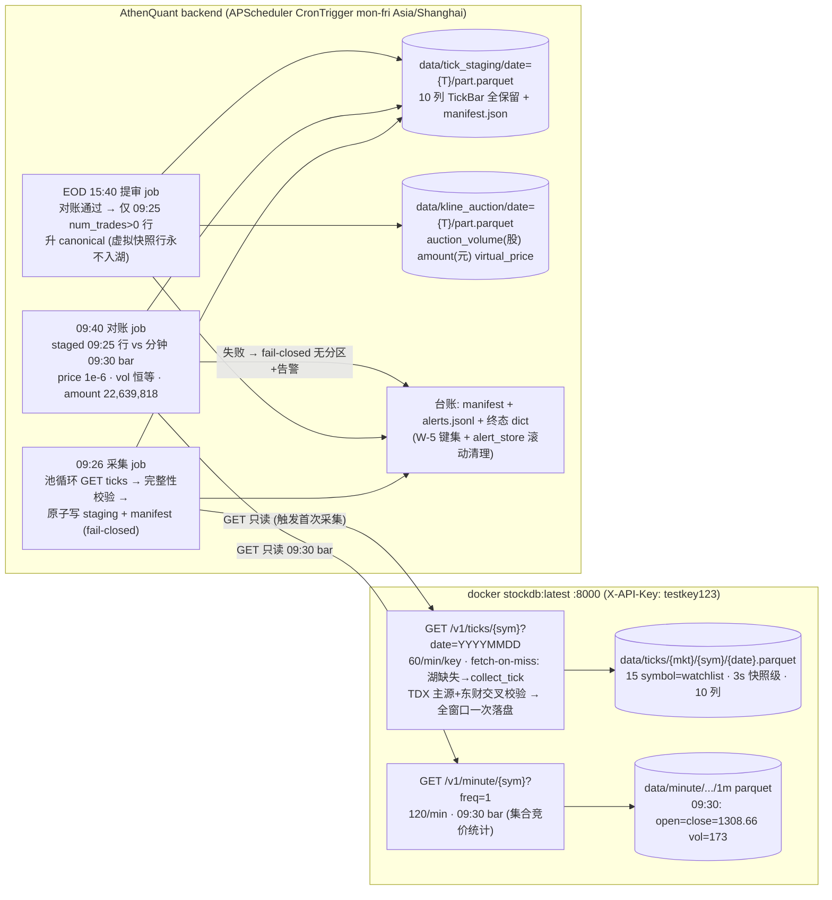

# Phase 43: T-day 竞价采集 sidecar (T-Day Auction Capture) - Research

**Researched:** 2026-08-07
**Domain:** 盘中竞价窗口 live 采集 (stockdb tick 端点) + staging 落盘 + live 对账闭合 + T-day 累积 + 诚实门
**Confidence:** HIGH（核心机制全部 live 实测锚定；覆盖范围受 watchlist 池限制，见 Summary）
**方法:** 只读侦察（stockdb/AthenaQuant 源码 file:line 核实）+ live probe（curl 127.0.0.1:8000 只读 GET /v1/ticks /v1/minute /v1/health + 湖内 parquet 逐行分析，零写入触发、零代码修改、零 commit）；未触碰 `frontend/src/pages/Watchlist.tsx`。

## Summary

Phase 43 的核心可行性**全部 live 实测确认**：stockdb tick 端点 (`GET /v1/ticks/{symbol}?date=YYYYMMDD`, 60/min/key) 可返回 09:15-09:25 竞价窗口的 3 秒快照级逐条数据（含 09:25:00 真实撮合行），且**对账锚点已用当日真实数据闭合**——SH600519 tick 09:25:00 行 `price=1308.66, vol_hand=173, num_trades=120`，173×100×1308.66 = 22,639,818 元，与分钟 09:30 bar（`open=close=1308.66, volume_hand=173`，OHLC 全等）精确闭合（两条独立端点 live 互证）。num_trades 语义实锤：09:15-09:24 快照行 `num_trades=0`（虚拟匹配非逐笔）、09:25:00 撮合行 `num_trades=120`（真实 120 笔）、09:30:00 首根连续竞价行 `num_trades=19`。采集路径的关键机制 = **服务端 fetch-on-miss**（kernel/service.py:488-490：湖文件缺失 → collect_tick 回源 TDX+东财交叉校验 → 全窗口数据一次落盘），意味着 sidecar 无需盘中轮询——**首次 GET 即触发服务端全窗口采集**，后续 GET 只读湖（文件存在不刷新，source 实测）。

三个必须由 planner/discuss 显式决策的结论：① **「逐秒快照」与源原生粒度（TDX L1 3 秒快照级，实测窗口 gap 分布 3s 占绝对多数）不匹配**——SDC-01 文本需重述为「3s 快照级逐条捕获」或明示源粒度限制；② **5537 标的全量盘中采集不可行**（60/min ÷ 5537 = 92min/轮 + 服务端逐 symbol 采集成本；本环境 tick 湖实际只有 15 个自选池 symbol），覆盖必须 pool-gated（自选池/配置白名单 ≤200）；③ **DATA-06 的 `auction_unmatched_volume`（虚拟未匹配量）经 probe 确认不可得**——TickBar/东财 details 行（7 字段）/QuoteSnapshot/depth（仅五档）均无未匹配量字段，诚实缺列不猜测；`auction_virtual_price` 语义可映射（09:25 撮合行 price == xyz `current` 语义，可交叉验证 kline_daily.open）。

**Primary recommendation:** sidecar = 三个 APScheduler cron job（镜像 daily_pipeline.py 既有 09:26 premarket job 注册模式）：① 09:26 采集 job——逐 symbol GET /v1/ticks（池 ≤200）→ 完整性校验（trade_date==T ∧ 09:25 行 num_trades>0 ∧ 窗口行数 ≥ 阈值）→ 原子写 `data/tick_staging/date={T}/part.parquet` + manifest（fail-closed，不完整 → 无分区 + 台账 reason）；② 09:40 对账 job——GET /v1/minute 09:30 bar 与 staged 09:25 行三重闭合（price 1e-6 / volume 恒等 / amount 派生 22,639,818）；③ EOD 15:40 提审 job——对账通过后仅将 09:25 num_trades>0 撮合行升 canonical `kline_auction`（`auction_volume=vol_hand×100` 股 / `auction_amount=price×vol×100` 元 / `auction_virtual_price=price`，num_trades 只进 staging 元数据），虚拟快照行永不入湖（555..565 窗口谓词保持）。零新增运行时依赖（httpx/polars/apscheduler 均既有）。

<phase_requirements>
## Phase Requirements

| ID | Description (REQUIREMENTS.md) | Research Support |
|----|-------------|------------------|
| SDC-01 | 盘中 09:15-09:25 逐秒快照 + 09:25 撮合行定时采集（独立脚本 + 盘中 cron 窗口）；live 对账闭合（09:25 price×vol == intraday 09:30 bar amt）；数据落 staging 不入 canonical 湖 | **tick 端点/数据/限频全部 live 实测**：GET /v1/ticks/{symbol}?date=YYYYMMDD（routes.py:607-620，60/min，X-API-Key）；tick 湖 15 symbol 仅当日（data/ticks/{mkt}/{sym}/{YYYYMMDD}.parquet）；3s 快照级 gap 分布实测（47×3s / 13×6s / 6×9s，窗口 85 行）；09:25 撮合行实测（1308.66/173手/120笔）+ 分钟 09:30 bar 双重闭合（22,639,818）；**采集机制 = fetch-on-miss 一次 GET 全窗口**（service.py:488-490 源码核实）；「逐秒」与 3s 源粒度不匹配 → 见 Assumptions A1；5537 全量不可行 → 覆盖 pool-gated（见 Q2/Assumptions A2）；canonical 湖契约核实（auction_sync.py CANONICAL_AUCTION_COLS + 555..565 谓词 + OPTIONAL_AUCTION_COLS） |
| SDC-02 | 自 T-day 逐日累积真实竞价列（auction_volume/amount/price, 多 num_trades 元数据）；DATA-06 派生输入（unmatched_volume/virtual_price）语义经 probe 确认后映射（不猜测） | **真实列映射全锚定**：auction_volume 单位=股（data.py:772「单位: 股」逐字）+ tick vol_hand 手 → ×100；auction_amount 元 = price×vol×100；auction_virtual_price = 09:25 price（xyz_provider.py:247 同语义 `current`）；num_trades=120 实测 → staging 元数据（canonical 无此列）。**DATA-06 probe 结论**：`auction_unmatched_volume` 不可得（TickBar schemas.py:426-443 无字段 / 东财 details 7 字段 eastmoney.py:804-815 无字段 / QuoteSnapshot 无字段 / Depth 仅五档）→ 诚实缺列，派生 `auction_unmatched_amount` 不产出（auction_columns.py:44-45 既有缺列语义）；`auction_virtual_price` 可映射且可交叉验证 kline_daily.open（verify_auction_backfill [4] 既有 1e-6 断言） |
| SDC-03 | 诚实门：采集失败 fail-closed（当日无数据 → 无当日分区，不伪造）；sidecar 状态可观测（台账/告警, 09:26 后缺失可告） | fail-closed 既有模式核实（auction_backfill `_fail_closed` W-5 9 键终态 + auction_sync probe 闸门 + premarket_snapshot skip 语义）；台账模式（alerts.jsonl JSONL 追加+滚动清理 alert_store.py:1-41 + 原子写）；告警链（alert_store.append + /api/alerts + webhook_adapter WeCom）；调度模式（daily_pipeline.py:1140-1174 CronTrigger mon-fri Asia/Shanghai + `_run_tracked` 单飞 + job_store）；**09:26 已有盘前 job**（`_PREMARKET_JOB_ID="premarket_pool_preview"` 9:26，daily_pipeline.py:969-970）— sidecar 采集 job 同槽位；交易日历缺口 = AQ 无日历服务（market_time.py 仅周末注释；stockdb trading_calendar 无 HTTP 端点）→ 交易日确认以数据在场（分钟 09:30 bar 存在）为准，见 Q6 |
</phase_requirements>

## Architectural Responsibility Map

| Capability | Primary Tier | Secondary Tier | Rationale |
|------------|-------------|----------------|-----------|
| 竞价窗口 tick 采集（GET /v1/ticks 池循环 + 完整性校验） | API / Backend | — | AQ backend 进程内 sidecar job（httpx 客户端），镜像 stockdb_provider 模式；无前端/SSR 参与 |
| staging 落盘（tick_staging 分区 + manifest + 台账） | Database / Storage | API / Backend | 独立湖 `data/tick_staging/date={T}/part.parquet`（镜像 premarket_results/date= 独立分区语义）；写入由采集 job 触发 |
| live 对账（staged 09:25 vs stockdb 分钟 09:30 bar） | API / Backend | Database / Storage | 只读对账：tick 09:25 行 vs /v1/minute 09:30 bar（price 1e-6 / volume 恒等 / amount 派生三检）；对账结果进 manifest |
| canonical 升湖（09:25 撮合行 → kline_auction） | Database / Storage | API / Backend | 仅 num_trades>0 撮合行、555..565 窗口谓词、merge-upsert 幂等 + 原子写（auction_sync 写路径镜像）；虚拟快照行永不入湖 |
| T-day 逐日累积（staging → canonical 日分区累积） | Database / Storage | — | 每交易日一分区，逐日累积；staging 全量保留（真实列 + 虚拟快照 + num_trades 元数据） |
| 交易日判定与告警（09:26 后缺失可告） | API / Backend | — | 交易日确认 = 数据在场（分钟 09:30 bar）为准；告警 = alert_store + webhook；调度 = CronTrigger mon-fri（既有模式） |

## Standard Stack

### Core

零新增依赖（v2.5 铁律）——全部为既有组件：

| 组件 | 位置 | Purpose | Why Standard |
|---------|---------|---------|--------------|
| `StockDBProvider`（httpx） | backend/app/data_providers/stockdb_provider.py | GET /v1/ticks 池循环 + GET /v1/minute 对账 | Phase 40 已交付（X-API-Key header-only、typed 异常、429 Retry-After）；tick 方法需扩展（见 Architecture Patterns） |
| APScheduler `CronTrigger` | backend/app/jobs/daily_pipeline.py:1140-1174 | 09:26 采集 / 09:40 对账 / EOD 15:40 提审三 job 注册 | 既有调度模式（`_run_tracked` 单飞 + job_store 跟踪 + replace_existing），盘前 09:26 同槽位先例 |
| `alert_store.append` | backend/app/services/alert_store.py | 缺失/对账失败告警事件（alerts.jsonl） | 既有 JSONL 追加 + 滚动清理；`/api/alerts` 查询面已有 |
| `auction_sync` 写路径语义 | backend/app/services/auction_sync.py | canonical 升湖（555..565 谓词 + merge-upsert + 原子写） | 唯一既有 canonical 写面语义；sidecar 提审复用其分区写/谓词（probe 闸门需适配 tick 源判定） |
| polars / json（stdlib） | backend deps | staging parquet 写 / manifest 写 | 全链路既有；原子写镜像 premarket_snapshot temp+os.replace |
| `market_time.cn_today/cn_now` | backend/app/market_time.py | 北京时区日期（交易日文件命名/窗口判定） | 既有固定 UTC+8 工具，容器时区不可靠的既有解 |

### Supporting

| 组件 | 位置 | When to Use |
|---------|---------|-------------|
| `auction_probe.resolve_auction_probe` | backend/app/services/auction_probe.py | DATA-06 语义 probe 门（tick 源判定：09:25 行 num_trades>0 ∧ 分钟闭合）；不 available → 竞价列缺席（既有双闸门） |
| `verify_auction_backfill` [4] 交叉校验 | backend/scripts/verify_auction_backfill.py:191-215 | 提审后复核 auction_virtual_price == kline_daily.open（1e-6 既有断言可复用到 tick 源） |
| `premarket_snapshot._DATE_RE` 路径守卫 | backend/app/services/premarket_snapshot.py | staging 目录名严格 `^\d{4}-\d{2}-\d{2}$` 校验（防路径穿越，T-27-01-02 既有模式） |
| `json_report_store` 原子写底座 | backend/app/services/json_report_store.py | manifest/台账 JSON 原子写（temp + os.replace + 实例锁）可选复用 |
| stockdb `trading_days.json` | stockdb/src/stockdb/calendar/data/trading_days.json | 交易日历数据文件（已核实 is_trading_day 正确：08-07 True / 08-08 False / 02-16,17 春节 False）；**无 HTTP 端点** — 仅作可选的日历 oracle 备注，不依赖 |

### Alternatives Considered

| Instead of | Could Use | Tradeoff |
|------------|-----------|----------|
| 09:26 定时 GET 触发 fetch-on-miss（推荐） | 盘中 60/min 轮询 GET /v1/ticks 逐秒捕获 | **轮询不可行（实测/源码）**：fetch-on-miss 只在湖文件缺失时触发采集；文件存在后 GET 只读湖，重复轮询拿到同一份内容，3s 快照来自服务端单次全窗口采集而非客户端轮询 |
| 服务端 WS /ws/stream 推送订阅（quotes/depth 频道，3s 轮询推送） | GET 文件式采集 | WS 存在（ws.py，open_auction 时段 poller 每 3s 推送）但：AQ 无 WS 客户端（websockets 不在 pyproject）、推送语义是 quotes 快照非 tick 明细、数据最终仍落 tick 湖；文件式采集零新依赖且已被实测证明 — **WS 不用** |
| 09:40 对账读 AQ kline_minute 湖 09:30 bar | 读 stockdb /v1/minute | AQ 分钟同步只在 15:30 EOD（daily_pipeline.py:565-581）→ 09:40 时 AQ 湖无当日 09:30 bar；stockdb /v1/minute 可直接读（live 实测 267 行含 09:30 bar）— 对账走 stockdb 直读，EOD 再以 AQ 湖复核 |
| 交易日历用 stockdb trading_days.json（host 文件读） | 以数据在场判定（分钟 09:30 bar 存在） | trading_days.json 在 stockdb 源码树/镜像内、无 HTTP 端点，AQ 容器访问路径部署相关（DEP-01 前置）；数据在场判定零依赖且诚实（有 09:30 bar ⇒ 交易日）— 主方案用后者，日历文件作可选增强 |

**Installation:** 无（零新增依赖）。

**Version verification:** 本阶段不安装任何外部包 — Package Legitimacy Gate 不适用（见下节）。运行面版本实测：AQ venv python 3.11.2 / stockdb 容器 `stockdb:latest`（镜像 50b2d89144ca）/ docker 29.6.1。

## Package Legitimacy Audit

> 本阶段**零新增外部包**（v2.5 铁律）。所有消费面为仓库内既有模块 + stockdb HTTP 端点，Package Legitimacy Gate 不适用。

| Package | Registry | Verdict | Disposition |
|---------|----------|---------|-------------|
| (无) | — | N/A | 不适用 — 零新增依赖；复用 httpx/polars/apscheduler 既有 deps |

**Packages removed due to [SLOP] verdict:** 无
**Packages flagged as suspicious [SUS]:** 无

## Architecture Patterns

### System Architecture Diagram



### Recommended Project Structure

```
backend/app/services/
├── auction_capture.py            # 新增: 采集 + staging 落盘 + 完整性校验 (SDC-01)
├── auction_reconcile.py          # 新增: 09:25 vs 分钟 09:30 bar 三重对账 (SDC-01 对账闭合)
├── auction_promote.py            # 新增: 对账通过后仅 09:25 num_trades>0 行升 canonical (SDC-02)
├── auction_sidecar_ledger.py     # 新增: 台账 (manifest + JSONL 终态 dict, W-5 键集风格)
└── (auction_sync.py 复用其谓词/写路径语义 — 不直接改, 见 Pitfall 6)
backend/app/jobs/daily_pipeline.py  # 扩展: 注册 09:26 采集 / 09:40 对账 / EOD 15:40 提审三 job
backend/tests/
├── fixtures/ticks/               # 新增: live 实测 tick 响应体 canned JSON (SH600519 09:15-09:25)
├── test_auction_capture.py       # 新增: 完整性校验门 + fail-closed + 原子写
├── test_auction_reconcile.py     # 新增: 三重对账 (173×100×1308.66=22,639,818 闭合)
├── test_auction_promote.py       # 新增: 仅撮合行升湖 + 单位映射 (×100 股) + 虚拟行排除
└── test_auction_sidecar_ledger.py  # 新增: 台账键集 + 告警事件
stockdb 侧（不修改）: api/routes.py ticks / kernel/service.py tick / pipeline.py collect_tick
```

### Pattern 1: fetch-on-miss 一次 GET = 全窗口采集（核心机制）

**What:** `service.tick`（kernel/service.py:475-491）读 `data/ticks/{mkt}/{sym}/{date}.parquet`；文件缺失 → `pipeline.collect_tick([sym], date)`（TDX `get_transaction_data` 当日 / `get_history_transaction_data` 历史 + 东财 details 交叉校验，`(symbol,time)` 去重 upsert）→ 一次返回**全天到当前时刻**的分笔（含 09:15-09:25 竞价窗口 + 09:25:00 撮合行）。文件存在 → 直接返回湖内容（**不刷新**）。

**When to use:** 任何 live 竞价窗口采集。**首次 GET 即决定当日文件内容** → sidecar 必须是当日该 symbol 的第一个 tick 请求者（09:26 job 承担），并对返回做完整性校验。

**实测证据（live 2026-08-07 SH600519）：**
- 窗口行 85 行：09:15:07 起每 ~3s 一行（gap 分布 47×3s / 13×6s / 6×9s / 4×12s…），至 09:24:58 全部 `num_trades=0`（虚拟匹配快照）；
- 09:25:00 `price=1308.66, vol_hand=173, num_trades=120, buyorsell=2`（真实撮合 120 笔）；09:25:01 回显行 `num_trades=0`；09:25:04 再一撮合行 `num_trades=120`；
- 09:30:00 `price=1302.5, vol_hand=27, num_trades=19`（连续竞价首根）；
- 全文件 2285 行（09:15:07-11:29:52），源=eastmoney（本环境 TDX 降级，东财兜底；政策链序 pytdx/mootdx→tdx_http→eastmoney，policy.py:112-115）。

**完整性校验建议（planner 写成任务验收）：**
```python
# 采集 job 每 symbol 的校验断言 (骨架)
def _validate_tick_window(rows: list[dict], trade_date: str) -> dict:
    """fail-closed 完整性: 交易日归属 + 09:25 撮合行存在 + 窗口覆盖。任一失败 → 不落分区。"""
    r09 = [r for r in rows if r["time"] <= "09:25:04" and r["time"] >= "09:15:00"]
    match = [r for r in r09 if r["num_trades"] and r["num_trades"] > 0]
    return {
        "ok": (
            rows and all(str(r["trade_date"]).startswith(trade_date) for r in rows)   # 归属日==T
            and any(r["time"] == "09:25:00" for r in match)                            # 09:25 撮合行存在
            and len(r09) >= 40                                                         # 窗口覆盖阈值(3s×10min≈200 理论, 实测 84)
        ),
        "window_rows": len(r09), "match_rows": len(match),
    }
```

### Pattern 2: staging 布局 + manifest（镜像 premarket_results 独立分区语义）

**What:** 竞价窗口数据落独立湖 `data/tick_staging/date={YYYY-MM-DD}/part.parquet`，**绝不写 canonical kline_auction**（虚拟量非成交）。目录名严格 `_DATE_RE` 校验（防路径穿越）。原子写 = temp + `os.replace`（镜像 premarket_snapshot.py）。

**staging 契约草案（10 列 = TickBar 全字段保留）：**

| 列 | 类型 | 语义（实测值） |
|---|---|---|
| `symbol` | str | 前缀形态 `SH600519`（服务端原样）|
| `trade_date` | datetime[us, Asia/Shanghai] | 交易日 00:00 aware |
| `time` | str | `HH:MM:SS`（`09:25:00`）|
| `price` | f64 | 成交价/虚拟参考价（元，`1308.66`）|
| `vol_hand` | i64 | 成交量（手，`173`；09:15-09:24 为虚拟匹配量）|
| `num_trades` | i64 | 成交笔数（撮合行 `120` / 快照行 `0`）|
| `buyorsell` | i64 | 主动方向 0/1/2（撮合行 `2`）|
| `source` | str | `eastmoney`（本环境实测）/ pytdx 等 |
| `fetched_at` | datetime[us, UTC] | 服务端采集时间 |
| `ingested_at` | datetime[us, UTC] \| null | 透传 |

**manifest.json（每日期）**：`{trade_date, captured_at, pool_size, symbols_ok, symbols_failed: [{symbol, reason}], completeness: {...}, reconciliation: {status, checks...}, promoted: bool, promoted_at}` —— 键集镜像 auction_backfill W-5 终态风格（成功 8 键 / fail-closed 9 键 + reason）。

**canonical 升湖（仅 09:25 撮合行）：**

| tick 字段 | 转换 | canonical 列 | 依据 |
|---|---|---|---|
| `time==09:25:00..04` 且 `num_trades>0` 行 | 取撮合行（两行同值 → dedupe） | datetime | 555..565 窗口谓词内 |
| `vol_hand` (手) | **×100** | `auction_volume` (股) | data.py:772「单位: 股」逐字 + xyz `volume`→auction_volume 同语义 |
| `price × vol_hand × 100` | 派生 | `auction_amount` (元) | 实测闭合 173×100×1308.66=22,639,818 |
| `price` | 恒等 | `auction_virtual_price` (元/股) | xyz_provider.py:247 `current`→`auction_virtual_price` 同语义；verify [4] 交叉验证 == kline_daily.open |
| `num_trades` (120) | **只进 staging 元数据/manifest** | —（canonical 无此列） | SDC-02「多 num_trades 元数据」 |
| 09:15-09:24 快照行 | **永不升 canonical** | — | 虚拟量非成交（555..565 谓词 + 提审过滤 num_trades>0）|

### Pattern 3: 三重对账闭合（09:25 撮合行 vs 分钟 09:30 bar）

**What:** 对账 = 两条独立端点互证（tick 明细 vs 分钟统计），三重检查全过才算闭合：

```python
# 对账 job 骨架 — 全部 live 实测锚定 (SH600519@2026-08-07)
def reconcile(match: dict, bar0930: dict, tol: float = 1e-6) -> dict:
    """match: staged 09:25 撮合行 {price, vol_hand}; bar0930: /v1/minute 09:30 行。"""
    checks = {
        "price_eq": abs(match["price"] - bar0930["close"]) <= tol,          # 1308.66 == 1308.66 ✓
        "vol_eq": match["vol_hand"] == bar0930["volume_hand"],              # 173 == 173 ✓ (int 恒等)
        "amount_closure": abs(match["price"] * match["vol_hand"] * 100
                             - bar0930["volume_hand"] * bar0930["close"] * 100) <= tol,  # 22,639,818 ✓
    }
    # amount 派生仅当 09:30 bar OHLC 全等 (纯净竞价 bar, Phase 42 规则); 不全等 → amount 记 UNKNOWN
    return {"status": "closed" if all(checks.values()) else "mismatch", "checks": checks}
```

**机制要点：**
- 对账读 stockdb `/v1/minute/{sym}?start=T&end=T+1&freq=1`（120/min；09:30 bar live 实测存在，`open=high=low=close=1308.66, volume_hand=173, amount_yuan=None`（腾讯源无 amount）→ amount 用 OHLC 全等派生；`end` 必须传 T+1（分钟不含 end 日语义，Phase 40 Pitfall 3）；
- 对账时点 09:40（09:30 bar 由服务端分钟采集产出；fetch-on-miss 同机制）；**失败处理：对账 mismatch → 当日不升 canonical + 台账 reason + 告警**（不伪造、不猜测）；
- EOD 复核：15:30 AQ kline_minute 同步后（daily_pipeline.py:565-581 含当日）再以 AQ 湖 09:30 bar 复验一次（第二独立来源）。

### Pattern 4: 诚实门（fail-closed + 台账 + 告警）

- **fail-closed**：完整性校验失败 → 不写 staging 分区（镜像 premarket_snapshot「诚实 skip 不写任何文件」）；对账失败 → 不升 canonical（镜像 auction_sync probe 闸门 + auction_backfill `_fail_closed` 9 键终态 `reason` 参数化）。
- **台账**：`data/user_data/auction_sidecar_ledger.jsonl`（JSONL 追加 + 滚动清理，镜像 alert_store.py:1-41）；每 job 跑完一行终态 dict（W-5 键集风格：`{job, trade_date, requested, ok, failed_symbols, reason?, ...}`）；manifest.json 同日沉淀。
- **告警链**：`alert_store.append`（`data/user_data/alerts.jsonl`，`/api/alerts` 查询面既有）+ 可选 `webhook_adapter`（WeCom 群 webhook 单向 POST）。触发条件：**交易日已确认（分钟 09:30 bar 存在）且 09:26 采集缺失/不完整** → alert `auction_sidecar_capture_missing`；对账 mismatch → `auction_sidecar_reconcile_fail`。非交易日（无 09:30 bar）→ 不告警（诚实跳过，台账记 `skipped_no_data`）。
- **交易日判定（无日历服务缺口下的诚实方案）**：AQ 无交易日历（market_time.py 仅周末注释；stockdb trading_calendar 无 HTTP 端点）；调度用 `CronTrigger(day_of_week="mon-fri")`（既有模式），交易日确认 = 数据在场（09:40 分钟 09:30 bar 存在 ⇒ 交易日）。可选增强（planner 可插 checkpoint:human-verify）：读 stockdb `trading_days.json`（src/stockdb/calendar/data/trading_days.json，已核实 2026-08-07 True / 08-08 Sat False / 2026-02-16,17 春节 False）——但需 host 路径可达（DEP-01 连通性前置，部署相关）。

### Anti-Patterns to Avoid

- **[CRITICAL] 盘中 60/min 轮询 GET /v1/ticks「逐秒采集」**：fetch-on-miss 只在文件缺失时触发；文件存在后 GET 永不刷新 → 轮询 600 次拿到同一份内容，纯浪费限频额度。3s 快照来自服务端单次全窗口采集。**正确：09:26 一次 GET 全窗口 + 完整性校验。**
- **[CRITICAL] 把虚拟快照行（num_trades=0）升 canonical kline_auction**：虚拟匹配量非成交（需求明示 + 555..565 谓词 + test_0930_excluded 既有契约）；提审必须过滤 `num_trades>0` 的 09:25 行。
- **不做归属日校验**：东财 details 在 09:15 前请求返回**上一交易日**分笔（eastmoney.py `_em_trading_day` 源码核实）→ 早于 09:15 的 GET 会拿到昨日数据；sidecar 必须传 `?date=T` 且校验响应 `trade_date` 归属日 == T。
- **把「逐秒快照」当硬验收**：源原生粒度 = TDX L1 3 秒快照级（实测）；验收按「3s 快照级逐条捕获（窗口行数 ≥ 阈值）」而非「每秒 1 行」。
- **对账 amount 从腾讯分钟 amount_yuan 直接读**：腾讯源 `amount_yuan=None`（实测）→ amount 用 OHLC 全等派生（Phase 42 规则），不全等记 UNKNOWN。
- **对账读 AQ kline_minute 湖（09:40 时点）**：AQ 分钟同步只在 15:30 EOD → 09:40 湖无当日 09:30 bar；对账读 stockdb /v1/minute 直连，EOD 才复核 AQ 湖。
- **把 stockdb 服务端 tick 采集当常驻依赖**：本环境 collect_loop `tick=0s`（禁用，实测日志「高增长数据采集：minute=0s, tick=0s」）→ 湖文件来自一次性 fetch；sidecar 不得假设文件已存在，必须依赖 fetch-on-miss 自触发（且当日首个请求者）。

## Don't Hand-Roll

| Problem | Don't Build | Use Instead | Why |
|---------|-------------|-------------|-----|
| HTTP 客户端/限频/凭证 | 手写 requests | `StockDBProvider`（stockdb_provider.py，httpx） | Phase 40 已交付：X-API-Key header-only、typed 异常、429 Retry-After、60/min 对齐；tick 方法在其上加 |
| 调度（09:26/09:40/15:40 窗口） | 自研 cron 循环 | APScheduler `CronTrigger` + `_run_tracked`（daily_pipeline.py:1140-1174） | 既有单飞 + job_store 跟踪 + replace_existing；盘前 09:26 job 同槽位先例 |
| 告警持久化 | 自研日志文件 | `alert_store.append`（alerts.jsonl + 滚动清理）+ `/api/alerts` | 既有 JSONL 追加/prune/查询面；webhook_adapter 可选的 WeCom 推送 |
| 原子写（staging/manifest/台账） | 直接 write | temp + `os.replace`（镜像 premarket_snapshot.py / json_report_store.py） | 进程中断不损坏；目录名 `_DATE_RE` 防穿越（T-27-01-02 既有模式） |
| canonical 分区写/谓词 | 自研写湖 | 镜像 `auction_sync` 555..565 谓词 + merge-upsert + 原子写语义 | 既有唯一 canonical 写契约（probe 闸门需适配 tick 源判定，见 Pitfall 6） |
| 对账金额 | 自研逐笔还原 | 三重闭合（price 1e-6 / vol 恒等 / amount OHLC 全等派生） | 全部实测锚定（22,639,818）；历史逐笔不可得（FA-04 前置结论） |

**Key insight:** 本阶段「难的部分」AQ 侧已有既有实现（provider/调度/告警/写路径/原子写）；**真正的新代码 = 三个小 job（采集+对账+提审）**，且它们之间通过 staging 分区 + manifest 解耦。最大的风险不在代码，而在**对源机制的误用**（fetch-on-miss 语义、09:15 前归属日回退、虚拟行升湖）——计划必须把这些写成显式验收断言（canned fixtures 冻结本次 live 实测体）。

## Common Pitfalls

### Pitfall 1: [CRITICAL] 轮询式「逐秒采集」误解 fetch-on-miss → 采到空/陈旧数据
**What goes wrong:** sidecar 按 1s 轮询 GET /v1/ticks 600 次，期望拿到逐秒快照；实际首次 GET 触发服务端全窗口采集，此后 599 次全部返回同一份湖内容（文件存在不刷新），且 60/min 限频下首 60 秒就被 429。
**Why it happens:** `service.tick` fetch-on-miss 只在 `read_ticks` 空时触发（kernel/service.py:488-490 源码核实）；文件存在 → 直接返回。
**How to avoid:** 09:26 一次 GET 全窗口 + 完整性校验；「逐秒快照」验收重述为「3s 快照级逐条捕获」（A1）。
**Warning signs:** 重复 GET 返回内容完全一致；429 密集。

### Pitfall 2: [CRITICAL] 虚拟快照行升 canonical 湖
**What goes wrong:** 提审把 09:15-09:24 的 num_trades=0 行（虚拟匹配量）写进 kline_auction → canonical 湖被虚拟量污染（需求明示禁止 + 虚拟量≠成交）。
**Why it happens:** staging 全量保留快照行，提审过滤不严。
**How to avoid:** 提审只取 `time in 09:25:00..09:25:59 ∧ num_trades>0` 行（实测 09:25:00/09:25:04 两行同值 → dedupe）；555..565 谓词保持 + 提审过滤双重保险；测试断言虚拟行永不出现（镜像 test_0930_excluded）。
**Warning signs:** kline_auction 分区出现 num_trades=0 语义的行或 09:15-09:24 多行。

### Pitfall 3: [HIGH] 09:15 前触发采集 → 拿到昨日数据
**What goes wrong:** 早于 09:15（如隔夜/盘前重试）的 GET /v1/ticks 无 date 参数 → 东财 `_em_trading_day` 回退上一交易日 → staging 把昨日 tick 标成今日。
**Why it happens:** `fetch_transaction_em` 归属日逻辑（eastmoney.py:837-849 源码核实）：上海时间 09:15 前回退上一交易日。
**How to avoid:** 请求必带 `?date={T:YYYYMMDD}`；响应逐行校验 `trade_date` 归属日 == T，不符 → fail-closed。
**Warning signs:** staging 分区内 trade_date 与目录日期不一致。

### Pitfall 4: [HIGH] 对账时点取 AQ 分钟湖 → 恒空误判
**What goes wrong:** 09:40 对账读 AQ kline_minute 当日分区 → 0 行（AQ 分钟同步只在 15:30 EOD）→ 误报对账失败。
**Why it happens:** daily_pipeline.py:565-581 分钟同步属盘后管道。
**How to avoid:** 对账读 stockdb `/v1/minute`（end=T+1 日粒度语义）；EOD 15:40 才以 AQ 湖复核（第二独立来源）。
**Warning signs:** 对账日志分钟 0 行但 stockdb 直读有 09:30 bar。

### Pitfall 5: [HIGH] 完整窗口 vs 部分窗口误判（当日首个请求者竞态）
**What goes wrong:** 某 symbol 的 tick 文件在 09:15-09:25 内已被其他客户端首次 GET 创建（只含部分窗口）→ 09:26 sidecar GET 返回部分数据且永不刷新。
**Why it happens:** 谁先 GET 谁决定当日文件内容（fetch-on-miss 一次性）。
**How to avoid:** 完整性校验兜底（09:25 撮合行必须存在 + 窗口行数阈值）；不完整 → fail-closed 无分区 + 台账/告警；可选：09:26 前无其他 tick 消费者（本环境 collect_loop tick=0s 已核实，dashboard 只读 quotes 不读 ticks）。
**Warning signs:** 窗口行数 < 40 或 09:25 行缺失。

### Pitfall 6: [MEDIUM] probe 闸门与既有诚实回归的适配
**What goes wrong:** 提审复用 `auction_sync.write_auction_partitions` 的 `resolve_auction_probe().status == available` 闸门——当前 probe 枚举的是 xyz MCP 源（auction_probe `_default_sources`），tick 源不在枚举 → 闸门恒不过 → 提审永远 0 写（静默）。
**Why it happens:** probe 源枚举（auction_probe.py `_default_sources`）与 tick 采集路径未接线。
**How to avoid:** 提审闸门改为「当日 staging 采集成功（manifest completeness.ok ∧ reconciliation.closed）」，不依赖 xyz probe；既有 probe/写湖测试（test_auction_probe / test_auction_sync）必须保持绿。
**Warning signs:** 提审 job 返回 0 写且无 reason。

### Pitfall 7: [MEDIUM] 对账金额单位/派生规则错配
**What goes wrong:** 用腾讯分钟 `amount_yuan=None` 当缺失错误，或用 tick vol_hand 直接当股（×1）→ 金额差 100 倍。
**Why it happens:** tick vol_hand 单位=手（TickBar schemas.py:441 显式）+ canonical auction_volume 单位=股（data.py:772 显式）→ 必须 ×100；腾讯分钟 amount=None（实测）。
**How to avoid:** 契约测试锁死 173×100×1308.66=22,639,818 与 volume==173 恒等；amount 仅在 OHLC 全等时派生。
**Warning signs:** 对账 amount 差 100 倍；auction_volume 与 tick vol_hand 相等（漏 ×100）。

## Code Examples

### 采集 job 骨架（镜像 _run_tracked 注册模式 + StockDBProvider）

```python
# backend/app/services/auction_capture.py — 09:26 采集 (骨架; canned fixtures 冻结 live 实测体)
def capture_auction_window(
    provider: StockDBProvider, symbols: list[str], trade_date: date, data_dir: Path,
) -> dict:
    """逐 symbol GET /v1/ticks → 完整性校验 → 原子写 staging + manifest。

    - fetch-on-miss: 当日首个 GET 触发服务端全窗口采集 (09:15-09:25 + 09:25 撮合行);
    - 完整性: 归属日==T ∧ 09:25:00 num_trades>0 ∧ 窗口行数 >= 40; 任一失败 → 该 symbol fail-closed;
    - 原子写: part.parquet temp+os.replace; 目录名 _DATE_RE 防穿越。
    """
    from app.services.premarket_snapshot import _DATE_RE  # 复用路径守卫
    if not _DATE_RE.fullmatch(trade_date.isoformat()):
        raise ValueError(f"trade_date 非法: {trade_date}")
    out_dir = data_dir / "tick_staging" / f"date={trade_date.isoformat()}"
    rows_all: list[dict] = []
    failed: list[dict] = []
    for sym in symbols:
        rows = provider.get_ticks(sym, date=trade_date.strftime("%Y%m%d"))  # 新增方法
        v = _validate_tick_window(rows, trade_date.strftime("%Y%m%d"))
        if v["ok"]:
            rows_all.extend(rows)
        else:
            failed.append({"symbol": sym, "reason": f"incomplete:{v}"})
    if not rows_all and failed:
        return {"requested": len(symbols), "ok": 0, "failed": failed}  # 全失败 → 无分区 (fail-closed)
    out_dir.mkdir(parents=True, exist_ok=True)
    pl.DataFrame(rows_all).write_parquet(out_dir / "part.parquet.tmp")
    (out_dir / "part.parquet.tmp").replace(out_dir / "part.parquet")
    # manifest.json 原子写 + 台账行 (W-5 键集风格) …
    return {"requested": len(symbols), "ok": len(symbols) - len(failed), "failed": failed}
```

### 提审 job 骨架（仅 09:25 撮合行升 canonical，单位映射锁死）

```python
# backend/app/services/auction_promote.py — EOD 15:40 提审 (骨架)
def promote_to_canonical(stage_df: pl.DataFrame, repo: KlineRepository) -> int:
    """对账 closed 后: 只取 09:25 num_trades>0 撮合行 → canonical 列映射 → 分区写。

    - 过滤: time in 09:25:00..09:25:59 ∧ num_trades > 0 (虚拟快照行 num_trades=0 永不入湖);
    - 映射: auction_volume = vol_hand × 100 (股, data.py:772) /
            auction_amount = price × vol_hand × 100 (元, 实测闭合 22,639,818) /
            auction_virtual_price = price (元/股, xyz `current` 同语义);
    - num_trades → manifest 元数据 (canonical 无此列); 走既有 555..565 谓词 + merge-upsert。
    """
    win = stage_df.filter(
        (pl.col("time") >= "09:25:00") & (pl.col("time") <= "09:25:59")
        & (pl.col("num_trades") > 0)
    ).unique(subset=["symbol", "time"])
    if win.is_empty():
        return 0
    canonical = win.with_columns([
        (pl.col("vol_hand") * 100).alias("auction_volume"),
        (pl.col("price") * pl.col("vol_hand") * 100).alias("auction_amount"),
        pl.col("price").alias("auction_virtual_price"),
    ]).select(["symbol", "datetime", "auction_volume", "auction_amount", "auction_virtual_price"])
    return write_auction_partitions(canonical, repo)  # 555..565 谓词 + 幂等 + 原子写
```

## State of the Art

| Old Approach | Current Approach | When Changed | Impact |
|--------------|------------------|--------------|--------|
| 竞价数据只来自 xyz MCP `stockdb_get_call_auction`（09:25 撮合行，配额窗约束，无虚拟窗口数据） | stockdb tick 端点（3s 快照级全窗口 + 09:25 撮合行，60/min/key 本地无配额窗） | Phase 40 接入 stockdb 通道后可用（tick 端点此前已存在但 AQ 未消费） | SDC-01/02 新数据面：虚拟快照（09:15-09:24）+ 真实撮合（09:25）+ num_trades 元数据；T-day 起逐日累积 |
| 分钟 09:30 bar 仅作统计口径 digest（Phase 42 MIN-02/03，不入湖） | 09:30 bar 兼任 live 对账锚点（tick 09:25 撮合行 vs 09:30 bar 三重闭合） | Phase 42 确立 09:30 bar = 集合竞价统计语义 | 对账零新源（复用 /v1/minute）；统计口径与逐笔口径互证 |
| 无盘中采集基础设施（collect_loop tick=0s 禁用，本环境） | sidecar 三 job（09:26 采集 / 09:40 对账 / EOD 提审）自触发 fetch-on-miss | Phase 43 | 盘中窗口数据 T-day 即得，逐日累积解锁 FA-04/RC-02 真列路径（P2 验证后升级常驻通道） |

**Deprecated/outdated:**
- **「逐秒快照」文本**: 源原生粒度 = TDX L1 3 秒快照级（实测），SDC-01 措辞需按 A1 重述。
- **xyz 配额窗作为唯一竞价源**: tick 通道无配额窗（本地 60/min/key 自控），但 xyz 链位保留（既有 auction 链/探针/回填依赖，本阶段不切换）。

## Assumptions Log

| # | Claim | Section | Risk if Wrong |
|---|-------|---------|---------------|
| A1 | SDC-01「逐秒快照」重述为「3s 快照级逐条捕获」——源原生粒度（TDX L1 3s，实测 gap 分布 3s 主导；窗口 85 行 ≈ 3s×10min） | Summary / Q1 / Pitfall 1 | 若用户坚持逐秒（每秒 1 行），tick 源不可达 → 需另寻逐笔源（FA-04 结论：历史逐笔不可得；live 逐秒同样不可得） |
| A2 | 采集覆盖 = 自选池/白名单（≤200），5537 全量盘中不可行（60/min ÷ 5537 = 92min/轮 + 服务端逐 symbol 采集成本） | Q2 / Summary | 若用户要求全量，需升级 stockdb 限频/批量端点（stockdb 侧改动，超出本阶段）或改 WS 推送面（新依赖） |
| A3 | 对账锚点 amount 派生规则（OHLC 全等时 vol×close×100）继续有效（Phase 42 规则）；腾讯分钟 `amount_yuan=None` 时 amount 不直读 | Pattern 3 / Pitfall 7 | 若腾讯源日后提供 amount_yuan，派生规则可被直读替代（对账金额不变，仍闭合） |
| A4 | 本环境 collect_loop tick/minute 均禁用（`tick=0s, minute=0s` 实测日志），湖文件来自一次性 fetch；部署目标机（3018）可能配置不同 | Q1 / Pitfall「常驻依赖」 | 若部署机 tick 采集常驻开启，sidecar 的 fetch-on-miss 首 GET 可能遇到「文件已被 collect_loop 创建」——完整性校验仍兜底；若常驻且增量刷新，sidecar 可退化为纯读 |
| A5 | 交易日判定以数据在场（分钟 09:30 bar 存在）为准；stockdb trading_days.json 作可选日历 oracle（无 HTTP 端点，host 路径可达性部署相关） | Q6 / Pattern 4 | 若遇「交易日但 09:30 bar 延迟发布」边缘 → 对账重试窗口需放宽（09:40 → 09:45 重试 1 次）；若用户要求权威日历，需 stockdb 加端点（跨仓库）或 AQ 自带日历（新数据） |

## Open Questions

1. **「逐秒快照」的验收口径（A1）**
   - What we know: 源原生粒度 3s（实测），「逐秒」不可达。
   - What's unclear: 用户接受「3s 快照级逐条捕获」还是坚持逐秒（需换源）。
   - Recommendation: discuss 阶段确认；研究默认按 3s 快照级规划（窗口行数 ≥ 40 阈值）。

2. **采集池构成（A2）**
   - What we know: 本环境 tick 湖 = stockdb watchlist 15 symbol；AQ 池机制（pools.py CSI300/CSI500/SSE50/CN_Equity_A/watchlist）与 premarket 池共用。
   - What's unclear: sidecar 池 = stockdb watchlist / AQ watchlist / 可配置白名单？
   - Recommendation: 默认「AQ 自选池 + 可配置白名单（≤200）」；5537 全量明确 descope（研究结论：不可行）。

3. **DATA-06 `auction_unmatched_volume` 的最终处置（Q4）**
   - What we know: probe 结论 = tick 源不可得（TickBar/东财 7 字段/QuoteSnapshot/Depth 均无）。
   - What's unclear: 是否需要为未匹配量做 WS depth 分析（五档盘口在竞价期的未匹配量近似）——需真实竞价时段 depth 采样验证，本阶段无法实测（盘已收）。
   - Recommendation: 本阶段诚实缺列（不映射）；后续若竞价时段 depth 采样显示可派生，另立探针任务。

4. **对账时点与分钟 09:30 bar 发布时延（A5）**
   - What we know: 本环境 /v1/minute 当日 09:30 bar 收盘后可读（实测）；盘中发布时延未实测（本环境 collect_loop minute=0s）。
   - What's unclear: 09:40 时 09:30 bar 是否必现（服务端分钟采集节奏）。
   - Recommendation: 对账 job 09:40 触发 + 09:45 重试 1 次（fetch-on-miss 首 GET 触发采集），仍无 → 台账记 pending + EOD 复核（AQ 湖）。

5. **升 canonical 的时点与闸门**
   - What we know: 对账 closed 是前置；canonical 写 = auction_sync 语义（probe 闸门需替换为 staging 判定，Pitfall 6）。
   - What's unclear: 提审时点 15:40（EOD 后）还是 09:45（当日即升）？需求「自 T-day 逐日累积」暗示按日；EOD 提审可与 Phase 44 D3 15:40 recap 槽位对齐。
   - Recommendation: EOD 15:40 提审（当日数据完整后）；当日 09:45 如需盘中可见，可加「provisional staging 读取」路径（不动 canonical）。

## Environment Availability

| Dependency | Required By | Available | Version | Fallback |
|------------|------------|-----------|---------|----------|
| stockdb API 容器 `:8000` | tick 采集 + 分钟对账 | ✓ | `stockdb:latest` (50b2d89144ca)，healthy | — |
| stockdb API key | 全部 GET | ✓ | `testkey123`（STOCKDB_API_KEYS） | 专用 AthenaQuant key（LOCAL-02 建议，限频桶隔离） |
| GET /v1/ticks/{symbol} | SDC-01 采集 | ✓ live 实测（200 行样例 + 09:25 撮合行） | 60/min/key | — |
| GET /v1/minute/{symbol} | SDC-01 对账 | ✓ live 实测（267 行含 09:30 bar） | 120/min/key | — |
| stockdb collect_loop tick/minute | 服务端湖填充 | ✗ 禁用（`tick=0s, minute=0s` 实测日志） | — | fetch-on-miss 自触发（首 GET 触发采集）—— sidecar 主机制 |
| AQ python 运行时 | sidecar 代码 | ✓ | 3.11.2（stockdb SDK 3.12 不可用 → HTTP 适配器形态既有） | — |
| AQ 依赖 httpx/polars/apscheduler | sidecar | ✓ pyproject 既有 | httpx>=0.27 / polars>=1.0 / apscheduler>=3.10 | — |
| websockets（AQ） | WS 推送方案 | ✗ 不在 pyproject | — | WS 方案已否决（文件式采集替代） |
| 交易日历 | SDC-03 假日跳过 | 部分（mon-fri CronTrigger + 数据在场判定） | stockdb trading_days.json 无 HTTP 端点 | 数据在场判定（主方案）|

**Missing dependencies with no fallback:** 无（tick/分钟数据面全部可用；collect_loop 禁用由 fetch-on-miss 机制替代，已实测证明数据可达）。

**Missing dependencies with fallback:**
- **逐秒粒度源**: 不可达 → 3s 快照级（A1，需 discuss 确认）。
- **全量 5537 盘中覆盖**: 不可达 → pool-gated（A2）。

## Validation Architecture

> workflow.nyquist_validation = true（.planning/config.json），本阶段含测试面。

### Test Framework
| Property | Value |
|----------|-------|
| Framework | pytest（backend/tests，仓库约定：生产 import 放测试函数内，避免模块级 DuckDB 单例） |
| Config file | 无独立 pytest.ini — 镜像既有测试约定（repo_env fixtures / canned JSON fixtures） |
| Quick run command | `cd backend && .venv/bin/python -m pytest tests/test_auction_capture.py tests/test_auction_reconcile.py -x -q` |
| Full suite command | `cd backend && .venv/bin/python -m pytest tests/ -q`（既有拍卖族回归保持绿） |

### Phase Requirements → Test Map
| Req ID | Behavior | Test Type | Automated Command | File Exists? |
|--------|----------|-----------|-------------------|-------------|
| SDC-01 | 采集 job：fetch-on-miss 一次 GET 全窗口 → staging 原子写；完整性校验 fail-closed（归属日/09:25 行/窗口阈值） | unit（canned tick fixtures = 本次 live 实测体） | `pytest tests/test_auction_capture.py -x` | ❌ Wave 0 |
| SDC-01 | 对账闭合：173×100×1308.66 == 22,639,818（price 1e-6 / vol 恒等 / amount OHLC 全等派生） | unit（fixture = live 实测 09:25 行 + 09:30 bar） | `pytest tests/test_auction_reconcile.py -x` | ❌ Wave 0 |
| SDC-01 | canonical 零污染：虚拟快照行（num_trades=0）永不升湖（555..565 + 提审过滤） | unit | `pytest tests/test_auction_promote.py -x` | ❌ Wave 0 |
| SDC-02 | 单位映射锁死：auction_volume==vol_hand×100（股）、auction_amount==price×vol×100（元）、auction_virtual_price==price；num_trades 只进 staging 元数据 | unit | `pytest tests/test_auction_promote.py -x` | ❌ Wave 0 |
| SDC-02 | DATA-06 诚实缺列：tick 源无 unmatched 列 → 派生列不产出（镜像 test_auction_columns.py 缺列语义） | unit | `pytest tests/test_auction_capture.py tests/test_auction_columns.py -x` | ❌ Wave 0（前者）；✅ 后者既有 |
| SDC-03 | fail-closed：完整性/对账失败 → 无当日分区 + 台账 reason（W-5 键集）| unit | `pytest tests/test_auction_sidecar_ledger.py -x` | ❌ Wave 0 |
| SDC-03 | 告警：交易日已确认（09:30 bar 存在）且采集缺失 → alert 事件（alerts.jsonl）；非交易日 → 无告警 | unit | `pytest tests/test_auction_sidecar_ledger.py -x` | ❌ Wave 0 |
| SDC-03 | 调度注册：三 job CronTrigger mon-fri Asia/Shanghai（09:26/09:40/15:40），_run_tracked 单飞 | integration（镜像 test_daily_pipeline_refresh.py 风格） | `pytest tests/test_daily_pipeline_refresh.py -x` | ❌ 需扩展既有文件 |

### Sampling Rate
- **Per task commit:** `cd backend && .venv/bin/python -m pytest tests/test_auction_capture.py tests/test_auction_reconcile.py tests/test_auction_promote.py -x -q`
- **Per wave merge:** 拍卖族回归 `pytest tests/test_auction_*.py -q` + `test_minute_*.py`（T-21-01/09:30 语义不回归）
- **Phase gate:** 全量 `pytest tests/ -q` 绿 + live 探针脚本（真实 GET /v1/ticks 只读）验证 canned fixtures 与真实响应形状一致

### Wave 0 Gaps
- [ ] `backend/tests/fixtures/ticks/` — canned JSON：SH600519 09:15-09:25 窗口 85 行（含 09:25:00 num_trades=120 撮合行）| 采集/校验/对账/提审四组 fixture
- [ ] `backend/tests/test_auction_capture.py` — 完整性门 + fail-closed + 原子写 + 归属日回退（09:15 前昨日数据拒绝）
- [ ] `backend/tests/test_auction_reconcile.py` — 三重对账闭合 + amount 派生规则 + mismatch 处理
- [ ] `backend/tests/test_auction_promote.py` — 仅撮合行升湖 + 单位映射 + 虚拟行排除 + 幂等重跑
- [ ] `backend/tests/test_auction_sidecar_ledger.py` — 台账键集（W-5 风格）+ 告警事件（交易日确认/非交易日静默）
- [ ] `backend/tests/test_daily_pipeline_refresh.py` 扩展 — 三 job 注册断言（CronTrigger 时点/id/replace_existing）

## Security Domain

> security_enforcement = true（.planning/config.json，absent=默认启用）。ASVS L1。

### Applicable ASVS Categories

| ASVS Category | Applies | Standard Control |
|---------------|---------|-----------------|
| V2 Authentication | yes | stockdb X-API-Key header-only（Phase 40 既有：禁 URL 传参）；key 从 settings 注入，绝不落 staging/manifest |
| V3 Session Management | no | 无会话面（纯后端 job，无用户交互） |
| V4 Access Control | yes | 写路径仅 3 个内部 job 函数；无新 API 端点暴露（或仅 GET /api/auction-sidecar/status 只读台账，镜像 auction_history GET-only 纪律） |
| V5 Input Validation | yes | staging 目录名 `_DATE_RE` fullmatch（T-27-01-02 防路径穿越，镜像 premarket_snapshot）；symbol 白名单（池内枚举，不信任外部输入）；trade_date 归属校验 |
| V6 Cryptography | no | 无加密需求（本地只读数据 + 既有凭证注入） |

### Known Threat Patterns for {stack}

| Pattern | STRIDE | Standard Mitigation |
|---------|--------|---------------------|
| 路径穿越（trade_date/symbol 注入目录名） | Tampering | `_DATE_RE` fullmatch + symbol 池白名单（镜像 premarket_snapshot.py 既有守卫） |
| API key 泄漏（日志/台账/staging） | Information Disclosure | header-only 凭证（Phase 40 铁律）；台账/staging 只写数据字段，绝不写 key/URL |
| 数据完整性（staging 被篡改 → canonical 污染） | Tampering | 对账三重闭合（独立第二源 /v1/minute 互证）+ 提审仅撮合行过滤 + merge-upsert 幂等 |
| 假日误报（非交易日告警风暴） | DoS（噪声） | 交易日数据在场判定（09:30 bar 存在才告警）+ mon-fri 调度 |
| 服务端 fetch-on-miss 的副作用放大（sidecar 首次 GET 触发服务端外部采集） | Spoofing（数据面） | 池 ≤200 + 60/min 对齐（sleep_between_batches）+ 完整性校验兜底（不信任服务端返回即真） |

## Sources

### Primary (HIGH confidence — live 实测 + 源码读核，本会话)
- **stockdb live probe 2026-08-07**: GET /v1/ticks/SH600519?date=20260807（200 行样例：09:15:07 起 3s 快照 + 09:25:00 撮合行 1308.66/173/120）；GET /v1/minute/SH600519（267 行，09:30 bar OHLC=1308.66/vol=173/amount=None）；GET /v1/health（TDX 降级/东财可用）；GET /v1/intraday（0 行，today-only 语义）；openapi 37 路径（含 /v1/ticks/{symbol}，无 calendar）
- **stockdb 湖内 parquet 分析**: data/ticks/sh/SH600519/20260807.parquet（2285 行，10 列，gap 分布 3s 主导，num_trades 0/120/19 语义，无下午段）；15 symbol 文件 = watchlist（data/watchlist.json 核实）
- **stockdb 源码**: api/routes.py:605-620（ticks 60/min）；kernel/service.py:475-491（tick fetch-on-miss）；kernel/tick.py（read_ticks）；contracts/schemas.py:426-443（TickBar 10 字段）；contracts/schemas.py:206-245（Depth 五档 / QuoteSnapshot 无 unmatched 字段）；providers/eastmoney.py:799-873（details 7 字段 + `_em_trading_day` 09:15 前回退）；providers/tdx.py:393+（get_transaction_data 当日/历史）；pipeline.py:1373+（collect_tick 交叉校验）；policy.py:112-115（链序）；calendar/trading_calendar.py + data/trading_days.json（is_trading_day 实测 08-07 True/08-08 False/02-16,17 False）；api/poller.py（open_auction 轮询 + WS 广播）
- **AthenaQuant 源码**: auction_sync.py:29-93（CANONICAL_AUCTION_COLS + OPTIONAL_AUCTION_COLS + 555..565 谓词 + 原子写）；auction_columns.py:29-45,102-131（DATA-06 派生语义 + 缺列诚实）；auction_probe.py（PROBE_SYMBOL/窗口/源枚举）；xyz_provider.py:177-268（stockdb_get_call_auction → auction_volume/amount/virtual_price 映射）；daily_pipeline.py:723-750（_run_tracked）、969-970（_PREMARKET 09:26）、1140-1174（CronTrigger 注册）、565-581（分钟同步 15:30 EOD）；premarket_snapshot.py（_DATE_RE 守卫 + 独立分区 + 原子写）；alert_store.py:1-41（alerts.jsonl 追加+滚动清理）；market_time.py（cn_today，无日历）；data.py:768-777（auction 列单位描述逐字）；verify_auction_backfill.py:191-215（[4] 交叉校验 1e-6）；config.py:121（data_dir）
- **Phase 40/42 RESEARCH.md**: 端点/限频/归一化/09:30 bar 统计口径基线（本会话重读核实）

### Secondary (MEDIUM)
- REQUIREMENTS.md SDC-01..03 + ROADMAP.md Phase 43 详情（Success Criteria 4 条）+ v2.5 SUMMARY 研究基础（tick 湖含 09:25 撮合行、3s 快照、60/min 限频、对账锚点 17300×1308.66=22,639,818 — 全部本次 live 复验一致）

### Tertiary (LOW)
- 无 WebSearch 依赖（全部结论来自本会话源码读核 + live 实测；外部文档未涉及——零新增依赖，无库文档需求）

## Metadata

**Confidence breakdown:**
- Standard stack: HIGH — 零新增依赖（v2.5 铁律），全部消费面既有组件 + live 实测端点
- Architecture: HIGH — 核心机制（fetch-on-miss / staging / 三重对账 / fail-closed）全部源码 + 实测锚定；A1/A2（逐秒粒度/覆盖池）为需求口径确认项，非技术不确定
- Pitfalls: HIGH — 7 项均从源码行为或实测数据反推（fetch-on-miss 一次性、归属日回退、分钟 end 语义、单位 ×100 等）

**Research date:** 2026-08-07（盘中数据实测日；本会话时点 = 沪市 2026-08-08 00:45 盘后）
**Valid until:** 2026-09-06（30 天；stockdb 若改 tick 端点/限频/fetch-on-miss 语义需重探；部署机 3018 的 collect_loop 配置与源可达性需重探 — A4）
