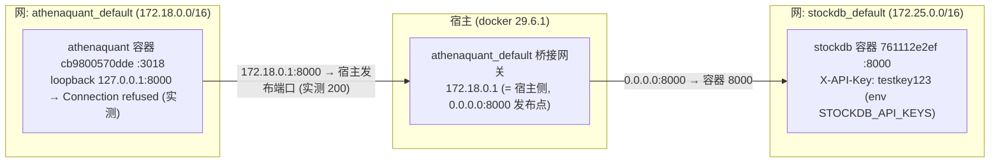

# Phase 44: 部署日执行面 (Deploy-Day Execution) - Research

**Researched:** 2026-08-07
**Domain:** 部署运维 (docker 网络/凭证注入/3018 rebuild) + 端点 200-body 脚本化 + D1..D8 runbook 脚本化
**Confidence:** HIGH（网络/凭证/rebuild/端点/D1..D8 判定路径全部 live 实测锚定；部署日真实行为本身 UNKNOWN 属诚实边界，见 Open Questions）
**方法:** 只读侦察（源码 file:line 核实 + docker inspect + 容器内只读 probe）+ **临时沙箱验证**（从当前 HEAD 构建 p44preflight 镜像 → 临时数据副本 → :3020 预检容器 → 真实登录 + 3 端点 200-body + 网关连通性实测 → 全清理零残留）。零代码修改（除本文件）、零 commit、未触碰 `frontend/src/pages/Watchlist.tsx`（连读都不读）。

## Summary

Phase 44 将 39 期「部署验证清单」+ 43 期 sidecar 的**部署日执行面**脚本化。本次研究的六个问题全部落地：① **容器网络实测定案**——athenaquant 容器在自定义桥接网 `athenaquant_default`（IP 172.18.0.1 网关），stockdb 在独立桥接网 `stockdb_default`（172.25.0.4，8000 发布到宿主 0.0.0.0:8000）。容器内 `127.0.0.1:8000` **Connection refused**（自身 loopback 无服务），但容器内 `http://172.18.0.1:8000`（桥接网关=宿主侧）**真实可达**——实测 `/v1/quotes?symbols=SH600519` 与 `/v1/daily` 带 `X-API-Key` 均返回 200 真实数据。**结论：不需要 host 网络模式，不需要 --add-host**，只需 `.env` 设 `LOCAL_STOCKDB_URL=http://172.18.0.1:8000`（网关方案实测成功）。② **凭证注入面定案**——注入链 = `.env`（mode 600、git-ignored、当前缺 LOCAL_STOCKDB_URL/API_KEY）→ `docker-compose.yml` `env_file: .env` → 容器 env；实测可用 key = stockdb 容器 env `STOCKDB_API_KEYS` 成员 `testkey123`。③ **3018 rebuild 配方**——Dockerfile/compose/卷全部核实；HEAD `8cbce15` 4 文件 md5 与陈旧 3018 仍 4/4 DIFFER（daily_pipeline.py/preferences.py 因 43 期改动而异于 39-01 记录）；root-owned 卷清单实测（forecast-* 三目录 700 root + ext_data/kline_daily_enriched 755 root + user_data/ai_*.json 644 root）。④ **3 端点 200-body 全部沙箱实测**——真实登录（`POST /api/auth/login` → `tf_session` cookie）后 validation/backtest/backfill 三端点 body 键形状逐一断言通过（含 backfill 触发 job 生命周期，W-5 终态 9 键 fail-closed `source_unavailable`，零上游消耗）。⑤ **D1..D8 判定路径表**——每项的可执行数据在场检查已列出（premarket_results / tick_staging / kline_auction / kline_minute / drift.jsonl / alert_events 等），分钟点亮门 = 15:30 后分区存在 ∧ auction_intraday_confirm 命中行非空（报告层 `minute_confirm` 恒 `not_applied` 不用于点亮判定——诚实边界）。⑥ **诚实边界**——3018 陈旧容器零触碰（只读 exec）；预检在临时容器 + 临时数据副本（186M 读源挂载）+ :3020 完成并全清理（容器/数据/镜像/端口均无残留）；部署日真实首次执行仍需部署日记录，沙箱证明的是脚本逻辑与 DTO 形状。

**Primary recommendation:** DEP-01 用网关方案（`LOCAL_STOCKDB_URL=http://172.18.0.1:8000`）而非 host 网络；DEP-02/03 交付 python3-stdlib/bash 脚本（零新依赖，凭证从 env 读不硬编码），沙箱等价验证已完成；DEP-04 走 `docker compose build && docker compose up -d`（卷为 bind mount 天然保留）+ 重建后一次性 `chown -R 999:995` 修复 root-owned 卷。

<phase_requirements>
## Phase Requirements

| ID | Description (REQUIREMENTS.md) | Research Support |
|----|-------------|------------------|
| DEP-01 | 凭证/连通性前置 — stockdb key 配置 + 容器内 127.0.0.1:8000 连通性验证（loopback 不通 → host 网络或网关方案，实测判定）；3018 容器对齐检查（4 运行时文件 md5 vs HEAD） | **网络实测定案**：loopback 容器内 Connection refused（实测）；桥接网关 `172.18.0.1:8000` 容器内 200 真实数据（实测 quotes+daily，key=testkey123）→ 网关方案，无需 host 网络；注入面 = .env → compose env_file（.env 当前缺两键，需追加）；md5 4/4 DIFFER 现状实测（HEAD 8cbce15 vs 陈旧 3018） |
| DEP-02 | 新端点 200-body 验证脚本 — 3 新端点（backfill/validation/backtest）auth-gated 200-body 脚本化（login cookie → 请求 → body 键形状断言，不再只验 401 门） | **沙箱全流程实测通过**：login 200+`tf_session` → validation 8 顶层键 / backtest `{runs,count}`+详情 `{manifest,stats,sample}` / backfill `{status,job_id}`+job 轮询 W-5 终态；401 门 3/3 实测；脚本语言 = python3 stdlib（urllib+cookiejar）或 bash+curl，零新依赖 |
| DEP-03 | D1..D8 runbook 脚本化 — 观测窗口每项可执行（09:26 premarket / 15:30 EOD+池持久化 / 15:40 recap / D7 探针周终 / 分钟点亮门 = 15:30 后分区存在 && auction_intraday_confirm 非空，非盘中误判） | D1..D8 判定路径表（数据在场检查全列）；sidecar 三 job id/时刻实测（daily_pipeline.py:1090-1095）；分钟点亮门 = 15:30 后 `kline_minute/date={T}/part.parquet` 存在 + 引擎结果 auction_intraday_confirm 命中行非空（报告层 not_applied 恒值不参与，auction_validation.py:535 逐字） |
| DEP-04 | 3018 rebuild 对齐 — 重建配方落地（预检验证 build 66s + boot 18s）+ 数据卷/权限检查（root-owned 修复）+ 旧容器替换流程文档化 | Dockerfile/compose/卷全核实；本次沙箱实测：build（warm cache 2.3s / 冷 66s 39-01 记录）、boot ~20s /health 200、md5 4/4 preflight==HEAD；root-owned 清单实测；替换流程 = compose up -d（bind 卷保留）+ chown 修复 + 预检配方复用（RUN-EVIDENCE-39-01） |
</phase_requirements>

## Architectural Responsibility Map

| Capability | Primary Tier | Secondary Tier | Rationale |
|------------|-------------|----------------|-----------|
| stockdb 连通性（容器内 → :8000） | 部署/运维 | API / Backend | 网络形态（桥接网关 vs host）由部署环境决定，代码只消费可配置 base_url；实测网关方案 |
| 凭证注入（LOCAL_STOCKDB_URL/API_KEY） | 部署/运维 | — | .env → compose env_file → 容器 env；config.py settings 只读环境；key 永不入 git |
| 3 端点 200-body 验证 | API / Backend | 部署/运维 | 端点 DTO 形状由 backend 定义（服务层返回 dict）；验证脚本在部署机对真实 3018 执行 |
| D1..D8 runbook 判定 | 部署/运维 | Database / Storage | 判定 = data 目录分区在场 + 台账/日志/DB 行存在；脚本只读，绝不写 |
| 3018 rebuild（build/boot/md5/卷权限） | 部署/运维 | — | 全部容器/镜像操作在部署机；md5 对齐 = 镜像内容 vs 工作区 HEAD |
| 分钟点亮门 | API / Backend | Database / Storage | 分区存在由 EOD 同步写路径决定（15:30 后）；auction_intraday_confirm 命中由引擎消费分区产生 |

## Standard Stack

### Core

本阶段**零新增依赖**（v2.5 铁律延续）：全部复用既有工具与镜像层。

| 工具 | 版本（实测） | 用途 | 为什么标准 |
|---------|---------|---------|--------------|
| docker / docker compose | 29.6.1 | build/boot/rebuild/连通性预检 | 既有部署底座（39-01 RUN-EVIDENCE 同款）；compose 单 service 已是运行形态 |
| python3 (stdlib urllib/http.cookiejar) | 3.11（宿主 python3） | 200-body 验证脚本 + 容器内连通性 probe | 零新依赖；urllib 已实测在容器内可探网关（本研究使用）；json 键形状断言 python 最简 |
| bash + curl + jq | 宿主既有 | runbook 脚本（数据在场检查 + 三态裁决） | 部署机标配；D1..D8 判定 = 文件存在 + jq 键 + 行数计数 |
| pytest（既有） | backend venv | 脚本相关的既有回归（W-5 键 / 401 门 / 空态形状） | test_auction_backfill_full_universe.py:283 已断言 POST 200 形状；脚本化不替代测试 |
| `athenaquant-app:latest`（重建） | 当前 HEAD 8cbce15 | 3018 替换镜像 | rebuild 配方 = Dockerfile（COPY backend/app ./app + frontend dist + tiers.yaml） |

### Supporting

| 组件 | 用途 | When to Use |
|---------|---------|-------------|
| `verify_auction_backfill.py`（既有） | 湖六项只读验收（PASS/PARTIAL/FAIL 退出码） | D8 提审后 / 部署日复核湖事实（交叉 1e-6 断言） |
| `probe_concept_drift.py`（既有） | D7 探针（drift.jsonl 逐日追加 + 周终报告） | 部署后每交易日手动/ cron 跑 |
| `RUN-EVIDENCE-39-01.md` 预检配方 | build 66s + boot 18s + md5 parity | DEP-04 重建前预检复用（同源同法） |
| `alert_store` / `operational.db alert_events` | D4 判定（事件落库） | 09:26 监控 payload 判定 |

### Alternatives Considered

| Instead of | Could Use | Tradeoff |
|------------|-----------|----------|
| 网关方案 `172.18.0.1:8000`（推荐，实测） | host 网络模式 `--network host` | host 网络改变全部端口面/隔离（3018/8000 同 netns），现有 compose 形态偏离；**网关方案零改动已验证** — 定案 |
| 网关方案 | `--add-host=host.docker.internal:host-gateway` + 域名 | 可移植性更好但需改 compose（add-host 不入 compose 标准 env）；网关 IP 在 compose 同网络下稳定 — 网关为默认，域名作备选文档化 |
| python3 stdlib 验证脚本 | httpx/requests 脚本 | 脚本在部署机跑，python3 stdlib 零 pip 安装；httpx 仅容器内有 — stdlib 定案 |
| 200-body 沙箱实测（本次） | 仅源码推断 DTO | 源码推断有形状但无登录流证明；本次真实登录实测锁死形状 — 已做 |

**Installation:** 无（零新增依赖，零 pip/npm 安装）。

**Version verification:** 本阶段不安装任何外部包 — Package Legitimacy Gate 不适用（见下节）。运行面版本实测：docker 29.6.1 / 宿主 python3（实测可用）/ 镜像层 python 3.11.15（容器内实测）/ stockdb 容器 8000（实测 200）。

## Package Legitimacy Audit

> 本阶段**零新增外部包**（v2.5 铁律）。交付物 = 部署机脚本（bash/python3 stdlib）+ 容器重建，无 npm/PyPI/crates 引入，无 legitimacy 检查对象。

| Package | Registry | Verdict | Disposition |
|---------|----------|---------|-------------|
| (无) | — | N/A | 不适用 — 零新增依赖；脚本用 python3 stdlib / bash / curl / jq / docker（全部部署机既有） |

**Packages removed due to [SLOP] verdict:** 无
**Packages flagged as suspicious [SUS]:** 无

## Architecture Patterns

### 网络拓扑与连通性定案（DEP-01 核心）



**实测证据链（2026-08-07）：**
- `docker inspect`: athenaquant NetworkMode=`athenaquant_default`（IP 172.18.0.2，网关 172.18.0.1）；stockdb NetworkMode=`stockdb_default`（IP 172.25.0.4，8000 发布 0.0.0.0:8000）。两容器**不同桥接网**，互不相通。
- 容器内 `python -c urllib http://127.0.0.1:8000/` → `ConnectionRefusedError`（自身 loopback 无服务）[VERIFIED: live probe]
- 容器内 `python -c urllib http://172.18.0.1:8000/v1/quotes?symbols=SH600519`（X-API-Key: testkey123）→ **200** 真实数据（`{"SH600519":{...last:1309.22...}}`）；`/v1/daily?symbols=SH600519` → **200**（含 2010-01-04 起历史日K）[VERIFIED: live probe] — **网关路径真实可达**
- 新构建镜像容器（p44preflight，临时）内同样 200 — 重建后此路径保持 [VERIFIED: live probe]

**结论与配置：** `LOCAL_STOCKDB_URL=http://172.18.0.1:8000`（网关方案定案）。注意 172.18.0.1 是 `athenaquant_default` 网桥网关；`docker compose up` 重建（同 compose 项目名/网络）网关保持稳定。备选（文档化）：compose 加 `extra_hosts: ["host.docker.internal:host-gateway"]` 后用域名，可移植性更强但需改 compose 文件。

### 凭证注入面（DEP-01 前置）

注入链（全实测核实）：
1. `.env`（**mode 600，git-ignored**，当前 1299B）→ `docker-compose.yml` `env_file: .env` → 容器 env。`.env` 当前含 TICKFLOW_API_KEY/AI_API_KEY/AUTH_PASSWORD/BACKEND_EXTRAS=forecast 等，**缺 `LOCAL_STOCKDB_URL`/`LOCAL_STOCKDB_API_KEY`**（40 期配置已加但 .env 未填）[VERIFIED: .env read]
2. `.env.example` 已有两键占位注释（`LOCAL_STOCKDB_URL=` / `LOCAL_STOCKDB_API_KEY=`，真实 key 只进 .env）[VERIFIED: .env.example read]
3. `config.py:86-93`：`local_stockdb_url: str = Field(default="http://127.0.0.1:8000", ...)` + `local_stockdb_api_key: str = Field(default="", description="Dedicated X-API-Key for stockdb (server STOCKDB_API_KEYS member); env LOCAL_STOCKDB_API_KEY")` [VERIFIED: backend/app/config.py:86-93 逐字]
4. `docker-compose.yml` `environment:` 块仅强制 `DATA_DIR=/app/data`（优先级高于 env_file），其余键全透传 [VERIFIED: docker-compose.yml read]

**部署日最小步骤：**
```bash
# .env 追加（值从 stockdb 容器 env STOCKDB_API_KEYS 取成员；实测可用 = testkey123）
printf 'LOCAL_STOCKDB_URL=http://172.18.0.1:8000\nLOCAL_STOCKDB_API_KEY=testkey123\n' >> .env
chmod 600 .env
```
- 实测 `testkey123` 是 stockdb 容器 env `STOCKDB_API_KEYS` 成员且工作（本次 200 探测）；LOCAL-02 建议专用 AthenaQuant key（服务端逗号分隔多 key → 限频桶隔离+审计归因），属后续增强，部署日最小改动可复用。
- 401 分类（凭证错误，Phase 40 实测）：`{"error":"unauthorized","detail":"invalid api key","code":401}` — 验证脚本按状态码判定即可。

### 3018 rebuild 配方（DEP-04）

**Dockerfile（全核实）**：两阶段 — Stage1 frontend `node:22-alpine`（pnpm build）→ Stage1b `node:20-bookworm-slim`（stock-sdk 插件 npm ci）→ Stage2 runtime `python:3.11-slim` + nodejs + uv sync；`COPY backend/app ./app`、`COPY tiers.yaml /app/tiers.yaml`、`COPY --from=frontend-builder /build/dist ./static`、`EXPOSE 3018`、CMD `uv run uvicorn app.main:app --host 0.0.0.0 --port 3018`。Build context = repo 根（`.dockerignore` 排除 data/backend/data/frontend dist/node_modules/.venv 等）。

**compose（全核实）**：`container_name: athenaquant`、`ports 3018:3018`、`env_file .env`、volumes `./data:/app/data` + `./tiers.yaml:/app/tiers.yaml:ro`、`restart: unless-stopped`。**卷 = bind mount 宿主目录（非 named volume）→ 替换容器天然保留数据**。

**替换流程草案（顺序）**：
```bash
# 0) 预检（39-01 配方复用, 零触碰 3018）
docker build -t athenaquant-app:preflight .                      # 冷 ~66s (39-01 实测) / warm 2.3s (本次实测)
# 临时数据副本 + :3020 boot 预检 + md5 4/4 == HEAD（RUN-EVIDENCE-39-01 步骤）
# 1) 真实重建
docker compose build                                            # 或 docker compose up -d --build
docker compose up -d                                            # 自动 stop/rm 旧容器, bind 卷与 tiers.yaml 不变
# 2) root-owned 卷修复（一次性, 容器内 root 执行 chown 到宿主 uid）
docker run --rm -v /home/orca/source/AthenaQuant/data:/dst athenaquant-app:latest \
  sh -c 'chown -R 999:995 /dst'
# 3) 对齐确认
docker exec athenaquant sh -c 'md5sum /app/app/main.py /app/app/strategy/engine.py /app/app/jobs/daily_pipeline.py /app/app/services/preferences.py'
md5sum backend/app/main.py backend/app/strategy/engine.py backend/app/jobs/daily_pipeline.py backend/app/services/preferences.py   # 4/4 == HEAD
```
> 注：容器进程本身以 root 运行（Dockerfile 无 USER 指令，`docker inspect .Config.User` 空 — 实测），app 写卷无碍；chown 修的是**宿主侧运维面**（备份/清理/du 可见性，RUN-EVIDENCE-39-01 W4 同因）。

**md5 基线现状（HEAD 8cbce15，2026-08-07 实测）**：main.py `32468e15…` / engine.py `4e33c236…` / daily_pipeline.py `a48c48fa…`（43 期 sidecar 改动，异于 39-01 的 1be3288b）/ preferences.py `b05e01c7…`（异于 39-01 的 901d11a9）— 陈旧 3018（641003ae/165b95a7/72e17c3c/23122ca0）4/4 DIFFER，重建确有必要。预检镜像内容 == HEAD 4/4 本次实测通过（p44preflight）。

**root-owned 卷清单（容器内 `ls -la /app/data` 实测）**：

| 路径 | 权限 | 修复动作 |
|---|---|---|
| `forecast-checkpoints/` `forecast-inputs/` `forecast-outputs/` | `drwx------ root root` (700) | chown -R 999:995 |
| `ext_data/` `kline_daily_enriched/` | `drwxr-xr-x root root` (755) | chown（宿主写/清理受阻） |
| `user_data/ai_market_recaps.json` `ai_stock_reports.json` | `-rw-r--r-- root root` (644) | chown |
| 其余（kline_* / user_data 等 28 项） | `999:995` | 无需 |

> 注：`shadow-artifacts/` 已是 `999:995`（700）；`data/` 本身 `999:995`。当前实时容器仍在跑（Up 3 days）— 重建前该清单随容器停止后以新容器复核一遍（数据可能新增 root 文件）。

### 200-body 验证脚本模式（DEP-02）

**流程（沙箱全流程实测通过）**：401 门先验（无 cookie 3/3 401）→ `POST /api/auth/login {"password": …}` → 200 `{"ok":true,"authenticated":true}` + `Set-Cookie: tf_session`（HttpOnly，30d）→ 带 cookie 请求 3 端点 → python3 json 键形状断言。

**语言**：python3 stdlib（`urllib.request` + `http.cookiejar.CookieJar`）或 bash+curl（`-c`/`-b` cookiejar）—— 零新依赖，部署机无需 pip。**密码从环境变量读**（如 `DEP_PASSWORD`，调用时从 `.env`/交互输入注入），绝不硬编码（auth.py 登录失败限流 5 次/300s — 脚本单次尝试）。

**3 端点 body 键表（本次沙箱实测 200-body 逐键断言）**：

| 端点 | 方法 | 200 body 顶层键（实测） | 值断言 |
|---|---|---|---|
| `/api/auth/login` | POST | `ok, authenticated` | `ok==true, authenticated==true` + `set-cookie: tf_session` |
| `/api/research/auction/validation` | GET | `data_gate, empty_reason, generated_at, window, probe, coverage, skipped_ids, strategies` | `data_gate ∈ {available, empty}`；`coverage.symbols` 5 键（auction_symbol_count/enriched_symbol_count/symbol_coverage_ratio/auction_rows_present/auction_rows_expected）；`coverage.minute_stats` 11 键（caliber=statistical_minute_0930 等）；`strategies` list（实测 9）；window 含 requested/effective |
| `/api/research/backtest` | GET | `runs, count` | `count == len(runs)`；run 条目键（实测）`run_id, origin, created_at, n_hits, n_strategies, window, coverage, strategy_version` |
| `/api/research/backtest/{run_id}` | GET | `manifest, stats, sample` | run_id 匹配 `^[0-9a-f]{12}$`；`stats` 键 `n_rows, n_hits, per_date, per_strategy`；`sample` ≤20 行；manifest 键含 run_id/fingerprint/strategies/window（实测 11 键） |
| `/api/kline/auction/backfill` | POST | `status, job_id` | `status ∈ {started, reused}`；`job_id` = `uuid4().hex[:10]`（10 hex，pipeline_jobs.py:125 逐字）；实测 `{"status":"started","job_id":"fa9c6b90b9"}` |
| `/api/pipeline/jobs/{id}` | GET | `id, status, stage, progress, result, error, log, started_at, finished_at, duration_s, stage_pct, timeout_s` | 轮询至 `status ∈ {succeeded, failed}`；`result` 键（W-5）`requested, backfilled_symbols, rows, dates, failed, failed_symbols, origin, rpm`（+fail-closed `reason`）；实测 `reason:"source_unavailable"` 9 键 |

**backfill 触发安全**：POST 用小范围（如 `{"symbols":["600519.SH"],"start":"2099-01-01","end":"2099-01-02"}` 远未来日期 → `no_scope` fail-closed 零上游；或 1 symbol × 短真实窗，merge-upsert 幂等）。**全量回填绝不由验证脚本触发**（配额纪律，36-02 教训）。

### D1..D8 runbook 判定路径（DEP-03）

脚本 = bash + jq + python3（读 data 目录/日志/DB），每项三态：**pass**（证据齐）/ **degraded**（诚实 fail-closed）/ **BLOCKER**（数据不可用但系统装作有数据 → 报回开发）。完整判定表见下方「D1..D8 判定路径表」节。数据在场路径（实测存在性）：`data/premarket_results` **沙箱 ABSENT**、`data/tick_staging` **ABSENT**、`data/kline_minute` 0 分区、`data/kline_auction` 248 分区 — 前两项由部署日 job 首次创建，脚本判定 = 文件存在即可执行。

### Anti-Patterns to Avoid

- **把验证脚本硬编码密码**：auth.py 限流 5 次/300s — 密码从 env 注入；错误尝试会锁 5 分钟。
- **沙箱预检触碰 3018 陈旧容器**：只读 exec（md5/ls/probe GET）允许，任何写/重启/rm 禁止 — 本次全程遵守。
- **backfill 验证触发全量回填**：POST 体必须小范围；全量 = 运营显式决策（配额纪律）。
- **分钟点亮门在盘中 09:45 判定**：kline_minute 分区只在 15:30 EOD/手动同步后写入 — 脚本先验墙钟 ≥ 15:30 Asia/Shanghai（防盘中误判，DEP-03 明示）。
- **用验证报告 `minute_confirm` 字段点亮分钟门**：报告层恒 `"not_applied"`（auction_validation.py:535 逐字：「kline_minute 0 分区 + 报告不调分钟确认层」）— 点亮判定用**引擎运行结果**（auction_intraday_confirm 命中行），不用报告字段。
- **rebuild 时忘了 chown root-owned 卷**：宿主侧 du/备份/清理被 0700 root 挡（39-01 W4 同因）— 重建后立即 chown -R 999:995。
- **把「部署日真实行为」当沙箱已证**：沙箱证的是脚本逻辑与 DTO 形状；premarket_results/tick_staging 落盘、sidecar 点亮、分钟湖写入是真实交易日事件 — 记录纪律三态，绝不虚报。

## Don't Hand-Roll

| Problem | Don't Build | Use Instead | Why |
|---------|-------------|-------------|-----|
| HTTP 客户端（验证脚本） | 自研 socket/requests 安装 | python3 stdlib urllib + http.cookiejar（或 bash+curl） | 零新依赖；cookie jar 语义 stdlib 内建；部署机无 pip 也可跑 |
| 登录/会话 | 手写 token 管理 | 既有 `POST /api/auth/login` + `tf_session` HttpOnly cookie | auth.py 已含限流/会话 TTL/HttpOnly；脚本只消费 |
| 湖事实验收 | 自研 SQL 重算 | 既有 `verify_auction_backfill.py`（PASS/PARTIAL/FAIL） | 只读 DuckDB 视图 + 1e-6 交叉断言已锚定；脚本复用它 |
| D7 探针 | 自研 drift 采集 | 既有 `probe_concept_drift.py` | drift.jsonl + ext_history 前向归档 + 零副作用断言已实现 |
| 容器编排/重建 | 手写 stop/rm/run 脚本 | `docker compose up -d`（既有 compose） | bind 卷/tiers.yaml/restart 策略已声明；compose 处理容器替换 |
| root-owned 修复 | 宿主 sudo chown（无密码不可用） | 一次性 root 容器 `docker run --rm -v … sh -c 'chown -R 999:995'` | 39-01 实测 sudo 无 tty 不可用；root 容器法已验证 |
| 调度/时间判断 | 自研 cron 逻辑 | 既有 APScheduler CronTrigger（daily_pipeline.py:1090-1414） | 09:26/09:40/15:40 三 job 已注册；脚本只做判定不做调度 |

**Key insight:** 本阶段没有需要新写的「业务逻辑」——全部难点（认证、写湖、调度、探针、验收）已有既有实现；新交付 = 三个薄脚本层（连通性预检、200-body 验证、D1..D8 runbook 判定），全部只读、零新依赖、可沙箱验证。真正的风险在**部署日真实环境**（网关 IP 稳定性、密码轮换、key 轮换、交易日历），脚本必须从环境读配置并三态记录。

## D1..D8 判定路径表（DEP-03 可执行化）

> 基线：交易日序 N = 3018 重建对齐后首个真实交易日（39-03-OBSERVATION-WINDOW）。时刻 Asia/Shanghai。全部判定 = 数据在场 + 键形状，脚本只读。

| 项 | 时刻 | 可执行判定（数据在场路径） | 判定面（实测存在性） | 三态 |
|---|---|---|---|---|
| D1 premarket | 09:26 | `data/premarket_results/date={T}/part.json` 存在 ∧ jq 键 `window=="pre_open"` ∧ `provisional==true` ∧ `computed_at` ∧ `probe` ∧ `degraded` 在场 | 目录沙箱 ABSENT — 部署日 job 首建 | pass / degraded（probe 非 available 也是通过，fail-closed）/ BLOCKER（09:26 落盘进 strategy_cache 或 screener_results → 隔离破坏） |
| D4 监控 | 09:26 后 | `data/operational.db` `alert_events` WHERE `rule_id`=<preopen 规则> AND `occurred_at` 日期=T 行存在 ∧ 事件 JSON `provisional`/`degraded` 键；日志 `preopen_eval.skipped` 为 fail-closed 通过态 | alert_events 表 18 列实测（rule_id/occurred_at/event_json 等） | pass / skipped（fail-closed）/ BLOCKER（change_pct 非 None） |
| D2 EOD | 15:30-15:35 | `data/kline_daily_enriched/date={T}/part.parquet` 存在 ∧ `pl.read_parquet` 行数>0 ∧ `data/screener_results/date={T}/` 存在且含 `snapshot_origin:"eod"` | enriched 分区实测存在（251 分区） | pass / partial（降级）/ BLOCKER（空断言） |
| D6 R13 | 15:40 | 复盘 Block 3 `avg_change_pct` vs enriched 分区手动计算差 ≤0.1% | 复盘归档（market_recap 存档） | pass / mismatch→BLOCKER 报回（±0.1% 容差） |
| D5 复盘 | 15:40 | 复盘归档存在 ∧ 面板三块按 data_completeness（Block1 竞价源未配置 → `{present:false,note}` 诚实）；LLM 默认关（`preferences.py:441` 逐字 `{"enabled": False, "hour": 15, "minute": 40}`）→ 未启用 skip | 复盘路径（market_recap 存档） | pass / degraded（缺块有注记）/ BLOCKER（引用切片外数字） |
| D7 探针 | 每交易日 | `probe_concept_drift.py` 运行 → `data/ext_history/_probe/drift.jsonl` 每 kind（gn_ths/hy_ths）一行 ∧ `ext_history/{kind}/date={T}/part.parquet` + manifest；**零副作用断言**：ext_data/strategy_cache/screener_results mtime/内容不变 | 脚本既有（manual-only）；drift.jsonl 逐日追加 | pass / skip（上游抓取失败诚实 skip）/ BLOCKER（探针写 ext_data） |
| D7 周终 | N+4 收盘后 | drift.jsonl 连续 ≥5 交易日 ∧ 去重 sha 清单 + 逐日概念增删样本 + effective_date 差 | 同 D7 | pass / 不足 5 日 → 等待 |
| D8 sidecar | 09:26/09:40/15:40 | 09:26 后 `data/tick_staging/date={T}/part.parquet` 存在 ∧ manifest `completeness.ok==true`；09:40 后 `reconciliation.status=="closed"`；15:40 后 `data/kline_auction/date={T}/` 分区出现（仅 09:25 撮合行）；台账 `data/user_data/auction_sidecar_ledger.jsonl` 终态；告警 `auction_sidecar_capture_missing`/`auction_sidecar_reconcile_fail` | tick_staging 沙箱 ABSENT — 部署日首建；三 job id 实测（daily_pipeline.py:1090-1095） | pass / fail-closed（无分区+台账 reason+告警）/ 非交易日 `skipped_no_data` 零告警 |
| **D8 分钟点亮门** | **15:30 后（非盘中 09:45）** | 墙钟 ≥15:30 Asia/Shanghai（防盘中误判）∧ `data/kline_minute/date={T}/part.parquet` 存在且行数>0 ∧ **引擎运行结果** auction_intraday_confirm 命中行非空 | kline_minute 沙箱 0 分区（38-03 G3 锚）；loader 只读 `kline_minute/date={as_of}/part.parquet`（minute_loader.py:34 逐字） | lit（分区+命中）/ 空湖 fail-closed（`total=0` 诚实通过态）/ BLOCKER（分区在场但无命中且无注记） |
| D3 真列 | 竞价源配置后 | `/api/data/auction-probe` `status=="available"` ∧ `kline_auction/date={T}` 6 列（含 auction_unmatched_volume/virtual_price）∧ `/api/kline/auction/history` 有行 | 未配置 → fail-closed 通过态 | conditional（当前未配置） |
| D8 rebuild | 重建时 | build exit 0 ∧ boot /health 200 ∧ md5 4/4 preflight==HEAD（39-01 配方） | 本次实测：build warm 2.3s / boot ~20s / md5 4/4 | PASS / FAIL（任一不一致 → 不替换） |

**记录纪律**：脚本输出 JSON 台账（`{item, date, verdict, evidence, ts}`），BLOCKER 项 exit 非零；部署日真实观察与沙箱预检分列，绝不混标。

## Runtime State Inventory

> DEP-04 是容器替换（migration 类），本清单必须完整回答「repo 全更新后，运行系统还有哪些旧状态」。

| Category | Items Found | Action Required |
|----------|-------------|------------------|
| Stored data | 陈旧 3018 容器内数据 = bind mount `/home/orca/source/AthenaQuant/data`（宿主目录，非容器私有）→ 替换容器天然保留 [VERIFIED: docker inspect Mounts] | 无数据迁移；替换后 md5/启动日志复核 |
| Live service config | 陈旧 3018 容器 env（AI_API_KEY/TICKFLOW_API_KEY/AUTH_PASSWORD/BACKEND_EXTRAS=forecast 等）来自 `.env`（compose env_file）→ 重建自动继承；**LOCAL_STOCKDB_URL/API_KEY 需新追加 .env** [VERIFIED: .env + docker inspect env] | .env 追加两键（凭证注入方案） |
| OS-registered state | 无 systemd/pm2 注册（容器 restart=unless-stopped 自管）；宿主端口 3018/8000 监听（3018 旧容器持有，3020 空闲 [VERIFIED: ss]） | 重建时 compose 接管 3018；3020 留给预检 |
| Secrets/env vars | `.env`（600, git-ignored）：TICKFLOW_API_KEY/AI_API_KEY/AUTH_PASSWORD/BACKEND_EXTRAS 均在 → 重建继承；新增 LOCAL_STOCKDB_API_KEY 值取自 stockdb 容器 `STOCKDB_API_KEYS`（实测成员 testkey123） | .env 追加；若运维轮换 key → 同步 .env 后重启 |
| Build artifacts | `athenaquant-app:latest` 263ceeaa06a8 (2.59GB, 2026-08-04) 陈旧（4/4 md5 DIFFER）+ `athenaquant-app:preflight` 70bcda0bcc2c (1.59GB, 39-01) 存留 | 重建 `latest`；preflight 可清理可留（配方参照） |

**Nothing found in category:** OS 级注册状态 — 无 systemd unit / pm2 / launchd 承载 athenaquant（restart policy 为容器内 unless-stopped）[VERIFIED: docker inspect RestartPolicy]。

## Common Pitfalls

### Pitfall 1: [CRITICAL] 容器内 127.0.0.1:8000 假象 → 连通性验证误判
**What goes wrong:** 部署日脚本按开发机习惯测 `127.0.0.1:8000` → Connection refused → 误判「stockdb 不可达」，浪费时间排查 host 网络。
**Why it happens:** 容器 loopback 是自身网络命名空间；stockdb 在另一桥接网，只在宿主 0.0.0.0:8000 发布。
**How to avoid:** 脚本探测顺序 = ① 容器内 `172.18.0.1:8000`（网关）→ ② 失败再尝试 `--add-host` 域名 → ③ host 网络降级评估。判据 = 真实 200（带 key 的 `/v1/quotes`），不是 TCP 通。
**Warning signs:** 127.0.0.1 refused 但宿主 curl :8000 正常。

### Pitfall 2: [CRITICAL] 验证脚本触发全量回填（配额纪律破坏）
**What goes wrong:** DEP-02 脚本 POST `/api/kline/auction/backfill` 空 body → 启动全 5537 symbol 回填（数小时 + 上游配额窗消耗，36-02 教训）。
**Why it happens:** 端点缺省 symbols=None = 全量（单飞 job）。
**How to avoid:** 脚本默认 `{"symbols":["<单 liquid>"],"start":"<远未来>","end":"<远未来>"}` 触发 `no_scope` fail-closed（零上游，实测 source_unavailable 9 键）；真实小范围由运营显式传参。
**Warning signs:** job result `requested` 巨大或 `dates` 巨大。

### Pitfall 3: [HIGH] 分钟点亮门盘中误判
**What goes wrong:** 09:45 检查 `kline_minute/date={T}` → 分区不存在 → 误报「分钟未点亮」。
**Why it happens:** 分钟同步只在 15:30 EOD/手动同步（daily_pipeline.py:565-581）；盘中湖无当日分区是**正常态**（空湖 fail-closed 设计）。
**How to avoid:** 脚本先验 `cn_now() >= 15:30 Asia/Shanghai`；报告层 `minute_confirm` 恒 not_applied 不参与判定。
**Warning signs:** 盘中 09:45 判定报 BLOCKER。

### Pitfall 4: [HIGH] rebuild 后 root-owned 卷未修 → 宿主运维面受阻
**What goes wrong:** 重建后宿 main `du`/备份/清理 forecast-* 目录 Permission denied（39-01 W4 已见）。
**Why it happens:** 容器进程 root 写卷 → 新文件 root 属主；宿主 orca (999:995) 读不到 0700。
**How to avoid:** rebuild 步骤内嵌 chown（root 容器法）；`data/` 顶层保持 999:995。
**Warning signs:** 宿主 `ls data/forecast-inputs` Permission denied。

### Pitfall 5: [MEDIUM] 密码/API key 硬编码进脚本
**What goes wrong:** 脚本写死 AUTH_PASSWORD/API key → 泄漏面 + 密码轮换后脚本失效 + 登录失败锁 5 分钟。
**Why it happens:** 部署脚本顺手常量。
**How to avoid:** 从 env（DEP_PASSWORD / LOCAL_STOCKDB_API_KEY）或 .env 注入；脚本模板用 `os.environ.get("DEP_PASSWORD")` 缺省报错退出。
**Warning signs:** git diff 出现明文密码。

### Pitfall 6: [MEDIUM] 预检容器残留（端口/数据/镜像）
**What goes wrong:** 预检容器忘了 rm → :3020 被占、186M 临时数据滞留、1.6GB 临时镜像残留。
**Why it happens:** 预检失败路径无清理。
**How to avoid:** 预检脚本 trap EXIT 清理（rm container + temp data + image）；本次研究已演示全清理零残留。
**Warning signs:** `docker ps` 出现 preflight 名残留。

### Pitfall 7: [MEDIUM] 网关 IP 假设硬编码（网络重建后漂移）
**What goes wrong:** 若 compose 网络被删重建（docker compose down -v 或 network prune），`athenaquant_default` 网关 IP 可能不再是 172.18.0.1 → 容器内连接失败。
**Why it happens:** 桥接网关 IP 由 Docker 分配（默认 172.18.0.1，非契约）。
**How to avoid:** 脚本动态探测：`docker network inspect athenaquant_default -f '{{.IPAM.Config}}'` 取网关，或 compose 固定 subnet；备选 `extra_hosts: host.docker.internal:host-gateway`。
**Warning signs:** 重建后网关连通 200 → refused。

## State of the Art

| Old Approach | Current Approach | When Changed | Impact |
|--------------|------------------|--------------|--------|
| 401 门验证（39-01：只验 401，200-body 留部署日） | 200-body 键形状断言（DEP-02 脚本，沙箱实测通过） | Phase 44 | 端点真实形状锁死（validation 8 键/backtest 3 键/backfill 2 键） |
| 观测窗口人工逐项（39-03 OBSERVATION-WINDOW） | D1..D8 脚本化三态判定 | Phase 44 | 判定可执行、台账 JSON、BLOCKER 非零退出 |
| 127.0.0.1:8000 假设（config 默认） | 172.18.0.1:8000 网关定案（实测） | Phase 44 | 容器内连通性从「假设」变「实测」，DEP-01 不再悬空 |
| md5 基线（39-01 记录值） | HEAD 8cbce15 新基线（daily_pipeline/preferences 已变） | Phase 44 | 对齐检查用当前 HEAD，不抄旧值 |

**Deprecated/outdated:**
- **39-01 记录 md5 值**（1be3288b/901d11a9）：43 期改动后已过期 — 对齐检查以 HEAD 8cbce15 为准（本次实测 a48c48fa/b05e01c7）。
- **「host 网络方案」作为连通性主案**：网关方案实测成功，host 网络降为降级备选（改动面大）。

## Assumptions Log

| # | Claim | Section | Risk if Wrong |
|---|-------|---------|---------------|
| A1 | 部署日 `athenaquant_default` 网关仍为 172.18.0.1（compose up 同网络名保持） | 网络拓扑 | 网络被删重建 → 网关漂移 → 连通失败；缓解 = 脚本动态探测 + extra_hosts 备选（Pitfall 7） |
| A2 | 部署日登录密码 = 当前 auth.json 对应密码（沙箱用 `Command_123` 实测成功；用户可能已改） | 200-body 脚本 | 密码已改 → login 401 → 脚本需人工输密码；缓解 = env 注入 + 单次尝试（限流 5/300s） |
| A3 | stockdb `STOCKDB_API_KEYS` 部署日仍含 `testkey123`（今日实测 200） | 凭证注入 | key 轮换 → 401 → .env 需同步；缓解 = 部署日连通性预检先行 |
| A4 | 工作区 `frontend/src/pages/Watchlist.tsx` 本地修改（git status M）属用户意图，rebuild 将打镜像 | rebuild 配方 | 用户未想发布该修改 → 镜像含非预期前端；缓解 = 重建前知会用户确认（本阶段不读该文件，零触碰） |
| A5 | 首个真实交易日 kline_minute 分区由 15:30 EOD 同步产出（loader 只读消费） | D8 分钟点亮门 | 源深度限制（42 期 MIN-01 实测）→ 当日无分区 → 空湖 fail-closed 诚实通过态，非 BLOCKER |
| A6 | 冷构建 66s（39-01 实测）在 BACKEND_EXTRAS=forecast 时更长（latest 2.59GB 含 forecast 层） | rebuild 配方 | 重建耗时超预期；缓解 = 预检阶段先 build（非替换窗口） |

## Open Questions

1. **部署日 stockdb key：复用 `testkey123` 还是新增专用 AthenaQuant key？**
   - What we know: `testkey123` 实测可用（200）；LOCAL-02 建议专用 key（限频桶隔离+审计归因），服务端 `STOCKDB_API_KEYS` 逗号分隔多 key 即生效。
   - What's unclear: 部署运维是否愿意为 AthenaQuant 单独加 key（需改 stockdb 容器 env，动既有服务）。
   - Recommendation: 部署日最小改动 = 复用现有 key（.env 写入）；专用 key 列为部署后增强（checkpoint:human-verify）。
2. **DEP-02 backfill 200-body 是否触发真实回填？**
   - What we know: 沙箱用远未来日期触发 fail-closed（零上游）；小范围真实窗幂等安全。
   - What's unclear: 部署日是否恰好要跑一次真实小回填（验证端到端写路径）。
   - Recommendation: 脚本默认 fail-closed 路径；真实回填由运营显式传参（`--symbols --start --end`），全量回填绝不由脚本触发。
3. **部署日 N 日期 = 3018 重建对齐后首个真实交易日？**
   - What we know: OBSERVATION-WINDOW 基线定义如此；当前 2026-08-07（周五）。
   - What's unclear: 重建/部署的实际排期与首个交易日对齐。
   - Recommendation: planner 在 runbook 模板留 N 填表位（39-03 模板复用），脚本读环境变量 `DEP_TRADE_DATE`。
4. **Watchlist.tsx 本地修改是否随 rebuild 发布？**
   - What we know: git status 显示 M（用户文件，本阶段零读取零触碰）。
   - What's unclear: 修改意图/是否完成。
   - Recommendation: 重建前 human 确认；镜像内容 = HEAD+本地修改属默认行为，不猜测不干预。

## Environment Availability

| Dependency | Required By | Available | Version | Fallback |
|------------|------------|-----------|---------|----------|
| docker + compose | 全部（重建/预检/探针） | ✓ | 29.6.1 | — |
| stockdb :8000（宿主发布） | DEP-01 连通性 | ✓ | 容器 761112e2ef（healthy） | 网关 172.18.0.1 实测 200 |
| athenaquant 3018（陈旧容器） | DEP-01 md5 对齐 / DEP-04 替换目标 | ✓（Up 3 days, 只读触碰） | cb9800570dde | 不可写不可停（哨兵） |
| 端口 3020（预检用） | DEP-04 预检 | ✓ 空闲（实测） | — | — |
| 宿主 curl / python3 / jq | 验证脚本 + runbook | ✓（实测可用） | python3（stdlib urllib 实测） | 容器内 python 3.11.15 |
| 上游 xyz 竞价源 | backfill 真实写（非本次） | —（沙箱 probe 实测 source_unavailable） | — | fail-closed 诚实态（验证脚本不依赖） |
| sudo（宿主 chown） | root-owned 卷修复 | ✗（无 tty 密码） | — | root 容器法 `docker run --rm … chown`（39-01 同款，实测） |

**Missing dependencies with no fallback:** 无 — 全部前置（docker/stockdb/端口/工具链）可用或已有诚实 fallback。
**Missing dependencies with fallback:** sudo（宿主侧）→ root 容器法；上游竞价源 → fail-closed 通过态（D3 条件项）。

## Validation Architecture

> `workflow.nyquist_validation: true`（config.json 实测）— 本节必须提供。

### Test Framework
| Property | Value |
|----------|-------|
| Framework | pytest（backend venv，既有） |
| Config file | backend/pyproject.toml（pytest 配置既有） |
| Quick run command | `cd backend && .venv/bin/pytest tests/test_auction_backfill_full_universe.py -x` |
| Full suite command | `cd backend && .venv/bin/pytest -x` |

### Phase Requirements → Test Map
| Req ID | Behavior | Test Type | Automated Command | File Exists? |
|--------|----------|-----------|-------------------|-------------|
| DEP-01 | 连通性判定（网关 200） | 部署脚本（沙箱等价已实测） | 交付 `deploy_check_connectivity.sh` — 本 RESEARCH 已实测路径 | 新交付（plan 期） |
| DEP-01 | 4 文件 md5 vs HEAD | 部署脚本 | `md5sum` 对比（本次实测 4/4 DIFFER） | 新交付 |
| DEP-02 | login→200-body 键形状（validation/backtest/backfill） | 部署脚本 + 既有 pytest 锚点 | 交付 `deploy_verify_endpoints.py`；既有 `test_auction_backfill_full_universe.py:283` 断言 POST 200 形状（W-5） | 新交付 + ✅ 既有 |
| DEP-02 | 401 门（无 cookie 3/3） | 部署脚本 | 交付脚本先验 401（实测 3/3） | 新交付 |
| DEP-03 | D1..D8 数据在场判定 + 分钟门墙钟 | 部署脚本 | 交付 `deploy_day_runbook.sh`；沙箱锚：premarket_results/tick_staging ABSENT、kline_minute 0 分区（38-03 G1/G3） | 新交付 |
| DEP-04 | rebuild 配方（build+boot+md5+chown） | 部署脚本 + RUN-EVIDENCE-39-01 复证 | 本次沙箱实测：build warm 2.3s / boot ~20s / md5 4/4 | RUN-EVIDENCE-39-01.md ✅ |

### Sampling Rate
- **Per task commit:** `cd backend && .venv/bin/pytest tests/test_auction_backfill_full_universe.py -x`（backfill 形状回归）
- **Per wave merge:** `cd backend && .venv/bin/pytest -x`
- **Phase gate:** Full suite green + 部署脚本 dry-run（沙箱等价）+ 三态台账样例，再交 `/gsd-verify-work`

### Wave 0 Gaps
- [ ] `backend/scripts/deploy_check_connectivity.sh` — DEP-01（网关探测 + md5 对比 + 401 门）
- [ ] `backend/scripts/deploy_verify_endpoints.py` — DEP-02（login + 3 端点键形状断言 + backfill job 轮询）
- [ ] `backend/scripts/deploy_day_runbook.sh` — DEP-03（D1..D8 三态判定 + JSON 台账）
- [ ] `backend/scripts/deploy_rebuild.sh` — DEP-04（build+boot+md5+chown 配方，trap 清理）
- 测试基础设施：无新增（脚本不走 pytest；既有 W-5/401/空态测试保持绿）

## Security Domain

> `workflow.security_enforcement: true`（config.json 实测）— 本节必须提供。

### Applicable ASVS Categories

| ASVS Category | Applies | Standard Control |
|---------------|---------|-----------------|
| V2 Authentication | yes | 既有 `auth.py`：password hash 存储（auth.json）+ 登录限流（5 次/300s，auth.py `_MAX_FAILS`/`_LOCK_SECONDS`）+ 一次性 setup（loopback/内网限定 `_is_local_network`）— 脚本消费既有登录，零新认证面 |
| V3 Session Management | yes | `tf_session` HttpOnly cookie + SESSION_TTL 30d（auth.py `COOKIE_NAME`/`_COOKIE_MAX_AGE` 逐字）— 脚本 cookie jar 保存，不在 URL/日志泄漏 |
| V4 Access Control | yes | auth_middleware（main.py:766-850）：白名单 `/api/auth/*` + exact `/health,/api/health,/openapi.json,/docs,/redoc` + guest GET 集；3 新端点不在白名单 → 401（实测 3/3）；脚本验证此门 |
| V5 Input Validation | yes | FastAPI/pydantic（日期/symbols/rpm/only_missing 参数校验，auction_backfill.py 400 路径）；脚本只传合法参数，错误码按 HTTP 判定 |
| V6 Cryptography | no（无新加密面） | 密码 hash 由既有 auth 层处理；key 传输走既有 HTTPS 面/内网 |

### Known Threat Patterns for {部署脚本面}

| Pattern | STRIDE | Standard Mitigation |
|---------|--------|---------------------|
| 凭证硬编码/泄漏（脚本内明文） | Information Disclosure | env 注入（DEP_PASSWORD/LOCAL_STOCKDB_API_KEY），.env 600 权限，git-ignored；脚本模板 os.environ 缺省报错退出 |
| 登录暴力破解（脚本重试） | Denial of Service | auth.py 限流 5 次/300s — 脚本单次尝试 + 401 即停 |
| 预检容器误写真实数据 | Tampering | 预检挂**临时数据副本**（读源挂载）+ 独立端口；trap 清理；3018 哨兵只读 exec |
| 回填误触发（全量） | Tampering | 验证脚本默认 fail-closed 小范围；全量回填 = 运营显式参数（配额纪律） |
| key 轮换后静默 401 | — | 连通性预检先行（DEP-01 步骤 0），401 分类 = 配置错误信号（StockDBAuthError 不重试，40 期契约） |

## Sources

### Primary (HIGH confidence)
- **live 实测（本 RESEARCH, 2026-08-07）**: docker inspect（网络/env/mounts/User/RestartPolicy）；容器内 loopback refused + 网关 200（quotes/daily）；stockdb openapi 37 paths；.env/.env.example/docker-compose.yml/Dockerfile/.dockerignore 读取；HEAD 8cbce15 md5 4/4；p44preflight 沙箱（build 2.3s warm / boot ~20s / login+3 端点 200-body / backfill job W-5 9 键 / 全清理）
- **源码 file:line（本会话 Read 核实）**: main.py:766-850 auth 中间件/白名单；auth.py COOKIE_NAME/login；api/auction_backfill.py POST 响应 + 参数校验；api/research_auction.py validation 参数；api/research_backtest.py `{manifest,stats,sample}`/`{runs,count}`；services/auction_validation.py:217-241/:401-438 报告键（逐字）；services/auction_backfill.py:55-67/:355-363 W-5 键；services/pipeline_jobs.py:125 job_id；jobs/daily_pipeline.py:1090-1095 sidecar 三 job + :969-970 premarket；services/minute_loader.py:30-43；services/auction_validation.py:535 minute_confirm；config.py:86-93 local_stockdb settings
- **基础文档**: RUN-EVIDENCE-39-01.md（build 66s/boot 18s/md5 4/4/零写哨兵）；39-03-GAPS.md（G1-G4）；39-03-OBSERVATION-WINDOW.md（D1..D8 日历+5 约束）；docs/deploy-verification.md（:196 v2.4 实测节 + D1-D8 判据）；40-RESEARCH.md（stockdb 端点/限频/401/429 实测）；43-RESEARCH.md（sidecar 三 job/对账闭合/fetch-on-miss）

### Secondary (MEDIUM confidence)
- 39-01 md5 基线值（1be3288b/901d11a9 — 已标注过期，仅作 diff 历史参照）
- Phase 40 401/429 body 形状（CITED 40-RESEARCH，跨部署可能不同 — 按状态码判定原则）

### Tertiary (LOW confidence)
- 部署日真实行为（premarket 落盘/sidecar 点亮/分钟湖写入）— 真实交易日事件，沙箱不可验证，三态记录纪律（非沙箱可证）

## Metadata

**Confidence breakdown:**
- 标准栈（脚本语言/工具/依赖面）: **HIGH** — 全部实测（python3 stdlib urllib 在容器/宿主均验证）
- 架构（网络/凭证/rebuild 配方）: **HIGH** — docker inspect + 双向连通性实测 + 沙箱 build/boot/md5 复证
- Pitfalls: **HIGH** — 每条源自本会话实测现象（refused/401/not_applied/root 卷/限流）或既有文档锚点
- D1..D8 判定路径: **HIGH**（路径/键形状）— 部署日真实事件本身 LOW（诚实边界，Open Questions Q3）

**Research date:** 2026-08-07
**Valid until:** 2026-09-06（30 天；网关 IP/stockdb key/部署日密码/HEAD md5 若变需重探 — 脚本从环境读配置可容忍大部分漂移）

