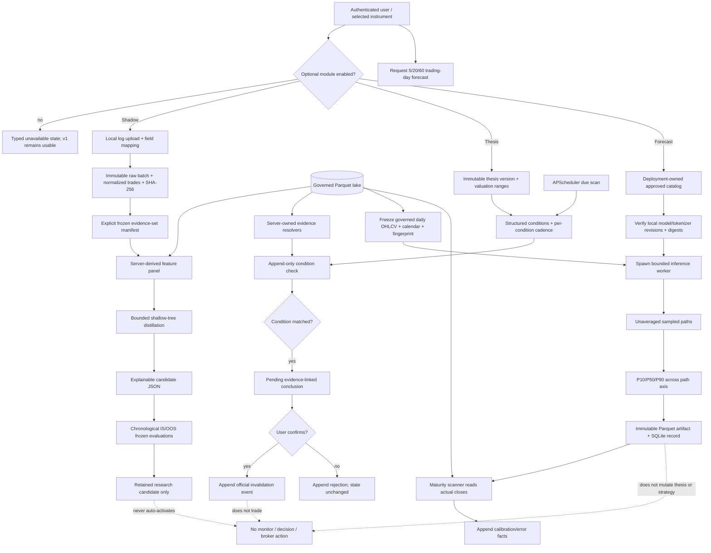

# Phase 05: Optional Enhancements - Research

**Researched:** 2026-07-15
**Domain:** 可选量化研究模块、不可变证据生命周期、Kronos 概率时序预测
**Confidence:** MEDIUM（现有架构与接缝为 HIGH；Kronos 官方资料经 README、源码、回归测试与模型仓库交叉核对，但本会话未执行模型推理，且外部依赖合法性 seam 均返回 SUS）

<user_constraints>
## User Constraints (from CONTEXT.md)

### Locked Decisions

### Shadow Account Strategy Distillation
- **D-01:** Actual trades enter through imported local execution logs. The initial workflow does not depend on broker connectivity or manual trade-by-trade entry.
- **D-02:** Every import is an immutable, attributable batch. Corrections or re-imports append a new batch and preserve the earlier evidence rather than editing or overwriting account history.
- **D-03:** Distillation produces an explainable strategy candidate whose inferred rules, features, parameters, source batches, and limitations are reviewable. A black-box behavior clone is not an acceptable retained result.
- **D-04:** Candidate retention requires frozen evidence plus explicit in-sample and out-of-sample evaluation. Full-sample fit or a single summary metric cannot establish eligibility, and retention does not activate monitoring or execution.

### Investment Thesis Lifecycle
- **D-05:** A thesis is immutable and versioned. New evidence or a changed core judgment creates a new version linked to its predecessor; prior valuation and reasoning remain auditable.
- **D-06:** Valuation anchors contain explicit assumptions and a value range. A single target price or link to an AI report is insufficient as the canonical anchor.
- **D-07:** Invalidation conditions are structured and machine-checkable. When evidence matches a condition, the system creates a pending, evidence-linked conclusion; only the user can confirm that the thesis is invalidated.
- **D-08:** Evidence-check cadence is configured per condition rather than by one global schedule. Each completed check appends its evidence, result, and time to the active thesis version without rewriting earlier checks.

### Kronos Forecast Delivery
- **D-09:** The first forecast workflow is object-bound to one A-share instrument and uses governed daily OHLCV data. It exposes bounded 5-, 20-, and 60-trading-day horizons rather than adding intraday or portfolio-batch forecasting.
- **D-10:** Every result visibly presents fixed P10/P50/P90 quantiles and a bounded set of inspectable sampled paths. The interface may emphasize an uncertainty band, but it cannot hide the sampled paths required by `FORE-01`.
- **D-11:** Models come from a deployment-owned approved checkpoint catalog. A run freezes the selected model and tokenizer identities, immutable revisions, and integrity digests; it never follows an unpinned remote `latest` checkpoint.
- **D-12:** Forecasts are immutable research records containing the governed input fingerprint, resolved horizon and sampling configuration, checkpoint provenance, quantiles, and sampled paths. As horizons mature, actual outcomes and calibration/error evidence append to the original record; forecasts do not automatically mutate a thesis, strategy, decision plan, monitor, or market action.

### Claude's Discretion
- Exact import formats and field mapping UI, duplicate-trade identity rules, distillation algorithm, candidate schema, and evaluation metrics are open to planning provided D-01 through D-04 remain enforceable and auditable.
- Exact thesis schema, supported valuation assumptions, condition language, scheduler mechanism, and evidence-check presentation are open provided versioning and user confirmation remain authoritative.
- Exact Kronos package boundary, optional dependency packaging, approved-checkpoint manifest format, model capacity defaults, sample count, resource limits, artifact format, chart composition, and asynchronous task mechanics are open provided D-09 through D-12 and the single-container/independent-module constraints hold.

### Deferred Ideas (OUT OF SCOPE)

None — discussion stayed within Phase 05 scope.
</user_constraints>

<phase_requirements>
## Phase Requirements

| ID | Description | Research Support |
|---|---|---|
| SHDW-01 | User can derive and evaluate strategies from a Shadow Account built from actual trading logs. | 不可变导入批次、原始工件与规范化成交事实、可解释浅层树蒸馏、时间顺序样本内/样本外冻结评估、候选保留而不激活。 |
| THES-01 | User can track investment theses, valuation anchors, invalidation conditions, and periodic evidence checks. | 不可变版本链、带假设的估值区间、受限条件 AST、每条件调度游标、追加式检查与人工确认事件。 |
| FORE-01 | Researcher can request Kronos time-series forecasts with quantiles, sampled paths, and model checkpoints. | 受治理日线输入、部署所有的固定 checkpoint 目录、保留未平均样本路径的 Kronos 适配器、P10/P50/P90、受限任务、不可变预测与后续校准。 |
</phase_requirements>

## Summary

[VERIFIED: codebase] 当前 AthenaQuant 已把市场时序限定在 Parquet/DuckDB/Polars，运行状态和不可变研究事实放在同一个 `operational.db`，并已有 `FrozenPanelArtifactStore`、`StrategyBacktestService`、Phase 2 实验目录、Phase 3 人工确认生命周期、Phase 4 进程级资源限制与安全投影。三个 Phase 05 模块应复用这些接缝，但必须分别拥有 `shadow`、`theses`、`forecast` 域，不能把职责继续堆进 `KlineRepository`、回测引擎、分析仓库或统一 API 客户端。

[CITED: https://github.com/shiyu-coder/Kronos/tree/67b630e67f6a18c9e9be918d9b4337c960db1e9a] Kronos 官方模型先把 OHLCV K 线量化为离散 token，再自回归生成未来路径；官方 `KronosPredictor.predict()` 最终返回一条 DataFrame 路径。[CITED: https://github.com/shiyu-coder/Kronos/blob/67b630e67f6a18c9e9be918d9b4337c960db1e9a/model/kronos.py] 关键限制是上游 `auto_regressive_inference()` 虽并行生成 `sample_count` 条样本，却在返回前沿样本轴求均值。因此直接调用公开 `predict()` 不能满足 D-10/FORE-01；本阶段必须在固定上游 revision 上加一个窄适配器，保留未平均的样本 tensor，再在服务端计算固定 P10/P50/P90。

**Primary recommendation:** [RECOMMENDED] 先建立共享的不可变事实/工件、模块能力探测和测试合同，再并行交付 Shadow、Thesis、Forecast 三条纵向切片；Forecast 默认采用本地预装、完整性校验、`local_files_only` 的 Kronos-mini 目录，所有长任务从父进程冻结输入后进入受限 spawn 子进程，三个模块都只产生研究记录或待确认结论，绝不激活既有 v1 行为。

## Architectural Responsibility Map

| Capability | Primary Tier | Secondary Tier | Rationale |
|---|---|---|---|
| 本地成交日志选择、字段映射预览 | Browser / Client | API / Backend | [RECOMMENDED] 浏览器只选择文件和映射；后端验证、归一化、归属和指纹，避免客户端成为证据权威。 |
| 不可变导入批次与规范化成交事实 | API / Backend | Database / Storage | [VERIFIED: codebase] SQLite 不可变触发器和 managed artifact 已是研究事实模式。 |
| Shadow 特征构造、蒸馏与评估 | API / Backend | Database / Storage | [RECOMMENDED] 服务端从 governed lake 取特征，冻结后由受限 worker 计算；前端不得提交规则结论。 |
| 论点版本、估值锚、失效条件 | API / Backend | Database / Storage | [VERIFIED: codebase] Phase 3/4 已采用服务端版本链、事件派生官方状态。 |
| 每条件检查调度 | API / Backend | Database / Storage | [VERIFIED: codebase] 同容器已有 APScheduler；SQLite 持久游标负责重启恢复，调度器不是证据。 |
| Kronos checkpoint 目录与安装状态 | API / Backend | CDN / Static — 不使用 | [RECOMMENDED] 部署拥有本地目录；运行时禁用远程 latest 和自动下载。 |
| governed OHLCV 与未来交易日索引 | Database / Storage | API / Backend | [VERIFIED: codebase] OHLCV 从 `KlineRepository` 读；[RECOMMENDED] 未来 session 必须由同一 governed lake 中的 CN-A 交易日历提供。 |
| Kronos 推理、路径与分位数 | API / Backend | Database / Storage | [RECOMMENDED] 子进程推理；路径/分位数是时序工件，写不可变 Parquet，SQLite 只存元数据与校验摘要。 |
| 预测/论点/候选可视化 | Browser / Client | API / Backend | [VERIFIED: codebase] TanStack Query、ECharts、对象局部缓存与现有 Backtest/Analysis 工作区已提供模式。 |

## Standard Stack

### Core — 已存在且必须复用

| Library / Contract | Version | Purpose | Why Standard |
|---|---:|---|---|
| Python | `>=3.11` | 后端与 worker runtime | [VERIFIED: `backend/pyproject.toml`] 项目约束；本机为 3.11.2。 |
| FastAPI / Pydantic | `fastapi>=0.115`, `pydantic>=2.7` | 严格请求、服务端 DTO、模块 503/404 边界 | [VERIFIED: codebase] 所有现有 Phase 2–4 API 使用该模式。 |
| Polars / DuckDB / PyArrow | `polars>=1.0`, `duckdb>=1.0`, `pyarrow>=16.0` | governed 数据读取、特征、不可变 Parquet 工件 | [VERIFIED: `backend/pyproject.toml`] 保持唯一时序边界。 |
| SQLite migrations | stdlib `sqlite3` | 批次、版本、任务游标、事实、血缘 | [VERIFIED: `backend/app/operational/migrations.py`] 单库、参数化、触发器保护。 |
| APScheduler | `>=3.10`（lock 为 3.11.2） | 每条件 due-check 与成熟预测校准扫描 | [VERIFIED: codebase] 已在同一 FastAPI lifespan 内启动并可优雅降级。 |
| Existing backtest contracts | repository source | Shadow 候选样本内/外评估 | [VERIFIED: codebase] `StrategyBacktestService`、`FrozenPanelArtifactStore` 与 `GovernedExperimentRunner` 已具输入冻结和进程限制模式。 |
| React / TanStack Query / ECharts | React 18.3, Query 5.55, ECharts 5.5 | 对象局部 UI、路径图、历史与不可用态 | [VERIFIED: `frontend/package.json`] 不增加第二套客户端状态或图表库。 |

### Optional — 仅对应 extra 启用

| Library / Asset | Reviewed version/revision | Purpose | Packaging decision |
|---|---|---|---|
| scikit-learn | `1.8.0`（当前 lock 已包含） | 受限深度的 `DecisionTreeClassifier`，导出 if/then 规则后丢弃 estimator | [CITED: https://scikit-learn.org/stable/modules/tree.html] 白盒树能导出简单规则且应通过 `max_depth`/`min_samples_leaf` 抑制过拟合。[WARNING: legitimacy seam returned SUS — planner must add human verification checkpoint.] |
| Kronos source | Git commit `67b630e67f6a18c9e9be918d9b4337c960db1e9a` (2026-04-13) | 模型、tokenizer、采样实现 | [CITED: https://github.com/shiyu-coder/Kronos/commit/67b630e67f6a18c9e9be918d9b4337c960db1e9a] 仓库没有可直接安装的 Python project metadata；推荐 vendored reviewed source + MIT LICENSE + upstream sync manifest，而非运行时 clone。 |
| Kronos-mini | model rev `f4e68697d9d5aed55cef5c96aabc3376bcad9f81`; weight SHA-256 `a7d5f37e…f54197c` | 默认 CPU 模型，4.1M 参数、2048 context | [CITED: https://huggingface.co/api/models/NeoQuasar/Kronos-mini] 约 16.4 MB 权重；适合作为单容器默认。 |
| Kronos-Tokenizer-2k | rev `26966d0035065a0cae0ebad7af8ece35bc1fb51c`; weight SHA-256 `b97ec46b…9a8717` | 与 mini 配对 | [CITED: https://github.com/shiyu-coder/Kronos#model-zoo] 官方配对，不能与 base tokenizer 互换。 |
| Kronos-small（可选目录项） | model rev `901c26c1332695a2a8f243eb2f37243a37bea320`; weight SHA-256 `b082dfcb…3c3e020` | 可选 24.7M 参数模型、512 context | [CITED: official README and Hugging Face API] 官方回归测试也固定该 revision。 |
| Kronos-Tokenizer-base（可选目录项） | rev `0e0117387f39004a9016484a186a908917e22426`; weight SHA-256 `59d85f6a…fc6bee` | small/base 配套 tokenizer | [CITED: official regression test and Hugging Face API] revision 与完整性摘要均可冻结。 |
| torch / einops / huggingface-hub / safetensors / tqdm | 上游要求：`torch>=2.0`, `einops==0.8.1`, `huggingface_hub==0.33.1`, `safetensors==0.6.2`, `tqdm==4.67.1` | CPU tensor、模型结构、固定 revision 下载/本地加载、安全权重、进度依赖 | [CITED: https://github.com/shiyu-coder/Kronos/blob/67b630e67f6a18c9e9be918d9b4337c960db1e9a/requirements.txt] 放入 `forecast` extra；运行时只允许本地文件。所有包被 legitimacy seam 标为 SUS，须人工核验后锁定。 |

### Alternatives Considered

| Instead of | Could Use | Tradeoff |
|---|---|---|
| 浅层决策树蒸馏 | 自写阈值/beam search | [RECOMMENDED AGAINST] 自写学习器增加数值、稳定性和解释导出负担；树只保留导出的受限 JSON 规则，不保留 pickle。 |
| Kronos-mini 默认 | Kronos-small 默认 | [RECOMMENDED] small 是官方测试路径但 context 仅 512、权重更大；mini 更符合无 GPU单容器。small 作为显式目录项保留。 |
| vendored 固定 Kronos source | `git+https` 动态安装 | [RECOMMENDED AGAINST] 上游无 Python packaging metadata，动态 branch 也违背 D-11。 |
| 本地 checkpoint | 每次 `from_pretrained(repo_id)` 联网 | [RECOMMENDED AGAINST] 运行时网络、moving ref、缓存漂移和失败恢复都破坏可复现性。 |
| Parquet 路径工件 | 把全部路径 JSON 塞入 SQLite | [RECOMMENDED] 路径是时序结果，应留在 managed Parquet；SQLite 只保存不可变 descriptor、配置、血缘和校验事实。 |
| 现有全局 scheduler 时间 | 每论点一个全局 cadence | [RECOMMENDED AGAINST] D-08 要求条件级 cadence；调度器只扫描持久 due cursor。 |

**Recommended extras:**

```toml
# backend/pyproject.toml — recommendation, not yet implemented
[project.optional-dependencies]
shadow = ["scikit-learn==1.8.0"]
forecast = [
  "torch>=2.0,<3",
  "einops==0.8.1",
  "huggingface-hub==0.33.1",
  "safetensors==0.6.2",
]
```

[RECOMMENDED] `tqdm` 与 `pandas` 已在解析后的项目依赖图中；不要为 Kronos 引入上游示例专用的 `matplotlib`，前端继续用 ECharts。[VERIFIED: codebase] `Dockerfile` 与 Compose 已支持空格分隔 `BACKEND_EXTRAS`，故默认镜像不携带 Shadow/Forecast 重依赖，启用时仍是同一个 service/container：

```bash
BACKEND_EXTRAS="shadow forecast" docker compose build
```

## Package Legitimacy Audit

> [VERIFIED: gsd package-legitimacy seam + PyPI registry] 所有候选包都存在于正确的 PyPI 生态；seam 因“当前最新发布过新 / 无法取得下载量 / 无 repo 字段”等信号给出 SUS。协议要求 planner 在安装前加入 `checkpoint:human-verify`，即使包来自官方文档也不能跳过。

| Package | Registry current / project target | Age / Source | Downloads signal | Verdict | Disposition |
|---|---|---|---|---|---|
| scikit-learn | PyPI 1.9.0 / target 1.8.0 | 2012 起；https://github.com/scikit-learn/scikit-learn | seam unknown | SUS | Flagged — human verify; reuse existing lock 1.8.0 |
| torch | PyPI 2.13.0 / upstream `>=2.0,<3` | 2018 起；https://github.com/pytorch/pytorch | seam unknown | SUS | Flagged — verify CPU wheel/index and lock resolution |
| einops | PyPI 0.8.2 / upstream 0.8.1 | 2018 起；https://github.com/arogozhnikov/einops | seam unknown | SUS | Flagged — pin 0.8.1 |
| huggingface-hub | PyPI 1.23.0 / upstream 0.33.1 | 2020 起；https://github.com/huggingface/huggingface_hub | seam unknown | SUS | Flagged — pin 0.33.1 and offline load only |
| safetensors | PyPI 0.8.0 / upstream 0.6.2 | 2022 起；https://github.com/huggingface/safetensors | seam unknown | SUS | Flagged — pin 0.6.2 |
| tqdm | PyPI 4.68.4 / existing lock 4.67.3 | established; PyPI source metadata lacks repo | seam unknown | SUS | Flagged — keep compatible existing lock; no separate extra entry |

**Packages removed due to SLOP verdict:** none.

**Packages flagged as suspicious [SUS]:** `scikit-learn`, `torch`, `einops`, `huggingface-hub`, `safetensors`, `tqdm`. Planner must place a human verification checkpoint before changing locks or building optional images.

## Architecture Patterns

### System Architecture Diagram



### Recommended Project Structure

```text
backend/app/
├── shadow/
│   ├── schemas.py          # import map, normalized fill, evidence set, candidate DTO
│   ├── artifacts.py        # raw batch bytes + immutable descriptors
│   ├── repository.py       # batch/trade/candidate/evaluation SQLite facts
│   ├── importer.py         # CSV/XLSX validation and normalization
│   ├── distillation.py     # bounded tree -> allowlisted JSON rules
│   ├── evaluation.py       # frozen IS/OOS collaborator over existing backtest
│   ├── service.py
│   ├── projections.py
│   └── api.py
├── theses/
│   ├── schemas.py          # thesis version, valuation anchor, condition AST/cadence
│   ├── repository.py       # versions/checks/reviews/events/schedule cursor
│   ├── evidence.py         # governed market/financial/analysis resolvers
│   ├── conditions.py       # fixed allowlist evaluator
│   ├── scheduler.py        # due scan only
│   ├── service.py
│   ├── projections.py
│   └── api.py
├── forecast/
│   ├── catalog.py          # deployment-owned manifest + availability
│   ├── calendar.py         # governed future CN-A sessions
│   ├── input.py            # KlineRepository adapter + fingerprint/freeze
│   ├── kronos_adapter.py   # pinned source boundary; unaveraged paths
│   ├── runner.py           # spawn/process group/rlimits/bounded result
│   ├── artifacts.py        # immutable forecast Parquet
│   ├── repository.py       # jobs, records, outcome/calibration facts
│   ├── calibration.py
│   ├── projections.py
│   └── api.py
└── operational/migrations.py
frontend/src/
├── pages/backtest/ShadowAccount.tsx
├── components/analysis/ThesisPanel.tsx
├── components/analysis/ForecastPanel.tsx
├── lib/api.ts
└── lib/queryKeys.ts
backend/tests/
├── shadow/
├── theses/
└── forecast/
frontend/e2e/phase5-optional-enhancements.spec.ts
```

### Pattern 1: Immutable import batch plus explicit evidence set

**What:** [RECOMMENDED] 每次上传都生成新 `batch_id`；先将原始 bytes 写入服务器生成路径并记录 `sha256/size/media_type/original_name/importer_version/principal/created_at`，再在同一事务写规范化 rows 与诊断。即使内容 SHA 相同也不复用 batch；只标记 `same_content_as`。修正通过 `supersedes_batch_id` 或新的 evidence-set manifest 表达，不删除旧事实。

**Duplicate rule:** [RECOMMENDED] 不删除重复行。优先以 broker execution/fill ID 生成 `trade_identity`; 缺失时基于规范化 `account_alias + symbol + side + executed_at(Asia/Shanghai) + quantity + price + fees + row ordinal` 生成稳定 row identity，同时另存不含 row ordinal 的 `duplicate_group_hash` 供 UI 审阅。分批成交必须保持多行。

**Import formats:** [RECOMMENDED] 第一版只接受 UTF-8/GB18030 CSV 与 XLSX；复用 `python-multipart`、Polars 和已存在的 `fastexcel`。限制文件大小、行数、列数和单元格长度；字段映射必须至少解析 symbol、side、executed_at、quantity、price，并显式记录 currency/fees/account/source timezone。解析失败形成不可执行批次诊断，不能部分静默入选。

### Pattern 2: Explainable candidate is exported rules, not a model blob

[CITED: https://scikit-learn.org/stable/modules/tree.html] `DecisionTreeClassifier` 可以学习简单 if/then 规则，但深树会过拟合且对数据扰动不稳定，因此官方建议限制深度、叶节点最小样本并处理类别不均衡。

[RECOMMENDED] 从导入成交的 entry 时点构造正例，并从相同标的/冻结窗口内按确定性 seed 抽取未成交候选日作为负例；只允许 Phase 2 DSL / enriched allowlist 中的数值字段。使用 `max_depth<=3`、固定 seed、`class_weight="balanced"`、最小叶样本阈值。训练后立即把每条叶路径导出为版本化 JSON（字段、运算符、阈值、支持度、precision/recall），重新通过固定 allowlist 编译；不保存 sklearn pickle，不允许任意 Python。

[RECOMMENDED] 候选 schema 至少包含：`candidate_id`, `distiller_version`, `rule_schema_version`, `entry_rules`, `exit/holding assumptions`, `features`, `parameters`, `source_batch_ids`, `evidence_set_fingerprint`, `training_window`, `seed`, `class_balance`, `limitations`, `created_at`。没有足够 exit evidence 时必须把 exit/holding 作为显式限制与参数，不能声称从行为中推断完成。

### Pattern 3: Chronological IS/OOS gate, not fit score

[VERIFIED: codebase] `GovernedExperimentRunner` 已从独立窗口生成样本内/外 evidence，并在父进程冻结 panel 后由子进程消费；`EvolutionService` 已把 `in_sample_out_of_sample_evidence` 作为独立 gate。

[RECOMMENDED] Shadow 使用时间顺序切分（按交易日与批次时间），禁止随机 row split。冻结三份标识：完整 feature panel、IS window、OOS window。至少展示 precision/recall、coverage、候选成交数、收益/回撤/成本后指标和与实际成交行为的一致度；保留资格要求两段都完成且达到显式阈值，不能由 full-sample 指标代替。保留只写 `retained_shadow_candidate` 事实，不写 strategy dirs、monitor rules、playbook 或 position。

### Pattern 4: Thesis official state is derived from immutable events

[VERIFIED: codebase] `AnalysisRepository`/`LifecycleRuleService` 已实现 evidence-linked pending review、服务端 reviewer principal、confirm/reject 事件和派生官方状态；`ViewpointService` 已实现版本链与校正不覆盖。

[RECOMMENDED] 新 thesis version 原子写入：核心判断、理由、至少一个 valuation anchor（method/currency/as_of/low/high/assumptions）、条件列表、`supersedes_version_id`。官方状态由最新已确认事件派生，不能更新版本行。新版本激活后旧版本 schedule cursor 停止，但旧 check/history 仍可读。

[RECOMMENDED] condition AST 使用固定 schema，而非自由文本或 Phase 2 factor DSL：`source_kind` (`market`, `financial`, `analysis`)、`field`, `operator`, typed threshold/range, unit, period/lookback, cadence (`daily|weekly|monthly|quarterly`), timezone。每个 source kind 有独立字段/运算符白名单。检查结果枚举 `matched|not_matched|insufficient_evidence|error`；只有 `matched` 创建 pending conclusion，且用户确认前 thesis official state 不变。

### Pattern 5: Scheduler is a recovery cursor, never evidence authority

[RECOMMENDED] `thesis_condition_schedule` 是少数可更新的运行游标，受 trigger 限制只允许单调推进 `next_due_at/lease_until`；`thesis_condition_checks`、evidence refs、pending conclusions、confirm/reject events 全部禁止 UPDATE/DELETE。唯一键 `(condition_id, due_at)` 防止重启重复。scheduler 每次只扫描有限数量 due rows，先租约，再调用服务；失败写 check/error 事实并推进到下一 cadence，不阻塞 v1 scheduler。

[RECOMMENDED] 成熟 forecast 的校准扫描使用相同模式：游标只负责发现 due horizon，真正 outcome/calibration 是 `(forecast_id,horizon)` 唯一的追加事实。

### Pattern 6: Approved catalog + offline checkpoint verification

[CITED: https://huggingface.co/docs/huggingface_hub/package_reference/file_download] Hugging Face `revision` 可为 commit hash，`local_files_only=True` 可禁止网络并只从本地 cache/dir 读取；缓存对象以 git SHA 或 LFS SHA-256 标识。

[RECOMMENDED] deployment manifest 每项固定：catalog id、Kronos source revision、model repo/revision/weight sha256、tokenizer repo/revision/weight sha256、pairing、max_context、allowed devices、local dirs。lifespan 只进行轻量目录/摘要检查，不 import torch、不下载；缺失时 `forecast_available=false`，其余模块正常。task worker 使用本地路径调用 `from_pretrained(local_path)`，并显式 `local_files_only`/无 `trust_remote_code`。

### Pattern 7: Preserve paths before quantiles

[CITED: official Kronos source] 上游把输入扩为 `sample_count`，生成后 reshape 成 `[batch, sample_count, time, feature]`，随后 `np.mean(axis=1)`。[RECOMMENDED] reviewed adapter 在 mean 前返回 tensor；记录 seed、T、top_k、top_p、sample_count。固定 `sample_count=32`、最大 32，UI 最多展示 12 条可选择路径，但 immutable artifact 保存全部 32 条以支持分位数和校准。P10/P50/P90 按每个 future date、每个 feature 沿 path 轴计算，不能从均值路径估算。

[RECOMMENDED] 默认 mini 使用最近最多 512 个 governed daily rows（虽然模型 context 可到 2048，先限制资源）；horizon 仅 `5|20|60`。模型输出 NaN/Inf 或 shape 错误时失败且不创建 forecast record；OHLC 关系或负 volume 违规不得静默 clamp，应写 `validation_warnings` 并在 UI 显示。Close uncertainty band 是主图，所有 sampled paths 仍可检查。

### Pattern 8: Forecast task freezes everything before spawn

[VERIFIED: codebase] `KlineRepository` 持有不可序列化 DuckDB connection；现有 governed runner 使用父进程加载/冻结数据、spawn 子进程、进程组终止、RLIMIT 与紧凑结果 Queue。

[RECOMMENDED] 父进程完成授权、instrument 解析、calendar/session 解析、OHLCV 读取、排序/唯一性/coverage 校验、输入 Parquet 与 fingerprint；子进程只收到 artifact reference、目录 catalog entry 和数值配置。默认全局并发 1、wall clock 120s、memory 2 GiB、CPU threads 2，均作为部署配置并冻结进 run。超时/OOM/模型缺失/摘要不符形成安全 terminal job，不创建伪 forecast。

### Pattern 9: Later calibration appends to the original identity

[RECOMMENDED] forecast record 不变；5/20/60 到期后，从 `KlineRepository` 读取 forecast origin 后第 N 个 governed session 的 actual OHLCV，并追加 outcome。每 horizon 计算 close 的 median absolute error、P10–P90 interval coverage、P10/P50/P90 pinball loss；聚合 calibration 必须展示样本数与 coverage period。缺价时追加 `unevaluable/missing_actual` 检查或保持 due，绝不用 0，也不回写预测。

### Anti-Patterns to Avoid

- **将 re-import 当 upsert：** 违反 D-02，且失去纠错审计链；必须新 batch + lineage。
- **按内容 hash 去重并返回旧 batch：** hash 只能检测相同内容，不能抹掉用户明确进行的新导入事实。
- **保存 sklearn estimator/pickle：** 黑盒、供应链与版本漂移；只保存验证过的规则 JSON。
- **随机 IS/OOS split：** 对时序产生泄漏；按不可交叠日期窗口切分。
- **把“retained”写入 StrategyEngine/Monitor：** D-04 明确禁止自动激活。
- **把 valuation anchor 存成单个 target：** D-06 要求区间与假设。
- **scheduler 直接失效 thesis：** D-07 只允许 pending + user confirm。
- **一条全局 thesis cadence：** 违反 D-08。
- **未来日期用 `pandas.bdate_range`：** 中国节假日会让 trading-day horizon 错位；必须使用 governed CN-A session dataset。
- **直接用 `KronosPredictor.predict(sample_count=32)` 当 32 paths：** 官方实现返回平均路径，不能满足 FORE-01。
- **运行时跟随 HF `main/latest`：** 违反 D-11；目录、revision、digest 均必须匹配。
- **预测路径全部写 SQLite JSON：** 破坏既有时序/工件边界；路径和 quantiles 写 immutable Parquet。
- **为 Forecast 启动第二容器/队列：** 不需要；使用同容器受限子进程和 SQLite job cursor。
- **从浏览器接受 evidence fingerprint、checkpoint digest、quantile 或 lifecycle verdict：** 客户端只选 bounded input；权威值全部服务端解析。

## Don't Hand-Roll

| Problem | Don't Build | Use Instead | Why |
|---|---|---|---|
| CSV/XLSX 解析 | 自写 delimiter/Excel parser | Polars + fastexcel + Pydantic mapping | [VERIFIED: codebase] 依赖已存在，能统一类型/空值诊断。 |
| 规则学习 | 自写搜索优化器 | 受限 scikit-learn shallow tree + 导出规则 | [CITED: sklearn docs] 白盒、可约束、可复现。 |
| 因子/条件任意执行 | `eval`, Python source, arbitrary Polars | 现有 Factor DSL allowlist 思路 + thesis 专用固定 AST | [VERIFIED: codebase] 已有安全编译模式。 |
| Shadow 回测 | 新回测引擎 | Existing BacktestEngine/StrategyBacktest semantics + frozen collaborator | 避免费用、撮合、warmup 语义分叉。 |
| 不可变工件 | 手工随机文件名和裸路径 | `FrozenPanelArtifactStore`/`EvaluationArtifactService` 模式 + SHA-256 descriptor | 防路径穿越、篡改和不完整写入。 |
| 人工确认生命周期 | mutable status column | Phase 3 pending review + confirm/reject event pattern | 官方状态可派生且并发安全。 |
| 外部 scheduler/queue | Redis/Celery/第二服务 | APScheduler + SQLite due cursor + bounded in-process dispatch | 保持单容器和无外部队列。 |
| Checkpoint 下载器 | curl/git clone/latest | Hugging Face fixed revision prefetch + local digest catalog | 防 moving ref 和运行时网络漂移。 |
| Quantile “模拟” | 在平均预测上加百分比 | 未平均真实 sampled paths 上的固定 quantile | D-10 的不确定性必须来自样本分布。 |
| Worker 限制 | 仅 `asyncio.wait_for` | 现有 spawned process-group + RLIMIT + kill/cleanup | Python timeout 不能可靠回收 native torch/BLAS。 |
| 新图表/状态库 | 第二套 chart/store | ECharts + TanStack Query + `QK` | 保持现有 UI 约定和对象局部缓存。 |

**Key insight:** [RECOMMENDED] 本阶段真正需要新增的是三个领域合同和一个 Kronos “保留样本轴”适配器；数据治理、不可变事实、回测、调度、任务进程和 UI 状态机制都已有成熟先例，不应复制。

## Concrete Data Contracts

### Shadow records

| Record | Required immutable fields | Mutable fields |
|---|---|---|
| `shadow_import_batches` | id, principal, raw artifact descriptor, content sha256, source label, importer/mapping version, supersedes id, row counts, diagnostics, created_at | none |
| `shadow_trade_facts` | batch id, row identity, duplicate group, account alias, symbol, side, executed_at, qty, price, fees/currency, source row, normalized payload | none |
| `shadow_evidence_sets` | included batch ids, explicit exclusions/reasons, resolved trade ids, fingerprint | none |
| `shadow_candidates` | rule JSON, features, params, source/evidence fingerprint, seed, limitations, distiller/schema versions | none |
| `shadow_candidate_evaluations` | candidate id, split kind, window, governed fingerprint, metrics, artifact refs, terminal status | none |
| `shadow_retention_events` | candidate id, IS/OOS evaluation ids, reviewer, rationale, created_at | none; no activation relation |

### Thesis records

| Record | Required immutable fields | Mutable fields |
|---|---|---|
| `theses` | id, instrument, created_by, created_at | none |
| `thesis_versions` | version, predecessor, judgment/rationale, created_at | none |
| `thesis_valuation_anchors` | method, currency, as_of, low/high, assumptions JSON, limitations | none |
| `thesis_conditions` | version id, source/field/op/threshold/unit/lookback, cadence/timezone | none |
| `thesis_condition_checks` | condition/version/due_at, evidence refs+fingerprint, result, observed values, checked_at | none |
| `thesis_pending_conclusions` | check id, proposed state/reason | none |
| `thesis_review_events` | pending id, confirm/reject, server principal, rationale, time | none |
| `thesis_condition_schedule` | condition id, next_due_at, lease_until, last_attempt | monotonic cursor only; not business evidence |

### Forecast records

| Record | Required immutable fields | Mutable fields |
|---|---|---|
| `forecast_jobs` | id, instrument, requested horizon/catalog id, created_at | guarded queued→running→terminal cursor only |
| `forecast_records` | job id, as_of/session ids, governed input fingerprint+artifact, horizon, lookback, seed/T/top_k/top_p/sample_count, source/model/tokenizer revisions and digests, output descriptor, validation warnings, created_at | none |
| `forecast_outcomes` | forecast id, horizon, actual session/value/fingerprint, outcome status, observed_at | none; unique per forecast+horizon terminal outcome |
| `forecast_calibration_facts` | forecast/outcome ids, metric schema, errors/coverage/pinball, created_at | none |

[RECOMMENDED] 所有事实表添加 `BEFORE UPDATE/DELETE RAISE(ABORT)`；只对 job/schedule cursor 写窄 transition trigger。外键全部 `ON DELETE RESTRICT`。

## Likely Files and Symbols

| Existing file/symbol | Planned use | Constraint |
|---|---|---|
| `backend/app/tickflow/repository.py::KlineRepository.get_daily/get_daily_asset` | Shadow features、Forecast OHLCV、Thesis market checks、maturity actuals | [VERIFIED: codebase] 只能读 governed data；不要把新域方法塞进 repository。 |
| `backend/app/backtest/frozen_panel.py::FrozenPanelArtifactStore` | Shadow/Forecast parent-side immutable panels | 校验 scope 和 panel checksum。 |
| `backend/app/backtest/strategy.py::StrategyBacktestService` | Shadow candidate evaluation semantics | 通过窄 collaborator；candidate 不注册、不监控。 |
| `backend/app/advanced/governed_runner.py::GovernedExperimentRunner` | Forecast/Shadow runner blueprint | 复用 spawn、process group、limits、bounded queue；不复用不匹配的 advanced authorization asset contract。 |
| `backend/app/advanced/evolution.py::EvolutionService` | IS/OOS gate precedent | 不把 Shadow 自动送 promotion。 |
| `backend/app/analysis/lifecycle.py::LifecycleRuleService` | Thesis pending/confirm/reject precedent | Thesis 拥有自己的 condition schema 与表。 |
| `backend/app/analysis/evidence_loader.py::GovernedEvidenceLoader` | Thesis evidence resolver patterns | 只从 governed market/financial/operational sources生成事实。 |
| `backend/app/advanced/viewpoints.py::ViewpointService` | version/supersedes/correction/evaluation precedent | 不与 viewpoint 概念混表。 |
| `backend/app/operational/migrations.py::MIGRATIONS` | 三域表、索引、immutable triggers | Wave 0 最先落合同。 |
| `backend/app/main.py::lifespan` | 可选 module factory、availability、scheduler registration | Forecast 缺依赖/模型必须降级，不阻塞 v1 startup。 |
| `backend/app/analysis/api.py`, `advanced/api.py` | scope、safe projection、503/404 precedent | opaque id 先解析到 instrument 再授权。 |
| `frontend/src/lib/api.ts` | 公开 DTO/request methods | 继续统一入口；用 allowlisted interface，避免 `any` 新扩散。 |
| `frontend/src/lib/queryKeys.ts::QK` | `shadow/*`, `thesis/{instrument}`, `forecast/{instrument}` keys | 对象、版本、record id 都进入 key。 |
| `frontend/src/pages/Backtest.tsx` | Shadow Account panel | 不新建顶级 shell。 |
| `frontend/src/components/analysis/AnalysisWorkspace.tsx` / `StockAnalysis.tsx` | Thesis + Forecast panels | instrument object-first；Portfolio 不启用 Forecast 第一版。 |
| `frontend/src/lib/useQuoteStream.ts` / QuoteService | bounded task progress | 仅 projection progress；完成后局部 invalidation。 |

## Failure Modes and Handling

### Shadow

1. **列映射错误/单位错误：** 价格、数量、金额字段混淆。→ 映射预览、有限值/正值检查、逐列单位确认，批次保留诊断但不进入 evidence set。
2. **partial fill 被“去重”：** 多行成交被合并。→ 保留每行、duplicate group 只提示；任何排除都写新 evidence-set manifest。
3. **时区和交易日漂移：** 夜间导出时间被错误归日。→ source timezone 明示并规范为 Asia/Shanghai；保留原始值。
4. **公司行为/复权语义不一致：** 实盘成交价与回测 adjusted series 混比。→ candidate evaluation 记录 data adjustment policy，展示 limitation，不静默混用。
5. **只有正例：** 无法学习进入规则。→ 从同标的 governed window 以固定 seed 构造负例，记录采样规则与 class balance。
6. **树过拟合/不稳定：** full-sample 看似优秀，OOS 失败。→ 深度/叶样本限制、时间 split、规则稳定性和 OOS gate；失败可审计但不可 retain。
7. **保留触发执行：** retention 被误接 monitor。→ schema/API 中不提供 activation 字段或关系；集成测试断言无 monitor/playbook/position side effect。

### Thesis

1. **版本更新覆盖旧 anchor：** 使用 UPDATE。→ 新 version + predecessor，trigger 禁更新。
2. **估值 anchor 只有 target：** 不满足 D-06。→ low/high/currency/as_of/assumptions 全部必填且 `high>=low`。
3. **自由文本 condition 假装机器可检查：** → 文本可作说明，但执行仅依赖 typed AST。
4. **缺失证据被当 false/zero：** → `insufficient_evidence`，不创建 invalidation proposal。
5. **重复 scheduler 执行：** → `(condition_id,due_at)` unique + lease；pending proposal 对 check 唯一。
6. **旧版本仍调度：** → due scan 只选当前 active version；历史 check 不删除。
7. **自动失效：** → match 只能 pending；confirm 使用 server principal 并重检当前 official state。

### Forecast

1. **model/tokenizer 错配：** → catalog pairing 固定且 startup/task 前双重校验。
2. **moving remote revision：** → 本地目录 + revision/digest；运行时不联网。
3. **平均路径误作样本集：** → adapter 在 `np.mean` 前截获 path axis；合同测试断言 path 数量与 quantile 来源。
4. **中国节假日错位：** → governed `market_calendar` future sessions；不足 60 sessions 则 fail closed。
5. **输入 gaps/重复/未来泄漏：** → as_of 截断、按 date 唯一排序、coverage 与 schema 检查、fingerprint 全部冻结。
6. **torch 占满内存/线程：** → 单 active task、spawn、RLIMIT、wall clock、thread env、父进程 kill/cleanup。
7. **子进程返回巨大对象：** → worker 写临时 artifact，Queue 只返回 capped manifest；父进程校验后原子 rename。
8. **异常 OHLCV 被修饰：** → finite/shape 硬失败，经济不变量写 warning，不 clamp 原始研究输出。
9. **预测自动影响系统：** → forecast API 无 thesis/strategy/plan/monitor mutation collaborator；集成测试断言无副作用。
10. **成熟结果重复写：** → `(forecast_id,horizon)` 唯一 outcome/calibration；missing actual 显式记录。

## Recommended Wave Boundaries

| Wave | Independent slices | Exit contract |
|---:|---|---|
| 0 | 依赖人工合法性 checkpoint；三域 Pydantic/DTO；SQLite migrations/triggers；测试 fixtures；governed future calendar contract；Kronos source/checkpoint manifest contract | 三 requirement 的 RED 行为合同存在；默认 deployment 无 optional extras 仍可 import/start。 |
| 1 | **并行** Shadow immutable importer/artifacts/repository；Thesis version/valuation/condition repository；Forecast optional packaging/catalog/availability and vendored upstream sync manifest | 可写/读不可变基础事实；重复 UPDATE/DELETE 失败；缺模块给 typed unavailable。 |
| 2 | **并行** Shadow feature panel + explainable distiller；Thesis governed evidence resolver + condition evaluator；Forecast governed OHLCV/calendar freezer + unaveraged Kronos adapter | 纯领域逻辑完成，无 HTTP/UI；每条输出含 provenance/fingerprint。 |
| 3 | **并行** Shadow bounded IS/OOS evaluator/retention；Thesis per-condition scheduler + pending/confirm/reject；Forecast bounded runner + immutable path/quantile artifacts | 三条核心后端用户流程完成；无自动激活/交易副作用。 |
| 4 | **并行** Shadow API/safe projections；Thesis API/object authorization；Forecast API/SSE/reconnect/job recovery；lifespan optional registration | 认证、对象 scope、idempotency、503/unavailable、recovery 行为可验证。 |
| 5 | **并行 UI** Backtest `ShadowAccount`; Analysis `ThesisPanel`; Stock Analysis `ForecastPanel`; unified API/QK/SSE invalidation | 用户可从现有对象表面完成三条流程；sampled paths、历史、pending state 和不可用态可见。 |
| 6 | Maturity/calibration scheduler + metrics UI；单容器 optional Compose acceptance；no-live-execution regression | FORE later calibration 闭环完成；默认 v1 与各单独 extra 组合都保持独立可用。 |

[RECOMMENDED] Wave 1–5 内三个模块可并行；唯一共享前置是 Wave 0 migration/DTO/calendar/availability contract。不要把“校准”推到后续 phase：D-12 明确属于本阶段，只是实现依赖先有 immutable forecast。

## Validation Architecture

### Test Framework

| Property | Value |
|---|---|
| Backend | [VERIFIED: `backend/pyproject.toml`] pytest `>=8.0`, pytest-asyncio `>=0.23`; existing tests use FastAPI `TestClient` and tmp-path SQLite/artifacts。 |
| Frontend E2E | [VERIFIED: `frontend/package.json`] Playwright `1.61.1`，现有 Phase 3/4 API/SSE route fixtures。 |
| Config | `backend/pyproject.toml`, `frontend/playwright.config.ts` |
| Quick run | `cd backend && uv run pytest tests/shadow tests/theses tests/forecast -x`（planned path） |
| Full phase run | `cd backend && uv run pytest tests/shadow tests/theses tests/forecast tests/test_phase5_optional_host.py -x` + `cd frontend && pnpm exec playwright test e2e/phase5-optional-enhancements.spec.ts --project=desktop-chromium` |
| Optional real-model smoke | `cd backend && uv run --extra forecast pytest tests/forecast/test_kronos_regression.py -m kronos_model -x`，仅在人工核验并预装 pinned mini/tokenizer 后执行；常规 suite 不联网。 |

> 本研究任务按用户约束未运行任何测试、formatter、linter 或 project-wide command；上表是 planner 的执行架构，不是本次验证结果。

### Phase Requirements → Test Map

| Req ID | Behavior | Test Type | Automated command | File Exists? |
|---|---|---|---|---|
| SHDW-01 | 相同/修正导入仍追加 batch，原始 bytes/trades 不可变；解析失败不进入 evidence set | unit/integration | `uv run pytest tests/shadow/test_imports.py -x` | ❌ Wave 0 |
| SHDW-01 | partial fills 不被去重；显式 evidence manifest 决定纳入项 | unit | `uv run pytest tests/shadow/test_evidence_sets.py -x` | ❌ Wave 0 |
| SHDW-01 | candidate 仅含 allowlisted explainable rules/features/params/source/limitations，无 pickle/代码 | unit | `uv run pytest tests/shadow/test_distillation.py -x` | ❌ Wave 0 |
| SHDW-01 | retained gate 必须同时引用 non-overlap IS/OOS 完成记录；retention 不写 monitor/strategy/playbook | integration | `uv run pytest tests/shadow/test_evaluation_retention.py -x` | ❌ Wave 0 |
| THES-01 | 新判断/证据创建 predecessor version；旧 anchor/condition 不可变 | unit/integration | `uv run pytest tests/theses/test_versions.py -x` | ❌ Wave 0 |
| THES-01 | anchor 必须 range+assumptions；condition AST 拒绝字段/运算符注入 | unit | `uv run pytest tests/theses/test_contracts.py -x` | ❌ Wave 0 |
| THES-01 | 每 condition cadence、due idempotency、重启 recovery；checks append-only | integration | `uv run pytest tests/theses/test_scheduler.py -x` | ❌ Wave 0 |
| THES-01 | match 只 pending；server principal confirm 后 official invalidated，reject 不改变 | integration/API | `uv run pytest tests/theses/test_lifecycle.py -x` | ❌ Wave 0 |
| FORE-01 | catalog 拒绝 moving ref、错配 tokenizer、hash mismatch；missing module 不阻塞 v1 | unit/host | `uv run pytest tests/forecast/test_catalog.py tests/test_phase5_optional_host.py -x` | ❌ Wave 0 |
| FORE-01 | only governed daily stock OHLCV；horizon 仅 5/20/60；calendar sessions/fingerprint 冻结 | unit/integration | `uv run pytest tests/forecast/test_input.py -x` | ❌ Wave 0 |
| FORE-01 | adapter 返回 32 paths；P10/P50/P90 从 path axis 计算而非 averaged path | unit + pinned fixture | `uv run pytest tests/forecast/test_kronos_adapter.py -x` | ❌ Wave 0 |
| FORE-01 | timeout/memory/shape failure 无 forecast record；success artifact immutable且 manifest bounded | integration | `uv run pytest tests/forecast/test_runner.py -x` | ❌ Wave 0 |
| FORE-01 | maturity append actual、coverage/pinball/error，retry 不改原 forecast | integration | `uv run pytest tests/forecast/test_calibration.py -x` | ❌ Wave 0 |
| SHDW/THES/FORE | UI 显示 immutable history、pending confirm、P10/50/90、sample paths、module unavailable；无外部请求 | browser | `pnpm exec playwright test e2e/phase5-optional-enhancements.spec.ts --project=desktop-chromium` | ❌ Wave 0 |

### Sampling Rate

- **Per task commit:** 对应单文件/单域 `pytest ... -x`，目标 <30s；UI task 运行 Phase 5 单 spec。
- **Per wave merge:** 三域 focused backend suite；有 UI 的 wave 加 desktop Playwright spec。
- **Phase gate:** 默认无 extras、仅 shadow、仅 forecast、shadow+forecast 四种 module availability host contract；随后运行完整 Phase 5 acceptance。真实 Kronos smoke 只在 checkpoint/本地模型就绪后运行且禁止联网。

### Wave 0 Gaps

- [ ] `backend/tests/shadow/{test_imports,test_evidence_sets,test_distillation,test_evaluation_retention}.py`
- [ ] `backend/tests/theses/{test_contracts,test_versions,test_scheduler,test_lifecycle}.py`
- [ ] `backend/tests/forecast/{test_catalog,test_input,test_kronos_adapter,test_runner,test_calibration}.py`
- [ ] `backend/tests/test_phase5_optional_host.py` — 模块组合、v1 不回归、no-live-execution。
- [ ] `frontend/e2e/phase5-optional-enhancements.spec.ts` — desktop + narrow viewport、SSE reconnect、unavailable state。
- [ ] Deterministic fixture assets：两种 broker CSV、XLSX、重复/partial fill、governed OHLCV/calendar Parquet、固定 sampled tensor、maturity actuals。
- [ ] Package human checkpoint and offline model fixture policy；常规 suite 绝不能下载 checkpoint。

## Environment Availability

| Dependency | Required By | Available | Version / evidence | Fallback |
|---|---|---|---|---|
| Python | all backend | ✓ | 3.11.2 observed | — |
| uv | optional extras/lock | ✓ | 0.9.30 observed | — |
| Docker | single-container acceptance | ✓ | 29.2.1 observed | — |
| CUDA/NVIDIA | optional acceleration | ✗ | `nvidia-smi` absent; workstation has no usable GPU | CPU Kronos-mini default |
| scikit-learn | Shadow distillation | not in default core; lock entry exists | 1.8.0 in `backend/uv.lock` | module unavailable unless `shadow` extra installed |
| torch/einops/HF/safetensors | Forecast | ✗ in current lock (tqdm only exists) | no matching lock entries; no import probe performed | typed Forecast unavailable; v1/Shadow/Thesis remain active |
| Kronos checkpoints | Forecast | ✗ | no local `data/**/Kronos*` or model catalog assets found | typed Forecast unavailable; deployment prefetch step required |
| Governed future CN-A calendar | 5/20/60 target timestamps | ✗ as a named dataset | [VERIFIED: codebase grep] no trading-calendar service/table found | Wave 0 must add governed calendar; never weekday approximation |

**Missing dependencies with no functional Forecast fallback:** fixed Kronos source/checkpoints and governed future session calendar. Planner must install/provision them for `FORE-01`; inability to do so disables only Forecast, not the completed v1 loop or other optional modules.

**Missing dependencies with fallback:** GPU absent → CPU mini; optional extras absent → explicit unavailable state.

## Security Domain

### Applicable ASVS Categories

| ASVS Category | Applies | Standard Control |
|---|---|---|
| V2 Authentication | reuse | [VERIFIED: codebase] existing FastAPI auth middleware/server principal；不新建认证。 |
| V3 Session Management | reuse | existing session token and opaque reviewer principal；browser reviewer text ignored。 |
| V4 Access Control | yes | opaque record → persisted instrument/account → server scope before read/mutate；foreign ID returns safe 404。 |
| V5 Input Validation | yes | Pydantic `extra="forbid"`, bounded enums/lengths/numbers, field/operator allowlists, finite checks。 |
| V6 Cryptography | yes | stdlib SHA-256 for content/fingerprint/integrity；不自制 encryption/signature。 |
| V8 Data Protection | yes | raw trade logs stored under server-owned non-static paths；safe DTO never returns local paths/account secrets。 |
| V12 File and Resource Handling | yes | max bytes/rows/columns, generated filenames, atomic writes, no archive extraction, CSV/XLSX parser limits。 |
| V13 API | yes | idempotency/409 conflict, bounded pagination/history, safe 503 unavailable, no raw exception or worker manifest disclosure。 |

### Known Threat Patterns

| Pattern | STRIDE | Standard Mitigation |
|---|---|---|
| filename traversal / overwrite | Tampering | Ignore client path; UUID directory, allowlisted extension/media, atomic temp→rename, checksum before DB commit. |
| malicious/oversized spreadsheet | DoS / Tampering | byte/row/cell limits, parse in bounded worker where needed, no formulas/macros execution, no ZIP upload support. |
| SQL/condition injection | Tampering | parameterized SQLite; fixed AST + field/operator dispatch; never interpolate identifiers from request. |
| pickle/remote-code checkpoint | Elevation | safetensors only, catalog files only, `trust_remote_code` absent/false, digest match, local-only loading. |
| model supply-chain drift | Tampering | source commit + model/tokenizer commit + LFS SHA-256 frozen per run; human legitimacy checkpoint. |
| torch native resource exhaustion | DoS | single active task, spawn process group, wall/memory/CPU/thread limits, capped queue, verified cleanup. |
| browser-forged evidence/checkpoint/quantile | Spoofing | request selects only instrument/horizon/catalog id/file mapping; server resolves all authority and calculations. |
| accidental live action | Elevation / Tampering | no broker collaborator, no strategy activation fields, no monitor/playbook/position mutation, explicit regression tests. |

## Common Pitfalls

### Pitfall 1: Treating imported history as an account balance ledger
**What goes wrong:** Shadow becomes a mutable portfolio or broker surrogate。  
**Why it happens:** 成交日志天然看似账户状态。  
**How to avoid:** [RECOMMENDED] 只把它定义为 immutable behavior evidence；positions/actual account 仍由现有 operational domain 管理。  
**Warning signs:** import route 更新 `accounts/positions`，或 UI 出现“同步到持仓”。

### Pitfall 2: Explainability only in UI prose
**What goes wrong:** 后端仍保存黑盒模型，仅前端生成“解释”。  
**How to avoid:** retained artifact 本身必须是 allowlisted rule JSON，且 evaluator 只执行该 JSON。  
**Warning signs:** candidate 依赖 pickle/joblib 才能重放。

### Pitfall 3: One mutable “current thesis” row
**What goes wrong:** anchor、conditions、reasoning 被覆盖，check 无法还原当时版本。  
**How to avoid:** every check FK 指向 exact thesis_version/condition；current 由 version order + confirmed events 派生。  
**Warning signs:** `UPDATE thesis_versions` 或 check 只存 thesis_id。

### Pitfall 4: Calendar and adjustment semantics omitted from forecast provenance
**What goes wrong:** 相同模型/数据看似相同，实际 horizon/价格语义不同。  
**How to avoid:** record calendar revision/session ids、OHLCV columns/source/adjustment semantics、as_of 和 full input fingerprint。  
**Warning signs:** config 只有 symbol/pred_len。

### Pitfall 5: Quantile crossing and OHLC inconsistency hidden
**What goes wrong:** component-wise quantile 或生成路径不满足 K-line 关系，UI 静默画成有效蜡烛。  
**How to avoid:** quantile monotonicity test、raw path warnings；主图以 close band 呈现，K-line 仅在合法时展示。  
**Warning signs:** clamp/重排 high-low 后未记录变换。

### Pitfall 6: Optional dependency imported at module import time
**What goes wrong:** 没有 torch/sklearn 的默认容器启动失败。  
**How to avoid:** capability factory 延迟 import；router/service 以 503 unavailable；base lifespan 永远不 import torch。  
**Warning signs:** `main.py` 顶层 `import torch` / `from sklearn...`。

## Code Examples

### Official pinned model/tokenizer loading pattern

```python
# Source: https://github.com/shiyu-coder/Kronos/blob/67b630e67f6a18c9e9be918d9b4337c960db1e9a/tests/test_kronos_regression.py
TOKENIZER_REVISION = "0e0117387f39004a9016484a186a908917e22426"
MODEL_REVISION = "901c26c1332695a2a8f243eb2f37243a37bea320"

tokenizer = KronosTokenizer.from_pretrained(
    "NeoQuasar/Kronos-Tokenizer-base", revision=TOKENIZER_REVISION
)
model = Kronos.from_pretrained(
    "NeoQuasar/Kronos-small", revision=MODEL_REVISION
)
```

[RECOMMENDED] AthenaQuant production must replace remote repo IDs with catalog-verified local directories; revision/digest仍写 forecast record。

### Official OHLCV and sampling call shape

```python
# Source: https://github.com/shiyu-coder/Kronos#making-forecasts
pred_df = predictor.predict(
    df=x_df,                 # open/high/low/close required; volume/amount optional upstream
    x_timestamp=x_timestamp,
    y_timestamp=y_timestamp,
    pred_len=pred_len,
    T=1.0,
    top_p=0.9,
    sample_count=1,
)
```

[RECOMMENDED] AthenaQuant adapter must not use this returned `pred_df` for D-10 because upstream averages `sample_count`; use the same tokenizer/model primitives but return the pre-mean path tensor。

### Recommended immutable quantile derivation

```python
# Recommendation derived from pinned upstream tensor shape; not copied from upstream.
# paths shape: [sample_count, horizon, feature]
quantiles = np.quantile(paths, q=[0.10, 0.50, 0.90], axis=0)
assert quantiles.shape == (3, horizon, feature_count)
```

### Recommended thesis condition dispatch

```python
# Recommendation following existing fixed-dispatch DSL patterns.
OPS = {
    "lt": lambda observed, threshold: observed < threshold,
    "lte": lambda observed, threshold: observed <= threshold,
    "gt": lambda observed, threshold: observed > threshold,
    "gte": lambda observed, threshold: observed >= threshold,
}
# field and source are separately checked against deployment-owned allowlists.
```

## State of the Art

| Old / tempting approach | Current required approach | Evidence / impact |
|---|---|---|
| Kronos moving branch + remote load | source commit + model/tokenizer revisions + LFS SHA-256 + offline local load | [CITED: official GitHub/HF APIs] 满足 D-11 并支持重放。 |
| `sample_count` output as probabilistic paths | retain pre-mean sample axis | [CITED: official source] 上游公开 Predictor 会平均，必须适配。 |
| single point forecast | fixed P10/P50/P90 + sampled paths + later calibration | D-10/D-12 locked。 |
| mutable thesis “latest” | immutable version/predecessor + event-derived state | Phase 3/4 codebase precedent。 |
| full-sample Shadow fit | chronological frozen IS/OOS evidence | D-04 locked；Phase 4 gate precedent。 |
| mandatory ML runtime | `shadow`/`forecast` extras + typed unavailable | 项目 independent-module contract。 |

**Deprecated/outdated for this phase:**
- Unpinned `from_pretrained("NeoQuasar/...")` against default branch: not allowed by D-11.
- Direct `KronosPredictor.predict(sample_count=N)` as sampled-path API: insufficient for FORE-01 at reviewed revision.
- Broker connectivity/manual trade entry: outside D-01.
- Auto-confirmed thesis invalidation or strategy activation: outside D-04/D-07/D-12 and no-live-execution boundary.

## Assumptions Log

| # | Claim | Section | Risk if Wrong |
|---|---|---|---|
| A1 | [ASSUMED] `sample_count=32`, UI 展示最多 12 paths、mini 512 lookback、120s/2GiB/2 threads 是合适的保守初值。 | Patterns 7/8 | CPU 性能可能不足或过度保守；planner 应把值做 deployment config，并在真实 pinned mini smoke 后下调/上调，但不能减少 P10/P50/P90 或 sampled paths 合同。 |
| A2 | [ASSUMED] CSV + XLSX 覆盖第一版实际本地 broker 日志。 | Pattern 1 | 若用户日志为 DBF/PDF/专有格式，需要新增 importer adapter；不可通过手工 entry 缩 scope。 |
| A3 | [ASSUMED] close 的 MAE、interval coverage、pinball loss 足以构成第一版 calibration evidence。 | Pattern 9 | 研究者可能需要 return-space 或 directional metrics；schema 应版本化并允许后续追加，不能改旧事实。 |

## Open Questions

1. **具体 broker 导出样例尚未在仓库中出现**
   - What we know: D-01 锁定 local execution logs；现有依赖能读 CSV/XLSX。
   - What's unclear: 实际列名、成交 ID、时区、费用与撤单记录。
   - Recommendation: Wave 0 定义 canonical fill contract + mapping fixture；实现可配置列映射，缺字段 fail closed，不等待 broker connectivity。

2. **当前代码库没有 governed future CN-A trading calendar**
   - What we know: Forecast 必须生成未来 timestamp，D-09 使用 trading-day horizon；weekday 近似不正确。
   - What's unclear: TickFlow 上游最终采用哪个 calendar provider。
   - Recommendation: Wave 0 建 `GovernedTradingCalendar` protocol 和 Parquet contract，接入现有同步/provider boundary；60 个未来 session 不足时明确拒绝。不要新增第二湖或运行时外部 API。

3. **Optional dependency gate 全部为 SUS**
   - What we know: PyPI 与官方项目都存在，但 legitimacy seam 无下载量或将最新版本判为过新。
   - What's unclear: 最终 CPU wheel index/锁文件组合。
   - Recommendation: planner 加一次 human checkpoint，核对官方 owner/source、wheel hashes、许可证和无 postinstall，再更新 lock；不得绕过 gate。

4. **Kronos 实际 CPU budget 未在本会话测量**
   - What we know: 当前没有 GPU、checkpoint 或 forecast extra；用户禁止本次运行测试。
   - What's unclear: mini × 32 paths × 60 steps 在目标容器的延迟/内存。
   - Recommendation: 实现 bounded config 与真实 pinned-model smoke；性能不足时降低并发/可见路径数或调整 timeout，不得降低保存 sample_count 到无法形成 P10/P90 的程度。

## Sources

### Primary — Project / official sources

- `.planning/phases/05-optional-enhancements/05-CONTEXT.md` — D-01…D-12 与 phase boundary。
- `.planning/REQUIREMENTS.md`, `.planning/ROADMAP.md`, `.planning/STATE.md`, `.planning/PROJECT.md` — scope、requirements、single-container/no-live constraints。
- `docs/ARCHITECTURE.md` — Phase 05 optional modules 与数据边界。
- `backend/app/tickflow/repository.py`, `backtest/frozen_panel.py`, `backtest/strategy.py` — governed data/frozen evaluation。
- `backend/app/analysis/*`, `backend/app/advanced/*`, `backend/app/operational/migrations.py`, `backend/app/main.py` — append-only lifecycle、bounded runner、safe API、lifespan。
- https://github.com/shiyu-coder/Kronos/tree/67b630e67f6a18c9e9be918d9b4337c960db1e9a — reviewed upstream source/README/tests/requirements。
- https://huggingface.co/api/models/NeoQuasar/Kronos-mini and paired tokenizer/model APIs — revisions、sizes、LFS digests、security scan metadata。
- https://huggingface.co/docs/huggingface_hub/package_reference/file_download — fixed revision/local-only cache contract。
- https://scikit-learn.org/stable/modules/tree.html — decision-tree explainability and overfit controls。

### Registry / seam evidence

- PyPI JSON and `pip index versions` for scikit-learn, torch, einops, huggingface-hub, safetensors, tqdm。
- `gsd-tools query package-legitimacy` — all six package verdicts SUS; none SLOP。
- Research-plan cache keys: `9e0910…`, `8ec520…`, `9cfc08…`。

### Tertiary

- WebSearch was used only to cross-locate official Kronos pages; no recommendation relies on a community-only source。

## Metadata

**Confidence breakdown:**
- Existing architecture and likely seams: HIGH — directly inspected repository source and contracts。
- Shadow design: MEDIUM — concrete implementation fits current patterns; actual broker log samples absent。
- Thesis lifecycle: HIGH — direct Phase 3/4 immutable version/pending-confirm precedents。
- Kronos API/source behavior: MEDIUM — official source/README/tests/HF metadata cross-checked, but provider seam classified direct webfetch LOW and no inference was run。
- Package compatibility: LOW until human checkpoint and optional lock/build smoke。
- Pitfalls/security: HIGH for codebase boundaries; MEDIUM for model resource defaults。

**Research date:** 2026-07-15
**Valid until:** 2026-08-14 for project patterns; re-check Kronos source/model revisions and package registry immediately before planning/install。
